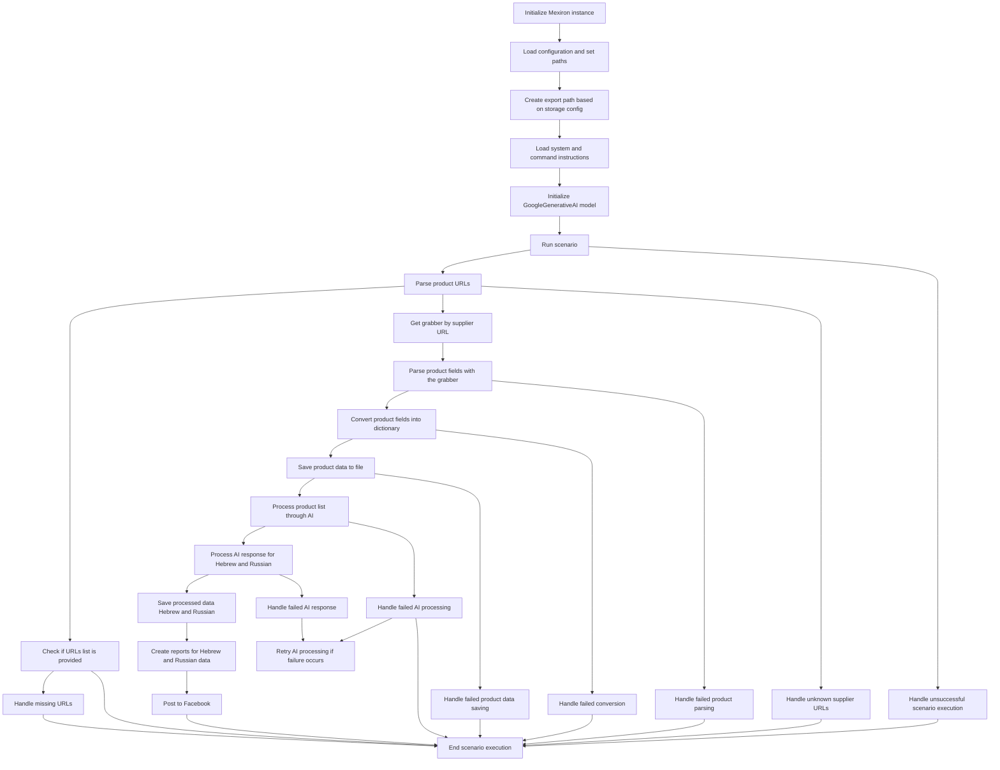

# Документация для `scenario_pricelist.mmd`

## Обзор

Данный файл представляет собой диаграмму в формате Mermaid, описывающую сценарий обработки прайс-листа. Он визуализирует последовательность шагов, начиная от инициализации и загрузки конфигураций до сохранения обработанных данных и публикации в Facebook. Диаграмма также отображает обработку различных ошибок и исключений, которые могут возникнуть в процессе выполнения сценария.

## Оглавление

- [Обзор](#обзор)
- [Диаграмма Mermaid](#диаграмма-mermaid)

## Диаграмма Mermaid

### Описание элементов диаграммы:

-   **`InitMexiron`**: Инициализация экземпляра Mexiron.
-   **`LoadConfig`**: Загрузка конфигурации и установка путей.
-   **`CreateExportPath`**: Создание пути экспорта на основе настроек хранилища.
-   **`LoadInstructions`**: Загрузка системных и командных инструкций.
-   **`InitializeAI`**: Инициализация модели GoogleGenerativeAI.
-   **`RunScenario`**: Запуск сценария.
-   **`ParseURLs`**: Разбор URL-адресов продуктов.
-   **`CheckURLs`**: Проверка, предоставлен ли список URL-адресов.
-   **`HandleMissingURLs`**: Обработка отсутствующих URL-адресов.
-   **`GetGrabber`**: Получение граббера по URL-адресу поставщика.
-   **`ParseFields`**: Разбор полей продукта с помощью граббера.
-   **`ConvertToDict`**: Преобразование полей продукта в словарь.
-   **`SaveToFile`**: Сохранение данных продукта в файл.
-   **`ProcessWithAI`**: Обработка списка продуктов с помощью AI.
-   **`HandleAIResponse`**: Обработка ответа AI для иврита и русского.
-   **`SaveProcessedData`**: Сохранение обработанных данных на иврите и русском.
-   **`GenerateReports`**: Создание отчетов для данных на иврите и русском.
-   **`PostToFacebook`**: Публикация в Facebook.
-   **`EndScenario`**: Завершение выполнения сценария.
-   **`HandleScenarioFailure`**: Обработка неудачного выполнения сценария.
-   **`HandleParseFailure`**: Обработка неудачного разбора продукта.
-   **`HandleConversionFailure`**: Обработка неудачного преобразования.
-   **`HandleSaveFailure`**: Обработка неудачного сохранения данных продукта.
-   **`HandleAIProcessingFailure`**: Обработка неудачной обработки AI.
-   **`RetryAI`**: Повторная попытка обработки AI в случае неудачи.
-   **`HandleAIResponseFailure`**: Обработка неудачного ответа AI.
-   **`HandleUnknownSupplierURLs`**: Обработка неизвестных URL-адресов поставщиков.