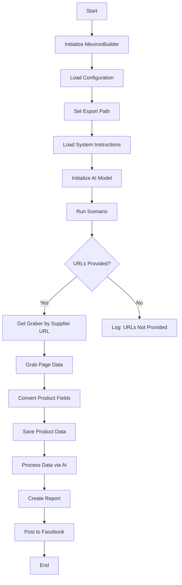
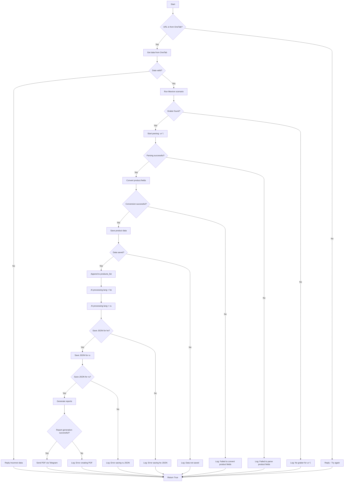

# Модуль `scenario_pricelist.py`

## Обзор

Этот скрипт является частью директории `hypotez/src/endpoints/kazarinov/scenarios` и предназначен для автоматизации процесса создания "мехирона" для Сергея Казаринова. Скрипт извлекает, анализирует и обрабатывает данные о продуктах от различных поставщиков, подготавливает данные, обрабатывает их с помощью ИИ и интегрируется с Facebook для публикации продуктов.

## Основные характеристики

1. **Извлечение и анализ данных**: Извлекает и анализирует данные о продуктах от различных поставщиков.
2. **Обработка данных ИИ**: Обрабатывает извлеченные данные с помощью модели Google Generative AI.
3. **Хранение данных**: Сохраняет обработанные данные в файлы.
4. **Генерация отчетов**: Генерирует HTML и PDF отчеты из обработанных данных.
5. **Публикация в Facebook**: Публикует обработанные данные в Facebook.

## Блок-схема модуля



## Легенда

1. **Start**: Начало выполнения скрипта.
2. **InitMexironBuilder**: Инициализация класса `MexironBuilder`.
3. **LoadConfig**: Загрузка конфигурации из JSON файла.
4. **SetExportPath**: Установка пути для экспорта данных.
5. **LoadSystemInstruction**: Загрузка системных инструкций для модели ИИ.
6. **InitModel**: Инициализация модели Google Generative AI.
7. **RunScenario**: Выполнение основного сценария.
8. **CheckURLs**: Проверка, предоставлены ли URL-адреса для анализа.
9. **GetGraber**: Получение соответствующего грабера для URL-адреса поставщика.
10. **GrabPage**: Извлечение данных страницы с помощью грабера.
11. **ConvertFields**: Преобразование полей продукта в словарь.
12. **SaveData**: Сохранение данных продукта в файл.
13. **ProcessAI**: Обработка данных продукта через модель ИИ.
14. **CreateReport**: Создание HTML и PDF отчетов из обработанных данных.
15. **PostFacebook**: Публикация обработанных данных в Facebook.
16. **End**: Конец выполнения скрипта.

---

## Классы

### `MexironBuilder`

**Описание**: Класс для построения "мехирона", автоматизирующий процесс извлечения, обработки и публикации данных о продуктах.

**Атрибуты**:

-   `driver`: Экземпляр Selenium WebDriver.
-   `export_path`: Путь для экспорта данных.
-   `mexiron_name`: Пользовательское имя для процесса мехирона.
-   `price`: Цена для обработки.
-   `timestamp`: Временная метка для процесса.
-   `products_list`: Список обработанных данных о продуктах.
-   `model`: Модель Google Generative AI.
-   `config`: Конфигурация, загруженная из JSON.

**Методы**:

#### `__init__`

```python
def __init__(self, driver: Driver, mexiron_name: Optional[str] = None) -> None:
    """
    Args:
        driver (Driver): Экземпляр Selenium WebDriver.
        mexiron_name (Optional[str], optional): Пользовательское имя для процесса мехирона. По умолчанию `None`.
    """
```

**Описание**: Инициализирует класс `MexironBuilder` с необходимыми компонентами.

**Параметры**:

-   `driver` (Driver): Экземпляр Selenium WebDriver.
-   `mexiron_name` (Optional[str], optional): Пользовательское имя для процесса мехирона. По умолчанию `None`.

#### `run_scenario`

```python
def run_scenario(self, system_instruction: Optional[str] = None, price: Optional[str] = None, mexiron_name: Optional[str] = None, urls: Optional[str | List[str]] = None, bot = None) -> bool:
    """
    Args:
        system_instruction (Optional[str], optional): Системные инструкции для модели ИИ. По умолчанию `None`.
        price (Optional[str], optional): Цена для обработки. По умолчанию `None`.
        mexiron_name (Optional[str], optional): Пользовательское имя для мехирона. По умолчанию `None`.
        urls (Optional[str | List[str]], optional): URL-адреса страниц продуктов. По умолчанию `None`.
        bot (optional): Объект бота. По умолчанию `None`.

    Returns:
        bool: Возвращает `True`, если сценарий выполнен успешно, иначе `False`.
    """
```

**Описание**: Выполняет сценарий: анализирует продукты, обрабатывает их с помощью ИИ и сохраняет данные.

**Параметры**:

-   `system_instruction` (Optional[str], optional): Системные инструкции для модели ИИ. По умолчанию `None`.
-   `price` (Optional[str], optional): Цена для обработки. По умолчанию `None`.
-   `mexiron_name` (Optional[str], optional): Пользовательское имя для мехирона. По умолчанию `None`.
-   `urls` (Optional[str | List[str]], optional): URL-адреса страниц продуктов. По умолчанию `None`.
-   `bot` (optional): Объект бота. По умолчанию `None`.

**Возвращает**:

-   `bool`: `True`, если сценарий выполнен успешно, иначе `False`.

#### `run_scenario` Flowchart



**Легенда**:

1.  **Start**: Начало выполнения сценария.
2.  **Проверка источника URL (IsOneTab)**:
    *   Если URL из OneTab, то данные извлекаются из OneTab.
    *   Если URL не из OneTab, пользователю отправляется сообщение "Try again".
3.  **Проверка валидности данных (IsDataValid)**:
    *   Если данные невалидны, пользователю отправляется сообщение "Incorrect data".
    *   Если данные валидны, запускается сценарий Mexiron.
4.  **Поиск граббера (IsGraberFound)**:
    *   Если граббер найден, начинается анализ страницы.
    *   Если граббер не найден, генерируется сообщение об отсутствии граббера для данного URL.
5.  **Анализ страницы (StartParsing)**:
    *   Если анализ успешен, данные преобразуются в требуемый формат.
    *   Если анализ не удался, ошибка регистрируется.
6.  **Преобразование данных (ConvertProductFields)**:
    *   Если преобразование успешно, данные сохраняются.
    *   Если преобразование не удается, ошибка регистрируется.
7.  **Сохранение данных (SaveProductData)**:
    *   Если данные сохранены, они добавляются в список продуктов.
    *   Если данные не сохранены, ошибка регистрируется.
8.  **Обработка ИИ (ProcessAIHe, ProcessAIRu)**:
    *   Данные обрабатываются ИИ для языков `he` (иврит) и `ru` (русский).
9.  **Сохранение JSON (SaveHeJSON, SaveRuJSON)**:
    *   Результаты обработки сохраняются в формате JSON для каждого языка.
    *   Если сохранение не удается, ошибка регистрируется.
10. **Генерация отчетов (GenerateReports)**:
     *   Генерируются HTML и PDF отчеты для каждого языка.
     *   Если создание отчета не удается, ошибка регистрируется.
11. **Отправка PDF через Telegram (SendPDF)**:
     *   PDF файлы отправляются через Telegram.
     *   Если отправка не удается, ошибка регистрируется.
12. **Завершение (ReturnTrue)**:
    *   Сценарий завершается возвратом `True`.

#### **Регистрация ошибок**:
- На каждом этапе, где могут возникать ошибки, включены узлы для регистрации ошибок (например, `LogNoGraber`, `LogParsingFailed`, `LogHeJSONError` и т.д.).

#### `get_graber_by_supplier_url`

```python
def get_graber_by_supplier_url(self, url: str) -> object | None:
    """
    Args:
        url (str): URL-адрес страницы поставщика.

    Returns:
        object | None: Возвращает экземпляр грабера, если найден, иначе `None`.
    """
```

**Описание**: Возвращает соответствующий грабер для заданного URL-адреса поставщика.

**Параметры**:

-   `url` (str): URL-адрес страницы поставщика.

**Возвращает**:

-   `object | None`: Экземпляр грабера, если найден, иначе `None`.

#### `convert_product_fields`

```python
def convert_product_fields(self, f: ProductFields) -> dict:
    """
    Args:
        f (ProductFields): Объект, содержащий разобранные данные продукта.

    Returns:
        dict: Отформатированный словарь данных продукта.
    """
```

**Описание**: Преобразует поля продукта в словарь.

**Параметры**:

-   `f` (ProductFields): Объект, содержащий разобранные данные продукта.

**Возвращает**:

-   `dict`: Отформатированный словарь данных продукта.

#### `save_product_data`

```python
def save_product_data(self, product_data: dict) -> None:
    """
    Args:
        product_data (dict): Отформатированные данные продукта.
    """
```

**Описание**: Сохраняет данные продукта в файл.

**Параметры**:

-   `product_data` (dict): Отформатированные данные продукта.

#### `process_ai`

```python
def process_ai(self, products_list: List[str], lang: str, attempts: int = 3) -> tuple | bool:
    """
    Args:
        products_list (List[str]): Список словарей с данными о продуктах в виде строк.
        lang (str): Язык для обработки.
        attempts (int, optional): Количество попыток повтора в случае неудачи. По умолчанию `3`.

    Returns:
        tuple | bool: Обработанный ответ в формате `ru` и `he`.
    """
```

**Описание**: Обрабатывает список продуктов с помощью модели ИИ.

**Параметры**:

-   `products_list` (List[str]): Список словарей с данными о продуктах в виде строк.
-    `lang` (str): Язык для обработки.
-   `attempts` (int, optional): Количество попыток повтора в случае неудачи. По умолчанию `3`.

**Возвращает**:

-   `tuple | bool`: Обработанный ответ в формате `ru` и `he`.

#### `post_facebook`

```python
def post_facebook(self, mexiron: SimpleNamespace) -> bool:
    """
    Args:
        mexiron (SimpleNamespace): Обработанные данные для публикации.

    Returns:
        bool: `True`, если публикация прошла успешно, иначе `False`.
    """
```

**Описание**: Выполняет сценарий публикации в Facebook.

**Параметры**:

-   `mexiron` (SimpleNamespace): Обработанные данные для публикации.

**Возвращает**:

-   `bool`: `True`, если публикация прошла успешно, иначе `False`.

#### `create_report`

```python
def create_report(self, data: dict, html_file: Path, pdf_file: Path) -> None:
    """
     Args:
         data (dict): Обработанные данные.
         html_file (Path): Путь для сохранения HTML-отчета.
         pdf_file (Path): Путь для сохранения PDF-отчета.
    """
```

**Описание**: Генерирует HTML и PDF отчеты из обработанных данных.

**Параметры**:

-   `data` (dict): Обработанные данные.
-   `html_file` (Path): Путь для сохранения HTML-отчета.
-   `pdf_file` (Path): Путь для сохранения PDF-отчета.

## Использование

Чтобы использовать этот скрипт, выполните следующие шаги:

1.  **Инициализация драйвера**: Создайте экземпляр класса `Driver`.
2.  **Инициализация MexironBuilder**: Создайте экземпляр класса `MexironBuilder` с драйвером.
3.  **Запуск сценария**: Вызовите метод `run_scenario` с необходимыми параметрами.

### Пример

```python
from src.webdriver.driver import Driver
from src.endpoints.kazarinov.scenarios.scenario_pricelist import MexironBuilder

# Инициализация драйвера
driver = Driver(...)

# Инициализация MexironBuilder
mexiron_builder = MexironBuilder(driver)

# Запуск сценария
urls = ['https://example.com/product1', 'https://example.com/product2']
mexiron_builder.run_scenario(urls=urls)
```

## Зависимости

-   `selenium`: Для автоматизации веб-браузера.
-   `asyncio`: Для асинхронных операций.
-   `pathlib`: Для обработки путей к файлам.
-   `types`: Для создания простых пространств имен.
-   `typing`: Для аннотаций типов.
-   `src.ai.gemini`: Для обработки данных ИИ.
-   `src.suppliers.*.graber`: Для извлечения данных от различных поставщиков.
-   `src.endpoints.advertisement.facebook.scenarios`: Для публикации в Facebook.

## Обработка ошибок

Скрипт включает надежную обработку ошибок, чтобы обеспечить непрерывное выполнение даже в случае, если некоторые элементы не найдены или если есть проблемы с веб-страницей. Это особенно полезно для обработки динамических или нестабильных веб-страниц.

## Вклад

Вклад в этот скрипт приветствуется. Пожалуйста, убедитесь, что любые изменения хорошо задокументированы и включают соответствующие тесты.

## Лицензия

Этот скрипт распространяется под лицензией MIT. Подробности смотрите в файле `LICENSE`.