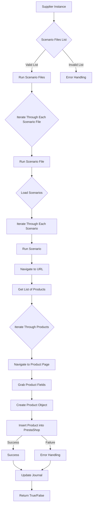

# Документация `scenario_executor.mmd`

## Обзор

Данный файл содержит mermaid-диаграмму, описывающую процесс выполнения сценариев. Диаграмма наглядно демонстрирует последовательность шагов от получения списка файлов сценариев до добавления продуктов в PrestaShop.

## Содержание

- [Обзор](#обзор)
- [Диаграмма](#диаграмма)

## Диаграмма

