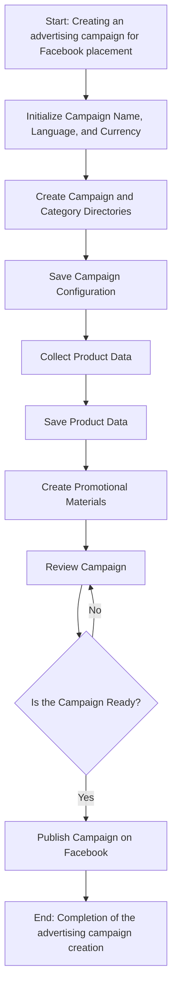
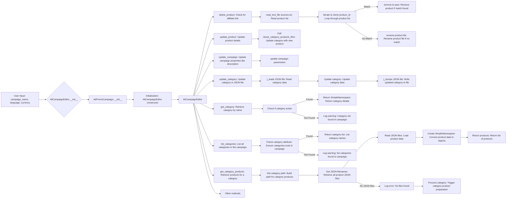
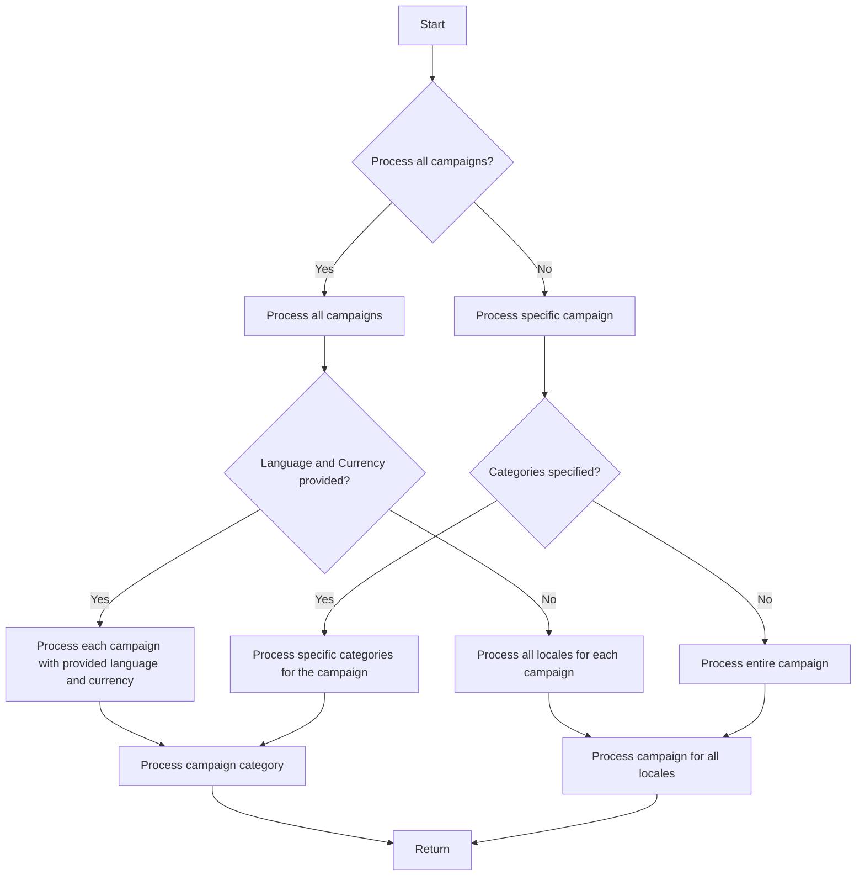

# Модуль `campaign`

## Обзор

Модуль `campaign` предназначен для управления процессом создания и публикации рекламных кампаний на Facebook. Он включает в себя функциональность для инициализации параметров кампании (название, язык, валюта), создания структуры каталогов, сохранения конфигураций новой кампании, сбора и сохранения данных о продуктах через `ali` или `html`, генерации рекламных материалов, просмотра кампании и публикации ее на Facebook.

## Оглавление

1.  [Обзор](#обзор)
2.  [Диаграмма процесса создания рекламной кампании](#диаграмма-процесса-создания-рекламной-кампании)
3.  [Описание процесса создания рекламной кампании](#описание-процесса-создания-рекламной-кампании)
4.  [Диаграмма редактирования кампании](#диаграмма-редактирования-кампании)
5.  [Диаграмма подготовки кампании](#диаграмма-подготовки-кампании)

## Диаграмма процесса создания рекламной кампании

## Описание процесса создания рекламной кампании

-   **Шаг 1**: Начало - Процесс начинается.
-   **Шаг 2**: Инициализация деталей кампании - Определяются название, язык и валюта кампании. Пример: Название кампании: "Летняя распродажа", Язык: "Русский", Валюта: "RUB".
-   **Шаг 3**: Создание каталогов кампании и категорий - Создаются необходимые каталоги или файлы для кампании. Пример: На файловой системе создается структура папок для хранения ресурсов кампании.
-   **Шаг 4**: Сохранение конфигурации кампании - Сохранются инициализированные детали кампании. Пример: Данные записываются в базу данных или конфигурационный файл.
-   **Шаг 5**: Сбор данных о продуктах - Собираются данные о продуктах, которые будут продвигаться в рамках кампании. Пример: Идентификаторы продуктов, описания, изображения и цены извлекаются из системы инвентаризации.
-   **Шаг 6**: Сохранение данных о продуктах - Сохранются собранные данные о продуктах. Пример: Данные записываются в таблицу базы данных, посвященную продуктам кампании.
-   **Шаг 7**: Создание рекламных материалов - Генерируются или выбираются графики, баннеры и другие рекламные материалы. Пример: Изображения и описания адаптируются для привлечения клиентов.
-   **Шаг 8**: Просмотр кампании - Процесс просмотра подтверждает готовность компонентов кампании. Пример: Проверка человеком или системой оценивает качество и полноту всех компонентов кампании.
-   **Шаг 9**: Готова ли кампания? - Проверка для определения, завершена ли кампания и готова ли к публикации. Пример: Логический флаг сигнализирует "Да", если все на месте, иначе "Нет", вызывая возврат к предыдущему шагу для внесения исправлений.
-   **Шаг 10**: Публикация кампании - Кампания становится активной на платформе, готовой для маркетинговых усилий. Пример: API-вызовы выполняются для публикации кампании на соответствующей платформе.
-   **Шаг 11**: Конец - Процесс создания кампании завершен.

## Диаграмма редактирования кампании

## Диаграмма подготовки кампании

