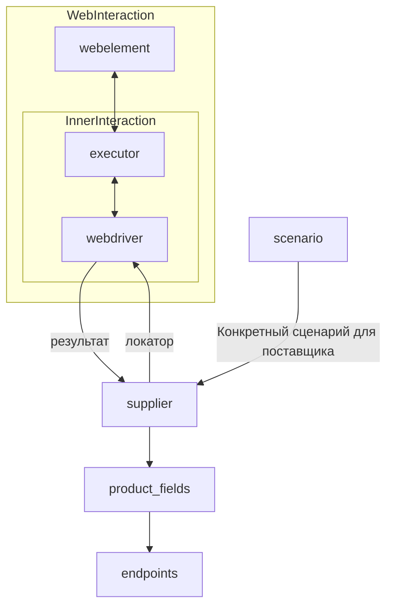

# Модуль `suppliers`

## Обзор

Этот модуль предоставляет базовый класс `Supplier` для взаимодействия с поставщиками данных (например, интернет-магазинами).  Класс `Supplier` обеспечивает стандартный интерфейс для работы с различными источниками данных, включая веб-сайты, документы и базы данных.  Он поддерживает инициализацию, конфигурацию, аутентификацию и выполнение рабочих процессов (сценариев) для получения данных от поставщиков.  Модуль предоставляет список реализованных поставщиков, информацию о них, а также примеры использования.

## Классы

### `Supplier`

**Описание**: Базовый класс для всех поставщиков. Представляет собой поставщика информации, который может быть производителем товаров, данных или информации. Источниками данных могут быть главная страница сайта, документ, база данных или таблица. Этот класс объединяет различных поставщиков под стандартизованным набором операций. Каждый поставщик имеет уникальный префикс. ([Подробности о префиксах](prefixes.md))

**Атрибуты**:

- `supplier_id` (int): Уникальный идентификатор поставщика.
- `supplier_prefix` (str): Префикс поставщика, например, `'amazon'`, `'aliexpress'`.
- `supplier_settings` (dict): Параметры поставщика, загруженные из файла JSON.
- `locale` (str): Код локализации (по умолчанию: `'en'`).
- `price_rule` (str): Правила для расчета цены (например, правила НДС).
- `related_modules` (module): Вспомогательные модули для операций с конкретным поставщиком.
- `scenario_files` (list): Список файлов сценариев, которые должны быть выполнены.
- `current_scenario` (dict): Сценарий, который выполняется в данный момент.
- `login_data` (dict): Данные для аутентификации.
- `locators` (dict): Словарь локаторов веб-элементов.
- `driver` (Driver): Экземпляр WebDriver для взаимодействия с веб-сайтом поставщика.
- `parsing_method` (str): Метод обработки данных (например, `'webdriver'`, `'api'`, `'xls'`, `'csv'`).


**Методы**:

#### `__init__`

**Конструктор класса `Supplier`.**

```python
def __init__(self, supplier_prefix: str, locale: str = 'en', webdriver: str | Driver | bool = 'default', *attrs, **kwargs):
    """Инициализирует экземпляр класса Supplier.

    Args:
        supplier_prefix (str): Префикс поставщика.
        locale (str, optional): Код локализации. По умолчанию 'en'.
        webdriver (str | Driver | bool, optional): Тип WebDriver. По умолчанию 'default'.

    Raises:
        DefaultSettingsException: Если параметры по умолчанию не настроены должным образом.
    """
```

#### `_payload`

**Загружает параметры поставщика и инициализирует WebDriver.**

```python
def _payload(self, webdriver: str | Driver | bool, *attrs, **kwargs) -> bool:
    """Загружает настройки, локаторы и инициализирует WebDriver.

    Args:
        webdriver (str | Driver | bool): Тип WebDriver.

    Returns:
        bool: Возвращает `True`, если загрузка прошла успешно.
    """
```

#### `login`

**Обрабатывает аутентификацию на сайте поставщика.**

```python
def login(self) -> bool:
    """Аутентифицирует пользователя на сайте поставщика.

    Returns:
        bool: Возвращает `True`, если вход выполнен успешно.
    """
```

#### `run_scenario_files`

**Выполняет один или несколько файлов сценариев.**

```python
def run_scenario_files(self, scenario_files: str | List[str] = None) -> bool:
    """Выполняет предоставленные файлы сценариев.

    Args:
        scenario_files (str | List[str], optional): Список или путь к файлам сценариев.

    Returns:
        bool: Возвращает `True`, если сценарии были выполнены успешно.
    """
```

#### `run_scenarios`

**Выполняет указанные сценарии.**

```python
def run_scenarios(self, scenarios: dict | list[dict]) -> bool:
    """Выполняет указанные сценарии.

    Args:
        scenarios (dict | list[dict]): Сценарии, которые должны быть выполнены.

    Returns:
        bool: Возвращает `True`, если все сценарии были выполнены успешно.
    """
```

## Список реализованных поставщиков

* [aliexpress](aliexpress) - Реализован с двумя рабочими процессами: `webdriver` и `api`
* ... (Список других поставщиков)

## Диаграмма взаимодействия (Mermaid)



## Как это работает

1. **Инициализация**: Метод `__init__` настраивает префикс поставщика, локализацию и WebDriver.
2. **Загрузка настроек**: `_payload` загружает конфигурацию, инициализирует локаторы и WebDriver.
3. **Аутентификация**: `login` выполняет вход на сайт поставщика.
4. **Выполнение сценариев**: Выполнение файлов сценариев или конкретных сценариев.

```
```
```python
# пример
supplier = Supplier(supplier_prefix='aliexpress', locale='ru', webdriver='chrome')
supplier._payload(webdriver='firefox')
supplier.login()
supplier.run_scenario_files(['scenario1.json'])
```