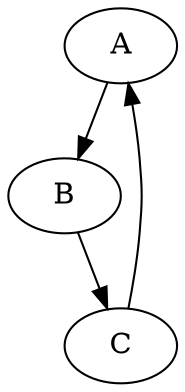

# Модуль `hypotez/src/utils/convertors/dot.py`

## Обзор

Этот модуль предоставляет функцию `dot2png` для преобразования файлов DOT в изображения PNG с использованием библиотеки Graphviz. Функция принимает путь к файлу DOT в качестве входных данных и сохраняет выходное изображение PNG в заданном месте. Модуль также включает обработку ошибок, чтобы обеспечить надежную работу при преобразовании.


## Функции

### `dot2png`

**Описание**: Функция преобразует файл DOT в изображение PNG.

**Параметры**:

- `dot_file` (str): Путь к входному файлу DOT.
- `png_file` (str): Путь для сохранения выходного файла PNG.

**Возвращает**:
  - `None`: Функция не возвращает значение.

**Вызывает исключения**:

- `FileNotFoundError`: Возникает, если файл DOT не найден.
- `Exception`: Возникает при других ошибках во время преобразования.

**Пример использования**:

```python
dot2png('example.dot', 'output.png')
```

Этот код преобразует файл `example.dot` в изображение `output.png`.

**Образец содержимого файла DOT (example.dot):**



**Как запустить скрипт из командной строки**:

```bash
python dot2png.py example.dot output.png
```

Эта команда создаст файл PNG с именем `output.png` из графа, определенного в `example.dot`.


## Обработка исключений

В функции `dot2png` используются блоки `try...except`, чтобы обрабатывать потенциальные ошибки.

- `FileNotFoundError`: Обрабатывает ситуацию, когда файл DOT не найден. Выводится сообщение об ошибке, и исключение перебрасывается вверх по стеку.
- `Exception`: Обрабатывает другие возможные ошибки во время преобразования. Выводится сообщение об ошибке, и исключение перебрасывается вверх по стеку.


## Модуль `sys`

Модуль `sys` используется для получения аргументов командной строки.


## Модуль `graphviz`

Модуль `graphviz` используется для работы с файлами DOT.

```
```