## АНАЛИЗ README.MD

### <алгоритм>

1.  **Начало:**
    *   Документ `README.MD` начинается с заголовка, указывающего на его назначение.
    *   Предоставляется ссылка на родительский `README.MD` и на русскоязычную версию.

2.  **Обзор модулей:**
    *   Документ перечисляет основные модули проекта, каждый из которых имеет следующую структуру:
        *   Название модуля (например, `assistant`, `bot`, `scenario`).
        *   Краткое описание назначения модуля.
        *   Ссылки на:
            *   Исходный код модуля (например, `readme.en.md`).
            *   Документацию модуля.
            *   Тесты модуля.
            *   Примеры использования модуля.
    *   Пример:
        ```
        ## assistant
        Модуль для взаимодействия с классом `CodeAssistant`, который помогает с обработкой задач по коду.

        - [Module code](https://github.com/hypo69/hypo/blob/master/src/assistant/readme.en.md) - Исходный код модуля `assistant`.
        - [Documentation](https://github.com/hypo69/hypo/blob/master/docs/gemini/en/doc/src/assistant/readme.en.md) - Документация для модуля `assistant`.
        - [Tests](https://github.com/hypo69/hypo/blob/master/pytest/gemini/src/assistant) - Тесты для модуля `assistant`.
        - [Examples](https://github.com/hypo69/hypo/blob/master/docs/examples/assistant) - Примеры использования модуля `assistant`.
        ```

3.  **Глоссарий:**
    *   Предоставляется глоссарий основных терминов, используемых в проекте:
        *   Термины `webdriver` (включая `Driver`, `Executor`, `Chrome`, `Firefox`, `locator`).
        *   Термины `Supplier` (включая список поставщиков и `Graber`).
        *   Термины `Product` (включая `ProductFields`).
         *  Термины `ai` (включая `Model Prompt`, `Command Instruction`).

4.  **Переход к следующему:**
    *   Имеется ссылка на документ `credentials.md`, описывающий инициализацию проекта и его настройку.
    *   Пример:
        ```
        Next
        =====
        [Project Initialization and Setup]((https://github.com/hypo69/hypo/blob/master/src/credentials.md)
        ```

### <mermaid>



```mermaid
flowchart TD
    Start[Start: README.MD] --> ModulesOverview[Overview of Modules]
    ModulesOverview --> Assistant[assistant module]
    ModulesOverview --> Bot[bot module]
    ModulesOverview --> Scenario[scenario module]
    ModulesOverview --> Suppliers[suppliers module]
    ModulesOverview --> Templates[templates module]
    ModulesOverview --> Translators[translators module]
    ModulesOverview --> Utils[utils module]
    ModulesOverview --> Webdriver[webdriver module]
    
    Assistant --> AssistantLinks[Module Links]
    Bot --> BotLinks[Module Links]
    Scenario --> ScenarioLinks[Module Links]
    Suppliers --> SuppliersLinks[Module Links]
    Templates --> TemplatesLinks[Module Links]
    Translators --> TranslatorsLinks[Module Links]
    Utils --> UtilsLinks[Module Links]
    Webdriver --> WebdriverLinks[Module Links]

    AssistantLinks --> AssistantCode[Source Code Link]
    AssistantLinks --> AssistantDoc[Documentation Link]
    AssistantLinks --> AssistantTests[Tests Link]
    AssistantLinks --> AssistantExamples[Examples Link]

    BotLinks --> BotCode[Source Code Link]
    BotLinks --> BotDoc[Documentation Link]
    BotLinks --> BotTests[Tests Link]
    BotLinks --> BotExamples[Examples Link]

    ScenarioLinks --> ScenarioCode[Source Code Link]
    ScenarioLinks --> ScenarioDoc[Documentation Link]
    ScenarioLinks --> ScenarioTests[Tests Link]
    ScenarioLinks --> ScenarioExamples[Examples Link]

    SuppliersLinks --> SuppliersCode[Source Code Link]
    SuppliersLinks --> SuppliersDoc[Documentation Link]
    SuppliersLinks --> SuppliersTests[Tests Link]
    SuppliersLinks --> SuppliersExamples[Examples Link]

    TemplatesLinks --> TemplatesCode[Source Code Link]
    TemplatesLinks --> TemplatesDoc[Documentation Link]
    TemplatesLinks --> TemplatesTests[Tests Link]
    TemplatesLinks --> TemplatesExamples[Examples Link]

    TranslatorsLinks --> TranslatorsCode[Source Code Link]
    TranslatorsLinks --> TranslatorsDoc[Documentation Link]
    TranslatorsLinks --> TranslatorsTests[Tests Link]
    TranslatorsLinks --> TranslatorsExamples[Examples Link]

    UtilsLinks --> UtilsCode[Source Code Link]
    UtilsLinks --> UtilsDoc[Documentation Link]
    UtilsLinks --> UtilsTests[Tests Link]
    UtilsLinks --> UtilsExamples[Examples Link]

    WebdriverLinks --> WebdriverCode[Source Code Link]
    WebdriverLinks --> WebdriverDoc[Documentation Link]
    WebdriverLinks --> WebdriverTests[Tests Link]
    WebdriverLinks --> WebdriverExamples[Examples Link]
    
    ModulesOverview --> Glossary[Glossary]
    Glossary --> WebdriverGlossary[webdriver terms]
    Glossary --> SupplierGlossary[Supplier terms]
    Glossary --> ProductGlossary[Product terms]
    Glossary --> AIGlossary[ai terms]

     Glossary --> End[Next: Project Initialization]
    End --> CredentialsLink[Link to credentials.md]
```

**Объяснение `mermaid` диаграммы:**

1.  **`Start`:** Начальная точка диаграммы, представляющая документ `README.MD`.
2.  **`ModulesOverview`:** Блок, представляющий общий обзор модулей проекта.
3.  **`Assistant`, `Bot`, `Scenario`, `Suppliers`, `Templates`, `Translators`, `Utils`, `Webdriver`:** Отдельные блоки, представляющие каждый модуль проекта.
4.  **`AssistantLinks`, `BotLinks`, `ScenarioLinks`, `SuppliersLinks`, `TemplatesLinks`, `TranslatorsLinks`, `UtilsLinks`, `WebdriverLinks`:** Блоки, представляющие ссылки на различные ресурсы для каждого модуля (код, документацию, тесты, примеры).
5.  **`AssistantCode` и т.д.:** Блоки, представляющие ссылки на исходный код, документацию, тесты и примеры для каждого модуля.
6. **`Glossary`:** Блок, представляющий глоссарий основных терминов проекта.
7. **`WebdriverGlossary`, `SupplierGlossary`, `ProductGlossary`, `AIGlossary`:** Блоки, представляющие термины для соответствующих областей.
8. **`End`:** Блок, представляющий завершающий этап документа с переходом к `credentials.md`.
9. **`CredentialsLink`:** Ссылка на файл `credentials.md`

Диаграмма показывает структуру документа `README.MD`, его разделение на модули и глоссарий, а также навигацию к дополнительным ресурсам.

### <объяснение>

**Импорты:**

В данном файле `README.MD` нет импортов Python. Это документ, написанный на Markdown, поэтому здесь нет необходимости в импортах.

**Классы, функции, переменные:**

Поскольку это документ, а не код Python, здесь нет классов, функций или переменных в контексте Python.

**Объяснение модулей:**

*   **`assistant`:** Этот модуль предоставляет функциональность для обработки и анализа кода с помощью класса `CodeAssistant`. Он предназначен для выполнения задач, связанных с кодом, и предоставляет API для взаимодействия с ним.
*   **`bot`:** Модуль отвечает за логику бота, обрабатывая входящие сообщения и команды. Он реализует основную функциональность бота, который, вероятно, взаимодействует с пользователями через какой-то интерфейс (например, мессенджер).
*   **`scenario`:** Этот модуль отвечает за управление сценариями, включая их генерацию и выполнение. Он позволяет определять последовательность действий, которые бот или приложение должно выполнять.
*   **`suppliers`:** Модуль предназначен для работы с данными о поставщиках, включая управление их информацией и связями. Он, вероятно, используется для получения данных о товарах или услугах от различных источников.
*   **`templates`:** Модуль управляет шаблонами, используемыми для различных целей. Он позволяет создавать, редактировать и использовать шаблоны для генерации текста или кода.
*   **`translators`:** Модуль отвечает за перевод текста. Он предоставляет API для перевода текста с одного языка на другой.
*   **`utils`:** Этот модуль содержит вспомогательные утилиты, упрощающие выполнение общих задач. Он может включать различные функции, не связанные с конкретными модулями.
*   **`webdriver`:** Модуль отвечает за взаимодействие с веб-браузерами. Он позволяет автоматизировать действия в браузере (например, навигацию, ввод данных, извлечение информации) с помощью драйверов веб-браузеров.

**Глоссарий:**
*   **`webdriver`:** Раздел глоссария объясняет термины, связанные с автоматизацией веб-браузеров, включая драйверы браузеров, механизмы выполнения команд и локаторы элементов.
*   **`Supplier`:**  Определяет, что такое поставщик, и упоминает, что это могут быть различные компании или платформы.
*    **`Product`:**  Раздел объясняет, что такое "продукт", и какие атрибуты могут быть у него.
*    **`ai`:** Раздел описывает, что такое промт модели и инструкции команды для ai.

**Цепочка взаимосвязей:**

1.  **`README.MD`** является отправной точкой для понимания структуры проекта и содержит общую информацию о модулях и их назначении.
2.  Каждый модуль (`assistant`, `bot`, `scenario` и т.д.) имеет свою собственную страницу `readme.en.md`, где содержится более подробное описание его функциональности.
3.  Для каждого модуля есть документация в папке `docs`, тесты в папке `pytest` и примеры использования в папке `examples`.
4.  Модуль `webdriver` может использоваться другими модулями (например, `suppliers`) для сбора данных с веб-сайтов.
5.  Модули `templates` и `translators` могут использоваться в различных частях проекта для генерации текста или перевода.
6.  В конце README.MD есть ссылка на `credentials.md`, который содержит описание инициализации и настройки проекта.
7.  Глоссарий помогает понять терминологию проекта.

**Потенциальные ошибки или области для улучшения:**

*   Документ `README.MD` является хорошим началом, но его можно улучшить, предоставив более подробное описание связей между модулями и примерами их взаимодействия.
*   Можно добавить диаграммы для наглядного представления архитектуры проекта и потоков данных.
*   Можно включить раздел с примерами кода для демонстрации использования модулей на практике.
*   Можно добавить инструкцию по установке и настройке среды для разработки.

В целом, документ `README.MD` является полезным ресурсом для понимания структуры и функциональности проекта, однако его можно улучшить, добавив больше информации и примеров.