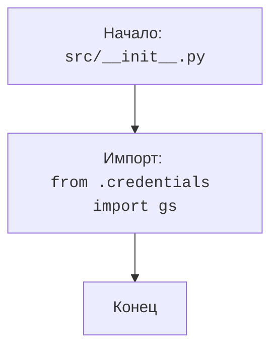

## АНАЛИЗ КОДА: `hypotez/src/__init__.py`

### <алгоритм>

1.  **Начало**: Исполнение начинается с файла `__init__.py` в каталоге `src`.
2.  **Импорт**:  Выполняется импорт объекта `gs` из модуля `credentials`, расположенного в той же директории (`src`).
3.  **Конец**:  Завершение работы модуля, после импорта.

**Пример**:

```python
# file: src/__init__.py
from .credentials import gs # Объект gs импортируется из src/credentials.py
```
### <mermaid>


**Объяснение зависимостей `mermaid`:**

*   **flowchart TD**: Объявляет диаграмму типа "flowchart" (блок-схема) с направлением "Top to Down" (сверху вниз).
*   **Start**: Обозначает начало выполнения кода в файле `src/__init__.py`.
*   **Import_credentials**: Представляет операцию импорта объекта `gs` из модуля `credentials.py`. Это ключевая зависимость в данном коде, так как `gs` становится доступен для использования в модулях, которые импортируют `src`.
*   **End**: Завершение работы модуля.

### <объяснение>

**Импорты:**

*   `from .credentials import gs`: Эта строка импортирует объект `gs` из модуля `credentials.py`, который находится в том же каталоге `src`.  Точка `.` в `from .credentials` означает относительный импорт, указывающий на то, что модуль `credentials` находится в той же директории, что и текущий файл.
    *   **Назначение:** Объект `gs` предположительно содержит глобальные настройки или учетные данные, которые будут использоваться другими частями проекта. Этот объект становится доступным в любом файле, который импортирует `src` или обращается к нему как к пакету.
    *   **Взаимосвязь:** Этот импорт создает связь между `__init__.py` и `credentials.py`, что позволяет использовать переменные/объекты, определенные в `credentials.py`.

**Классы:**
*   В данном коде классы не используются.

**Функции:**
*   В данном коде функции не используются.

**Переменные:**

*   `gs`: Переменная, импортированная из модуля `credentials`. Представляет собой объект, который вероятно содержит глобальные настройки, данные или учетные данные. Тип объекта `gs`  определяется в модуле `credentials`.

**Цепочка взаимосвязей с другими частями проекта:**

1.  `src/__init__.py` является точкой входа в пакет `src`. При импорте пакета, например, `import src`,  код в `__init__.py` выполняется автоматически.
2.  Импорт `gs` из `credentials.py` делает этот объект доступным для всех модулей, импортирующих `src`. Таким образом, любой модуль в проекте, который импортирует `src` или один из его подмодулей, может использовать глобальные настройки, хранящиеся в `gs`.

**Потенциальные ошибки и области для улучшения:**

*   **Отсутствие docstring для gs**:  Необходимо добавить docstring для объекта `gs` в файле `credentials.py`, чтобы другие разработчики знали, что он содержит и как его использовать.
*   **Отсутствие явного описания:** В комментарии к модулю говорится, что здесь представлен структурированный обзор модулей проекта. Однако, `__init__.py` по умолчанию не делает никаких импортов. Обычно в `__init__.py` импортируют  необходимые подмодули или их части, делая их доступными при импорте `src`. В данном случае явного описания нет, поэтому не ясно какой функционал должен представлять этот модуль.
*   **Глобальные переменные:**  Использование глобальных переменных, таких как `gs`, может усложнить отладку и поддержку кода, особенно в больших проектах. Следует рассмотреть возможность использования более структурированного подхода, например, через конфигурационные классы или объекты.