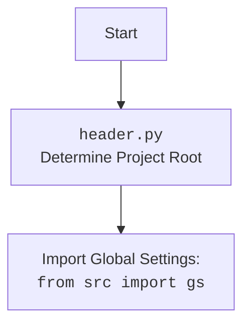

## <алгоритм>

1.  **Начало**: Скрипт начинается с определения функции `set_project_root`.
2.  **`set_project_root`**:
    *   Определяется текущий путь к файлу `__file__` и его родительский каталог (`current_path`).
    *   Начинается итерация по текущему каталогу и его родительским каталогам.
    *   **Поиск корневого каталога**:
        *   Для каждого каталога проверяется, есть ли в нем какой-либо из `marker_files` (`'__root__'`, `'.git'`).
        *   Если маркерный файл найден, текущий каталог устанавливается как корень проекта (`__root__`), и цикл прерывается.
    *   Если корень проекта не найден, то корнем проекта будет каталог где находится скрипт.
    *   Добавление каталога проекта в `sys.path`, если он отсутствует.
    *   Функция возвращает путь к корневому каталогу проекта (`__root__`).
3.  **Определение корня проекта**: Вызывается `set_project_root()`, и результат сохраняется в `__root__`.
4.  **Импорт `gs`**: Импортируется модуль `gs` из пакета `src`.
5.  **Загрузка настроек**:
    *   Попытка открыть файл `settings.json` из каталога `src` в корневом каталоге проекта.
    *   Если файл открыт, настройки загружаются из JSON в словарь `settings`.
    *   Если файл не найден или JSON некорректен, происходит обработка исключения `FileNotFoundError`, `json.JSONDecodeError`
6. **Загрузка `README.MD`**:
   * Попытка открытия файла `README.MD` и чтения контента в переменную `doc_str`.
   * Если файл не найден или нет прав доступа, происходит обработка исключения `FileNotFoundError`, `json.JSONDecodeError`.
7.  **Определение переменных**:
    *   `__project_name__` - Имя проекта, берется из `settings` или устанавливается в `'hypotez'` по умолчанию.
    *   `__version__` - Версия проекта, берется из `settings` или устанавливается в `''` по умолчанию.
    *   `__doc__` - Описание проекта, читается из `README.MD` или `''` если `README.MD` нет.
    *   `__details__` - Дополнительная информация о проекте, устанавливается в `''` по умолчанию.
    *   `__author__` - Автор проекта, берется из `settings` или устанавливается в `''` по умолчанию.
    *   `__copyright__` - Информация об авторских правах, берется из `settings` или устанавливается в `''` по умолчанию.
    *   `__cofee__` - Информация о возможности поддержать разработчика, берется из `settings` или устанавливается в ссылку по умолчанию.
8.  **Конец**: Скрипт завершается, возвращая глобальные переменные настроек проекта.

## <mermaid>

```mermaid
flowchart TD
    Start --> FindRoot[<code>set_project_root()</code> <br> Determine Project Root];
    FindRoot --> CheckMarkers{Check for marker files in current and parent directories};
    CheckMarkers -- "Marker file found" --> SetRoot[Set project root directory];
    CheckMarkers -- "No marker file found" --> UseCurrentDir[Set project root to current dir];
    SetRoot --> AddToPath[Add project root to system path if missing];
    UseCurrentDir --> AddToPath
    AddToPath --> ReturnRoot[Return project root];
    ReturnRoot --> ImportGS[Import Global Settings: <br><code>from src import gs</code>];
    ImportGS --> LoadSettings{Load settings from <br><code>settings.json</code>};
    LoadSettings -- "File found" --> ParseSettings[Parse <code>settings.json</code>];
     LoadSettings -- "File not found or cannot parse" --> SetDefaultSettings[Set default values]
    ParseSettings --> LoadDocString{Load doc string from <br><code>README.MD</code>};
        SetDefaultSettings --> LoadDocString;
    LoadDocString -- "File found" --> SetDocString[Set document string];
    LoadDocString -- "File not found" --> SetDefaultDocString[Set default empty doc string];
    SetDocString --> SetProjectVariables[Set project variables:  <br><code>__project_name__, __version__ , __doc__, __details__ , __author__, __copyright__, __cofee__</code>];
    SetDefaultDocString --> SetProjectVariables
    SetProjectVariables --> End
    

    classDef fileStyle fill:#f9f,stroke:#333,stroke-width:2px
    class Start, End fileStyle;
    
    
```


## <объяснение>

**Импорты:**

*   `sys`:  Используется для доступа к системным переменным и функциям, в данном случае, для добавления пути к корневому каталогу проекта в `sys.path`. Это позволяет импортировать модули из проекта без указания относительных путей.
*   `json`:  Используется для работы с JSON файлами. В скрипте применяется для чтения файла `settings.json`, содержащего настройки проекта.
*   `packaging.version`: Используется для работы с версиями пакетов, но в текущем скрипте не используется напрямую.
*  `pathlib.Path`: Используется для работы с путями к файлам и директориям в объектно-ориентированном стиле. Упрощает работу с файловой системой.

**Функции:**

*   `set_project_root(marker_files: tuple = ('__root__', '.git')) -> Path`:
    *   **Аргументы**:
        *   `marker_files`: `tuple` с именами файлов или каталогов, которые используются для определения корня проекта (по умолчанию `('__root__', '.git')`).
    *   **Возвращаемое значение**:
        *   `Path`: Объект `Path` к корню проекта. Если корень не найден, то путь к каталогу где находится текущий файл.
    *   **Назначение**:
        *   Находит корневой каталог проекта, поднимаясь вверх по дереву каталогов от текущего файла. Поиск останавливается, когда один из `marker_files` будет найден.

**Переменные:**

*   `__root__`: `Path` - Путь к корневому каталогу проекта.  Эта переменная устанавливается через вызов функции `set_project_root()` и используется для определения абсолютных путей к другим файлам проекта, например `settings.json` и `README.MD`.
*  `settings`: `dict` - Словарь, который загружается из файла `settings.json` и содержит настройки проекта.
* `doc_str`: `str` - Строка содержащая описание проекта из файла `README.MD`
*   `__project_name__`: `str` - Имя проекта, извлекается из `settings` или используется значение по умолчанию `'hypotez'`.
*   `__version__`: `str` - Версия проекта, извлекается из `settings` или используется значение по умолчанию `''`.
*   `__doc__`: `str` - Описание проекта, извлекается из `doc_str` или используется значение по умолчанию `''`.
*   `__details__`: `str` - Дополнительные детали проекта, всегда устанавливается в `''`.
*  `__author__`: `str` - Автор проекта, извлекается из `settings` или используется значение по умолчанию `''`.
*  `__copyright__`: `str` - Информация о копирайте, извлекается из `settings` или используется значение по умолчанию `''`.
*  `__cofee__`: `str` - Сообщение о возможности пожертвовать на развитие проекта, извлекается из `settings` или используется значение по умолчанию "Treat the developer to a cup of coffee for boosting enthusiasm in development: https://boosty.to/hypo69".

**Взаимосвязи с другими частями проекта:**

*   **`src.gs`**: Модуль `gs` (вероятно, "global settings") импортируется для получения доступа к глобальным настройкам или путям проекта. Этот модуль должен быть определен в проекте.
*   **`settings.json`**: Файл `settings.json` содержит настройки проекта, такие как имя, версия, автор, копирайт и тд.  Этот файл загружается для получения доступа к настройкам проекта, и его отсутствие обрабатывается через `try ... except`.
*  **`README.MD`**: Файл `README.MD` содержит описание проекта. Если файл отсутствует, то переменная `__doc__` будет содержать пустую строку.

**Потенциальные ошибки и области для улучшения:**

*   **Обработка ошибок**: В блоках `try...except`  используется `...` для обработки исключений `FileNotFoundError` и `json.JSONDecodeError`, но, лучше логировать ошибку или предоставлять более информативное сообщение об ошибке.
*   **Отсутствие проверок**: Отсутствует проверка на тип данных, которые загружаются из JSON файла.
*   **Обработка случая отсутствия `settings.json` и `README.MD`:**  Предусмотрено присвоение значений по умолчанию,  но не предусмотрена обработка случая, когда отсутствуют важные данные в `settings.json` или `README.MD`.

**Цепочка взаимосвязей:**

1.  Скрипт `header.py` определяет корневой каталог проекта, используя `set_project_root()`.
2.  Скрипт импортирует `src.gs` для доступа к глобальным настройкам.
3.  Скрипт загружает настройки из `settings.json`.
4.  Скрипт загружает описание проекта из `README.MD`.
5.  Скрипт определяет глобальные переменные (`__project_name__`, `__version__`, `__doc__`, `__details__` ,`__author__`, `__copyright__`, `__cofee__`).

В целом, скрипт `header.py` отвечает за определение корневого каталога проекта, загрузку настроек и определения глобальных переменных проекта. Он выступает как точка входа для получения основной информации о проекте и его настройках.