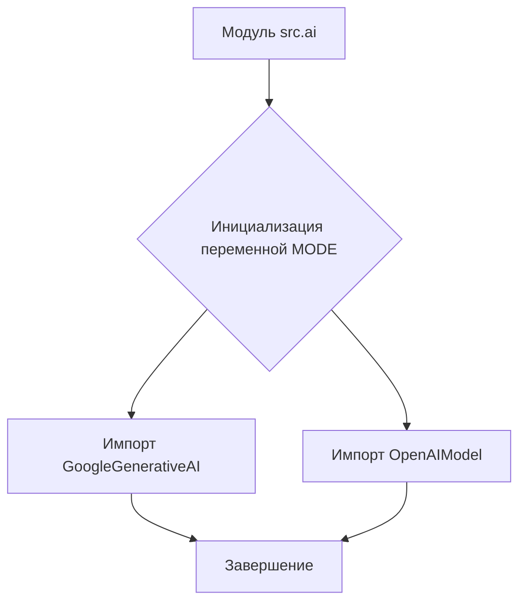

# <input code>

```python
## \file /src/ai/__init__.py
# -*- coding: utf-8 -*-

#! venv/bin/python/python3.12

"""
module: src.ai
	:platform: Windows, Unix
	:synopsis: Модуль интерфейса моделей ИИ.
	"""


from .gemini import GoogleGenerativeAI
from .openai import OpenAIModel
```

# <algorithm>

Алгоритм работы кода тривиален. Он представляет собой инициализацию модуля `src.ai`.

**Шаг 1:**  Модуль импортирует классы из подмодулей `gemini` и `openai`.
**Пример:**  Код импортирует классы `GoogleGenerativeAI` и `OpenAIModel` из соответствующих подмодулей.

**Шаг 2:** Модуль инициализирует переменную `MODE` со значением 'dev'.
**Пример:**  Это переменная, скорее всего, определяет режим работы, например, 'dev' – для разработки, 'prod' – для производства.

**Пошаговая блок-схема:**



Данные не передаются между функциями или классами на этом этапе, так как это инициализационный модуль.


# <mermaid>

```mermaid
graph LR
    subgraph "src.ai"
        A[] --> B(Импорт GoogleGenerativeAI);
        A --> C(Импорт OpenAIModel);
    end
```

# <explanation>

* **Импорты:**
    - `from .gemini import GoogleGenerativeAI`: Импортирует класс `GoogleGenerativeAI` из подмодуля `gemini` внутри текущей директории (`src.ai`).  Это предполагает, что в `src/ai/gemini.py` определен класс `GoogleGenerativeAI`, представляющий интерфейс к модели Google Gemini.
    - `from .openai import OpenAIModel`: Импортирует класс `OpenAIModel` из подмодуля `openai` внутри текущей директории (`src.ai`). Предполагается, что в `src/ai/openai.py` определен класс `OpenAIModel`, представляющий интерфейс к модели OpenAI.
    - Импорты начинаются с `.`, что означает, что подмодули `gemini` и `openai` расположены в той же директории, что и `__init__.py`.

* **Переменные:**
    - ``:  Это константа, которая, вероятно, используется для определения режима работы приложения (разработка или производство).  Её значение должно быть установлено в соответствии с рабочей средой.

* **Классы:**
    - `GoogleGenerativeAI`:  Класс, предоставляющий методы для взаимодействия с моделью Google Gemini.
    - `OpenAIModel`: Класс, предоставляющий методы для взаимодействия с моделью OpenAI.

* **Функции:**  Нет функций в данном `__init__.py`.

* **Возможные ошибки/улучшения:**
    - Нет проверки существования импортированных классов (`GoogleGenerativeAI`, `OpenAIModel`). Если `gemini.py` или `openai.py` отсутствуют или содержат ошибки,  приложение вызовет ошибку во время выполнения.
    - Нет указания на использование и инициализацию моделей, описанных в подмодулях. Для того, чтобы использовать эти модели, необходимо будет создать экземпляры классов `GoogleGenerativeAI` и `OpenAIModel` в коде, использующем этот модуль.
    - Переменная `MODE` - это только константа. Возможно, её значение должно изменяться в зависимости от окружения, или, более вероятно, что инициализация моделей зависит от переменной `MODE`.


**Цепочка взаимосвязей:**
Модуль `src.ai` служит посредником для взаимодействия с внешними моделями (Google Gemini и OpenAI).  Он, в свою очередь, зависит от `src.ai.gemini` и `src.ai.openai` для реализации интерфейсов моделей. Программа, использующая `src.ai`, будет импортировать этот модуль и взаимодействовать с ним, чтобы получить доступ к методам для работы с моделями ИИ.