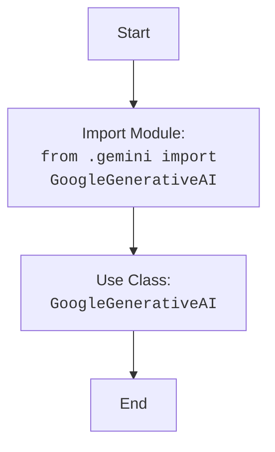
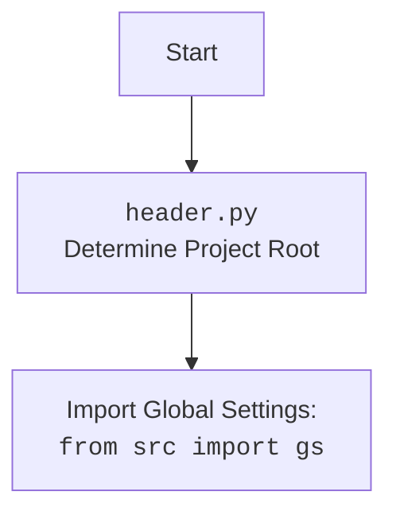

## АНАЛИЗ КОДА: `hypotez/src/ai/__init__.py`

### <алгоритм>

1.  **Импорт**: Из модуля `gemini` текущего пакета (`.`) импортируется класс `GoogleGenerativeAI`.

    *   **Пример**: В коде, если есть файл `gemini.py` в директории `hypotez/src/ai`, и он содержит класс `GoogleGenerativeAI`, то данный импорт сделает этот класс доступным в текущем файле `__init__.py`.
    
    *   **Поток данных**: Импорт не создает поток данных, но позволяет использовать класс `GoogleGenerativeAI`. Поток данных начнётся, когда будет создан экземпляр класса `GoogleGenerativeAI` и вызваны его методы.

### <mermaid>

**Объяснение диаграммы:**

1.  `Start`: Начало процесса.
2.  `ImportGeminiModule`: Импортирует класс `GoogleGenerativeAI` из модуля `gemini`, который находится в той же директории. Этот шаг устанавливает зависимость от модуля `gemini`.
3.  `GoogleGenerativeAIClass`: Класс `GoogleGenerativeAI` теперь доступен для использования в текущем модуле (`__init__.py`), и можно создавать его экземпляры.
4.  `End`: Завершение процесса импорта и подготовки класса к использованию.

### <объяснение>

*   **Импорты**:
    *   `from .gemini import GoogleGenerativeAI`:
        *   Импортирует класс `GoogleGenerativeAI` из модуля `gemini.py`, находящегося в той же директории, что и текущий файл `__init__.py` (пакет `ai`).
        *   `.` (точка) в импорте означает текущий пакет.
        *   `gemini` указывает на модуль `gemini.py`.
        *   `GoogleGenerativeAI` - конкретный класс, который мы хотим импортировать.
        *   Этот импорт позволяет использовать `GoogleGenerativeAI` в других модулях, импортирующих пакет `ai`.

*   **Классы**:
    *   `GoogleGenerativeAI`:
        *   Предполагается, что класс `GoogleGenerativeAI` определен в `gemini.py`.
        *   Этот класс, вероятно, предоставляет интерфейс для работы с API Google Gemini.
        *   Конкретные атрибуты и методы класса нам неизвестны, так как их нет в предоставленном коде. Но можно предположить наличие таких методов, как `generate_text`, `generate_image` и т.п.

*   **Функции**:
    *   В предоставленном коде нет функций.
*   **Переменные**:
    *   В данном коде нет переменных.

**Взаимосвязи с другими частями проекта**:
    *   Пакет `ai` предназначен для интеграции моделей AI, таких как Google Gemini.
    *   Класс `GoogleGenerativeAI` будет использоваться в других модулях проекта (например, в модулях, работающих с текстом или изображениями), для вызова API Google Gemini.
    *   Подразумевается что есть пакет `hypotez/src/` , который содержит пакет `ai`.
    *   Предположительно модуль `src` содержит глобальные настройки, но они отсутствуют в представленном коде.

**Потенциальные ошибки или области для улучшения**:
*   В предоставленном коде нет обработки ошибок.
*   Нет никакой документации о том, как использовать класс `GoogleGenerativeAI`.

**Дополнительно**:

В случае, если в файле `gemini.py` используется `import header`, тогда добавится следующий блок mermaid:

