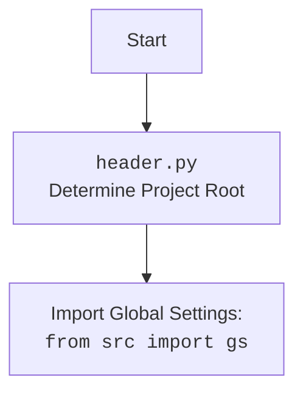

## <алгоритм>

1.  **Инициализация клиента:**
    *   При создании экземпляра `ClaudeClient` (например, `claude_client = ClaudeClient(api_key)`), вызывается метод `__init__`, который принимает `api_key` в качестве аргумента.
    *   Создается объект `anthropic.Client` с использованием полученного `api_key`.
    *   Этот объект `anthropic.Client` сохраняется в атрибуте `self.client` экземпляра `ClaudeClient`.

    *   Пример:
        *   Ввод: `api_key = "your-api-key"`
        *   `__init__(api_key)` создает `self.client = anthropic.Client(api_key)`
        *   Вывод: Объект `ClaudeClient` с инициализированным `self.client`

2.  **Генерация текста:**
    *   Вызывается метод `generate_text(prompt, max_tokens_to_sample=100)`.
    *   Метод отправляет запрос к `self.client.completion` с указанием `prompt`, `model="claude-v1"`, `max_tokens_to_sample`, и `stop_sequences`.
    *   Полученный ответ сохраняется в переменную `response`.
    *   Метод возвращает значение ключа `'completion'` из `response`.

    *   Пример:
        *   Ввод: `prompt = "Write a short story about a robot learning to love."`
        *   `generate_text(prompt)` вызывает `self.client.completion(prompt=prompt, model="claude-v1", max_tokens_to_sample=100, stop_sequences=["\\n\\nHuman:"])`
        *   Вывод: `response['completion']` - сгенерированный текст

3.  **Анализ тональности:**
    *   Вызывается метод `analyze_sentiment(text)`.
    *   Формируется строка запроса `f"Analyze the sentiment of the following text: {text}"`.
    *   Метод отправляет запрос к `self.client.completion` с использованием сформированного запроса, `model="claude-v1"`, `max_tokens_to_sample=50`, и `stop_sequences`.
    *   Полученный ответ сохраняется в переменную `response`.
    *   Метод возвращает значение ключа `'completion'` из `response`.

    *   Пример:
        *   Ввод: `text = "I am very happy today!"`
        *   `analyze_sentiment(text)` вызывает `self.client.completion(prompt=f"Analyze the sentiment of the following text: {text}", model="claude-v1", max_tokens_to_sample=50, stop_sequences=["\\n\\nHuman:"])`
        *   Вывод: `response['completion']` - анализ тональности текста

4.  **Перевод текста:**
    *   Вызывается метод `translate_text(text, source_language, target_language)`.
    *   Формируется строка запроса `f"Translate the following text from {source_language} to {target_language}: {text}"`.
    *   Метод отправляет запрос к `self.client.completion` с использованием сформированного запроса, `model="claude-v1"`, `max_tokens_to_sample=100`, и `stop_sequences`.
    *   Полученный ответ сохраняется в переменную `response`.
    *   Метод возвращает значение ключа `'completion'` из `response`.

    *   Пример:
        *   Ввод: `text = "Hello, how are you?", source_language="en", target_language="es"`
        *   `translate_text(text, source_language, target_language)` вызывает `self.client.completion(prompt=f"Translate the following text from {source_language} to {target_language}: {text}", model="claude-v1", max_tokens_to_sample=100, stop_sequences=["\\n\\nHuman:"])`
        *   Вывод: `response['completion']` - переведенный текст

5.  **Пример использования (if __name__ == "__main__":)**
    *   Создается экземпляр `ClaudeClient` с ключом API.
    *   Вызывается метод `generate_text()` для генерации текста.
    *   Вызывается метод `analyze_sentiment()` для анализа тональности.
    *   Вызывается метод `translate_text()` для перевода текста.
    *   Результаты выводятся в консоль.

## <mermaid>

```mermaid
flowchart TD
    Start --> ClaudeClientInit[ClaudeClient Initialization<br><code>__init__(api_key)</code>]
    ClaudeClientInit --> AnthropicClientCreation[Create anthropic.Client with API Key]
    AnthropicClientCreation --> StoreClientObject[Store anthropic.Client Object in <code>self.client</code>]
    StoreClientObject --> GenerateTextCall[Call <code>generate_text(prompt, max_tokens_to_sample)</code>]
    GenerateTextCall --> AnthropicCompletionGenerate[Call <code>self.client.completion()</code> for text generation]
     AnthropicCompletionGenerate --> ReturnGeneratedText[Return Generated Text from Response]
     ReturnGeneratedText --> AnalyzeSentimentCall[Call <code>analyze_sentiment(text)</code>]
     AnalyzeSentimentCall --> AnthropicCompletionSentiment[Call <code>self.client.completion()</code> for sentiment analysis]
     AnthropicCompletionSentiment --> ReturnSentimentAnalysis[Return Sentiment Analysis from Response]
     ReturnSentimentAnalysis --> TranslateTextCall[Call <code>translate_text(text, source_language, target_language)</code>]
     TranslateTextCall --> AnthropicCompletionTranslate[Call <code>self.client.completion()</code> for text translation]
     AnthropicCompletionTranslate --> ReturnTranslatedText[Return Translated Text from Response]
     ReturnTranslatedText --> End
```

**Объяснение зависимостей `mermaid`:**

*   `flowchart TD`:  Объявляет тип диаграммы как блок-схему (flowchart) с направлением сверху вниз (TD - Top Down).
*   `Start`, `End`: Начало и конец блок-схемы.
*   `ClaudeClientInit`: Блок, представляющий вызов конструктора класса `ClaudeClient`.
*   `AnthropicClientCreation`: Блок, описывающий создание экземпляра класса `anthropic.Client`.
*    `StoreClientObject`: Блок, обозначающий сохранение объекта `anthropic.Client` в атрибуте экземпляра класса `self.client`.
*   `GenerateTextCall`: Блок, представляющий вызов метода `generate_text`.
*  `AnthropicCompletionGenerate`: Блок, обозначающий вызов метода `completion` из `anthropic.Client` для генерации текста.
* `ReturnGeneratedText`: Блок, представляющий возврат сгенерированного текста из ответа.
*   `AnalyzeSentimentCall`: Блок, представляющий вызов метода `analyze_sentiment`.
*  `AnthropicCompletionSentiment`: Блок, обозначающий вызов метода `completion` из `anthropic.Client` для анализа тональности.
*  `ReturnSentimentAnalysis`: Блок, представляющий возврат анализа тональности из ответа.
*   `TranslateTextCall`: Блок, представляющий вызов метода `translate_text`.
* `AnthropicCompletionTranslate`: Блок, обозначающий вызов метода `completion` из `anthropic.Client` для перевода текста.
*  `ReturnTranslatedText`: Блок, представляющий возврат переведенного текста из ответа.
*   `-->`: Стрелки, обозначающие поток выполнения.

## <объяснение>

**Импорты:**

*   `import anthropic`: Импортирует библиотеку `anthropic`, которая, как предполагается, является официальным SDK для взаимодействия с API Claude. Это ключевая зависимость для данного модуля, поскольку именно через неё происходит связь с моделью Claude.

**Классы:**

*   `class ClaudeClient:`:
    *   **Роль:** Этот класс является оберткой (wrapper) вокруг `anthropic.Client`, предоставляя более высокоуровневые методы для работы с Claude API.
    *   **Атрибуты:**
        *   `self.client`:  Экземпляр `anthropic.Client`, используется для отправки запросов к API. Инициализируется в методе `__init__`.
    *   **Методы:**
        *   `__init__(self, api_key)`: Конструктор класса. Принимает API ключ как аргумент и инициализирует `self.client`.
        *   `generate_text(self, prompt, max_tokens_to_sample=100)`: Генерирует текст на основе предоставленного `prompt` используя `self.client.completion`. Возвращает сгенерированный текст.
        *   `analyze_sentiment(self, text)`: Анализирует тональность текста. Использует `self.client.completion` для выполнения запроса к API. Возвращает результат анализа тональности.
        *   `translate_text(self, text, source_language, target_language)`: Переводит текст с одного языка на другой. Использует `self.client.completion` для запроса к API. Возвращает переведенный текст.

**Функции:**

*   В данном коде нет отдельных функций, кроме методов класса `ClaudeClient`. Методы класса, такие как `generate_text`, `analyze_sentiment` и `translate_text`, уже подробно описаны выше.

**Переменные:**

*   `api_key`: Строка, содержащая API ключ для доступа к API Claude. Используется при создании экземпляра `ClaudeClient`.
*   `prompt`, `text`, `source_language`, `target_language`: Строковые переменные, используемые в качестве параметров методов класса `ClaudeClient` и представляющие входные данные для запросов к API.
*   `response`: Переменная, хранящая ответ от API. Как правило, это словарь, из которого извлекается значение по ключу `'completion'`.
*   `generated_text`, `sentiment_analysis`, `translated_text`:  Строковые переменные, используемые для хранения результатов работы методов класса `ClaudeClient`.
*   `claude_client`: Экземпляр класса `ClaudeClient`.

**Потенциальные ошибки и улучшения:**

1.  **Обработка ошибок API:** В коде отсутствует обработка ошибок, которые могут возникнуть при запросах к API (например, проблемы с сетью, неверный API ключ, превышение лимита запросов). Необходимо добавить блоки try-except для обработки исключений и корректного реагирования на них.
2.  **Конфигурация модели:** Жестко задана модель `"claude-v1"`. Может быть полезно вынести название модели в конфигурацию или передавать как аргумент в методы.
3.  **Логирование:** Отсутствует логирование, что усложняет отладку и мониторинг.
4.  **Параметризация `stop_sequences`:** Может быть полезно сделать `stop_sequences` параметром, передаваемым в методы, если в разных случаях требуются разные стоп-последовательности.
5.  **Ключ API в коде:** Хранение API ключа непосредственно в коде является уязвимостью. Ключ должен быть вынесен в переменные окружения или использоваться другой способ безопасного хранения.
6.  **Не хватает документации:** Класс и его методы можно было бы прокомментировать более подробно.

**Взаимосвязь с другими частями проекта:**

*   Этот модуль, по всей видимости, предназначен для использования в качестве компонента AI в более широком проекте.
*   Другие части проекта могут импортировать класс `ClaudeClient` и использовать его для взаимодействия с Claude API.
*   Этот модуль зависит от библиотеки `anthropic`, которая должна быть установлена в окружении.
*   Этот модуль может зависеть от модуля `header.py`, который определяет корень проекта, но в этом коде не импортирован.

**Дополнение про header.py**

Поскольку в данном коде нет импорта `header.py`, блок `mermaid` с его описанием не включен. Если бы импорт был, то диаграмма выглядела бы так:


```

В этом случае `header.py` отвечал бы за определение корневого каталога проекта, чтобы все импорты могли строиться относительно него, а `import[Import Global Settings: <br><code>from src import gs</code>]` означал бы импорт глобальных настроек проекта.