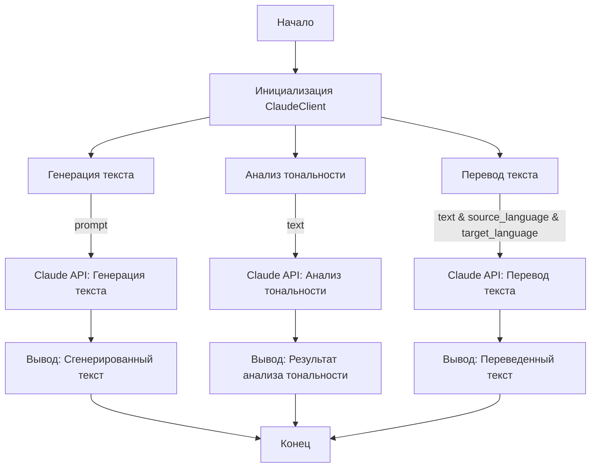

## ИНСТРУКЦИЯ:

Анализируй предоставленный код подробно и объясни его функциональность. Ответ должен включать три раздела:  

1. **<алгоритм>**: Опиши рабочий процесс в виде пошаговой блок-схемы, включая примеры для каждого логического блока, и проиллюстрируй поток данных между функциями, классами или методами.  
2. **<mermaid>**: Напиши код для диаграммы в формате `mermaid`, проанализируй и объясни все зависимости, 
    которые импортируются при создании диаграммы. 
    **ВАЖНО!** Убедитесь, что все имена переменных, используемые в диаграмме `mermaid`, 
    имеют осмысленные и описательные имена. Имена переменных вроде `A`, `B`, `C`, и т.д., не допускаются!  
    
    **Дополнительно**: Если в коде есть импорт `import header`, добавьте блок `mermaid` flowchart, объясняющий `header.py`:\
    ```mermaid\
    flowchart TD\
        Start --> Header[<code>header.py</code><br> Determine Project Root]\
    \
        Header --> import[Import Global Settings: <br><code>from src import gs</code>] \
    ```

3. **<объяснение>**: Предоставьте подробные объяснения:  
   - **Импорты**: Их назначение и взаимосвязь с другими пакетами `src.`.  
   - **Классы**: Их роль, атрибуты, методы и взаимодействие с другими компонентами проекта.  
   - **Функции**: Их аргументы, возвращаемые значения, назначение и примеры.  
   - **Переменные**: Их типы и использование.  
   - Выделите потенциальные ошибки или области для улучшения.  

Дополнительно, постройте цепочку взаимосвязей с другими частями проекта (если применимо).  

Это обеспечивает всесторонний и структурированный анализ кода.
## Формат ответа: `.md` (markdown)
**КОНЕЦ ИНСТРУКЦИИ**
```markdown
## <алгоритм>

**Блок-схема работы с `ClaudeClient`:**

1.  **Инициализация `ClaudeClient`**:
    *   **Пример**: `api_key = "your-api-key"; claude_client = ClaudeClient(api_key)`
    *   **Описание**: Создается экземпляр класса `ClaudeClient`, который принимает API-ключ как аргумент. Этот ключ используется для аутентификации при обращении к сервису Claude от Anthropic.

2.  **Генерация текста**:
    *   **Пример**: `prompt = "Напишите короткую историю..."; generated_text = claude_client.generate_text(prompt)`
    *   **Описание**: Вызывается метод `generate_text` с текстом промпта. Метод отправляет запрос в API Claude и возвращает сгенерированный текст.

3.  **Анализ тональности**:
    *   **Пример**: `text_to_analyze = "Сегодня я очень счастлив!"; sentiment_analysis = claude_client.analyze_sentiment(text_to_analyze)`
    *   **Описание**: Метод `analyze_sentiment` принимает текст, отправляет его в API Claude, и возвращает анализ тональности (например, "положительная", "отрицательная" или "нейтральная").

4.  **Перевод текста**:
    *   **Пример**: `text_to_translate = "Привет, как дела?"; source_language = "ru"; target_language = "en"; translated_text = claude_client.translate_text(text_to_translate, source_language, target_language)`
    *   **Описание**: Метод `translate_text` принимает текст, код исходного языка и код целевого языка. Отправляет запрос в API Claude для перевода и возвращает переведенный текст.

**Поток данных:**

```
[API Key] --> ClaudeClient Initialization
[Prompt Text] --> generate_text() --> [Generated Text]
[Text for Analysis] --> analyze_sentiment() --> [Sentiment Analysis Result]
[Text to Translate, Source Language, Target Language] --> translate_text() --> [Translated Text]
```

## <mermaid>


**Разбор зависимостей в `mermaid`:**

Диаграмма описывает последовательность операций, выполняемых с использованием `ClaudeClient`. Она показывает, как данные (текст, языки) передаются между локальными методами `ClaudeClient` и API Claude, для получения сгенерированного текста, анализа тональности, и переведенного текста.

## <объяснение>

**Импорты:**

-   `from claude_client import ClaudeClient`: Импортирует класс `ClaudeClient` из модуля `claude_client`. Предположительно, `claude_client.py` содержит реализацию класса, который взаимодействует с API Claude.

**Классы:**

-   `ClaudeClient`:
    *   **Роль:** Этот класс служит интерфейсом для взаимодействия с языковой моделью Claude от Anthropic. Он инкапсулирует логику для отправки запросов к API и обработки ответов.
    *   **Атрибуты:** Предположительно, имеет атрибут для хранения API-ключа, переданного при инициализации.
    *   **Методы:**
        -   `__init__(api_key)`: Конструктор класса, принимающий API-ключ.
        -   `generate_text(prompt, max_tokens_to_sample=100)`: Генерирует текст на основе заданного промпта.
            *   **Параметры**: `prompt` (строка, текст промпта), `max_tokens_to_sample` (целое число, максимальное количество токенов для генерации, по умолчанию 100).
            *   **Возвращает**: Строка, сгенерированный текст.
        -   `analyze_sentiment(text)`: Анализирует тональность заданного текста.
            *   **Параметры**: `text` (строка, текст для анализа).
            *   **Возвращает**: Строка, результат анализа тональности.
        -   `translate_text(text, source_language, target_language)`: Переводит текст с одного языка на другой.
            *   **Параметры**: `text` (строка, текст для перевода), `source_language` (строка, код исходного языка), `target_language` (строка, код целевого языка).
            *   **Возвращает**: Строка, переведенный текст.
    *   **Взаимодействие:** Этот класс использует API Claude для выполнения запросов и возвращает результаты.

**Функции:**

-   В данном README.md коде функции не определяются напрямую, но описаны методы класса `ClaudeClient`.

**Переменные:**

-   `api_key`: Строка, содержит API-ключ для доступа к сервису Claude.
-   `prompt`: Строка, содержит текст промпта для генерации текста.
-   `generated_text`: Строка, содержит сгенерированный текст.
-   `text_to_analyze`: Строка, содержит текст для анализа тональности.
-   `sentiment_analysis`: Строка, содержит результат анализа тональности.
-   `text_to_translate`: Строка, содержит текст для перевода.
-   `source_language`: Строка, содержит код исходного языка.
-   `target_language`: Строка, содержит код целевого языка.
-   `translated_text`: Строка, содержит переведенный текст.

**Потенциальные ошибки и области для улучшения:**

-   **Обработка ошибок:** Код не показывает, как обрабатываются ошибки, возникающие при обращении к API Claude (например, сетевые ошибки, некорректный API-ключ, превышение лимитов). Необходимо добавить обработку исключений для более надежной работы.
-   **Валидация входных данных:** Нет валидации входных данных. Например, `source_language` и `target_language` должны быть корректными кодами языков.
-   **Асинхронность:** Выполнение запросов к API может быть долгим. Рассмотреть использование асинхронных запросов для повышения производительности.
-   **Конфигурация:** Жестко заданный `max_tokens_to_sample` может быть не оптимальным во всех случаях. Желательно добавить возможность конфигурировать этот параметр.

**Взаимосвязи с другими частями проекта:**

-   **`claude_client.py`**:  Этот файл, вероятно, содержит реализацию класса `ClaudeClient` и является основой для данного модуля.
-   **`src.ai`**: Модуль `src.ai` является родительским для `src.ai.anthropic`, что подразумевает интеграцию модуля с другими AI-сервисами или моделями в рамках проекта.
-   **Настройки API Key**: предполагается, что значение `api_key` получается из настроек проекта, а не хардкодится в коде.

Этот анализ предоставляет структурированное понимание представленного кода и его места в проекте.
```