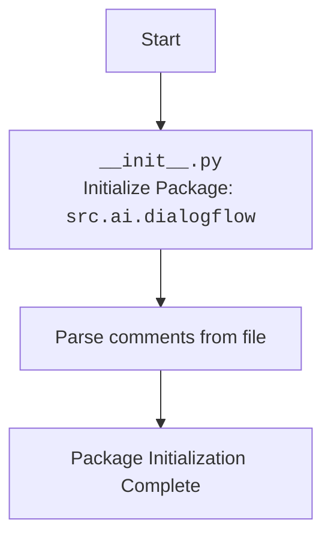

## АНАЛИЗ КОДА: `src/ai/dialogflow/__init__.py`

### <алгоритм>

1.  **Начало**:  Файл `__init__.py` является частью пакета `src.ai.dialogflow`. Он инициализирует этот пакет при импорте.
2.  **Комментарии**: Файл содержит различные комментарии, включая:
    *   Заголовок файла.
    *   Описание модуля `src.ai.dialogflow`.
    *   Совместимость с различными платформами (Windows, Unix).
    *   Ссылка на статью на Хабре (https://habr.com/ru/articles/346606/).
    *   **Пример:**

        ```python
        # -*- coding: utf-8 -*-
        #! venv/bin/python/python3.12
        """
        .. module:: src.ai.dialogflow
        """
        ```
3.  **Отсутствие исполняемого кода**: Файл `__init__.py`  не содержит исполняемого кода, кроме комментариев. Он просто указывает, что директория `dialogflow` является Python-пакетом.
    *   **Пример**: Файл пуст.
4.  **Конец**: Пакет `src.ai.dialogflow` инициализирован при импорте, но никаких действий не выполнено.

### <mermaid>


**Объяснение:**
*   **flowchart TD**: Указывает, что мы строим блок-схему сверху вниз.
*   **Start**: Начало процесса инициализации.
*   **Init**: Обозначает файл `__init__.py`, который инициализирует пакет `src.ai.dialogflow`.
*  **Comments**: Парсинг комментариев для описания модуля и другой метаинформации
*   **End**: Завершение инициализации пакета, без каких-либо выполняемых операций.

### <объяснение>

*   **Импорты**: В данном файле импорты отсутствуют.  Файл `__init__.py` в пакете не требует явных импортов,  поскольку его основная функция - обозначить директорию как Python-пакет.
*   **Классы**: В данном файле классы отсутствуют.  `__init__.py` обычно не содержит определений классов.
*   **Функции**: В данном файле функции отсутствуют.  `__init__.py` обычно не содержит определений функций.
*   **Переменные**: В данном файле переменные отсутствуют.
*   **Назначение файла**: Файл `__init__.py` в Python служит для инициализации пакета. Его наличие в директории делает эту директорию пакетом, что позволяет импортировать модули и подпакеты из нее. В данном случае файл `__init__.py` инициализирует пакет `src.ai.dialogflow`.
*   **Взаимосвязи с другими частями проекта**: Этот файл не зависит от других файлов, но он является частью более крупной структуры проекта `src`. Пакеты `src.ai` и `src.ai.dialogflow` в целом будут использоваться для работы с Dialogflow API и других AI-компонентов проекта.
*   **Потенциальные ошибки или области для улучшения**:
    *   В текущем виде файл не выполняет никаких действий, кроме инициализации пакета. В дальнейшем в этом файле можно добавить дополнительные операции по настройке пакета, например, импорт необходимых модулей или инициализацию общих переменных.
    *   Описание модуля в комментариях очень общее.  В будущем, после реализации функционала пакета, нужно будет добавить более подробное описание функциональности модуля.
    *  Ссылка на статью на Хабре может быть полезна для понимания общих принципов работы с Dialogflow API, но более подробная документация, привязанная к особенностям проекта, необходима.

Этот анализ показывает, что данный `__init__.py`  используется для объявления  директории `dialogflow` как пакета.  В нем нет исполняемого кода, но он является основой для дальнейшей работы пакета `src.ai.dialogflow`.