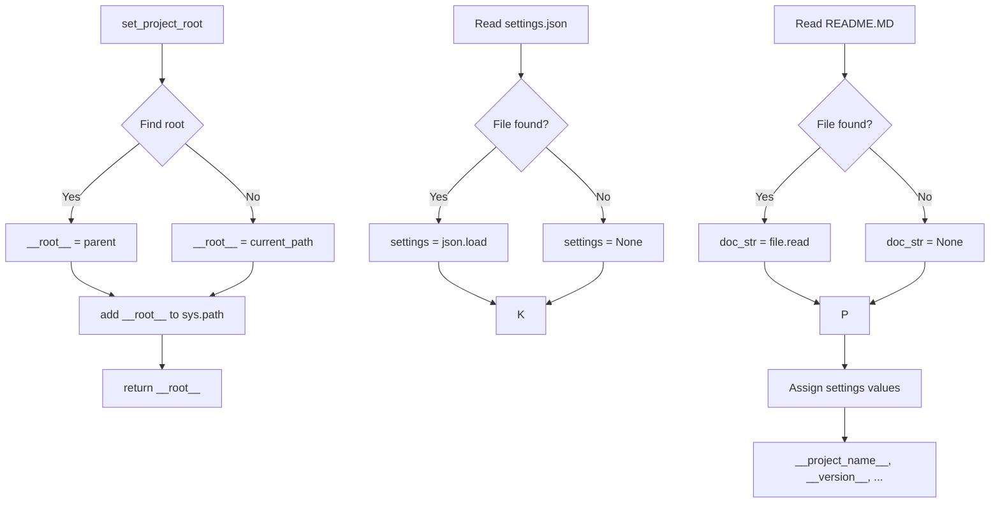

# <input code>

```python
## \file hypotez/src/ai/dialogflow/header.py
# -*- coding: utf-8 -*-\

#! venv/bin/python/python3.12

"""
.. module: src.ai.dialogflow 
	:platform: Windows, Unix
	:synopsis:

"""


"""
	:platform: Windows, Unix
	:synopsis:

"""


"""
	:platform: Windows, Unix
	:synopsis: Модуль определяющий корневой путь к проекту. Все импорты строятся относительно этого пути.
    :TODO: В дальнейшем перенести в системную переменную

"""


import sys
import json
from packaging.version import Version

from pathlib import Path
def set_project_root(marker_files=('__root__','.git')) -> Path:
    """
    Finds the root directory of the project starting from the current file's directory,
    searching upwards and stopping at the first directory containing any of the marker files.

    Args:
        marker_files (tuple): Filenames or directory names to identify the project root.
    
    Returns:
        Path: Path to the root directory if found, otherwise the directory where the script is located.
    """
    __root__:Path
    current_path:Path = Path(__file__).resolve().parent
    __root__ = current_path
    for parent in [current_path] + list(current_path.parents):
        if any((parent / marker).exists() for marker in marker_files):
            __root__ = parent
            break
    if __root__ not in sys.path:
        sys.path.insert(0, str(__root__))
    return __root__


# Get the root directory of the project
__root__ = set_project_root()
"""__root__ (Path): Path to the root directory of the project"""

from src import gs

settings:dict = None
try:
    with open(gs.path.root / 'src' /  'settings.json', 'r') as settings_file:
        settings = json.load(settings_file)
except (FileNotFoundError, json.JSONDecodeError):
    ...

doc_str:str = None
try:
    with open(gs.path.root / 'src' /  'README.MD', 'r') as settings_file:
        doc_str = settings_file.read()
except (FileNotFoundError, json.JSONDecodeError):
    ...


__project_name__ = settings.get("project_name", 'hypotez') if settings  else 'hypotez'
__version__: str = settings.get("version", '')  if settings  else ''
__doc__: str = doc_str if doc_str else ''
__details__: str = ''
__author__: str = settings.get("author", '')  if settings  else ''
__copyright__: str = settings.get("copyrihgnt", '')  if settings  else ''
__cofee__: str = settings.get("cofee", "Treat the developer to a cup of coffee for boosting enthusiasm in development: https://boosty.to/hypo69")  if settings  else "Treat the developer to a cup of coffee for boosting enthusiasm in development: https://boosty.to/hypo69"
```

# <algorithm>

**Шаг 1:** Функция `set_project_root()`.
    - Принимает кортеж `marker_files` с именами файлов/директорий, которые используются для определения корневой директории проекта.
    - Начинает поиск с текущей директории файла и идет вверх по иерархии директорий.
    - Для каждой директории проверяет существование файлов/директорий из `marker_files` в данной директории.
    - Если файл/директория из `marker_files` найден, то эта директория становится корневой (`__root__`) и цикл завершается.
    - Если ни один из файлов/директорий не найден, корневой директорий остается текущая.
    - Добавляет корневую директорию в `sys.path` для корректного импорта модулей.
    - Возвращает корневую директорию (`__root__`).

**Шаг 2:** Получение корневой директории.
    - Вызывается функция `set_project_root()`, результат присваивается переменной `__root__`.

**Шаг 3:** Чтение настроек.
    - Попытка открыть файл `settings.json` в директории `gs.path.root / 'src'`.
    - Если файл найден, то содержимое файла парсится с помощью `json.load` и присваивается переменной `settings`.
    - Если файл не найден или содержимое некорректно, обработчик ошибок пропускает этот блок кода.


**Шаг 4:** Чтение документации.
    - Аналогично, с помощью `try-except` читается файл `README.MD` и содержимое присваивается переменной `doc_str`.

**Шаг 5:** Чтение переменных настроек.
    - Из словаря `settings` считываются переменные: `project_name`, `version`, `author`, `copyright`, `cofee`.
    - Присваивается значение по умолчанию, если `settings` не существует или соответствующие ключи не найдены.

**Пример данных:**
Входные данные:
- Файл `settings.json`: `{"project_name": "MyProject", "version": "1.0.0", "author": "John Doe"}`
- Файл `README.MD`: `My project description`

Выходные данные:
- `__project_name__`: "MyProject"
- `__version__`: "1.0.0"
- `__doc__`: "My project description"
- `__author__`: "John Doe"

# <mermaid>



# <explanation>

**Импорты:**

- `sys`: Предоставляет доступ к системным параметрам, в частности, к пути `sys.path`. Используется для добавления корневой директории в `sys.path`, что необходимо для импорта модулей.
- `json`: Для работы с JSON-файлами, например, для загрузки настроек.
- `packaging.version`: Для работы с версиями пакетов.
- `pathlib`: Для работы с путями к файлам. Важно для определения корневого пути и работы с файлами.
- `src.gs`: Предполагается, что это модуль, который предоставляет переменную/функцию `gs.path.root`, содержащую корневой путь к проекту, определенный в другом модуле.


**Классы:**

Нет явных классов в этом файле.


**Функции:**

- `set_project_root(marker_files)`:  Функция находит корневой каталог проекта. Она принимает кортеж маркеров, таких как имена файлов или папок (`pyproject.toml`, `requirements.txt`, `README.md`).  Возвращает объект `Path` с путем к корневому каталогу. Эта функция необходима для того, чтобы импорты работали независимо от того, где находится файл `header.py` относительно корневой директории проекта. Она существенно улучшает организацию проекта.

**Переменные:**

- `__root__`: Путь к корневому каталогу проекта, определенный функцией `set_project_root()`.
- `settings`: Словарь с настройками, загруженный из файла `settings.json`.
- `doc_str`: Строка, содержащая содержимое файла `README.MD`.
- `__project_name__`, `__version__`, `__doc__`, `__details__`, `__author__`, `__copyright__`, `__cofee__`: Переменные с информацией о проекте, полученные из `settings` или имеющие значения по умолчанию.

**Возможные ошибки и улучшения:**

- **Обработка ошибок:** Блоки `try...except` для чтения `settings.json` и `README.MD` обрабатывают возможные `FileNotFoundError` и `json.JSONDecodeError`.  Это важно, так как эти файлы могут отсутствовать или быть повреждены.
- **Глобальные переменные:** Использование глобальных переменных (например, `__root__`, `settings`, `doc_str`) может сделать код менее гибким и труднотестируемым в больших проектах. Вместо этого можно использовать функции и классы для организации данных и логики.
- **Типизация:** Дополнительная типизация может повысить читабельность и безопасность кода.


**Взаимосвязь с другими частями проекта:**

Модуль `header.py` необходим для определения пути к корневому каталогу проекта, который используется другими модулями, в частности модулем `src.gs`.  Взаимодействие с `gs.path.root` (из модуля `src.gs`) свидетельствует о том, что `gs` отвечает за получение/обработку путей к ресурсам проекта.

```
+-----------------+     +-------------------+
| header.py      |----->|   gs.py           |
+-----------------+     +-------------------+
                 |     |
                 |     v
                 +-----+-----> другие модули
                               |
                               |
                             Работают с путями
```
Этот модуль играет важную роль в организации проекта, обеспечивая возможность обращения к ресурсам проекта вне зависимости от текущего рабочего каталога.