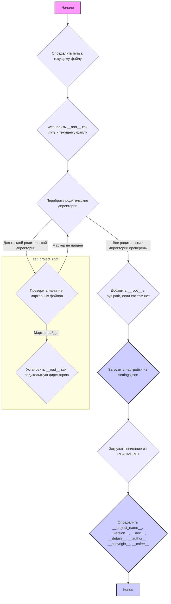
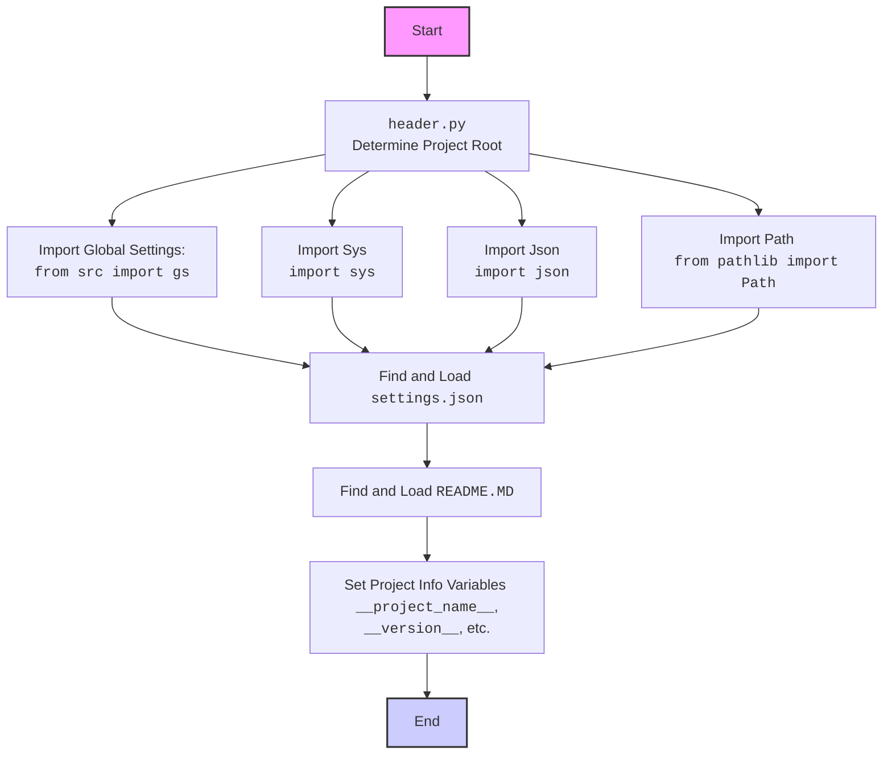

## ИНСТРУКЦИЯ:

Анализируй предоставленный код подробно и объясни его функциональность. Ответ должен включать три раздела:

1.  **<алгоритм>**: Опиши рабочий процесс в виде пошаговой блок-схемы, включая примеры для каждого логического блока, и проиллюстрируй поток данных между функциями, классами или методами.
2.  **<mermaid>**: Напиши код для диаграммы в формате `mermaid`, проанализируй и объясни все зависимости,
    которые импортируются при создании диаграммы.
    **ВАЖНО!** Убедитесь, что все имена переменных, используемые в диаграмме `mermaid`,
    имеют осмысленные и описательные имена. Имена переменных вроде `A`, `B`, `C`, и т.д., не допускаются!

    **Дополнительно**: Если в коде есть импорт `import header`, добавьте блок `mermaid` flowchart, объясняющий `header.py`:
    ```mermaid
    flowchart TD
        Start --> Header[<code>header.py</code><br> Determine Project Root]

        Header --> import[Import Global Settings: <br><code>from src import gs</code>]
    ```

3.  **<объяснение>**: Предоставьте подробные объяснения:
    -   **Импорты**: Их назначение и взаимосвязь с другими пакетами `src.`.
    -   **Классы**: Их роль, атрибуты, методы и взаимодействие с другими компонентами проекта.
    -   **Функции**: Их аргументы, возвращаемые значения, назначение и примеры.
    -   **Переменные**: Их типы и использование.
    -   Выделите потенциальные ошибки или области для улучшения.

Дополнительно, постройте цепочку взаимосвязей с другими частями проекта (если применимо).

Это обеспечивает всесторонний и структурированный анализ кода.
## Формат ответа: `.md` (markdown)
**КОНЕЦ ИНСТРУКЦИИ**

## <алгоритм>


**Примеры:**

1.  **Определение пути к текущему файлу:** `__file__` - это специальная переменная, содержащая путь к текущему файлу (`header.py`). Например: `D:/projects/hypotez/src/ai/dialogflow/header.py`.
2.  **Установка \_\_root\_\_ как пути к текущему файлу:**  `__root__` временно устанавливается в путь к директории, где находится `header.py`, например: `D:/projects/hypotez/src/ai/dialogflow`.
3.  **Перебор родительских директорий:** Если `header.py` находится в `D:/projects/hypotez/src/ai/dialogflow`, то будут перебраны `D:/projects/hypotez/src/ai/dialogflow`, `D:/projects/hypotez/src/ai`, `D:/projects/hypotez/src`, `D:/projects/hypotez`, `D:/projects`, `D:/`.
4.  **Проверка наличия маркерных файлов:** Проверяется наличие файлов `__root__` или `.git` в текущей родительской директории. Например, если `.git` находится в `D:/projects/hypotez`, то `__root__` будет установлен в `D:/projects/hypotez`.
5.  **Загрузка настроек из `settings.json`:** Файл `settings.json` загружается как JSON-объект и сохраняется в переменной `settings`. Например: `{ "project_name": "hypotez", "version": "1.0.0" }`.
6.  **Загрузка описания из `README.MD`:** Содержимое файла `README.MD` читается в виде строки и сохраняется в переменной `doc_str`.
7.  **Определение глобальных переменных:**  `__project_name__`, `__version__`, `__doc__` и другие, берутся из `settings`, если `settings` существуют, иначе устанавливаются значения по умолчанию.

## <mermaid>
```mermaid
flowchart TD
    Start --> FindRoot[<code>set_project_root()</code> <br> Determine Project Root];
    FindRoot --> PathCalculation[Calculate Path to Current File]
    PathCalculation --> SetRootToCurrent[Set  <code>__root__</code>  to Current File Directory]
    SetRootToCurrent --> IterateParents[Iterate Through Parent Directories]
    IterateParents --> CheckForMarkers{Check for Marker Files <br>  (<code>__root__</code>, <code>.git</code>)}
    CheckForMarkers -- Marker Found --> SetRootToParent[Set <code>__root__</code> to Parent Directory]
    SetRootToParent --> ExitLoop[Exit Loop]
    CheckForMarkers -- Marker Not Found --> IterateParents
    IterateParents -- All Parents Checked --> AddRootToSysPath{Add <code>__root__</code> to <code>sys.path</code> if not present}
    AddRootToSysPath --> ReturnRoot[Return <code>__root__</code>]
    ReturnRoot --> LoadSettings{Load <code>settings.json</code>}
    LoadSettings -- Success --> LoadReadme{Load <code>README.MD</code>}
    LoadSettings -- Failure --> LoadReadme
    LoadReadme -- Success --> SetGlobalVars[Set Global Variables <br> <code>__project_name__</code>, <code>__version__</code> etc.]
    LoadReadme -- Failure --> SetGlobalVars
    SetGlobalVars --> End
    End

    style Start fill:#f9f,stroke:#333,stroke-width:2px
    style End fill:#ccf,stroke:#333,stroke-width:2px

```



**Зависимости:**
*   `sys`: Модуль `sys` используется для работы с интерпретатором Python, включая изменение путей поиска модулей (`sys.path`).
*   `json`: Модуль `json` используется для работы с JSON-файлами, в частности для загрузки настроек из файла `settings.json`.
*   `packaging.version`:  Импортируется `Version` из `packaging.version` но не используется в предоставленном коде.
*   `pathlib.Path`: Модуль `pathlib` используется для работы с путями к файлам и директориям в объектно-ориентированном стиле.
*   `src.gs`: Импортируется модуль `gs` из пакета `src`, который, вероятно, содержит глобальные настройки и константы, включая пути к директориям проекта.

## <объяснение>

**Импорты:**

*   `import sys`:  Используется для доступа к переменным и функциям, связанным с интерпретатором Python. Здесь используется для добавления корневой директории проекта в `sys.path`, чтобы другие модули могли быть импортированы.
*   `import json`: Используется для работы с JSON-данными, конкретно для чтения данных конфигурации из файла `settings.json`.
*   `from packaging.version import Version`: Импортируется класс `Version`, но не используется в текущем коде, возможно, это заготовка для будущего использования.
*   `from pathlib import Path`: Используется для представления путей к файлам и директориям, что облегчает их обработку и манипулирование.
*   `from src import gs`: Импортирует модуль `gs` из пакета `src`. `gs` вероятно, содержит глобальные пути к директориям проекта, например `gs.path.root`.

**Функции:**

*   `set_project_root(marker_files=('__root__', '.git')) -> Path`:
    *   **Аргументы:**
        *   `marker_files`: (tuple, optional) кортеж строк, представляющих названия файлов или директорий, которые являются признаком корневой директории проекта. Значение по умолчанию `('__root__', '.git')`.
    *   **Возвращает:** Объект `Path`, представляющий путь к корневой директории проекта.
    *   **Назначение:** Находит корневую директорию проекта путем поиска вверх по иерархии директорий, начиная с директории, где находится текущий файл, и останавливается на первой директории, содержащей хотя бы один из маркерных файлов. Если маркер не найден, то возвращается путь к директории текущего файла. Путь найденной корневой директории также добавляется в `sys.path`.
    *   **Пример:** Если `header.py` находится в `/path/to/project/src/ai/dialogflow` и `.git` находится в `/path/to/project`, то функция вернет `Path('/path/to/project')`.

**Переменные:**

*   `__root__`: Переменная типа `Path`, содержащая путь к корневой директории проекта. Определяется вызовом функции `set_project_root()` и доступна как глобальная переменная.
*   `settings`: Переменная типа `dict`, содержащая настройки проекта, считанные из `settings.json`.
*   `doc_str`: Переменная типа `str`, содержащая содержимое файла `README.MD`.
*   `__project_name__`: Строка, содержащая название проекта. Берется из `settings`, если есть, иначе равна `"hypotez"`.
*   `__version__`: Строка, содержащая версию проекта. Берется из `settings`, если есть, иначе пустая строка.
*   `__doc__`: Строка, содержащая документацию проекта, взятая из файла `README.MD`.
*  `__details__` : Строка, содержащая детали проекта, устанавливается пустой.
*   `__author__`: Строка, содержащая имя автора проекта. Берется из `settings`, если есть, иначе пустая строка.
*   `__copyright__`: Строка, содержащая информацию об авторских правах проекта. Берется из `settings`, если есть, иначе пустая строка.
*   `__cofee__`: Строка, содержащая сообщение с предложением угостить разработчика кофе. Берется из `settings`, если есть, иначе стандартное сообщение.

**Объяснение кода:**

1.  **Определение корневой директории проекта:**
    *   Функция `set_project_root` определяет корневую директорию проекта, ища маркерные файлы (`__root__` или `.git`) вверх по дереву директорий от местоположения текущего файла.
    *   После нахождения корня, он добавляется в `sys.path`, позволяя импортировать модули, расположенные в этом каталоге.
2.  **Загрузка настроек:**
    *   Скрипт пытается загрузить файл `settings.json` из директории `src`, расположенной в корне проекта.
    *   Если файл не найден или его не получается декодировать как JSON, то ошибки перехватываются с помощью блока `try-except` и игнорируются.
3.  **Загрузка документации:**
    *   Аналогично загрузке настроек, скрипт пытается прочитать файл `README.MD` из директории `src` в корне проекта.
    *   Если файл не найден или возникают проблемы, то ошибки перехватываются и игнорируются.
4.  **Установка глобальных переменных:**
    *   Глобальные переменные, такие как имя проекта, версия и т.д., определяются либо из загруженных настроек, либо устанавливаются значения по умолчанию, если файл настроек не был найден.
    *   Эти переменные предоставляют важную информацию о проекте, которая может быть использована в других частях кода.

**Потенциальные ошибки и области для улучшения:**

*   **Обработка ошибок:**  Блоки `try-except` перехватывают исключения `FileNotFoundError` и `json.JSONDecodeError`, но ничего не делают в случае ошибок.  Может быть полезным добавить логирование или вывод предупреждения при возникновении ошибок, чтобы помочь в отладке.
*   **Отсутствие валидации настроек:** Код не проверяет корректность загруженных настроек. Может быть добавлена валидация, чтобы убедиться, что необходимые ключи присутствуют в `settings.json` и имеют правильный формат.
*   **Жёстко заданные пути:**  Путь `'src'` в коде является жёстко заданным.  Возможно, стоит сделать его настраиваемым или использовать константу, хранящую путь.
*   **Зависимость от `gs`:** Зависимость от модуля `gs` не объясняется в коде. Нужна дополнительная документация, как этот модуль влияет на работу скрипта.
*   **Неиспользуемый импорт:** Импортируется `Version` из `packaging.version`, но не используется. Этот импорт стоит удалить, если он не планируется к использованию в будущем.

**Взаимосвязь с другими частями проекта:**

*   `header.py` является центральной точкой для определения корневой директории проекта и загрузки настроек. Это делает его важной частью проекта.
*   Глобальные переменные, определенные в `header.py`, такие как `__project_name__`, `__version__`,  могут использоваться в других модулях проекта для получения информации о проекте.
*  Модуль `gs` предоставляющий глобальные настройки используется при загрузке `settings.json` и `README.MD`
*   Остальные части проекта могут зависеть от наличия этих переменных.

**Цепочка взаимосвязей:**

`header.py` -> `src.gs` -> `settings.json` -> `README.MD` -> (другие модули проекта)

`header.py` настраивает окружение проекта, `src.gs` предоставляет глобальные пути, `settings.json` хранит настройки проекта, `README.MD` содержит документацию, и другие модули используют эту информацию.