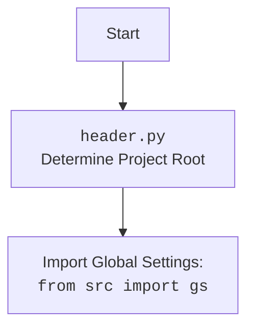

## ИНСТРУКЦИЯ:

Анализируй предоставленный код подробно и объясни его функциональность. Ответ должен включать три раздела:

1. **<алгоритм>**: Опиши рабочий процесс в виде пошаговой блок-схемы, включая примеры для каждого логического блока, и проиллюстрируй поток данных между функциями, классами или методами.
2. **<mermaid>**: Напиши код для диаграммы в формате `mermaid`, проанализируй и объясни все зависимости,
    которые импортируются при создании диаграммы.
    **ВАЖНО!** Убедитесь, что все имена переменных, используемые в диаграмме `mermaid`,
    имеют осмысленные и описательные имена. Имена переменных вроде `A`, `B`, `C`, и т.д., не допускаются!

    **Дополнительно**: Если в коде есть импорт `import header`, добавьте блок `mermaid` flowchart, объясняющий `header.py`:
    ```mermaid
    flowchart TD
        Start --> Header[<code>header.py</code><br> Determine Project Root]

        Header --> import[Import Global Settings: <br><code>from src import gs</code>]
    ```

3. **<объяснение>**: Предоставьте подробные объяснения:
   - **Импорты**: Их назначение и взаимосвязь с другими пакетами `src.`.
   - **Классы**: Их роль, атрибуты, методы и взаимодействие с другими компонентами проекта.
   - **Функции**: Их аргументы, возвращаемые значения, назначение и примеры.
   - **Переменные**: Их типы и использование.
   - Выделите потенциальные ошибки или области для улучшения.

Дополнительно, постройте цепочку взаимосвязей с другими частями проекта (если применимо).

Это обеспечивает всесторонний и структурированный анализ кода.
## Формат ответа: `.md` (markdown)
**КОНЕЦ ИНСТРУКЦИИ**

## <алгоритм>

**1. `__init__` (Инициализация):**

   - **Вход**: `api_key` (строка), `model_name` (строка, опционально), `generation_config` (словарь, опционально), `system_instruction` (строка, опционально), `**kwargs` (дополнительные аргументы).
   - **Процесс**:
     1. Сохраняет `api_key`, `model_name`, `generation_config` и `system_instruction` как атрибуты экземпляра.
     2. Определяет пути для сохранения журнала диалогов (`dialogues_path`) и истории (`history_path`), используя `gs.path.dialogues` и `gs.path.history`.
     3. Инициализирует модель Google Generative AI с помощью `google.generativeai.GenerativeModel`.
   - **Выход**: Инициализированный экземпляр класса `GoogleGenerativeAI`.
     
   **Пример**:
     ```python
     ai = GoogleGenerativeAI(api_key="your_api_key", model_name="gemini-pro", system_instruction="You are a helpful assistant.")
     ```
     Здесь создается экземпляр `GoogleGenerativeAI`, настраивая его с ключом API, именем модели и системной инструкцией.

**2. `config` (Конфигурация):**

   - **Вход**: Отсутствует (метод экземпляра).
   - **Процесс**:
     1. Формирует путь к файлу конфигурации `generative_ai.json` используя `gs.path.src / 'ai' / 'gemini' / 'generative_ai.json'`.
     2. Читает и разбирает JSON файл, используя `jjson.read_json`.
   - **Выход**: Словарь с настройками из JSON файла.

   **Пример**:
     ```python
     config = ai.config()
     print(config)
     ```
     В этом примере вызывается метод `config`, возвращающий словарь конфигурации.

**3. `_start_chat` (Начало чата):**
    
   - **Вход**: Отсутствует (метод экземпляра).
   - **Процесс**:
      1. Инициализирует новую сессию чата с помощью `self.model.start_chat()`.
      2.  Устанавливает начальную историю чата как пустой список.
   - **Выход**: Инициализированная сессия чата.

  **Пример:**
    ```python
     chat_session = ai._start_chat()
    ```
     Здесь вызывается метод `_start_chat`, создающий новую сессию чата.

**4. `_save_dialogue` (Сохранение диалога):**

   - **Вход**: `dialogue` (список словарей, представляющий диалог).
   - **Процесс**:
     1. Итерирует по каждому сообщению в диалоге.
     2.  Записывает каждое сообщение в текстовый файл журнала диалогов.
     3.  Записывает каждое сообщение в формате JSON в JSON файл журнала диалогов.
   - **Выход**: Нет явного возвращаемого значения (сохраняет данные на диск).

   **Пример**:
     ```python
     dialogue = [{"role": "user", "content": "Hello"}, {"role": "model", "content": "Hi there!"}]
     ai._save_dialogue(dialogue)
     ```
     Метод `_save_dialogue` сохраняет указанный диалог в файлы.

**5. `ask` (Запрос):**

   - **Вход**: `q` (строка, запрос), `attempts` (целое число, количество попыток, по умолчанию 15).
   - **Процесс**:
     1. Выполняет запрос к модели Google Generative AI с учетом повторных попыток при ошибках.
     2. Обрабатывает ошибки сети, недоступности сервиса, лимиты квот и другие API ошибки, логируя их и используя экспоненциальную задержку перед повторной попыткой.
     3. Сохраняет диалог в файлы истории.
   - **Выход**: Ответ модели (строка, опционально).

   **Пример**:
     ```python
     response = ai.ask("Tell me a joke")
     print(response)
     ```
     Метод `ask` отправляет запрос и выводит полученный ответ или `None` в случае ошибок.

**6. `chat` (Чат):**

   - **Вход**: `q` (строка, сообщение чата).
   - **Процесс**:
      1.  Использует сессию чата, полученную из метода `_start_chat`.
      2.  Отправляет сообщение чата модели.
      3.  Логирует ошибки и возвращает текст ответа.
   - **Выход**: Ответ модели (строка).

   **Пример**:
     ```python
     response = ai.chat("How are you today?")
     print(response)
     ```
     Метод `chat` отправляет сообщение и возвращает ответ модели.

**7. `describe_image` (Описание изображения):**
    - **Вход**: `image_path` (путь к изображению типа `Path`).
    - **Процесс**:
        1. Кодирует изображение в base64.
        2. Отправляет закодированное изображение и запрос модели.
    - **Выход**: Текстовое описание изображения (строка, опционально).

   **Пример**:
     ```python
     image_path = Path("path/to/your/image.jpg")
     description = ai.describe_image(image_path)
     print(description)
     ```
    Метод `describe_image` отправляет изображение и возвращает его текстовое описание.

**8. `upload_file` (Загрузка файла):**
   - **Вход**: `file` (путь к файлу или файловый объект), `file_name` (опциональное имя файла).
   - **Процесс**:
      1. Загружает файл в модель ИИ, обрабатывая повторные попытки при ошибках.
      2. Логирует успешную или неудачную загрузку.
   - **Выход**: Логическое значение (`True` - успех, `False` - неудача).

  **Пример:**
   ```python
    file_path = Path("path/to/your/file.txt")
    success = ai.upload_file(file_path)
    print(success)
   ```
   Метод `upload_file` загружает файл и возвращает результат операции.

## <mermaid>
```mermaid
flowchart TD
    Start[Начало] --> Init[<code>__init__</code><br>Инициализация API, модели и путей]
    Init --> Config[<code>config</code><br>Загрузка настроек из JSON]
    Config --> StartChat[<code>_start_chat</code><br>Начало сессии чата]
    StartChat --> SaveDialogue[<code>_save_dialogue</code><br>Сохранение диалога в файлы]
    SaveDialogue --> Ask[<code>ask</code><br>Запрос к модели (текст)]
    Ask --> Chat[<code>chat</code><br>Чат с моделью]
    Chat --> DescribeImage[<code>describe_image</code><br>Описание изображения]
    DescribeImage --> UploadFile[<code>upload_file</code><br>Загрузка файла]
    UploadFile --> End[Конец]
    
     style Start fill:#f9f,stroke:#333,stroke-width:2px
     style End fill:#f9f,stroke:#333,stroke-width:2px

    classDef method fill:#ccf,stroke:#333,stroke-width:1px;
    class Init, Config, StartChat, SaveDialogue, Ask, Chat, DescribeImage, UploadFile method
```


## <объяснение>

**Импорты:**

-   `google.generativeai`: Основной пакет для взаимодействия с Google Generative AI моделями.
-   `google.api_core.exceptions`: Содержит классы исключений, специфичные для API Google, используется для обработки ошибок.
-   `google.auth.exceptions`: Содержит исключения, связанные с аутентификацией в Google API.
-   `requests`: Библиотека для выполнения HTTP запросов, используется для взаимодействия с API Google.
-   `grpc`: Библиотека для удаленного вызова процедур, используется Google для обмена данными.
-   `src.logger`: Кастомный модуль для ведения журнала событий.
-   `src.utils.printer`: Кастомный модуль для вывода информации в консоль.
-   `src.utils.file`: Кастомный модуль для работы с файлами и путями.
-   `src.utils.date_time`: Кастомный модуль для работы с датами и временем.
-   `src.utils.convertors.unicode`: Кастомный модуль для обработки текста в кодировке UTF-8.
-   `src.utils.jjson`: Кастомный модуль для работы с JSON файлами, включающий чтение и запись.
-   `typing`: Для определения типов переменных, улучшает читаемость и помогает выявлять ошибки на этапе разработки.

**Класс `GoogleGenerativeAI`:**

-   **Роль:** Предоставляет интерфейс для работы с моделями Google Generative AI, инкапсулирует логику запросов, ответов, обработки ошибок, ведения журнала и управления диалогами.
-   **Атрибуты:**
    -   `api_key`: Строка, ключ API Google.
    -   `model_name`: Строка, имя модели ИИ.
    -   `generation_config`: Словарь, конфигурация генерации.
    -   `system_instruction`: Строка, системная инструкция для модели.
    -   `model`: Экземпляр `google.generativeai.GenerativeModel`, модель ИИ.
    -   `dialogues_path`: Путь к каталогу, где сохраняются диалоги.
    -   `history_path`: Путь к файлу, где сохраняется история.
-   **Методы:**
    -   `__init__(self, api_key: str, model_name: Optional[str] = None, generation_config: Optional[Dict] = None, system_instruction: Optional[str] = None, **kwargs)`: Конструктор класса, инициализирует атрибуты и модель ИИ.
    -   `config(self)`: Загружает настройки из JSON файла конфигурации.
    -  `_start_chat(self)`: Инициализирует сессию чата с моделью.
    -   `_save_dialogue(self, dialogue: list)`: Сохраняет диалог в текстовые и JSON файлы.
    -   `ask(self, q: str, attempts: int = 15) -> Optional[str]`: Отправляет запрос модели ИИ, обрабатывает ошибки и повторные попытки.
    -   `chat(self, q: str) -> str`: Отправляет сообщение в чат с моделью и возвращает ответ.
    -   `describe_image(self, image_path: Path) -> Optional[str]`: Генерирует текстовое описание изображения.
    -   `upload_file(self, file: str | Path | IOBase, file_name: Optional[str] = None) -> bool`: Загружает файл в модель ИИ.

**Функции:**

-   Все методы класса `GoogleGenerativeAI` описаны выше.

**Переменные:**

-   `api_key`, `model_name`, `generation_config`, `system_instruction`, `q`, `attempts`, `image_path`, `file`, `file_name`: Локальные переменные и параметры методов класса, имеют типы, указанные в аннотациях типов.
-   `dialogues_path`, `history_path`, `model`: Атрибуты экземпляра класса, имеют типы, определенные при инициализации класса.

**Цепочка взаимосвязей с другими частями проекта:**

-   `src.logger`: Используется для ведения журнала всех действий и ошибок, обеспечивая отслеживаемость операций.
-   `src.utils.printer`:  Используется для форматированного вывода сообщений в консоль.
-   `src.utils.file`:  Используется для работы с путями и файлами, чтения JSON настроек и сохранения истории диалогов.
-   `src.utils.date_time`: Используется для добавления временных меток в логи и файлы истории.
-   `src.utils.convertors.unicode`:  Используется для обработки текстовых данных в формате UTF-8.
-    `src.utils.jjson`: Используется для чтения и записи JSON файлов.
-   `src.`: Взаимодействует с другими модулями проекта в `src`, такими как `src.config` для получения путей и других параметров.

**Потенциальные ошибки и области для улучшения:**

-   **Отсутствие обработки ошибок в `config`**: Метод `config` не обрабатывает исключения при чтении или разборе JSON файла, что может привести к ошибкам.
-   **Жесткие пути**:  Пути к файлам диалогов и истории жестко закодированы в методе `__init__`, что может затруднить их настройку.
-   **Обработка ошибок**: Некоторые методы используют `try...except`, но не всегда обрабатывают ошибки в деталях, и могут быть случаи, когда не все ошибки правильно обрабатываются.
-   **Отсутствует асинхронность**: Все операции выполняются синхронно, что может приводить к задержкам, особенно при работе с API.
-   **Использовать именованные кортежи** вместо словарей для сообщений диалога, чтобы улучшить читаемость и обеспечить лучшую проверку типов.
-   **Добавить валидацию** входных данных, таких как `api_key` и путей к файлам.

В целом, класс `GoogleGenerativeAI` предоставляет мощный и гибкий интерфейс для работы с моделями Google Generative AI. Однако, некоторые области могут быть улучшены для повышения надежности, гибкости и производительности.