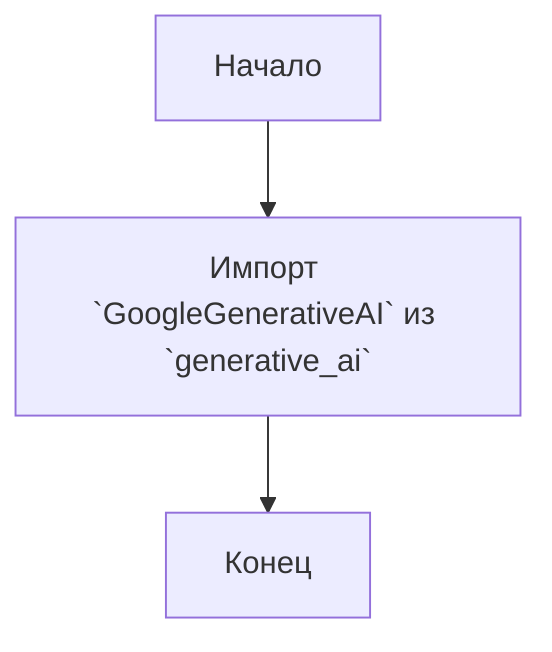
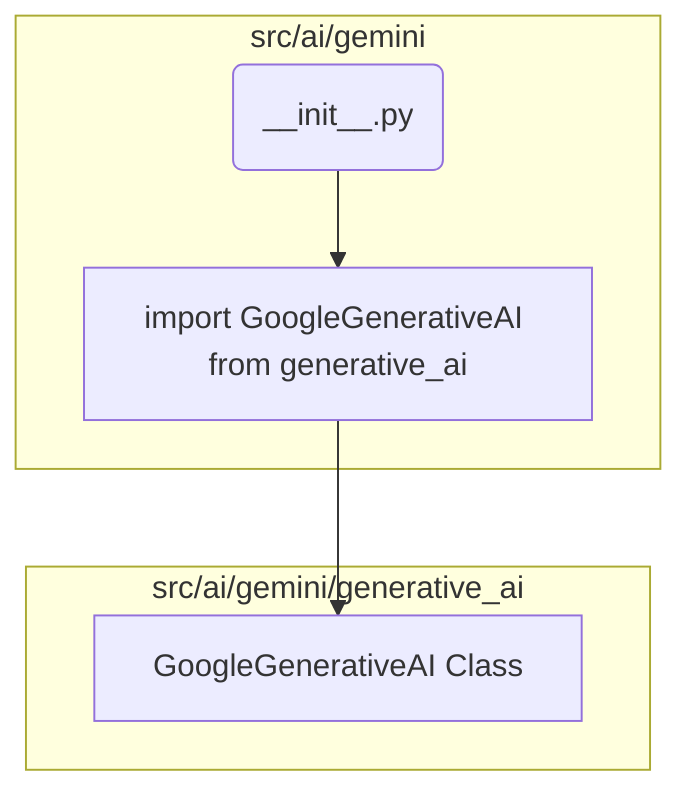

## АНАЛИЗ КОДА: `src/ai/gemini/__init__.py`

### 1. <алгоритм>
**Описание:**

Модуль `__init__.py` в пакете `src.ai.gemini` служит для инициализации этого пакета. Он импортирует класс `GoogleGenerativeAI` из подмодуля `generative_ai`. Это позволяет другим частям проекта импортировать `GoogleGenerativeAI` напрямую из пакета `src.ai.gemini` (например, `from src.ai.gemini import GoogleGenerativeAI`), а не через указание полного пути к подмодулю.

**Пошаговая блок-схема:**

**Пример:**
1.  Начинается выполнение модуля `__init__.py`.
2.  Выполняется импорт `from .generative_ai import GoogleGenerativeAI`.
    *   Этот импорт позволяет использовать класс `GoogleGenerativeAI` по более короткому имени, что упрощает использование модуля `src.ai.gemini` в других частях проекта.
3.  Завершение работы модуля `__init__.py`.

### 2. <mermaid>

**Объяснение диаграммы `mermaid`:**
-   Диаграмма показывает структуру модуля `src/ai/gemini`, в котором файл `__init__.py` импортирует класс `GoogleGenerativeAI` из модуля `generative_ai`.
-   `Start(__init__.py)` представляет начало процесса импорта, когда выполняется `__init__.py`.
-   `ImportGoogleGenerativeAI` представляет процесс импорта класса `GoogleGenerativeAI`.
-   `GoogleGenerativeAI Class` - это класс, который импортируется из модуля `generative_ai`.
-   Стрелка  `ImportGoogleGenerativeAI --> GoogleGenerativeAI`  показывает, что  `GoogleGenerativeAI` импортируется из  `generative_ai`  в  `__init__.py`.

### 3. <объяснение>

**Импорты:**
-   `from .generative_ai import GoogleGenerativeAI`: Этот оператор импортирует класс `GoogleGenerativeAI` из модуля `generative_ai`, который находится в том же пакете `src.ai.gemini`.

**Классы:**
-   В данном файле классы не определяются, но используется импорт `GoogleGenerativeAI`. Вероятно класс `GoogleGenerativeAI` предназначен для работы с API Google Gemini.

**Функции:**
-   В данном файле функции не определены.

**Переменные:**
-   Переменные не определены.

**Взаимосвязь с другими частями проекта:**

-   Этот модуль предназначен для предоставления доступа к классу `GoogleGenerativeAI`, который, вероятно, используется в других модулях для работы с API Google Gemini.
-   `__init__.py` позволяет импортировать класс, используя более короткий путь, например, `from src.ai.gemini import GoogleGenerativeAI` вместо `from src.ai.gemini.generative_ai import GoogleGenerativeAI`.

**Потенциальные ошибки и улучшения:**

-   В данном файле ошибок не выявлено.
-   Улучшением может быть добавление документации к модулю для лучшего понимания его назначения.