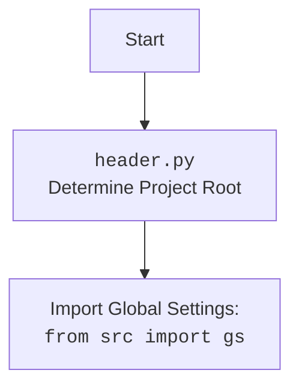

## АНАЛИЗ КОДА: `src/ai/gemini/generative_ai.py`

### 1. <алгоритм>

**Блок-схема работы класса `GoogleGenerativeAI` и его взаимодействия с другими модулями:**

```mermaid
flowchart TD
    A[Начало] --> B{Инициализация класса<br> `GoogleGenerativeAI`};
    B --> C[Настройка API и модели Google AI];
    C --> D{Загрузка истории чата?};
    D -- Да --> E[Загрузка истории из JSON];
    E --> F[Инициализация чата с историей];
    D -- Нет --> G[Инициализация нового чата];
    F --> H{Вызов метода ask()};
    G --> H;
     H -- да -> I[Отправка текстового запроса модели];
     I -->J{Получен ответ?};
     J-- да -->K[Сохранение диалога]
     K-->L[Возврат ответа];
     J-- нет -->M{Попытки исчерпаны?};
    H -- нет->M
     M -- да -->N[Завершение с ошибкой];
    M -- нет -->H;
    L --> N;
    N-->O{Вызов метода chat()}
    O --да-->P[Загрузка истории чата];
    P-->Q[Отправка сообщения в чат];
    Q-->R{Получен ответ?};
    R--да-->S[Сохранение истории чата];
    S-->T[Возврат ответа];
    R--нет-->U[Ошибка в чате];
    O--нет-->U
    U-->T
    T-->V{Вызов метода describe_image()};
    V-->W[Подготовка запроса с изображением];
    W-->X[Отправка запроса модели];
    X-->Y{Получен ответ?};
    Y--Да-->Z[Возврат ответа];
    Y--Нет-->AA[Возврат ошибки];
    Z-->AA;
    AA-->AB{Вызов метода upload_file()};
    AB-->AC[Загрузка файла в модель];
    AC-->AD{Файл успешно загружен?};
    AD--да-->AE[Возврат True];
    AD--нет-->AF[Попытка удаления файла];
    AF-->AC
    AE --> AG[Завершение];
    
    
     classDef current fill:#f9f,stroke:#333,stroke-width:2px;
    class B,C,D,E,F,G,H,I,J,K,L,M,N,O,P,Q,R,S,T,U,V,W,X,Y,Z,AA,AB,AC,AD,AE,AF,AG current;

```
### 2. <mermaid>

```mermaid
flowchart TD
    Start[Начало] --> InitClass[Инициализация класса<br><code>GoogleGenerativeAI</code>];
    InitClass --> ConfigAPI[Настройка API ключа и модели Google AI];
    ConfigAPI --> LoadHistoryCheck{Загрузка истории чата?};
    LoadHistoryCheck -- Да --> LoadHistory[Загрузка истории из JSON файла];
    LoadHistory --> InitChatHistory[Инициализация чата с историей];
    LoadHistoryCheck -- Нет --> InitChatNew[Инициализация нового чата];
    InitChatHistory --> MethodAskCheck{Вызов метода ask()};
    InitChatNew --> MethodAskCheck;
    MethodAskCheck -- Да --> SendTextRequest[Отправка текстового запроса модели];
    SendTextRequest --> GetResponseCheck{Получен ответ?};
    GetResponseCheck -- Да --> SaveDialog[Сохранение диалога];
    SaveDialog --> ReturnResponse[Возврат ответа];
    GetResponseCheck -- Нет --> AttemptsCheck{Попытки исчерпаны?};
    MethodAskCheck -- Нет --> AttemptsCheck;
    AttemptsCheck -- Да --> ErrorExit[Завершение с ошибкой];
    AttemptsCheck -- Нет --> MethodAskCheck;
    ReturnResponse --> ErrorExit;
    ErrorExit--> MethodChatCheck{Вызов метода chat()};
     MethodChatCheck--Да-->LoadChatHistory[Загрузка истории чата];
    LoadChatHistory --> SendMessageChat[Отправка сообщения в чат];
    SendMessageChat --> GetChatResponseCheck{Получен ответ?};
    GetChatResponseCheck -- Да --> SaveChatHistory[Сохранение истории чата];
    SaveChatHistory --> ReturnChatResponse[Возврат ответа];
    GetChatResponseCheck -- Нет --> ChatError[Ошибка в чате];
     MethodChatCheck--Нет-->ChatError
     ChatError-->ReturnChatResponse
    ReturnChatResponse --> MethodDescribeImageCheck{Вызов метода describe_image()};
     MethodDescribeImageCheck --> PrepareImageRequest[Подготовка запроса с изображением];
    PrepareImageRequest --> SendImageRequest[Отправка запроса модели];
    SendImageRequest --> GetImageResponseCheck{Получен ответ?};
    GetImageResponseCheck -- Да --> ReturnImageResponse[Возврат ответа];
    GetImageResponseCheck -- Нет --> ReturnImageError[Возврат ошибки];
    ReturnImageResponse --> ReturnImageError;
    ReturnImageError --> MethodUploadFileCheck{Вызов метода upload_file()};
    MethodUploadFileCheck --> UploadFileModel[Загрузка файла в модель];
    UploadFileModel --> FileUploadedCheck{Файл успешно загружен?};
    FileUploadedCheck -- Да --> ReturnTrue[Возврат True];
    FileUploadedCheck -- Нет --> TryDeleteFile[Попытка удаления файла];
    TryDeleteFile --> UploadFileModel;
    ReturnTrue --> End[Завершение];

    classDef current fill:#f9f,stroke:#333,stroke-width:2px;
    class InitClass,ConfigAPI,LoadHistoryCheck,LoadHistory,InitChatHistory,InitChatNew,MethodAskCheck,SendTextRequest,GetResponseCheck,SaveDialog,ReturnResponse,AttemptsCheck,ErrorExit,MethodChatCheck,LoadChatHistory,SendMessageChat,GetChatResponseCheck,SaveChatHistory,ReturnChatResponse,ChatError,MethodDescribeImageCheck,PrepareImageRequest,SendImageRequest,GetImageResponseCheck,ReturnImageResponse,ReturnImageError,MethodUploadFileCheck,UploadFileModel,FileUploadedCheck,ReturnTrue,TryDeleteFile,End current;
```

**Описание зависимостей в `mermaid` диаграмме:**

*   **Начало** (`Start`): Начальная точка выполнения программы.
*   **Инициализация класса** (`InitClass`): Создание экземпляра `GoogleGenerativeAI`.
*   **Настройка API ключа и модели Google AI** (`ConfigAPI`): Инициализация API ключа и выбор модели Google AI.
*    **Загрузка истории чата?**(`LoadHistoryCheck`): Проверка на наличие истории чата в JSON.
*   **Загрузка истории из JSON файла** (`LoadHistory`): Загрузка истории чата из файла.
*   **Инициализация чата с историей** (`InitChatHistory`): Запуск чата с предварительно загруженной историей.
*   **Инициализация нового чата** (`InitChatNew`): Запуск нового чата без истории.
*  **Вызов метода ask()**(`MethodAskCheck`): Проверка вызова метода `ask`
*   **Отправка текстового запроса модели** (`SendTextRequest`): Отправка текстового запроса к модели Gemini.
*   **Получен ответ?** (`GetResponseCheck`): Проверка наличия ответа от модели.
*   **Сохранение диалога** (`SaveDialog`): Сохранение текущего диалога в файл.
*   **Возврат ответа** (`ReturnResponse`): Возврат полученного ответа от модели.
*   **Попытки исчерпаны?** (`AttemptsCheck`): Проверка количества попыток обращения к модели.
*   **Завершение с ошибкой** (`ErrorExit`): Завершение работы метода из-за ошибки.
*  **Вызов метода chat()**(`MethodChatCheck`): Проверка вызова метода `chat`
*   **Загрузка истории чата** (`LoadChatHistory`): Загрузка истории чата перед отправкой нового сообщения.
*   **Отправка сообщения в чат** (`SendMessageChat`): Отправка пользовательского сообщения в чат.
*   **Получен ответ?**(`GetChatResponseCheck`): Проверка наличия ответа от модели.
*   **Сохранение истории чата**(`SaveChatHistory`): Сохранение истории чата после получения ответа.
*   **Возврат ответа** (`ReturnChatResponse`): Возвращает ответ модели Gemini.
*   **Ошибка в чате** (`ChatError`): Переход в случае ошибки в чате.
*  **Вызов метода describe_image()**(`MethodDescribeImageCheck`): Проверка вызова метода `describe_image`
*   **Подготовка запроса с изображением** (`PrepareImageRequest`): Подготовка данных для запроса с изображением.
*   **Отправка запроса модели** (`SendImageRequest`): Отправка запроса на обработку изображения в модель Gemini.
*   **Получен ответ?** (`GetImageResponseCheck`): Проверка наличия ответа от модели.
*   **Возврат ответа** (`ReturnImageResponse`): Возврат полученного ответа с описанием изображения.
*   **Возврат ошибки** (`ReturnImageError`): Возврат ошибки, если описание изображения получить не удалось.
*   **Вызов метода upload_file()**(`MethodUploadFileCheck`): Проверка вызова метода `upload_file`
*    **Загрузка файла в модель** (`UploadFileModel`): Загрузка файла в модель Gemini.
*   **Файл успешно загружен?** (`FileUploadedCheck`): Проверка успешности загрузки файла.
*    **Возврат True** (`ReturnTrue`): Возврат `True` в случае успешной загрузки файла.
*   **Попытка удаления файла** (`TryDeleteFile`): Попытка удаления файла, если загрузка не удалась.
*   **Завершение** (`End`): Конечная точка выполнения программы.

**Дополнительный `mermaid` flowchart для `header.py`:**



### 3. <объяснение>

**Импорты:**

*   `asyncio`: Для асинхронного программирования.
*   `time`: Для работы со временем (задержки).
*   `json`: Для работы с JSON данными.
*   `io.IOBase`: Базовый класс для потоков ввода-вывода.
*   `pathlib.Path`: Для работы с путями к файлам и директориям.
*   `datetime`: Для работы с датой и временем.
*   `typing.Optional, Dict, List`: Для аннотации типов.
*   `types.SimpleNamespace`:  Создание объектов с атрибутами.
*    `base64`: Для кодирования/декодирования base64.
*   `google.generativeai as genai`: API для взаимодействия с Google Gemini.
*   `requests`: Для обработки HTTP запросов (обработка ошибок).
*   `grpc.RpcError`: Для ошибок вызовов gRPC.
*   `google.api_core.exceptions`:  Набор исключений от Google API (например, GatewayTimeout).
*   `google.auth.exceptions`: Исключения аутентификации.
*   `header`: Собственный модуль для определения корневого каталога проекта и загрузки общих настроек.
*   `src.logger.logger`:  Логгер.
*   `src`: Пакет, содержащий другие модули проекта.
*   `src.utils.file`: Модуль для операций с файлами (чтение, запись).
*  `src.utils.date_time`: Модуль для работы с датой и временем (такие как таймаут).
*   `src.utils.convertors.unicode`: Для кодирования и декодирования юникода.
*   `src.utils.jjson`: Модуль для загрузки и сохранения данных в формате JSON
*   `src.utils.image`: Модуль для работы с изображениями.

**Класс `GoogleGenerativeAI`:**

*   **Роль:** Инкапсулирует логику взаимодействия с моделями Google Generative AI.
*   **Атрибуты:**
    *   `api_key` (str): Ключ API Google.
    *   `model_name` (str): Имя используемой модели (по умолчанию "gemini-2.0-flash-exp").
    *   `generation_config` (Dict): Конфигурация генерации (по умолчанию `{"response_mime_type": "text/plain"}`).
    *   `system_instruction` (str): Инструкция для модели.
    *   `dialogue_log_path` (Path): Путь к каталогу для сохранения логов диалогов.
    *  `dialogue_txt_path` (Path): Путь для сохранения текстового файла диалогов.
    *   `history_dir` (Path): Путь к каталогу для сохранения истории чата.
    *   `history_txt_file` (Path): Путь к файлу для сохранения текстовой истории чата.
     *  `history_json_file` (Path): Путь к файлу для сохранения JSON истории чата.
    *   `model`: Экземпляр `genai.GenerativeModel`.
    *   `_chat`: Экземпляр чата, полученный через `model.start_chat()`.
    *   `chat_history` (List): Список для хранения истории чата.
    *   `MODELS` (List): Список доступных моделей.
*   **Методы:**
    *   `__init__`: Инициализация экземпляра класса, настройка API, модели и путей для хранения истории.
    *   `config`: Возвращает конфигурацию из файла настроек.
    *   `_start_chat`: Инициализирует чат с заданной системной инструкцией или пустой историей.
    *    `_save_dialogue`: Сохраняет диалог в JSON файл.
    *    `_save_chat_history`: Асинхронно сохраняет всю историю чата в JSON файл.
    *   `_load_chat_history`: Загружает историю чата из JSON файла.
    *   `ask`:  Асинхронно отправляет текстовый запрос к модели и возвращает ответ.
    *   `chat`: Асинхронно отправляет сообщение в чат, сохраняет историю и возвращает ответ.
    *    `describe_image`: Асинхронно отправляет изображение в Gemini Pro Vision и возвращает его текстовое описание.
    *   `upload_file`: Асинхронно загружает файл в модель Gemini.

**Функции:**

*   `main`: Асинхронная функция, демонстрирующая использование класса `GoogleGenerativeAI`.
    *   Создание экземпляра `GoogleGenerativeAI`.
    *   Пример использования `describe_image` с JSON и без JSON вывода.
    *  Пример использования  `upload_file`
    *   Пример чата в цикле.

**Переменные:**

*   `timeout_check`: Экземпляр класса `TimeoutCheck`, используемый для проверки таймаутов.
*   `api_key`: Строка, содержащая API ключ для доступа к Google Generative AI.
*   `system_instruction`: Строка, содержащая системную инструкцию для модели.
*    `image_path`: `pathlib.Path`  Путь к файлу изображения.
*    `prompt`: Строка, содержащая промт для модели.
*  `description`:  Строка, содержащая ответ от модели.
* `parsed_description`: Словарь полученный при парсинге ответа JSON.
* `file_path`: `pathlib.Path` путь к загружаемому файлу.
* `file_upload` : Результат загрузки файла в модель.
* `user_message` : Строка, содержащая пользовательский ввод.
* `ai_message` : Строка, содержащая ответ от модели.

**Потенциальные ошибки и области для улучшения:**

1.  **Обработка ошибок:**
    *   В методах `ask` и `chat` есть блоки `try-except` для обработки ошибок, но они могут быть более детализированы.
    *   Логирование ошибок может быть расширено для более точной диагностики.
2.  **Повторные запросы:**
    *   В методе `ask` используется экспоненциальный бэк-офф, но количество попыток может быть параметризовано.
3.  **Управление историей чата:**
    *   История чата сохраняется в JSON файлы,  можно  добавить  механизм для ограничения размера файлов.
4.  **Конфигурация:**
    *   Настройки модели можно вынести в отдельный файл конфигурации.
5.  **Безопасность:**
    *   API ключ не должен храниться напрямую в коде, а лучше использовать переменные окружения.
6.  **Использование типа `Optional`:**
     - В методе `describe_image` переменная `mime_type` использует `Optional[str]` , что может привести к `TypeError` , тк mime_type передаётся в словарь.

**Взаимосвязи с другими частями проекта:**

*   Используется модуль `header` для определения корневого каталога и загрузки глобальных настроек.
*   Используется модуль `src.logger.logger` для ведения журнала работы программы.
*   Используются модули `src.utils.file`, `src.utils.date_time`,  `src.utils.convertors.unicode` `src.utils.jjson` и `src.utils.image` для вспомогательных операций, например для работы с файлами, конвертацией и т.д.

Этот анализ предоставляет полное понимание функциональности кода, его зависимостей и потенциальных областей для улучшения.