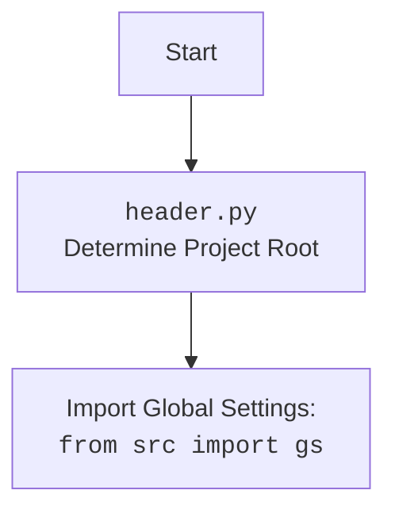

## ИНСТРУКЦИЯ:

Анализируй предоставленный код подробно и объясни его функциональность. Ответ должен включать три раздела:  

1. **<алгоритм>**: Опиши рабочий процесс в виде пошаговой блок-схемы, включая примеры для каждого логического блока, и проиллюстрируй поток данных между функциями, классами или методами.  
2. **<mermaid>**: Напиши код для диаграммы в формате `mermaid`, проанализируй и объясни все зависимости, 
    которые импортируются при создании диаграммы. 
    **ВАЖНО!** Убедитесь, что все имена переменных, используемые в диаграмме `mermaid`, 
    имеют осмысленные и описательные имена. Имена переменных вроде `A`, `B`, `C`, и т.д., не допускаются!  
    
    **Дополнительно**: Если в коде есть импорт `import header`, добавьте блок `mermaid` flowchart, объясняющий `header.py`:\
    ```mermaid
    flowchart TD
        Start --> Header[<code>header.py</code><br> Determine Project Root]
    
        Header --> import[Import Global Settings: <br><code>from src import gs</code>] 
    ```

3. **<объяснение>**: Предоставьте подробные объяснения:  
   - **Импорты**: Их назначение и взаимосвязь с другими пакетами `src.`.  
   - **Классы**: Их роль, атрибуты, методы и взаимодействие с другими компонентами проекта.  
   - **Функции**: Их аргументы, возвращаемые значения, назначение и примеры.  
   - **Переменные**: Их типы и использование.  
   - Выделите потенциальные ошибки или области для улучшения.  

Дополнительно, постройте цепочку взаимосвязей с другими частями проекта (если применимо).  

Это обеспечивает всесторонний и структурированный анализ кода.
## Формат ответа: `.md` (markdown)
**КОНЕЦ ИНСТРУКЦИИ**
```

## <алгоритм>
### Инициализация `GoogleGenerativeAI`
1. **`__init__`**:
    - Принимает `api_key`, `model_name` (опционально), `generation_config` (опционально), `system_instruction` (опционально) и `**kwargs`.
    - Сохраняет переданные параметры.
    - Определяет пути для журналов диалогов (`self.dialogue_text_path`, `self.dialogue_json_path`).
    - Инициализирует Google Generative AI модель (`self.model`).
        - *Пример:* `ai = GoogleGenerativeAI(api_key="your_api_key", model_name="gemini-pro", system_instruction="You are a helpful assistant.")`

### Конфигурация
2. **`config`**:
    - Читает JSON файл конфигурации из `gs.path.src / 'ai' / 'gemini' / 'generative_ai.json'`.
    - Возвращает словарь с конфигурационными параметрами.
    - *Пример:* `config_data = ai.config()`

### Запуск чата
3. **`_start_chat`**:
    - Инициализирует сессию чата (`self.chat`).
    - Сбрасывает историю чата (`self.chat_history`).

### Сохранение диалога
4. **`_save_dialogue`**:
    - Принимает список сообщений `dialogue`.
    - Записывает каждое сообщение в текстовый файл.
    - Записывает каждое сообщение в JSON файл.
    - *Пример:* `ai._save_dialogue([{"role": "user", "parts": ["Hello"]}, {"role": "model", "parts": ["Hi there"]}])`

### Отправка текстового запроса
5. **`ask`**:
    - Принимает текстовый запрос `q` и количество попыток `attempts` (по умолчанию 15).
    - Повторяет попытки отправки запроса при ошибках сети, используя экспоненциальную задержку.
        - *Пример:*
            - *Попытка 1:* `response = ai.ask("What is the capital of France?")`
            - Если ошибка сети, то ожидание (например, 2 секунды) и повтор.
            - *Попытка 2:* `response = ai.ask("What is the capital of France?")`
    - Если запрос успешен, возвращает ответ.
    - Сохраняет диалог.

### Отправка сообщения в чат
6. **`chat`**:
    - Принимает текстовое сообщение `q`.
    - Если сессия чата не инициализирована, вызывает `_start_chat`.
    - Отправляет сообщение в чат.
    - Возвращает текст ответа.
    - Сохраняет диалог.
        - *Пример:* `chat_response = ai.chat("How are you?")`

### Описание изображения
7. **`describe_image`**:
    - Принимает путь к изображению `image_path`.
    - Кодирует изображение в base64.
    - Отправляет изображение модели ИИ для описания.
    - Возвращает текстовое описание изображения.
    - *Пример:* `image_description = ai.describe_image(Path("image.jpg"))`

### Загрузка файла
8. **`upload_file`**:
    - Принимает путь к файлу `file` или объект `IOBase` и имя файла `file_name` (опционально).
    - Загружает файл в модель ИИ.
    - Возвращает `True` при успешной загрузке, `False` - в случае ошибки.
     - *Пример:* `file_upload_success = ai.upload_file(Path("document.pdf"))`

## <mermaid>
```mermaid
flowchart TD
    Start[Начало] --> Init[Инициализация GoogleGenerativeAI]
    Init -- "api_key, model_name, generation_config, system_instruction" --> Config[Загрузка конфигурации]
    Config --> StartChat[Запуск сессии чата (_start_chat)]
    StartChat --> Ask[Отправка текстового запроса (ask)]
    Ask -- "q:str, attempts:int" --> HandleErrors[Обработка ошибок (сеть, сервис, квоты, аутентификация, ввод, API)]
    HandleErrors -- Успешно --> SaveDialogue[Сохранение диалога (_save_dialogue)]
    SaveDialogue --> ReturnTextResponse[Возврат текстового ответа]
    Ask -- Ошибка --> HandleErrors
    StartChat --> Chat[Отправка сообщения в чат (chat)]
    Chat -- "q:str" --> HandleChatErrors[Обработка ошибок чата]
    HandleChatErrors -- Успешно --> ChatSaveDialogue[Сохранение диалога чата]
    ChatSaveDialogue --> ReturnChatResponse[Возврат текстового ответа чата]
    Chat -- Ошибка --> HandleChatErrors
    Init --> DescribeImage[Генерация описания изображения (describe_image)]
    DescribeImage -- "image_path:Path" --> ImageEncoding[Кодирование изображения в base64]
    ImageEncoding --> SendImageToModel[Отправка изображения модели ИИ]
    SendImageToModel --> ReturnImageDescription[Возврат описания изображения]
    Init --> UploadFile[Загрузка файла (upload_file)]
    UploadFile -- "file:str|Path|IOBase, file_name:Optional[str]" --> HandleFileUpload[Обработка загрузки файла]
    HandleFileUpload --> ReturnUploadStatus[Возврат статуса загрузки]
    ReturnTextResponse --> End[Конец]
    ReturnChatResponse --> End
    ReturnImageDescription --> End
     ReturnUploadStatus --> End


    classDef errorFill fill:#f9f,stroke:#333,stroke-width:2px
    HandleErrors:::errorFill
    HandleChatErrors:::errorFill
    HandleFileUpload:::errorFill
```


### Анализ зависимостей `mermaid`

Диаграмма `mermaid` описывает основной поток управления в классе `GoogleGenerativeAI`. 
-   `Start`: Начало выполнения.
-   `Init`: Инициализация класса `GoogleGenerativeAI` с параметрами API Key, имя модели, конфигурация генерации и системная инструкция.
-  `Config`: Загрузка конфигурации из файла `generative_ai.json`.
-   `StartChat`: Запуск сессии чата.
-   `Ask`: Метод для отправки текстового запроса и получения ответа.
-   `HandleErrors`: Блок обработки ошибок при отправке запроса (ошибки сети, сервиса, лимиты, и др.).
-    `SaveDialogue`: Сохранение диалога в текстовый и JSON файлы.
-   `ReturnTextResponse`: Возврат текстового ответа.
-  `Chat`: Метод для отправки сообщения в чат и получения ответа.
-   `HandleChatErrors`: Блок обработки ошибок при отправке сообщения в чат.
-   `ChatSaveDialogue`: Сохранение диалога чата в текстовый и JSON файлы.
-   `ReturnChatResponse`: Возврат текстового ответа чата.
-   `DescribeImage`: Метод для генерации текстового описания изображения.
-  `ImageEncoding`: Кодирование изображения в формат base64.
- `SendImageToModel`: Отправка изображения модели ИИ.
-   `ReturnImageDescription`: Возврат описания изображения.
-   `UploadFile`: Метод для загрузки файла.
-   `HandleFileUpload`: Обработка загрузки файла.
-    `ReturnUploadStatus`: Возврат статуса загрузки.
-   `End`: Конец выполнения.

## <объяснение>
### Импорты
- **`google.generativeai`**: Основная библиотека для взаимодействия с Google Generative AI API.
- **`requests`**: Используется для выполнения HTTP запросов, в основном для обработки ошибок.
- **`grpc`**: Используется для обмена данными с Google API.
- **`google.api_core.exceptions`**: Содержит исключения, которые могут возникнуть при работе с Google API.
- **`google.auth.exceptions`**: Содержит исключения, связанные с аутентификацией.
- **`src.logger`**: Используется для ведения журнала событий и ошибок.
    - *Взаимосвязь*: Логирование используется во всех основных методах для отслеживания работы класса.
- **`src.utils.printer`**: Используется для форматированного вывода.
    - *Взаимосвязь*: Используется для вывода сообщений и ошибок.
- **`src.utils.file`**: Используется для операций с файлами (чтение, запись).
    - *Взаимосвязь*: Используется для чтения файла конфигурации и сохранения диалогов.
- **`src.utils.date_time`**: Используется для работы с датой и временем, например, для меток времени в журналах.
    - *Взаимосвязь*: Используется для создания меток времени при сохранении диалогов.
- **`src.utils.convertors.unicode`**: Используется для преобразования текста в unicode.
    - *Взаимосвязь*: Используется для обработки текста и его корректного представления.
- **`src.utils.jjson`**: Используется для работы с JSON.
    - *Взаимосвязь*: Используется для сохранения диалогов в формате JSON.

### Классы
-   `GoogleGenerativeAI`:
    - **Роль**: Обеспечивает интерфейс для взаимодействия с моделями Google Generative AI.
    - **Атрибуты**:
        -   `api_key`: Ключ API для доступа к сервису Google Generative AI.
        -   `model_name`: Имя модели, которую нужно использовать (например, "gemini-pro").
        -   `generation_config`: Конфигурация генерации (например, параметры генерации текста).
        -   `system_instruction`: Системная инструкция для модели (например, "Ты - полезный помощник").
        -  `dialogue_text_path`, `dialogue_json_path`: Пути к файлам для сохранения диалогов.
        -   `model`: Экземпляр модели Google Generative AI.
        -   `chat`: Сессия чата.
        -   `chat_history`: История чата.
    -   **Методы**:
        -   `__init__`: Инициализирует класс, устанавливает конфигурацию и создает модель.
        -   `config`: Загружает конфигурацию из JSON файла.
        -   `_start_chat`: Запускает сессию чата.
        -   `_save_dialogue`: Сохраняет диалог в текстовый и JSON форматы.
        -   `ask`: Отправляет текстовый запрос модели и получает ответ.
        -   `chat`: Отправляет сообщение в сессию чата и получает ответ.
        -   `describe_image`: Генерирует текстовое описание изображения.
        -   `upload_file`: Загружает файл.
-  **Взаимодействие**:
    -  Использует `google.generativeai` для связи с API.
    - Использует `src.logger` для ведения журнала.
    - Использует `src.utils.printer` для вывода.
    - Использует `src.utils.file` для работы с файлами.
    - Использует `src.utils.date_time` для меток времени.
    - Использует `src.utils.convertors.unicode` для преобразования текста.
    - Использует `src.utils.jjson` для работы с JSON.

### Функции
-   `__init__(self, api_key: str, model_name: Optional[str] = None, generation_config: Optional[Dict] = None, system_instruction: Optional[str] = None, **kwargs)`:
    - **Аргументы**: `api_key` (обязательный), `model_name`, `generation_config`, `system_instruction` (все опциональные).
    - **Возвращаемое значение**: Нет.
    - **Назначение**: Инициализация экземпляра класса `GoogleGenerativeAI`.

-   `config(self)`:
    - **Аргументы**: Нет.
    - **Возвращаемое значение**: Словарь с конфигурационными параметрами.
    - **Назначение**: Чтение конфигурации из файла `generative_ai.json`.

-  `_start_chat(self)`:
    -   **Аргументы**: Нет.
    -   **Возвращаемое значение**: Нет.
    -   **Назначение**: Запускает сессию чата и сбрасывает историю.

-  `_save_dialogue(self, dialogue: list)`:
    -   **Аргументы**: `dialogue` (список сообщений).
    -   **Возвращаемое значение**: Нет.
    -   **Назначение**: Сохраняет диалог в текстовый и JSON файлы.

-   `ask(self, q: str, attempts: int = 15) -> Optional[str]`:
    -   **Аргументы**: `q` (текст запроса), `attempts` (количество попыток, по умолчанию 15).
    -   **Возвращаемое значение**: Строка с ответом модели или `None` при неудаче.
    -   **Назначение**: Отправляет запрос и обрабатывает ответы с повторными попытками при ошибках.

-   `chat(self, q: str) -> str`:
    -   **Аргументы**: `q` (текст сообщения).
    -   **Возвращаемое значение**: Строка с ответом модели.
    -   **Назначение**: Отправляет сообщение в чат и получает ответ.

-  `describe_image(self, image_path: Path) -> Optional[str]`:
    -  **Аргументы**: `image_path` (путь к файлу изображения).
    -   **Возвращаемое значение**: Строка с описанием изображения или `None` в случае ошибки.
    -   **Назначение**: Генерирует описание изображения.

-  `upload_file(self, file: str | Path | IOBase, file_name: Optional[str] = None) -> bool`:
    -   **Аргументы**: `file` (путь к файлу или IOBase), `file_name` (опциональное имя файла).
    -   **Возвращаемое значение**: `True`, если файл загружен успешно, `False` - в противном случае.
    -   **Назначение**: Загружает файл.

### Переменные
-   `api_key`: Строка, содержащая ключ API для доступа к Google Generative AI.
-   `model_name`: Строка, содержащая имя модели, которую нужно использовать.
-   `generation_config`: Словарь, содержащий настройки генерации текста.
-   `system_instruction`: Строка, содержащая системные инструкции для модели.
-  `dialogue_text_path`: Путь к файлу для сохранения диалогов в текстовом формате.
- `dialogue_json_path`: Путь к файлу для сохранения диалогов в JSON формате.
-   `model`: Экземпляр класса модели, полученный от `google.generativeai`.
-   `chat`: Сессия чата, созданная при помощи `model.start_chat()`.
-  `chat_history`: Список, в котором хранится история сообщений чата.
-   `q`: Строка, содержащая текст запроса или сообщения.
-   `attempts`: Целое число, указывающее количество попыток при отправке запроса.
-  `response`: Строка, содержащая ответ модели.
-   `image_path`: Строка или объект Path, содержащий путь к файлу изображения.
- `file`: Путь к файлу или объект `IOBase`, содержащий файл для загрузки.
- `file_name`: Имя загружаемого файла.

### Потенциальные ошибки и области для улучшения
-   **Обработка ошибок**: Хотя класс имеет надежную обработку ошибок, некоторые ошибки могут быть более специфичными (например, ошибки лимита токенов) и требовать более точной обработки.
-  **Асинхронность**: Использование асинхронных операций могло бы улучшить производительность при одновременных запросах.
-   **Конфигурация**: Можно добавить дополнительные опции конфигурации для более гибкой настройки.
-  **Управление контекстом**:  Можно добавить механизм управления контекстом чата, чтобы очищать его по мере необходимости, что особенно важно при длительных диалогах.
-   **Типизация**: Использование `typing` для более точного определения типов переменных и возвращаемых значений может улучшить читаемость кода.

### Цепочка взаимосвязей
-  `GoogleGenerativeAI` --> `google.generativeai`: Для прямого доступа к моделям Google AI.
-  `GoogleGenerativeAI` --> `src.logger`: Для логирования событий и ошибок.
- `GoogleGenerativeAI` --> `src.utils.printer`: Для вывода информации в консоль.
- `GoogleGenerativeAI` --> `src.utils.file`: Для сохранения диалогов и загрузки конфигураций.
-  `GoogleGenerativeAI` --> `src.utils.date_time`: Для меток времени при логировании и сохранении диалогов.
-   `GoogleGenerativeAI` --> `src.utils.convertors.unicode`: Для корректной обработки текста.
-   `GoogleGenerativeAI` --> `src.utils.jjson`: Для сохранения диалогов в JSON.
-  `GoogleGenerativeAI` --> `requests`: Для обработки HTTP запросов и ошибок.
- `GoogleGenerativeAI` --> `grpc`: Для обмена данными с Google API.
- `GoogleGenerativeAI` --> `google.api_core.exceptions`: Для обработки исключений, связанных с API.
- `GoogleGenerativeAI` --> `google.auth.exceptions`: Для обработки ошибок аутентификации.

Этот анализ обеспечивает полное понимание функциональности, зависимостей и взаимосвязей кода, а также дает представление о его возможных улучшениях.