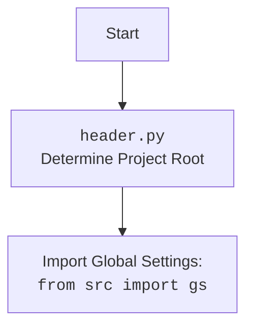

## <алгоритм>

1.  **`set_project_root(marker_files)`**:
    *   Начало: Функция вызывается с `marker_files` (по умолчанию `('__root__', '.git')`).
    *   Определение текущего пути: Получает абсолютный путь к каталогу, содержащему текущий файл.
        *   Пример: Если файл находится в `/home/user/hypotez/src/ai/gradio/header.py`, то `current_path` будет `/home/user/hypotez/src/ai/gradio`.
    *   Инициализация корня проекта: Присваивает `current_path` переменной `__root__`.
    *   Поиск родительских каталогов: Проходит по родительским каталогам от текущего вверх.
        *   Пример: `current_path`, `/home/user/hypotez/src/ai`, `/home/user/hypotez/src`, `/home/user/hypotez`, `/home/user`.
    *   Проверка наличия маркеров: Для каждого родительского каталога проверяет, существует ли в нём какой-либо из файлов или директорий, указанных в `marker_files`.
        *   Пример: Проверяется, существует ли `/home/user/hypotez/.git` или `/home/user/hypotez/__root__`.
    *   Обновление корня проекта: Если маркер найден, `__root__` обновляется до этого каталога, и цикл прекращается.
        *   Пример: Если `.git` найден в `/home/user/hypotez`, то `__root__` станет `/home/user/hypotez`.
    *   Добавление в `sys.path`: Если `__root__` отсутствует в `sys.path`, добавляет его.
    *   Возврат корня проекта: Функция возвращает `__root__`.
2.  **`__root__ = set_project_root()`**: Вызывает функцию и сохраняет результат в переменной `__root__`.
3.  **Импорт `src.gs`**: Импортирует модуль `gs` из пакета `src`.
4.  **Чтение `config.json`**:
    *   Пытается открыть файл `config.json` в каталоге `src` относительно `__root__`.
    *   Загружает JSON-данные в переменную `config`.
    *   Если файл не найден или JSON не валиден, происходит исключение, но блок `try` ничего не выполняет.
5.  **Чтение `README.MD`**:
    *   Пытается открыть файл `README.MD` в каталоге `src` относительно `__root__`.
    *   Читает данные из файла в переменную `doc_str`.
    *   Если файл не найден или происходит ошибка, выполняется блок `...` (ничего не делает).
6.  **Инициализация глобальных переменных**:
    *   `__project_name__`:  Инициализируется из `config.get("project_name", 'hypotez')` или 'hypotez', если `config` не загружен.
    *    `__version__`: Инициализируется из `config.get("version", '')` или пустой строкой, если `config` не загружен.
    *   `__doc__`: Присваивает значение `doc_str`, если оно есть, иначе пустую строку.
    *   `__details__`: Инициализируется пустой строкой.
    *    `__author__`:  Инициализируется из `config.get("author", '')` или пустой строкой, если `config` не загружен.
    *   `__copyright__`: Инициализируется из `config.get("copyrihgnt", '')` или пустой строкой, если `config` не загружен.
    *   `__cofee__`: Инициализируется из `settings.get("cofee", ...)` или строкой с предложением угостить разработчика кофе, если `settings`  не найден

## <mermaid>

```mermaid
flowchart TD
    Start[Start] --> FindRoot[set_project_root()]
    FindRoot --> CheckMarkers{Check if any marker file exists in parent directories}
    CheckMarkers -- Yes --> SetRoot[Set Project Root]
    CheckMarkers -- No --> NextParent[Check next parent directory]
    NextParent --> CheckMarkers
    SetRoot -->  AddRootToPath[Add __root__ to sys.path]
    AddRootToPath --> ImportGS[Import Global Settings: from src import gs]
    ImportGS --> LoadConfig{Load config.json from project root}
    LoadConfig --> LoadReadme{Load README.MD from project root}
    LoadReadme --> InitializeGlobalVars[Initialize global variables]
    InitializeGlobalVars --> End[End]
    
    style Start fill:#f9f,stroke:#333,stroke-width:2px
     style End fill:#ccf,stroke:#333,stroke-width:2px
```



## <объяснение>

**Импорты:**

*   `sys`: Используется для модификации `sys.path`, что позволяет импортировать модули из корневой директории проекта.
*   `json`: Используется для чтения конфигурационного файла `config.json` в формате JSON.
*   `packaging.version.Version`: Используется для работы с версиями, не используется в данном файле но подключен.
*   `pathlib.Path`: Используется для работы с путями к файлам и директориям.

**Функции:**

*   **`set_project_root(marker_files)`**:
    *   **Аргументы**: `marker_files` (кортеж строк) - список файлов или директорий, которые используются для определения корневой директории проекта. По умолчанию `('__root__', '.git')`.
    *   **Возвращает**: `pathlib.Path` - объект, представляющий корневую директорию проекта.
    *   **Назначение**: Функция определяет корневую директорию проекта путем поиска вверх по дереву каталогов, пока не найдет каталог, содержащий хотя бы один из файлов/директорий, указанных в `marker_files`.  Она также добавляет найденный корень в `sys.path`, чтобы можно было импортировать модули из этого каталога. Это важно для обеспечения правильной работы импортов при запуске проекта из любого места.

**Переменные:**

*   `__root__`: `pathlib.Path` - Хранит абсолютный путь к корневой директории проекта.
*   `config`: `dict` - Содержит данные из файла конфигурации `config.json`. Изначально `None`, если файл не удалось прочитать.
*   `doc_str`: `str` - Содержит содержимое файла `README.MD`. Изначально `None`, если файл не удалось прочитать.
*  `__project_name__`: `str` - Название проекта, полученное из `config.json` или 'hypotez'.
*   `__version__`: `str` - Версия проекта, полученная из `config.json` или пустая строка.
*   `__doc__`: `str` - Описание проекта, взятое из `README.MD` или пустая строка.
*   `__details__`: `str` - Детальная информация, в текущей версии пустая строка.
*   `__author__`: `str` - Автор проекта, полученный из `config.json` или пустая строка.
*   `__copyright__`: `str` - Информация об авторских правах, полученная из `config.json` или пустая строка.
*    `__cofee__`: `str` -  Строка с предложением угостить разработчика кофе, полученная из settings или строка по умолчанию.

**Классы:**

*   В данном коде классы не используются.

**Цепочка взаимосвязей с другими частями проекта:**

1.  **Обнаружение корня проекта**: Этот файл является точкой входа для определения корня проекта, что позволяет другим модулям правильно импортировать свои зависимости.
2.  **Импорт `src.gs`**: Этот импорт устанавливает связь с модулем `gs`, где хранится информация о путях к каталогам проекта, что позволяет получить доступ к корневому каталогу, каталогу с конфигурацией, и т.д.
3.  **Загрузка конфигурации**: Файл `config.json` содержит общую конфигурацию проекта, которая используется для задания имени проекта, версии и т.д.
4.  **Загрузка документации**: Файл `README.MD` содержит описание проекта, которое используется как документация.

**Потенциальные ошибки и области для улучшения:**

*   **Обработка ошибок при чтении файлов**: В блоках `try...except` используется `...`, что не позволяет полноценно обработать ошибки.  Необходимо выводить сообщение об ошибке в `stderr` и, возможно, использовать логирование.
*   **Отсутствие обработки исключений**: Возможные исключения при работе с путями `pathlib`, такие как ошибки доступа к файлу, не обрабатываются. Следует добавить обработку таких ошибок.
*   **Неопределенное значение `settings`**: Переменная `settings` не объявлена, что приведет к ошибке при вызове `settings.get("cofee", ...)`. Надо либо исправить опечатку, либо добавить импорт/инициализацию.
*  **Нестандартизированная обработка конфигурации**: Сейчас используется `.get("ключ", default)`, следует использовать более надежную валидацию (например, с использованием `pydantic` или `cerberus`).
*  **Отсутствие типов переменных**: Следует объявить типы переменных для наглядности и возможности статического анализа кода.
*  **Константы**: Магические строки в `config.get` следует вынести в константы.

Этот код является важным элементом проекта, обеспечивая его правильную настройку и доступ к ресурсам. Однако необходимо улучшить обработку ошибок и более аккуратно работать с конфигурацией, а также добавить недостающие импорты.