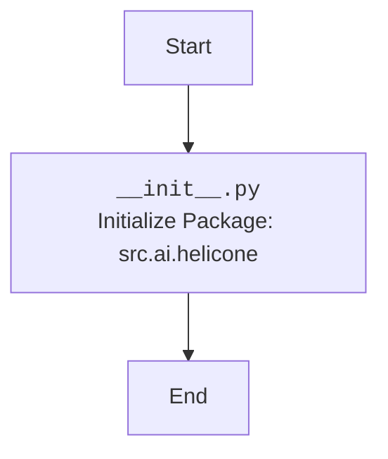

## <алгоритм>

1. **Начало:** Скрипт `__init__.py` запускается при импорте пакета `src.ai.helicone`.
2. **Завершение:**  Скрипт выполняется без каких-либо явных операций. Он служит для инициализации пакета, делая его доступным для импорта других модулей.

В данном коде нет явных действий или функций, поэтому нет потока данных.

## <mermaid>

**Объяснение зависимостей:**

В данном коде нет зависимостей от других модулей или классов, так как он просто предназначен для инициализации пакета.

## <объяснение>

**Импорты:**
- В этом файле нет явных импортов. Файл `__init__.py` используется для того, чтобы Python рассматривал каталог `src/ai/helicone` как пакет, позволяя импортировать его модули и подпакеты.

**Классы:**
- В файле не определены классы.

**Функции:**
- В файле не определены функции.

**Переменные:**
- В файле не определены переменные.

**Пояснения:**

- Файл `__init__.py` используется для инициализации пакета `src.ai.helicone`. Когда пакет импортируется в другом модуле, Python выполняет код, содержащийся в `__init__.py`.
- В данном случае файл пуст, что означает, что при импорте пакета `src.ai.helicone` никакие дополнительные действия не выполняются, кроме того, что пакет становится доступным для импорта модулей из него.

**Потенциальные ошибки или области для улучшения:**

- **Отсутствие описания функциональности пакета:** В `__init__.py` обычно добавляют комментарии для описания назначения пакета.
- **Отсутствие явной инициализации:** Если бы пакет требовал определенной настройки при первом импорте, например, установки переменных окружения или создания глобальных объектов, это можно было бы сделать здесь.
- **Потенциальное использование:**
  - В будущем в этот файл можно добавить импорты часто используемых модулей из пакета, чтобы они были сразу доступны при импорте пакета. Например, `from . import module1, module2`.
  - В этом файле могут быть определены глобальные переменные или константы, относящиеся ко всему пакету.