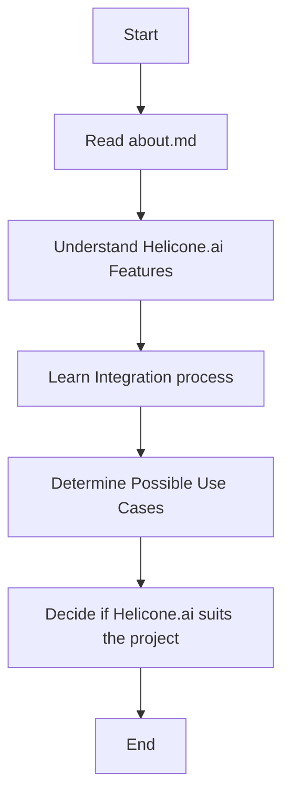

## Анализ `hypotez/src/ai/helicone/about.md`

### 1. <алгоритм>

Файл `about.md` представляет собой текстовое описание платформы Helicone.ai. Это не исполняемый код, а документация, поэтому блок-схема будет описывать процесс чтения и использования этого файла.

**Блок-схема:**

1. **Начало**:  Файл `about.md` существует как часть документации проекта.
2. **Чтение файла**: Пользователь (например, разработчик или член команды) открывает файл `about.md` для ознакомления.
3. **Изучение контента**: Пользователь читает разделы файла, такие как "What is Helicone.ai?", "Key Features", "Use Cases", "Getting Started", "Benefits", и "Conclusion".
4. **Понимание платформы**: На основе прочитанной информации пользователь получает представление о функциональности, возможностях и преимуществах платформы Helicone.ai.
5. **Применение знаний**: Пользователь использует полученную информацию для принятия решений о применении Helicone.ai в своем проекте, например, определяет, соответствует ли платформа требованиям проекта, или как начать интеграцию с платформой.
6. **Конец**: Процесс чтения файла завершен, пользователь обладает информацией о Helicone.ai.

**Примеры для каждого логического блока:**

1. **Начало:** Файл `about.md` находится в директории `hypotez/src/ai/helicone`.
2. **Чтение файла:** Пользователь использует текстовый редактор, программу для просмотра файлов markdown, или веб-браузер для просмотра файла.
3. **Изучение контента:** Пользователь читает раздел "Key Features" и понимает, что платформа поддерживает интеграцию с различными AI-моделями.
4. **Понимание платформы:** Пользователь понимает, что Helicone.ai предлагает гибкость, простоту использования, надежность и безопасность.
5. **Применение знаний:** Пользователь решает использовать Helicone.ai для своего проекта, поскольку он соответствует требованиям по интеграции с разными моделями и обеспечивает необходимые функции.
6. **Конец:** Пользователь закрывает файл, зная возможности и особенности Helicone.ai.

### 2. <mermaid>

**Зависимости `mermaid`:**

- Нет зависимостей, так как `mermaid` генерирует блок-схему в виде текста.
- Блок-схема, созданная с помощью `mermaid`, описывает процесс чтения и понимания содержимого файла `about.md`.

### 3. <объяснение>

**Импорты:**

*   В данном файле нет импортов, так как это файл формата markdown (`.md`).  Он не является исполняемым кодом Python и не импортирует какие-либо модули.

**Классы:**

*   В данном файле нет классов, поскольку он является текстовым файлом с описанием.

**Функции:**

*   В данном файле нет функций, поскольку это текстовый файл с описанием.

**Переменные:**

*   В файле отсутствуют переменные, поскольку это текстовый файл с описанием.

**Детали:**

*   Файл `about.md` является частью документации проекта и содержит информацию о платформе Helicone.ai. Его цель - предоставить разработчикам и пользователям общее представление о возможностях и преимуществах платформы.
*   Файл содержит следующие разделы:
    *   **What is Helicone.ai?** - Общее описание платформы.
    *   **Key Features** - Перечисление основных функциональных возможностей.
    *   **Use Cases** - Примеры использования платформы.
    *   **Getting Started with Helicone.ai** - Руководство по началу работы с платформой.
    *   **Benefits of Helicone.ai** - Преимущества использования платформы.
    *   **Conclusion** - Итоговое заключение.
*   Содержание файла ориентировано на предоставление понятной информации для потенциальных пользователей и разработчиков. Это не код, а описание.

**Потенциальные ошибки или области для улучшения:**

*   Так как это файл документации, "ошибок" в техническом смысле нет.
*   Возможные области для улучшения:
    *   Регулярное обновление контента с учетом изменений в платформе.
    *   Добавление ссылок на более подробную документацию или примеры кода.
    *   Мультиязычная поддержка для пользователей из разных регионов.

**Цепочка взаимосвязей с другими частями проекта:**

*   Файл `about.md` связан с остальными частями проекта тем, что он представляет собой документацию для модуля `helicone`, который является частью проекта `hypotez`.
*   Он помогает пользователям понять, как использовать функции Helicone.ai.
*   Этот файл часто читают в сочетании с файлами `readme.md`, файлами настройки, и кодом в `hypotez/src/ai/helicone/` для понимания общей картины проекта.