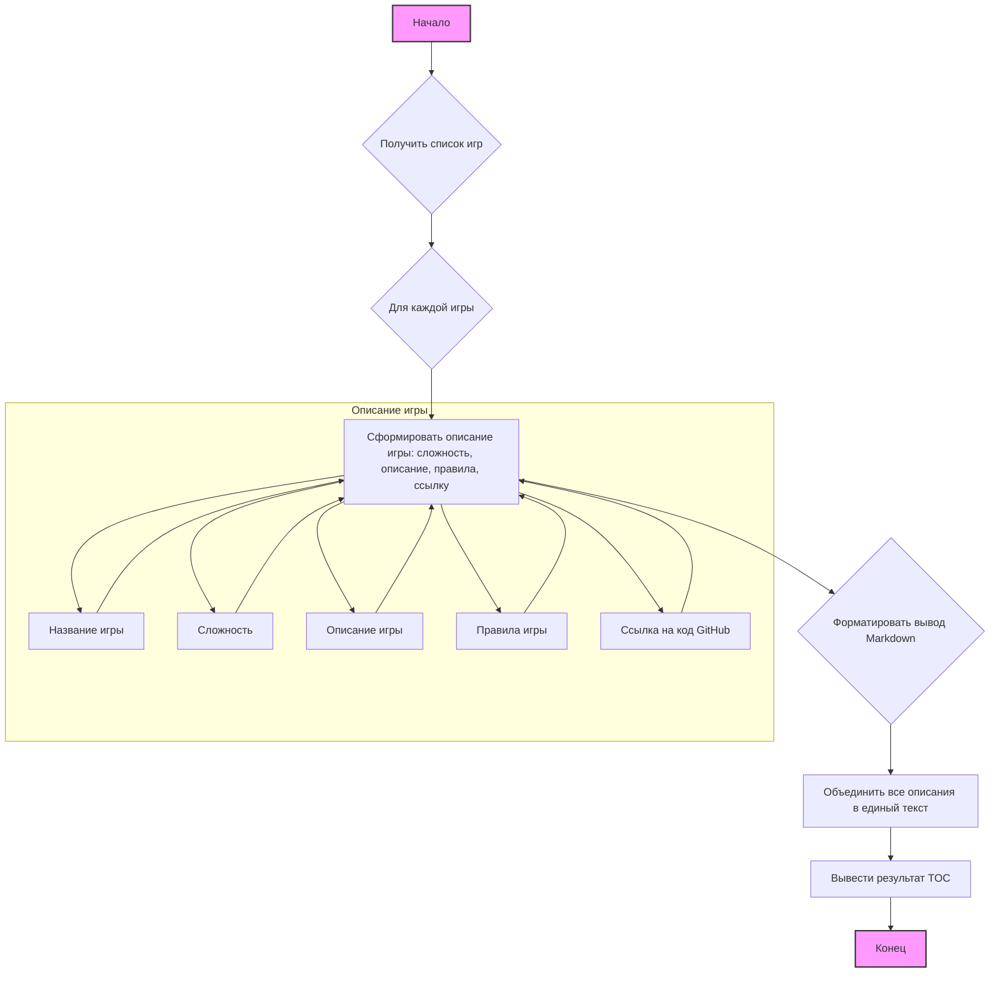

## ИНСТРУКЦИЯ:

Анализируй предоставленный код подробно и объясни его функциональность. Ответ должен включать три раздела:

1.  **<алгоритм>**: Опиши рабочий процесс в виде пошаговой блок-схемы, включая примеры для каждого логического блока, и проиллюстрируй поток данных между функциями, классами или методами.
2.  **<mermaid>**: Напиши код для диаграммы в формате `mermaid`, проанализируй и объясни все зависимости,
    которые импортируются при создании диаграммы.
    **ВАЖНО!** Убедитесь, что все имена переменных, используемые в диаграмме `mermaid`,
    имеют осмысленные и описательные имена. Имена переменных вроде `A`, `B`, `C`, и т.д., не допускаются!

    **Дополнительно**: Если в коде есть импорт `import header`, добавьте блок `mermaid` flowchart, объясняющий `header.py`:
    ```mermaid
    flowchart TD
        Start --> Header[<code>header.py</code><br> Determine Project Root]

        Header --> import[Import Global Settings: <br><code>from src import gs</code>]
    ```

3.  **<объяснение>**: Предоставьте подробные объяснения:
    - **Импорты**: Их назначение и взаимосвязь с другими пакетами `src.`.
    - **Классы**: Их роль, атрибуты, методы и взаимодействие с другими компонентами проекта.
    - **Функции**: Их аргументы, возвращаемые значения, назначение и примеры.
    - **Переменные**: Их типы и использование.
    - Выделите потенциальные ошибки или области для улучшения.

Дополнительно, постройте цепочку взаимосвязей с другими частями проекта (если применимо).

Это обеспечивает всесторонний и структурированный анализ кода.
## Формат ответа: `.md` (markdown)
**КОНЕЦ ИНСТРУКЦИИ**

# Анализ кода для создания TOC

## 1. <алгоритм>

Этот код предназначен для автоматического создания оглавления (TOC) для набора текстовых игр, взятых из книги "101 Basic Computer Games". Оглавление будет в формате Markdown и включать название игры, ее сложность, краткое описание, правила и ссылку на исходный код.

**Блок-схема процесса:**

1.  **Ввод данных:**
    *   Получаем список названий игр из инструкции.
    *   Получаем список директорий для которых необходимо сгенерировать TOC.

2.  **Итерация по играм:**
    *   Для каждой игры в списке, формируем ее описание:
        *   Берем название игры.
        *   Устанавливаем сложность (пример: случайное число или определенное значение).
        *   Берем краткое описание игры из инструкции.
        *   Берем правила игры из инструкции.
        *   Формируем ссылку на исходный код на GitHub.

3.  **Форматирование вывода:**
    *   Создаем строку в формате Markdown для каждой игры, объединяем все строки в общий текст.

4.  **Вывод результата:**
    *   Выводим сгенерированный Markdown текст TOC.

**Пример для одной игры (Acey Ducey):**

1.  **Ввод:**
    *   Название игры: "Acey Ducey"
    *   Описание: "карточная игра."
    *   Правила: "Игроки делают ставки на то, будет ли следующая карта между двумя открытыми картами."
    *   Сложность: 3

2.  **Форматирование:**
    *   Создаем строку:

```markdown
Acey Ducey
========
Сложность 3
     карточная игра.
     Игроки делают ставки на то, будет ли следующая карта между двумя открытыми картами.
* [Перейти к коду](https://github.com/hypo69/hypo/blob/master/src/endpoints/ai_games/101_basic_computer_games/ru/Acey Ducey)

---
```

## 2. <mermaid>



**Объяснение `mermaid`:**

*   `flowchart TD`: Определяет, что это блок-схема сверху вниз.
*   `A[Начало]`, `H[Конец]`: Начало и конец процесса.
*   `B{Получить список игр}`: Блок принятия решения (ромб) для получения списка игр.
*   `C{Для каждой игры}`: Блок принятия решения (ромб) для начала цикла перебора игр.
*   `D[Сформировать описание игры: сложность, описание, правила, ссылку]`: Блок процесса, формирует описание игры.
*   `E{Форматировать вывод Markdown}`: Блок процесса, форматирует вывод в Markdown.
*    `F[Объединить все описания в единый текст]`: Блок процесса, объединяет все описания игр в один текст.
*   `G[Вывести результат TOC]`: Блок процесса, выводит результат.
*   `style A fill:#f9f,stroke:#333,stroke-width:2px` и `style H fill:#f9f,stroke:#333,stroke-width:2px`: стилизуют блоки "Начало" и "Конец".
*    `subgraph "Описание игры"`: Группа блоков, которые формируют описание отдельной игры.
*    `D1[Название игры]`, `D2[Сложность]`, `D3[Описание игры]`, `D4[Правила игры]`, `D5[Ссылка на код GitHub]`: отдельные блоки, формирующие атрибуты описания игры.
*    `-->`: Стрелки, показывающие порядок выполнения операций.

## 3. <объяснение>

**Импорты:**
В данном коде импортов нет, так как это текстовый блок, описывающий процесс.

**Классы:**
Классы не используются, так как код не является исполняемым.

**Функции:**
В данном коде функции не используются, так как это текстовый блок, описывающий процесс.

**Переменные:**

В данном коде явно используемых переменных нет, это скорее псевдокод, переменные подразумеваются в процессе:

*   `список_игр`: Список названий игр (строки).
*    `список_директорий`: Список директорий, для которых нужно создать TOC (строки).
*   `название_игры`: Строка, представляющая название текущей игры.
*   `сложность_игры`: Целое число, представляющее сложность текущей игры.
*   `описание_игры`: Строка, представляющая описание текущей игры.
*    `правила_игры`: Строка, представляющая правила текущей игры.
*   `ссылка_на_код`: Строка, содержащая URL-адрес к исходному коду игры на GitHub.
*    `markdown_toc`: Строка, содержащая финальный TOC в формате Markdown.

**Потенциальные ошибки и области для улучшения:**

1.  **Отсутствие конкретной реализации**: Код в текущем виде является описанием процесса и не может быть непосредственно выполнен. Для использования потребуется реализация в конкретном языке программирования.
2.  **Жестко закодированные данные**: Список игр и их описания жестко закодированы в инструкции, было бы полезнее загружать их из файла.
3.  **Сложность игры**: Уровень сложности игры не определен, нужно добавить логику определения сложности, например, по длине кода или каким-либо критериям.
4.  **Генерация ссылок**: Ссылка на код GitHub генерируется в коде и не меняется для каждой игры, необходимо добавить логику для генерации уникальной ссылки для каждой игры, исходя из списка `список_директорий`.
5.  **Исключения**: Не обрабатываются случаи отсутствия данных для каких-либо игр.

**Взаимосвязь с другими частями проекта:**
Этот код связан с другими частями проекта:
*   Структура файлов:  Связан со структурой директорий проекта в репозитории GitHub.
*   Генерация контента: Эта часть создает TOC для игр и будет использоваться как индекс к соответствующим файлам.

Это обеспечивает всесторонний и структурированный анализ кода.