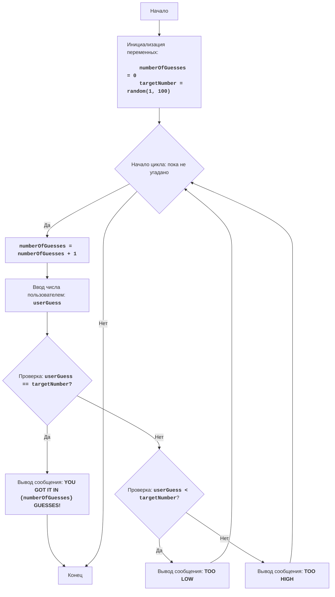

# АНАЛИЗ КОДА

## 1. <алгоритм>

**Блок-схема:**

1.  **Инициализация**:
    -   `numberOfGuesses` присваивается значение 0.
    -   `targetNumber` присваивается случайное целое число от 1 до 100 (например, 42).
    
2.  **Начало цикла `while True`**: 
    
    **Пример**: 
        
        numberOfGuesses = 0
        targetNumber = 42
        while True:
            
3. **Увеличение счетчика попыток**:
    -   `numberOfGuesses` увеличивается на 1.
   
    **Пример**:
        
        numberOfGuesses = 1
        
4.  **Ввод числа пользователем**:
    -   Запрашивается ввод числа у пользователя (например, пользователь вводит 50).
        
    **Пример**:
    
        userGuess = 50
    
5.  **Проверка на угадывание**:
    -   Проверяется условие `userGuess == targetNumber` (50 == 42).
    -   Если условие истинно, выводится сообщение "YOU GOT IT IN {numberOfGuesses} GUESSES!" и цикл завершается.
    
        **Пример**: 
            
            50 == 42 (false)
   
6.  **Если число не угадано, проверка на "слишком низко"**:
    -   Проверяется условие `userGuess < targetNumber` (50 < 42).
    -   Если условие истинно, выводится сообщение "TOO LOW".
   
        **Пример**:
            
            50 < 42 (false)
    
7.  **Если число не меньше, то оно больше ("слишком высоко")**:
    -   Если предыдущие условия не выполнены, выводится сообщение "TOO HIGH".
    
        **Пример**:
        
            Выводится "TOO HIGH"
    
8.  **Возврат к началу цикла**:
    -   Цикл возвращается к шагу 3 и процесс повторяется.
    -   Допустим пользователь ввел 20.
        
    **Пример**:
            
        numberOfGuesses = 2
        userGuess = 20
        20 == 42 (false)
        20 < 42 (true)
        Выводится "TOO LOW"
        

9.  **Завершение цикла**:
    -   Когда условие `userGuess == targetNumber` истинно (например, пользователь ввел 42), цикл завершается.
        
        **Пример**:
        
        numberOfGuesses = 5
        userGuess = 42
        42 == 42 (true)
        Выводится "YOU GOT IT IN 5 GUESSES!"

## 2. <mermaid>

**Анализ:**
   
*   Диаграмма начинается с блока `Start`, который представляет начало программы.

*   Блок `InitializeVariables` выполняет инициализацию переменных: `numberOfGuesses` устанавливается в 0, а `targetNumber`  получает случайное значение от 1 до 100.

*   `LoopStart` обозначает начало цикла, который продолжается до тех пор, пока число не будет угадано.

*   `IncreaseGuesses` увеличивает счетчик количества попыток `numberOfGuesses` на 1.

*   `InputGuess` запрашивает ввод числа от пользователя и сохраняет его в переменной `userGuess`.

*   `CheckGuess` проверяет, равно ли число, введенное пользователем `userGuess`, загаданному числу `targetNumber`.

*   Если числа равны (Да), программа переходит к блоку `OutputWin`, где выводится сообщение о победе с указанием количества попыток, после чего переходит к блоку `End`.
    
*   Если числа не равны (Нет), то программа переходит к блоку `CheckLow`, где проверяется, меньше ли число `userGuess` загаданного числа `targetNumber`.

*   Если `userGuess` меньше `targetNumber` (Да), то выводится сообщение `TOO LOW`, и программа возвращается к началу цикла `LoopStart`.

*   Если `userGuess` не меньше `targetNumber` (Нет), это означает, что `userGuess` больше `targetNumber`, и выводится сообщение `TOO HIGH`, после чего программа также возвращается к началу цикла `LoopStart`.

*   Цикл завершается, когда условие в блоке `CheckGuess` становится истинным (числа равны), и программа переходит к блоку `End`.

## 3. <объяснение>

### Импорты:

-   `import random`: Этот оператор импортирует модуль `random`, который предоставляет функции для генерации псевдослучайных чисел. В данном коде используется функция `random.randint(1, 100)` для генерации случайного целого числа в диапазоне от 1 до 100, которое игрок должен угадать. Модуль `random` является частью стандартной библиотеки Python и не зависит от других частей проекта `src.`.

### Переменные:

-   `numberOfGuesses`: Целочисленная переменная, которая хранит количество попыток, предпринятых игроком для угадывания числа. Инициализируется значением 0 в начале игры.
-   `targetNumber`: Целочисленная переменная, которая хранит случайное число, которое игрок должен угадать. Значение присваивается с помощью функции `random.randint(1, 100)` в начале игры.
-   `userGuess`: Целочисленная переменная, которая хранит число, введенное пользователем во время каждой попытки. Это значение получается через функцию `input()` и преобразуется в целое число с помощью `int()`.

### Функции:
-   В явном виде пользовательские функции не используются, но неявно используется функция `random.randint(a,b)` из модуля `random`
   - **Аргументы**:  принимает 2 целых числа `a` и `b`.
   - **Возвращаемое значение**: возвращает случайное целое число в диапазоне от `a` до `b` включительно
   - **Назначение**: генерирует случайное целое число для загаданной переменной.

### Цикл `while True`:

-   `while True:`: Этот цикл используется для бесконечного повторения игрового процесса, пока игрок не угадает загаданное число.
-   `numberOfGuesses += 1`: Увеличивает счетчик попыток на 1 перед каждой попыткой ввода числа.
-   `try...except ValueError`:  Блок используется для обработки возможных ошибок ввода пользователя.
    -   `userGuess = int(input("Угадай число от 1 до 100: "))`: Запрашивает ввод числа от пользователя и пытается преобразовать введенную строку в целое число.
    -   `except ValueError`: Если пользователь ввел не целое число, будет выведено сообщение об ошибке, и цикл перейдет к следующей итерации (пользователю будет предложено ввести число снова).
-   `if userGuess == targetNumber:`: Проверяет, угадал ли пользователь число.
    -   `print(f"ПОЗДРАВЛЯЮ! Вы угадали число за {numberOfGuesses} попыток!")`: Выводит сообщение о победе.
    -   `break`: Завершает цикл `while True`, если число угадано.
-   `elif userGuess < targetNumber`: Если введенное число меньше загаданного, выводится сообщение "Слишком низко".
-   `else`: Если введенное число больше загаданного, выводится сообщение "Слишком высоко".

### Общая функциональность:

Код реализует игру "Угадай число". Компьютер генерирует случайное число, а игрок пытается его угадать, получая подсказки о том, является ли введенное число слишком низким или слишком высоким. Игра продолжается до тех пор, пока игрок не угадает загаданное число.

### Потенциальные ошибки и области для улучшения:
*   **Нет ограничений на ввод**: Код не проверяет, находится ли введенное пользователем число в диапазоне от 1 до 100. Если пользователь введет число меньше 1 или больше 100, то код все равно обработает его как обычный ввод, что может привести к неожиданному поведению.
*   **Нет защиты от нечислового ввода**: Код пытается преобразовать любой ввод в целое число, что может привести к ошибке если пользователь введет текст. Ошибка обрабатывается, но программа не просит ввести число повторно, в этом есть упущение.
*   **Отсутствие валидации**: Было бы полезно добавить проверку на ввод пользователя, чтобы убедиться, что он вводит целое число в допустимом диапазоне (от 1 до 100) для улучшения пользовательского опыта.
*   **Нет ограничений на количество попыток**: Игрок может пытаться угадать число бесконечно долго. Можно добавить ограничение на количество попыток.

### Цепочка взаимосвязей с другими частями проекта:

Этот код является самостоятельным и не имеет прямых зависимостей с другими частями проекта `src.`. Он использует только стандартный модуль `random` для генерации случайных чисел. В связи с этим, он не связан напрямую с другими частями проекта и может быть запущен независимо.

В целом, код хорошо структурирован и понятен, выполняет свою функцию, но имеет несколько областей, которые можно улучшить для более надежной и дружественной к пользователю реализации.