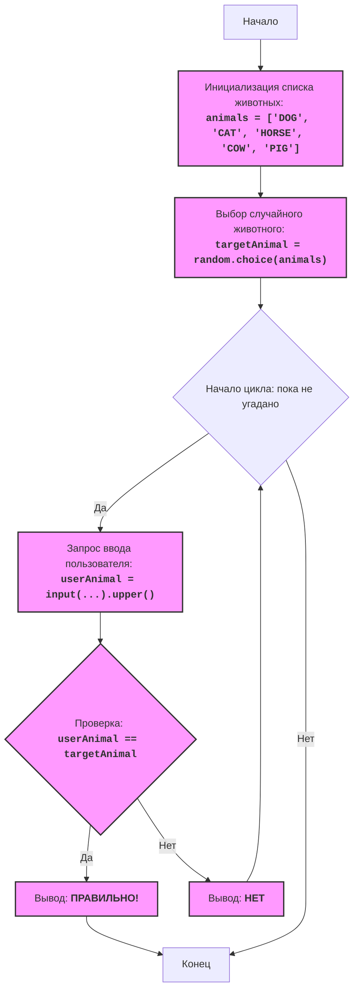

## <алгоритм>

**Пошаговый алгоритм игры "ANIMAL" с примерами:**

1.  **Инициализация списка животных:**
    *   Создается список `animals`, содержащий строки с названиями животных, например `animals = ['DOG', 'CAT', 'HORSE', 'COW', 'PIG']`.

2.  **Выбор случайного животного:**
    *   Из списка `animals` случайным образом выбирается одно животное, которое сохраняется в переменной `targetAnimal`.
        *   Пример: `targetAnimal` может стать `'CAT'`, если случайный выбор пал на второй элемент списка.

3.  **Начало цикла "пока не угадано":**
    *   Запускается бесконечный цикл `while True:`, который будет продолжаться до тех пор, пока игрок не угадает животное.

4.  **Запрос ввода от пользователя:**
    *   Пользователю выводится сообщение "Угадайте животное (DOG, CAT, HORSE, COW, PIG):".
    *   Введенное пользователем значение сохраняется в переменной `userAnimal` после преобразования к верхнему регистру.
        *   Пример: Если пользователь ввел "dog", то `userAnimal` будет равно `'DOG'`.

5.  **Проверка на совпадение:**
    *   Сравнивается значение `userAnimal` с `targetAnimal`.
        *   Если `userAnimal` равно `targetAnimal`, переходим к шагу 6.
        *   Если `userAnimal` не равно `targetAnimal`, переходим к шагу 7.
        *   Пример: Если `userAnimal` равно `'CAT'`, а `targetAnimal` равно `'CAT'`, то условия совпали.

6.  **Вывод сообщения "ПРАВИЛЬНО!" и завершение игры:**
    *   Выводится сообщение "ПРАВИЛЬНО!" на экран.
    *   Цикл `while True:` прерывается с помощью `break`.
        *   Пример: На экран выводится "ПРАВИЛЬНО!".

7.  **Вывод сообщения "НЕТ" и возврат к началу цикла:**
    *   Выводится сообщение "НЕТ" на экран.
    *   Программа возвращается к началу цикла, где пользователю снова предлагается ввести название животного.
        *   Пример: На экран выводится "НЕТ", и игра продолжается.

8.  **Конец игры:**
    *   Игра заканчивается после того, как пользователь угадал животное и цикл был прерван.

**Поток данных:**

*   `animals` (список строк) → `random.choice()` → `targetAnimal` (строка)
*   `input()` (ввод пользователя, строка) → `.upper()` → `userAnimal` (строка)
*   `userAnimal`, `targetAnimal` →  сравнение `==` →  логическое значение
*   логическое значение → `print()` (вывод в консоль)

## <mermaid>

**Объяснение диаграммы `mermaid`:**

1.  **`Start`**:  Начальная точка программы.
2.  **`InitializeAnimals`**:  Инициализируется список строк `animals` с названиями животных.
3.  **`ChooseRandomAnimal`**:  Случайным образом выбирается животное из списка `animals` и сохраняется в переменную `targetAnimal`. Используется функция `random.choice()`.
4.  **`LoopStart`**:  Начало бесконечного цикла `while True`, который продолжается, пока пользователь не угадает животное.
5.  **`InputAnimal`**: Пользователю предлагается ввести название животного. Введенная строка преобразуется в верхний регистр и сохраняется в переменной `userAnimal`.
6.  **`CheckAnimal`**: Проверка на совпадение: сравниваются введенное пользователем название `userAnimal` с выбранным случайным `targetAnimal`.
7.  **`OutputWin`**: Если проверка на совпадение успешна, выводится сообщение "ПРАВИЛЬНО!".
8.  **`End`**: Конец игры (цикл прерывается).
9.  **`OutputWrong`**: Если проверка на совпадение не успешна, выводится сообщение "НЕТ".
10. **Возврат к `LoopStart`**: После вывода "НЕТ" программа возвращается к началу цикла, чтобы пользователь сделал новую попытку.

## <объяснение>

**Импорты:**

*   `import random`: Импортирует модуль `random` из стандартной библиотеки Python. Модуль `random` предоставляет функции для генерации псевдослучайных чисел. В этом коде используется функция `random.choice()`, которая выбирает случайный элемент из списка.

**Переменные:**

*   `animals` (list): Список, содержащий названия животных (строки). Определен в глобальной области видимости и используется как источник данных.
*   `targetAnimal` (str): Строка, содержащая случайно выбранное животное из списка `animals`. Она инициализируется один раз в начале программы и остается неизменной в течение текущей игровой сессии.
*   `userAnimal` (str): Строка, содержащая введенное пользователем название животного. Каждый раз, когда пользователь делает попытку, эта переменная обновляется.

**Функции:**

*   `random.choice(seq)`: Функция из модуля `random`, которая принимает в качестве аргумента последовательность `seq` (в данном случае список `animals`) и возвращает случайный элемент из этой последовательности.
*   `input(prompt)`: Встроенная функция Python, которая выводит сообщение `prompt` и ожидает ввода пользователя. Возвращает строку, содержащую введенный пользователем текст.
    *   Пример: `input("Угадайте животное: ")` выведет "Угадайте животное: " на экран и будет ждать ввода.
*   `.upper()`: Метод строк Python, преобразующий все символы в строке в верхний регистр.
    *   Пример: `"dog".upper()` вернет `"DOG"`.
*   `print(obj)`: Встроенная функция Python, выводящая на экран текстовое представление объекта `obj`.
*   `break`: Оператор, используемый для немедленного выхода из текущего цикла.

**Логика работы:**

1.  Программа начинается с инициализации списка `animals` и выбора случайного животного `targetAnimal`.
2.  Запускается бесконечный цикл `while True`, который будет продолжаться, пока пользователь не угадает животное.
3.  В цикле пользователю предлагается ввести название животного.
4.  Ввод пользователя преобразуется в верхний регистр.
5.  Происходит сравнение введенного названия с загаданным.
6.  Если названия совпадают, на экран выводится сообщение "ПРАВИЛЬНО!", и цикл прерывается.
7.  Если названия не совпадают, на экран выводится сообщение "НЕТ", и цикл продолжается.
8.  Игра продолжается, пока не будет угадано загаданное животное.

**Области для улучшения:**

*   **Обработка некорректного ввода**: Сейчас программа принимает только ввод, который является одним из вариантов животных из списка (с учетом регистра). Стоит добавить проверку ввода на соответствие ожидаемым вариантам.
*   **Количество попыток**: Возможно, стоит ограничить количество попыток, предоставляемых пользователю.
*   **Подсказки**: Можно добавить подсказки после нескольких неверных попыток.
*   **Проверка на пустой ввод**: Нужно добавить проверку на пустой ввод пользователя.

**Связь с другими частями проекта:**

Данный код является самостоятельной игрой и не имеет прямой связи с другими частями проекта, предполагая, что это отдельная игра в наборе игр. Однако, если бы была необходимость, результаты игры или некоторые её параметры можно было бы сохранять и использовать в других модулях. Например, можно было бы использовать этот код в качестве части обучения или тестирования, где успешное выполнение могло бы влиять на общий прогресс.

**Цепочка взаимосвязей:**

В текущей реализации нет взаимосвязей с другими частями проекта. Однако, в потенциале, игра может быть связана с другими компонентами через API или сохранение результатов.

**Общий вывод:**

Представленный код реализует простую игру в угадывание животного. Он хорошо структурирован и легко читается. Однако есть области для улучшения, в частности обработка некорректного ввода и добавление дополнительных игровых механик. Код можно расширять и использовать в более сложных проектах, добавляя функционал и улучшая интерфейс.