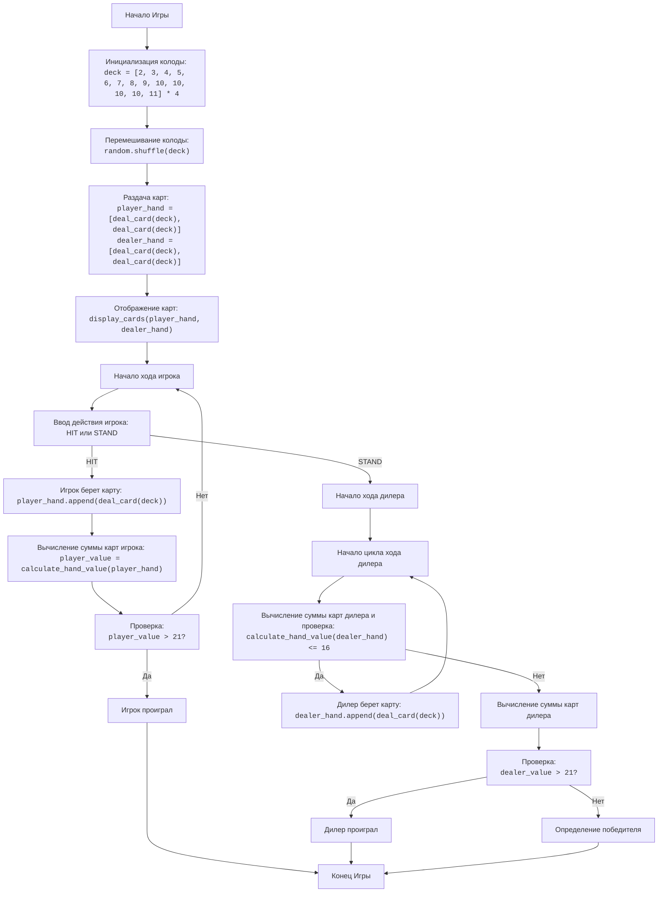

## АНАЛИЗ КОДА: BLKJAK (БЛЭКДЖЕК)

### 1. <алгоритм>

**Блок-схема процесса игры в Блэкджек:**

1.  **Начало Игры:**
    *   Инициализируется колода из 52 карт. Каждая карта имеет значение от 2 до 10, валет, дама и король - 10, туз - 1 или 11.
    *   Пример: `deck = [2, 3, 4, 5, 6, 7, 8, 9, 10, 10, 10, 10, 11] * 4`
2.  **Перемешивание Колоды:**
    *   Колода карт перемешивается в случайном порядке.
    *   Пример: `random.shuffle(deck)`
3.  **Раздача Начальных Карт:**
    *   Игроку и дилеру раздаётся по две карты. Одна карта дилера остаётся закрытой.
    *   Пример:
        *   `player_hand = [deal_card(deck), deal_card(deck)]`
        *   `dealer_hand = [deal_card(deck), deal_card(deck)]`
4.  **Отображение Карт:**
    *   Показываются карты игрока и одна открытая карта дилера.
    *   Пример: `display_cards(player_hand, dealer_hand)`
5.  **Ход Игрока:**
    *   Игрок выбирает HIT (взять карту) или STAND (остановиться).
        *   Если HIT: игроку выдается ещё одна карта.
            *   Пример: `player_hand.append(deal_card(deck))`
        *   Вычисляется сумма очков игрока.
            *   Пример: `player_value = calculate_hand_value(player_hand)`
        *   Если сумма очков игрока больше 21, он проигрывает, и игра завершается.
        *   Если STAND: ход переходит к дилеру.
        *   Пример ввода: `action = input("Хотите взять еще карту? (HIT/STAND): ").upper()`
6.  **Ход Дилера:**
    *   Дилер берёт карты, пока сумма его очков не станет больше 16.
        *   Пример: `while calculate_hand_value(dealer_hand) <= 16:`
        *   `dealer_hand.append(deal_card(deck))`
    *   Если сумма очков дилера больше 21, он проигрывает, и игрок выигрывает.
7.  **Определение Победителя:**
    *   Сравниваются суммы очков игрока и дилера.
        *   Пример: `player_value = calculate_hand_value(player_hand)`
        *   `dealer_value = calculate_hand_value(dealer_hand)`
    *   Если сумма очков игрока больше, чем у дилера, но не больше 21, игрок выигрывает.
    *   Если сумма очков дилера больше, чем у игрока, но не больше 21, дилер выигрывает.
    *   Если суммы равны, объявляется ничья (PUSH).
8.  **Конец Игры:**
    *   Выводится результат игры.
    *   Пример: `print("Вы выиграли!")`, `print("Вы проиграли!")`, `print("Ничья!")`

### 2. <mermaid>

**Объяснение `mermaid` диаграммы:**

*   **Start**: Начало игры.
*   **InitializeDeck**: Создание колоды карт (список целых чисел, представляющих значения карт).
*   **ShuffleDeck**: Перемешивание колоды.
*   **DealCards**: Раздача по две карты игроку и дилеру.
*   **DisplayInitialHands**: Отображение карт игрока и одной открытой карты дилера.
*   **PlayerTurnStart**: Начало хода игрока.
*   **PlayerActionChoice**: Запрос действия от игрока (HIT или STAND).
*   **PlayerHit**: Игрок берёт еще одну карту.
*   **CalculatePlayerHandValue**: Вычисление суммы очков карт игрока.
*   **CheckPlayerBust**: Проверка, не превысила ли сумма очков игрока 21.
*   **PlayerBust**: Сообщение о проигрыше игрока.
*  **DealerTurnStart**: Начало хода дилера.
*   **DealerHitLoopStart**: Начало цикла, где дилер берет карты, если его сумма <= 16.
*   **CalculateDealerHandValueCheck**: Проверка и вычисление суммы карт дилера.
*   **DealerHit**: Дилер берет еще одну карту.
*  **CalculateDealerHandValue**: Вычисление суммы карт дилера.
*  **CheckDealerBust**: Проверка, не превысила ли сумма очков дилера 21.
*   **DealerBust**: Сообщение о проигрыше дилера.
*   **DetermineWinner**: Определение победителя и вывод результатов игры.
*   **End**: Конец игры.

**Зависимости:**

*   Диаграмма не использует импортированные зависимости, поскольку код не импортирует другие модули, кроме `random`.

### 3. <объяснение>

**Импорты:**

*   `import random`: Модуль `random` используется для генерации случайных чисел, в данном случае для перемешивания колоды карт.

**Функции:**

*   `deal_card(deck)`:
    *   **Аргументы**: `deck` (список) - колода карт.
    *   **Возвращаемое значение**: Карта (последний элемент) из колоды.
    *   **Назначение**: Извлекает и возвращает карту из колоды, удаляя её.
    *   **Пример**: Если `deck = [2, 3, 4]`, то `deal_card(deck)` вернёт 4, а `deck` станет `[2, 3]`.
*   `calculate_hand_value(hand)`:
    *   **Аргументы**: `hand` (список) - набор карт игрока или дилера.
    *   **Возвращаемое значение**: Целое число - общая сумма очков карт в руке.
    *   **Назначение**: Вычисляет сумму очков карт, обрабатывая тузы (1 или 11).
    *   **Пример**: Если `hand = [10, 11, 2]`, то `calculate_hand_value(hand)` вернет 13 (11 станет 1, так как 10 + 11 + 2 > 21). Если `hand = [10, 2]`, то `calculate_hand_value(hand)` вернет 12.
*   `display_cards(player_hand, dealer_hand, show_dealer_full=False)`:
    *   **Аргументы**:
        *   `player_hand` (список) - карты игрока.
        *   `dealer_hand` (список) - карты дилера.
        *   `show_dealer_full` (булево, по умолчанию `False`) - определяет, показывать ли все карты дилера.
    *   **Возвращаемое значение**: None.
    *   **Назначение**: Выводит на экран карты игрока и дилера.
    *   **Пример**: Если `player_hand = [10, 5]`, `dealer_hand = [7, 11]` и `show_dealer_full` равен `False`, то будет показано: Карты дилера: <закрытая карта> 11. Карты игрока: 10 5 Сумма: 15
*   `play_blackjack()`:
    *   **Аргументы**: None.
    *   **Возвращаемое значение**: None.
    *   **Назначение**: Основная функция, реализующая логику игры в блэкджек. Включает создание колоды, раздачу карт, ходы игрока и дилера, определение победителя.

**Переменные:**

*   `deck` (список): Колода карт. Инициализируется в `play_blackjack()` как список целых чисел от 2 до 11, умноженный на 4 (для 4 мастей).
*   `player_hand` (список): Рука карт игрока. Создаётся в `play_blackjack()` путём раздачи двух карт из колоды.
*   `dealer_hand` (список): Рука карт дилера. Создаётся в `play_blackjack()` путём раздачи двух карт из колоды.
*   `player_value` (целое число): Сумма очков карт игрока, вычисляется функцией `calculate_hand_value`.
*   `dealer_value` (целое число): Сумма очков карт дилера, вычисляется функцией `calculate_hand_value`.
*   `action` (строка): Выбор игрока: "HIT" или "STAND".

**Потенциальные ошибки и области для улучшения:**

*   **Обработка ошибок ввода:** Код проверяет только ввод "HIT" или "STAND", но не обрабатывает другие возможные некорректные вводы. Можно добавить проверку на пустую строку или другие невалидные значения.
*   **Сообщения о победе:** Можно добавить более развернутые сообщения о победе и поражении, чтобы было более информативно.
*   **Текстовый интерфейс:** Игра реализована через простой текстовый интерфейс. Можно подумать о добавлении графического интерфейса для улучшения пользовательского опыта.
*   **Реализация нескольких раундов:** В текущей реализации игра заканчивается после одного раунда. Можно добавить возможность играть несколько раундов.

**Цепочка взаимосвязей с другими частями проекта:**

*   Этот код является автономным и не зависит от других частей проекта, за исключением стандартных библиотек Python.  Хотя `random` является частью стандартной библиотеки, но для данного проекта этого достаточно, что бы игра запустилась и корректно работала.

**Дополнительные заметки:**

*   Код хорошо структурирован и логически понятен.
*   Функции имеют чёткое назначение, что облегчает чтение и понимание кода.
*   Комментирование кода достаточное.