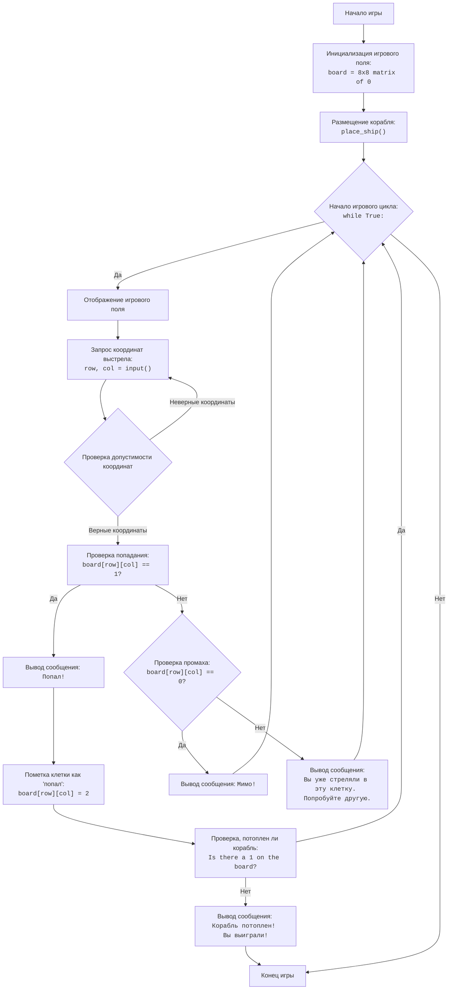

## АНАЛИЗ КОДА:

### 1. <алгоритм>

**Инициализация:**

1.  Создается игровое поле `board` как матрица 8x8, заполненная нулями.
    *   Пример: `board = [[0, 0, 0, 0, 0, 0, 0, 0], [0, 0, 0, 0, 0, 0, 0, 0], ..., [0, 0, 0, 0, 0, 0, 0, 0]]`

**Размещение корабля:**

1.  Случайно выбирается направление: горизонтальное (0) или вертикальное (1).
    *   Пример: `direction = 0` (горизонтальное)
2.  Выбираются случайные координаты начала корабля.
    *   Пример: `row = 3`, `col = 2`
3.  Корабль размещается на поле, занимая 3 последовательные клетки.
    *   Пример: Если направление горизонтальное, то `board[3][2] = 1`, `board[3][3] = 1`, `board[3][4] = 1`.
    *   Пример: Если направление вертикальное, то `board[3][2] = 1`, `board[4][2] = 1`, `board[5][2] = 1`.

**Игровой цикл:**

1.  Выводится текущее состояние игрового поля.
    *   Пример:
        ```
        0 0 0 0 0 0 0 0
        0 0 0 0 0 0 0 0
        0 0 0 1 1 1 0 0
        0 0 0 0 0 0 0 0
        0 0 0 0 0 0 0 0
        0 0 0 0 0 0 0 0
        0 0 0 0 0 0 0 0
        0 0 0 0 0 0 0 0
        ```
2.  Запрашивается ввод координат выстрела.
    *   Пример: Пользователь вводит "3,4".
3.  Координаты преобразуются в индексы массива: `row = 3`, `col = 4`.
4.  Проверяется, был ли выстрел попаданием:
    *   Если `board[row][col] == 1`:
        *   Выводится сообщение "Попал!".
        *   Значение в клетке изменяется на 2 (`board[row][col] = 2`).
        *   Проверяется, есть ли еще клетки корабля (есть ли на поле значение 1):
            *   Если нет, то выводится сообщение "Корабль потоплен! Вы выиграли!" и игра заканчивается.
    *   Если `board[row][col] == 0`:
        *   Выводится сообщение "Мимо!".
    *  Если `board[row][col] == 2`:
        *   Выводится сообщение "Вы уже стреляли в эту клетку. Попробуйте другую.".
5.  Цикл повторяется до тех пор, пока корабль не будет потоплен.

### 2. <mermaid>



**Объяснение `mermaid` диаграммы:**

*   **Start (Начало игры):** Начальная точка выполнения программы.
*   **InitializeBoard (Инициализация игрового поля):** Создание игрового поля как матрицы 8x8, заполненной нулями.
*   **PlaceShip (Размещение корабля):** Вызывает функцию `place_ship()`, которая размещает корабль на доске случайным образом.
*   **GameLoopStart (Начало игрового цикла):** Начало основного цикла игры, который продолжается до тех пор, пока корабль не будет потоплен.
*   **DisplayBoard (Отображение игрового поля):** Выводит текущее состояние игрового поля в консоль.
*   **InputCoordinates (Запрос координат выстрела):** Запрашивает у пользователя ввод координат выстрела.
*   **ValidateCoordinates (Проверка допустимости координат):** Проверяет, что введенные пользователем координаты находятся в допустимых пределах игрового поля (от 0 до 7). Если координаты неверные, то игра возвращается к запросу ввода.
*    **CheckHit (Проверка попадания):** Проверяет, является ли выстрел попаданием (если в клетке находится корабль, то есть значение равно 1).
*   **OutputHit (Вывод сообщения: Попал!):** Выводит сообщение "Попал!", если выстрел попал в корабль.
*   **MarkHit (Пометка клетки как 'попал'):**  Изменяет значение в клетке, где был выстрел, на 2, чтобы избежать повторных попаданий.
*   **CheckShipSunk (Проверка, потоплен ли корабль):** Проверяет, есть ли еще клетки корабля на поле.
*   **OutputSunk (Вывод сообщения: Корабль потоплен! Вы выиграли!):** Выводит сообщение о победе, если корабль потоплен.
*   **End (Конец игры):** Завершение работы программы.
*    **CheckMissed (Проверка промаха):** Проверяет, был ли выстрел промахом (если в клетке нет корабля и не было попадания, то есть значение равно 0).
*   **OutputMiss (Вывод сообщения: Мимо!):** Выводит сообщение "Мимо!", если выстрел не попал в корабль.
*    **OutputRehit (Вывод сообщения: Вы уже стреляли в эту клетку. Попробуйте другую.):** Выводит сообщение о том, что игрок уже стрелял в эту клетку.

### 3. <объяснение>

**Импорты:**

*   `import random`: Модуль `random` используется для генерации случайных чисел, необходимых для выбора направления корабля и его координат. Он обеспечивает случайное поведение игры.

**Переменные:**

*   `board`: Двумерный список (матрица) размером 8x8, представляющий игровое поле. Изначально заполнен нулями.
    *   Тип: `list` of `list` of `int`.
    *   Использование: Хранит состояние игрового поля. 0 - пусто, 1 - корабль, 2 - попадание.
*   `direction`: Случайное число, представляющее направление корабля (0 - горизонтальное, 1 - вертикальное).
    *   Тип: `int`.
    *   Использование: Определяет, как будет размещен корабль.
*   `row`, `col`: Целые числа, представляющие координаты ряда и столбца соответственно.
    *   Тип: `int`.
    *   Использование: Используются для определения местоположения корабля и выстрелов игрока.
*   `i`: Переменная цикла, используется при размещении корабля.
    *  Тип: `int`.
    *   Использование: Используется для перемещения по клеткам при размещении корабля.
*   `coordinates`: Строка, содержащая координаты выстрела, введенные пользователем в формате "ряд,столбец".
    *   Тип: `str`.
    *   Использование: Хранит ввод пользователя.
*   `row_b`: Переменная цикла, используется при проверке, потоплен ли корабль.
     * Тип: `list`.
    *  Использование: Используется для итерации по строкам `board`.
*  `ship_sunk`: Булева переменная, которая указывает, потоплен ли корабль.
    * Тип: `bool`.
    * Использование: Используется для контроля завершения игры.

**Функции:**

*   `place_ship()`:
    *   Аргументы: Нет.
    *   Возвращаемое значение: Нет.
    *   Назначение: Размещает корабль на игровом поле случайным образом.
    *   Пример:
        1.  Выбирается случайное направление: `direction = 0` (горизонтальное).
        2.  Выбираются случайные координаты: `row = 2`, `col = 1`.
        3.  Корабль размещается на поле: `board[2][1] = 1`, `board[2][2] = 1`, `board[2][3] = 1`.
*   **Основной игровой цикл `while True:`:**
    *   Аргументы: Нет.
    *   Возвращаемое значение: Нет.
    *   Назначение: Управляет ходом игры, запрашивая ввод координат, проверяя попадания и сообщая о результатах.

**Детальное объяснение:**

1.  **Инициализация:** Создается игровое поле `board`, которое представляет собой список списков, каждый из которых является строкой поля. Изначально все клетки заполнены нулями.
2.  **Размещение корабля:** Функция `place_ship()` генерирует случайное положение корабля на поле. Корабль имеет длину 3 и может располагаться горизонтально или вертикально. Функция устанавливает значения 1 в ячейках, занимаемых кораблем.
3.  **Игровой цикл:**
    *   Выводится текущее состояние игрового поля.
    *   Запрашивается ввод координат выстрела в формате "ряд,столбец".
    *   Проверяется, является ли выстрел попаданием.
        *   Если попадание (значение в клетке 1), то клетка отмечается как попадание (значение 2), и проверяется, потоплен ли корабль. Если все части корабля потоплены, игра завершается.
        *   Если промах (значение в клетке 0), то выводится сообщение о промахе.
        *   Если игрок стреляет в клетку, в которую уже попал, то выводится соответствующее сообщение.
    *   Цикл продолжается до тех пор, пока корабль не будет потоплен.

**Потенциальные ошибки и области для улучшения:**

*   **Отсутствие проверок ввода:** В коде есть обработка `ValueError` при вводе неверного формата, но отсутствует проверка на ввод нечисловых данных.
*   **Ограниченная длина корабля:** Код предполагает, что длина корабля всегда равна 3. Можно улучшить, добавив возможность задавать длину корабля.
*   **Отображение игрового поля:** Текущий вывод поля не очень наглядный. Можно использовать более удобное форматирование.
*   **Логика повторных выстрелов**: В коде есть проверка, что игрок стреляет не в ту же клетку, в которую он уже попал. Можно добавить логику для автоматического пропуска хода, если игрок повторно стреляет в клетку, в которую уже стрелял.

**Взаимосвязи с другими частями проекта:**
Этот код представляет собой отдельную игру "Морской бой" и не зависит от других частей проекта `src`.

Этот подробный анализ должен дать полное понимание работы представленного кода.