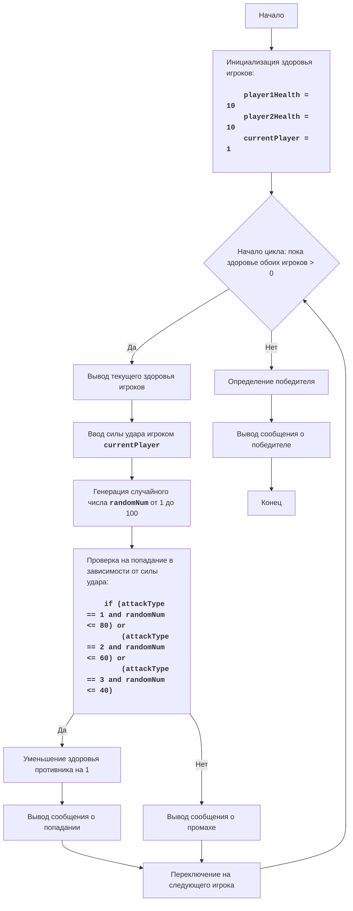
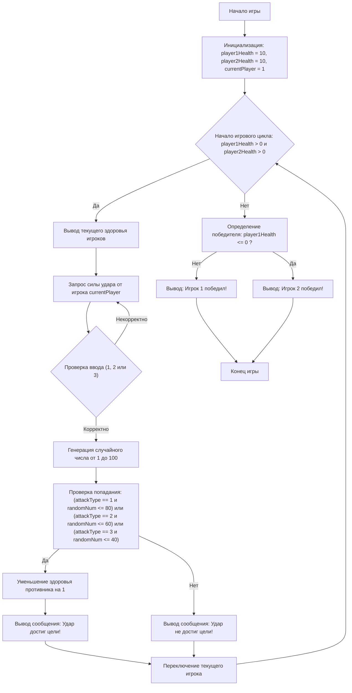

## ИНСТРУКЦИЯ:

Анализируй предоставленный код подробно и объясни его функциональность. Ответ должен включать три раздела:  

1. **<алгоритм>**: Опиши рабочий процесс в виде пошаговой блок-схемы, включая примеры для каждого логического блока, и проиллюстрируй поток данных между функциями, классами или методами.  
2. **<mermaid>**: Напиши код для диаграммы в формате `mermaid`, проанализируй и объясни все зависимости, 
    которые импортируются при создании диаграммы. 
    **ВАЖНО!** Убедитесь, что все имена переменных, используемые в диаграмме `mermaid`, 
    имеют осмысленные и описательные имена. Имена переменных вроде `A`, `B`, `C`, и т.д., не допускаются!  
    
    **Дополнительно**: Если в коде есть импорт `import header`, добавьте блок `mermaid` flowchart, объясняющий `header.py`:\
    ```mermaid
    flowchart TD
        Start --> Header[<code>header.py</code><br> Determine Project Root]
    
        Header --> import[Import Global Settings: <br><code>from src import gs</code>] 
    ```

3. **<объяснение>**: Предоставьте подробные объяснения:  
   - **Импорты**: Их назначение и взаимосвязь с другими пакетами `src.`.  
   - **Классы**: Их роль, атрибуты, методы и взаимодействие с другими компонентами проекта.  
   - **Функции**: Их аргументы, возвращаемые значения, назначение и примеры.  
   - **Переменные**: Их типы и использование.  
   - Выделите потенциальные ошибки или области для улучшения.  

Дополнительно, постройте цепочку взаимосвязей с другими частями проекта (если применимо).  

Это обеспечивает всесторонний и структурированный анализ кода.
## Формат ответа: `.md` (markdown)
**КОНЕЦ ИНСТРУКЦИИ**
```
<BOXING>:
=================
Сложность: 4
-----------------
Игра "Бокс" представляет собой текстовую имитацию боксерского поединка между двумя игроками, где каждый игрок по очереди наносит удары, выбирая их силу (слабый, средний, сильный), и компьютер случайным образом определяет, попал ли удар. Игра продолжается до тех пор, пока один из боксеров не будет нокаутирован (его счетчик здоровья не достигнет 0).
Правила игры:
1.  Играют два игрока по очереди.
2.  У каждого игрока есть счетчик здоровья, изначально равный 10.
3.  Игрок может выбрать один из трех типов удара: слабый (1), средний (2) или сильный (3).
4.  Сила удара влияет на шанс попадания: слабый удар имеет наибольшую вероятность попадания, сильный - наименьшую.
5.  Если удар попадает, то здоровье противника уменьшается на 1.
6.  Игра заканчивается, когда здоровье одного из игроков достигает 0.
7.  Игрок, у которого здоровье осталось больше 0, объявляется победителем.
-----------------
Алгоритм:
1. Инициализировать здоровье обоих игроков (игрок 1 и игрок 2) значением 10.
2. Начать игровой цикл, который продолжается, пока здоровье обоих игроков больше 0:
    2.1 Вывести текущее здоровье обоих игроков.
    2.2 Запросить ввод от текущего игрока (игрок 1 или 2).
        - Если текущий игрок - игрок 1, запросить ввод силы удара (1-слабый, 2-средний, 3-сильный).
        - Если текущий игрок - игрок 2, запросить ввод силы удара (1-слабый, 2-средний, 3-сильный).
    2.3 Сгенерировать случайное число от 1 до 100.
    2.4 Если:
        - игрок выбрал слабый удар (1) и случайное число меньше или равно 80, то удар достиг цели, уменьшить здоровье противника на 1.
        - игрок выбрал средний удар (2) и случайное число меньше или равно 60, то удар достиг цели, уменьшить здоровье противника на 1.
        - игрок выбрал сильный удар (3) и случайное число меньше или равно 40, то удар достиг цели, уменьшить здоровье противника на 1.
        - иначе, удар не достиг цели.
    2.5 Вывести сообщение, достиг ли удар цели.
    2.6 Переключить ход на следующего игрока.
3. После завершения цикла определить победителя (у кого здоровье больше 0).
4. Вывести сообщение о победителе.
-----------------
Блок-схема:


Legenda:
    Start - Начало программы.
    InitializeHealth - Инициализация переменных: player1Health и player2Health (здоровье игроков) устанавливаются в 10, currentPlayer (текущий игрок) устанавливается в 1.
    LoopStart - Начало цикла, который продолжается, пока здоровье обоих игроков больше 0.
    DisplayHealth - Вывод текущего здоровья обоих игроков.
    InputAttack - Запрос у текущего игрока ввода силы удара (1, 2 или 3) и сохранение его в переменной attackType.
    GenerateRandomNumber - Генерация случайного числа в диапазоне от 1 до 100 и сохранение его в переменной randomNum.
    CheckHit - Проверка, попал ли удар, на основе случайного числа и выбранной силы удара.
    ReduceOpponentHealth - Уменьшение здоровья противника на 1, если удар попал.
    OutputHit - Вывод сообщения о попадании удара.
    SwitchPlayer - Переключение хода на следующего игрока.
    OutputMiss - Вывод сообщения о промахе.
    DetermineWinner - Определение победителя после окончания цикла.
    OutputWinner - Вывод сообщения о победителе.
    End - Конец программы.
```
```python
import random

# Инициализация здоровья игроков
player1Health = 10
player2Health = 10
# Начинаем с первого игрока
currentPlayer = 1


# Основной игровой цикл
while player1Health > 0 and player2Health > 0:
    # Выводим текущее здоровье игроков
    print(f"Здоровье игрока 1: {player1Health}, Здоровье игрока 2: {player2Health}")
    
    # Запрашиваем ввод от текущего игрока
    while True:
        try:
            attackType = int(input(f"Игрок {currentPlayer}, выберите силу удара (1-слабый, 2-средний, 3-сильный): "))
            if attackType in [1, 2, 3]:
                break
            else:
                print("Некорректный ввод. Пожалуйста, выберите 1, 2 или 3.")
        except ValueError:
            print("Некорректный ввод. Пожалуйста, введите число.")
    
    # Генерируем случайное число
    randomNum = random.randint(1, 100)
    
    # Определяем, попал ли удар и уменьшаем здоровье противника, если удар попал
    hit = False
    if attackType == 1 and randomNum <= 80:
        hit = True
    elif attackType == 2 and randomNum <= 60:
        hit = True
    elif attackType == 3 and randomNum <= 40:
        hit = True
    
    if hit:
        print("Удар достиг цели!")
        if currentPlayer == 1:
            player2Health -= 1
        else:
            player1Health -= 1
    else:
        print("Удар не достиг цели.")

    # Переключаем ход на следующего игрока
    currentPlayer = 3 - currentPlayer  # Переключает с 1 на 2 и с 2 на 1

# Определяем победителя
if player1Health <= 0:
    print("Игрок 2 победил!")
else:
    print("Игрок 1 победил!")
```
```
Объяснение кода:
1.  **Импорт модуля `random`**:
   -  `import random`: Импортирует модуль `random`, который используется для генерации случайных чисел.
2.  **Инициализация переменных**:
    -   `player1Health = 10`: Инициализирует здоровье игрока 1 со значением 10.
    -   `player2Health = 10`: Инициализирует здоровье игрока 2 со значением 10.
    -   `currentPlayer = 1`: Устанавливает текущего игрока на игрока 1.
3. **Основной игровой цикл `while player1Health > 0 and player2Health > 0:`**:
   -  Цикл продолжается, пока здоровье обоих игроков больше 0.
   -  **Вывод текущего здоровья**:
        - `print(f"Здоровье игрока 1: {player1Health}, Здоровье игрока 2: {player2Health}")`: Выводит текущее здоровье обоих игроков.
   - **Запрос ввода от текущего игрока**:
      -  `while True:`:  Бесконечный цикл для запроса ввода, пока не будет введен корректный вариант.
      -  `try...except ValueError:`: Обрабатывает возможные ошибки ввода (если пользователь введет не число).
      -  `attackType = int(input(f"Игрок {currentPlayer}, выберите силу удара (1-слабый, 2-средний, 3-сильный): "))`: Запрашивает у текущего игрока выбор силы удара.
      -  `if attackType in [1, 2, 3]:`: Проверяет, корректен ли ввод (1, 2 или 3).
      - `break`: Выходит из цикла запроса ввода при корректном вводе.
      - `else:`: Выводит сообщение о некорректном вводе, если введено число не 1, 2 или 3.
   - **Генерация случайного числа**:
      -  `randomNum = random.randint(1, 100)`: Генерирует случайное число от 1 до 100.
   - **Проверка попадания и уменьшение здоровья**:
      - `hit = False`: Инициализирует переменную hit (попадание) со значением False.
      - `if attackType == 1 and randomNum <= 80:`: Проверяет, если выбран слабый удар и случайное число меньше или равно 80, удар достигает цели.
      - `elif attackType == 2 and randomNum <= 60:`: Проверяет, если выбран средний удар и случайное число меньше или равно 60, удар достигает цели.
      - `elif attackType == 3 and randomNum <= 40:`: Проверяет, если выбран сильный удар и случайное число меньше или равно 40, удар достигает цели.
      - `if hit:`: Проверяет, был ли удар успешен.
      - `print("Удар достиг цели!")`: Выводит сообщение об успехе.
      -  Уменьшает здоровье противника в зависимости от текущего игрока.
      -  `else:`: Если удар не достиг цели.
      -  `print("Удар не достиг цели.")`: Выводит сообщение о неудаче.
   - **Переключение хода**:
      -   `currentPlayer = 3 - currentPlayer`: Переключает текущего игрока (если был 1, то становится 2, и наоборот).
4.  **Определение победителя**:
    -  `if player1Health <= 0:`: Проверяет, если здоровье игрока 1 стало 0 или меньше.
    - `print("Игрок 2 победил!")`: Выводит сообщение о победе игрока 2.
    -   `else:`: Если здоровье игрока 1 больше 0.
    -  `print("Игрок 1 победил!")`: Выводит сообщение о победе игрока 1.
```
<br>

### <алгоритм>
1.  **Инициализация**:
    -   Устанавливаем `player1Health` и `player2Health` в 10.
        *   Пример: `player1Health = 10`, `player2Health = 10`
    -   Устанавливаем `currentPlayer` в 1 (первый игрок).
        *   Пример: `currentPlayer = 1`
2.  **Игровой цикл `while`**:
    -   Цикл продолжается, пока `player1Health` > 0 И `player2Health` > 0.
        *   Пример: Если `player1Health = 5` и `player2Health = 3`, цикл продолжается. Если `player1Health = 0`, цикл заканчивается.
    -   **Вывод здоровья**:
        -   Выводим текущее здоровье обоих игроков.
            *   Пример: `Здоровье игрока 1: 5, Здоровье игрока 2: 3`
    -   **Ввод силы удара**:
        -   Запрашиваем у текущего игрока (1 или 2) ввод силы удара (1, 2, или 3).
            *   Пример: "Игрок 1, выберите силу удара (1-слабый, 2-средний, 3-сильный): "
        -   Проверяем, что ввод корректный (1, 2 или 3). Если ввод некорректный, запрашиваем снова.
        -   Сохраняем ввод в `attackType`.
            *   Пример: Если игрок ввел `2`, `attackType = 2`.
    -   **Генерация случайного числа**:
        -   Генерируем случайное число от 1 до 100 и сохраняем в `randomNum`.
            *   Пример: `randomNum = 75`
    -   **Проверка попадания**:
        -   Проверяем, попал ли удар, на основе выбранной силы удара и `randomNum`:
            -   Если `attackType = 1` (слабый удар) и `randomNum <= 80`, то удар попал.
                *   Пример: Если `attackType = 1` и `randomNum = 60`, удар попал.
            -   Если `attackType = 2` (средний удар) и `randomNum <= 60`, то удар попал.
                *   Пример: Если `attackType = 2` и `randomNum = 55`, удар попал.
            -   Если `attackType = 3` (сильный удар) и `randomNum <= 40`, то удар попал.
                *   Пример: Если `attackType = 3` и `randomNum = 30`, удар попал.
        -   Если удар попал, устанавливаем `hit = True`.
            *   Пример: `hit = True`
        -   Иначе `hit = False`.
            *   Пример: `hit = False`
    -   **Уменьшение здоровья**:
        -   Если `hit = True`, уменьшаем здоровье противника на 1.
            *   Пример: Если `currentPlayer = 1`, то `player2Health -= 1`. Если `currentPlayer = 2`, то `player1Health -= 1`.
    -   **Вывод результата удара**:
        -   Выводим сообщение о результате удара ("Удар достиг цели!" или "Удар не достиг цели.").
            *   Пример: "Удар достиг цели!" или "Удар не достиг цели."
    -   **Переключение игрока**:
        -   Переключаем текущего игрока (`currentPlayer`): если был 1, становится 2, и наоборот.
            *   Пример: Если `currentPlayer = 1`, то `currentPlayer` становится 2; если `currentPlayer = 2`, то `currentPlayer` становится 1.
3.  **Определение победителя**:
    -   Когда цикл `while` завершается (здоровье одного из игроков становится 0 или меньше), проверяем здоровье игроков.
        *   Пример: Если `player1Health = 0`, а `player2Health = 3`, цикл заканчивается.
    -   Если `player1Health <= 0`, то игрок 2 победил.
        *   Пример: Вывод сообщения "Игрок 2 победил!".
    -   Иначе, игрок 1 победил.
        *   Пример: Вывод сообщения "Игрок 1 победил!".

### <mermaid>

**Анализ зависимостей:**

В данном коде используется только один импорт - `random`. Это стандартный модуль Python, который не зависит от каких-либо других частей проекта `src`.

-   `import random`: Модуль `random` предоставляет функции для генерации псевдослучайных чисел. Он используется для имитации случайности попадания ударов.

### <объяснение>

**1. Импорты:**
   -   `import random`:  Импортирует модуль `random` для генерации случайных чисел. Это стандартный модуль Python, не связанный с другими частями проекта `src`.

**2. Переменные:**
   -   `player1Health` (int): Здоровье игрока 1, инициализируется значением 10.
   -   `player2Health` (int): Здоровье игрока 2, инициализируется значением 10.
   -   `currentPlayer` (int): Текущий игрок (1 или 2), инициализируется значением 1.
   -   `attackType` (int): Тип выбранного удара текущим игроком (1-слабый, 2-средний, 3-сильный).
   -   `randomNum` (int): Случайное число, генерируемое для определения попадания удара.
   -   `hit` (bool): Флаг, указывающий, попал ли удар.

**3. Функции:**
    -   `random.randint(a, b)`: Метод модуля `random`, который генерирует случайное целое число в диапазоне от a до b включительно.
         *  Пример: `random.randint(1, 100)` вернет случайное число от 1 до 100.
    -   `input(prompt)`: Встроенная функция, которая выводит строку `prompt` и возвращает ввод пользователя как строку.
         *   Пример: `input("Введите ваше имя: ")` выведет "Введите ваше имя: " и будет ожидать ввод пользователя.
    -   `print(value, ..., sep=' ', end='\n', file=sys.stdout, flush=False)`: Встроенная функция, выводит на консоль значения, разделенные `sep`, заканчивая `end`.
        *   Пример: `print("Привет", "мир", sep=" - ", end="!")` выведет `Привет - мир!`

**4. Классы:**
   -   В данном коде нет классов.

**5. Основной игровой цикл:**
   -  `while player1Health > 0 and player2Health > 0:`: Главный игровой цикл, продолжающийся пока у обоих игроков остается здоровье.
   -  Внутри цикла:
      - Выводится текущее здоровье игроков.
      - Запрашивается ввод от текущего игрока для выбора силы удара (1, 2 или 3).
      - Генерируется случайное число.
      - Определяется, попал ли удар, и если да, уменьшается здоровье противника.
      - Выводится сообщение о результате удара.
      - Переключается ход на следующего игрока.
   -   После завершения цикла выводится сообщение о победителе.

**6. Потенциальные ошибки и улучшения:**
   - **Обработка нечислового ввода:** Хотя код обрабатывает ошибку ValueError при вводе силы удара, он может быть улучшен, чтобы обрабатывать другие типы некорректного ввода (например, пустую строку).
   - **Улучшенная логика определения попадания:** Можно вынести логику определения попадания в отдельную функцию, чтобы код был более читаемым.
   - **Улучшенный интерфейс:** Текстовой интерфейс игры может быть улучшен, добавив больше деталей (например, описание нанесенного удара, анимацию или что-то подобное).
   - **Расширяемость:**  Код можно расширить, добавив разные виды атак, специальные удары, или даже AI противника.

**7. Взаимосвязь с другими частями проекта (если применимо):**
   -  Этот код не зависит от других частей проекта `src`. Это автономная реализация текстовой игры "Бокс".