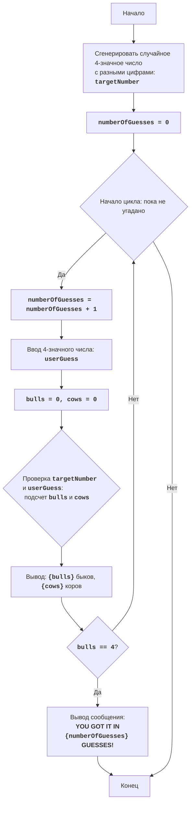

## ИНСТРУКЦИЯ:

Анализируй предоставленный код подробно и объясни его функциональность. Ответ должен включать три раздела:

1.  **<алгоритм>**: Опиши рабочий процесс в виде пошаговой блок-схемы, включая примеры для каждого логического блока, и проиллюстрируй поток данных между функциями, классами или методами.
2.  **<mermaid>**: Напиши код для диаграммы в формате `mermaid`, проанализируй и объясни все зависимости,
    которые импортируются при создании диаграммы.
    **ВАЖНО!** Убедитесь, что все имена переменных, используемые в диаграмме `mermaid`,
    имеют осмысленные и описательные имена. Имена переменных вроде `A`, `B`, `C`, и т.д., не допускаются!

    **Дополнительно**: Если в коде есть импорт `import header`, добавьте блок `mermaid` flowchart, объясняющий `header.py`:
    ```mermaid
    flowchart TD
        Start --> Header[<code>header.py</code><br> Determine Project Root]

        Header --> import[Import Global Settings: <br><code>from src import gs</code>]
    ```

3.  **<объяснение>**: Предоставьте подробные объяснения:
    -   **Импорты**: Их назначение и взаимосвязь с другими пакетами `src.`.
    -   **Классы**: Их роль, атрибуты, методы и взаимодействие с другими компонентами проекта.
    -   **Функции**: Их аргументы, возвращаемые значения, назначение и примеры.
    -   **Переменные**: Их типы и использование.
    -   Выделите потенциальные ошибки или области для улучшения.

Дополнительно, постройте цепочку взаимосвязей с другими частями проекта (если применимо).

Это обеспечивает всесторонний и структурированный анализ кода.
## Формат ответа: `.md` (markdown)
**КОНЕЦ ИНСТРУКЦИИ**

## <алгоритм>

**Блок-схема игрового процесса:**



**Описание шагов:**

1.  **Start**: Начало программы.
2.  **GenerateTargetNumber**: Вызывается функция `generate_target_number()`, которая создает случайное 4-значное число с неповторяющимися цифрами, например `targetNumber = 1234`.
3.  **InitializeGuesses**:  Устанавливается начальное количество попыток `numberOfGuesses` в 0.
4.  **LoopStart**: Начало цикла, который продолжается, пока игрок не угадает число.
5.  **IncreaseGuesses**:  Увеличивается счетчик `numberOfGuesses` на 1, например `numberOfGuesses = 1`.
6.  **InputGuess**:  Пользователь вводит 4-значное число, например `userGuess = 5678`. Если ввод не является целым числом, то программа выводит сообщение об ошибке и запрашивает повторный ввод. Если число не является 4-х значным, программа так же выводит сообщение об ошибке и запрашивает повторный ввод.
7.  **InitializeBullsCows**:  Обнуляются счетчики `bulls` (быки) и `cows` (коровы).
8.  **CheckBullsCows**: Сравниваются цифры `targetNumber` и `userGuess`.
    *   Если цифра на той же позиции совпадает, увеличивается счетчик `bulls`. Например, если `targetNumber = 1234` и `userGuess = 1567`, `bulls` станет 1.
    *   Если цифра есть в `targetNumber`, но не на той же позиции, увеличивается счетчик `cows`. Например, если `targetNumber = 1234` и `userGuess = 5167`, `cows` станет 1.
9.  **OutputBullsCows**: Выводятся результаты подсчета быков и коров, например "1 быков, 1 коров".
10. **CheckWin**: Проверяется, равно ли количество "быков" 4 (победа).
    *   Если `bulls == 4`, переходит к шагу `OutputWin`.
    *   Если `bulls != 4`, возвращается к `LoopStart`.
11. **OutputWin**:  Выводится сообщение о победе и количестве попыток, например "YOU GOT IT IN 5 GUESSES!".
12. **End**: Завершение игры.

## <mermaid>

```mermaid
flowchart TD
    Start[Start] --> GenerateTargetNumber[generate_target_number(): <br><code>targetNumber</code>]
    GenerateTargetNumber --> InitializeGuesses[numberOfGuesses = 0]
    InitializeGuesses --> GameLoopStart{while True}
    GameLoopStart -- True --> IncreaseGuesses[numberOfGuesses += 1]
    IncreaseGuesses --> GetUserGuess[userGuess = input()]
    GetUserGuess --> ValidateUserGuess{Validate userGuess: <br>1000 <= userGuess <= 9999}
    ValidateUserGuess -- True --> InitializeBullsAndCows[bulls = 0, cows = 0]
    InitializeBullsAndCows --> ConvertNumbersToStrings[target_str = str(targetNumber), <br>guess_str = str(userGuess)]
     ConvertNumbersToStrings --> CheckBullsCowsLoopStart{for i in range(4)}
    CheckBullsCowsLoopStart --> CheckBull{guess_str[i] == target_str[i]}
    CheckBull -- True --> IncreaseBulls[bulls += 1]
    IncreaseBulls --> CheckBullsCowsLoopEnd
    CheckBull -- False --> CheckCow{guess_str[i] in target_str}
    CheckCow -- True --> IncreaseCows[cows += 1]
    IncreaseCows --> CheckBullsCowsLoopEnd
    CheckCow -- False --> CheckBullsCowsLoopEnd
    CheckBullsCowsLoopEnd{CheckBullsCowsLoopEnd} --> CheckBullsCowsLoopStart
    CheckBullsCowsLoopEnd --> OutputBullsAndCows[print(f"{bulls} быков, {cows} коров")]
     OutputBullsAndCows --> CheckWinCondition{bulls == 4}
    CheckWinCondition -- True --> OutputWinMessage[print(f"YOU GOT IT IN {numberOfGuesses} GUESSES!")]
    OutputWinMessage --> End[End]
    CheckWinCondition -- False --> GameLoopStart
    ValidateUserGuess -- False --> GetUserGuess
     GameLoopStart -- False --> End
     
```

**Описание зависимостей:**

1.  **`random`**:
    *   Импортируется для генерации случайных чисел и перемешивания списка в функции `generate_target_number()`.
    *   Используется для создания случайного 4-значного числа, которое игрок должен угадать.

**Описание переменных в mermaid диаграмме:**

*   `targetNumber`: Целое число, которое игрок должен угадать. Генерируется функцией `generate_target_number()`.
*   `numberOfGuesses`: Целое число, счетчик попыток пользователя.
*   `userGuess`: Целое число, ввод пользователя.
*   `bulls`: Целое число, количество "быков" (цифры угаданы и на правильных местах).
*   `cows`: Целое число, количество "коров" (цифры угаданы, но не на правильных местах).
* `target_str`: Строковое представление `targetNumber`.
* `guess_str`: Строковое представление `userGuess`.

## <объяснение>

**Импорты:**

*   `import random`: Импортирует модуль `random` для генерации случайных чисел и перемешивания списка. Это позволяет генерировать случайное 4-значное число с неповторяющимися цифрами, которое нужно угадать.

**Функции:**

*   `generate_target_number()`:
    *   **Аргументы:** Нет.
    *   **Возвращаемое значение:**  4-значное целое число с неповторяющимися цифрами.
    *   **Назначение:** Генерирует случайное 4-значное число, которое нужно угадать.
    *   **Примеры:** Вызов `generate_target_number()` может вернуть, например, `1234` или `9876`.
        *   `digits = list(range(10))`: Создается список цифр от 0 до 9.
        *   `random.shuffle(digits)`: Список цифр перемешивается в случайном порядке.
        *   `target = digits[0] * 1000 + digits[1] * 100 + digits[2] * 10 + digits[3]`: Из первых четырех цифр формируется 4-значное число.
        *   `if digits[0] == 0:`: Проверка, если первая цифра 0, то функция вызывается рекурсивно, чтобы обеспечить не 0-ое число в качестве первой цифры.
        *   `return target`: Возвращается сгенерированное число.

**Переменные:**

*   `targetNumber` (int): Содержит загаданное 4-значное число, сгенерированное функцией `generate_target_number()`.
*   `numberOfGuesses` (int): Счетчик попыток игрока. Инициализируется 0, увеличивается на 1 при каждой попытке.
*   `userGuess` (int): Содержит число, введенное пользователем в виде 4-значного целого числа.
*    `bulls` (int): Счетчик "быков". Инициализируется 0. Увеличивается на 1 каждый раз, когда угадывается цифра в правильной позиции.
*    `cows` (int): Счетчик "коров". Инициализируется 0. Увеличивается на 1 каждый раз, когда угадывается цифра, но не на правильной позиции.
*    `target_str` (str): Строковое представление `targetNumber`.
*   `guess_str` (str): Строковое представление `userGuess`.

**Объяснение кода:**

1.  **Инициализация:**
    *   Генерируется `targetNumber`, которое нужно угадать.
    *   Инициализируется `numberOfGuesses` в 0.
2.  **Игровой цикл:**
    *   Бесконечный цикл `while True`, который продолжается, пока игрок не угадает число.
    *   `numberOfGuesses` увеличивается на 1.
    *   Запрашивается ввод `userGuess`.
        *   Обрабатывается исключение `ValueError`, если пользователь вводит не число.
        *   Проверяется, является ли введенное число 4-значным.
    *   Обнуляются счетчики `bulls` и `cows`.
    *   `targetNumber` и `userGuess` преобразуются в строки для удобства сравнения цифр.
    *   Цикл `for` проходит по каждой цифре `userGuess`:
        *   Если цифра на той же позиции в `targetNumber`, увеличивается `bulls`.
        *   Если цифра есть в `targetNumber`, но на другой позиции, увеличивается `cows`.
    *   Выводятся значения `bulls` и `cows`.
    *   Проверяется условие победы (`bulls == 4`).
        *   Если условие выполняется, выводится сообщение о победе и игра заканчивается оператором `break`.

**Потенциальные ошибки и области для улучшения:**

1.  **Обработка ошибок ввода:**
    *   Код обрабатывает неверный ввод, но можно добавить проверку на то, что пользователь вводит именно 4-значное число.
2.  **Генерация числа:**
    *   Функция `generate_target_number()` является рекурсивной, что может привести к ошибке `RecursionError`, если рандом выдает ноль первой цифрой много раз подряд. Это можно исправить с помощью цикла while.

**Цепочка взаимосвязей с другими частями проекта:**

*   Этот код является автономным, поэтому нет прямой связи с другими частями проекта.
*  Этот код является реализацией одной из игр в сборнике базовых компьютерных игр.

Этот анализ предоставляет детальное понимание кода, его алгоритма, зависимостей и возможных улучшений.