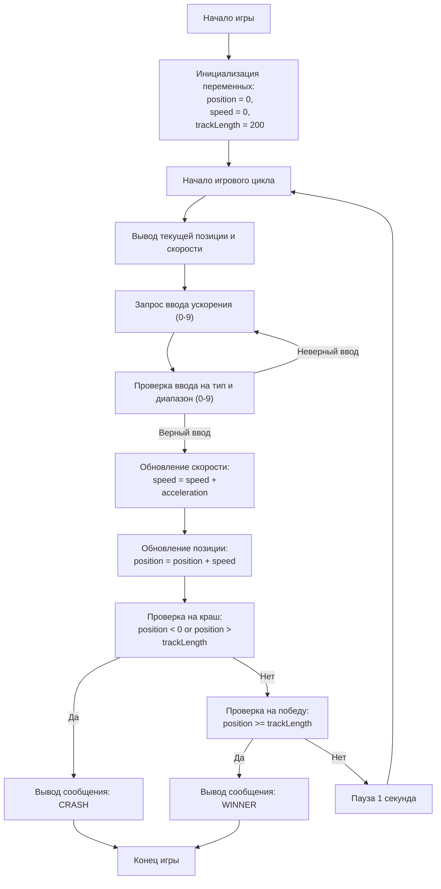

## АНАЛИЗ КОДА:

### <алгоритм>

**Описание алгоритма игры "CAN AM" в виде пошаговой блок-схемы:**

1. **Инициализация:**
   - Установить начальную позицию (`position`) автомобиля в `0`.
   - Установить начальную скорость (`speed`) автомобиля в `0`.
   - Установить длину трассы (`trackLength`) в `200`.
   *Пример: `position = 0`, `speed = 0`, `trackLength = 200`*

2. **Начало игрового цикла:**
   - Запустить цикл `while True`, который будет выполняться до тех пор, пока игра не закончится (победа или проигрыш).
   *Пример: начало цикла `while True:`*

3. **Вывод текущего состояния:**
   - Вывести на экран текущую позицию и скорость автомобиля.
   *Пример: `Текущая позиция: 0, текущая скорость: 0`*

4. **Ввод ускорения:**
   - Запросить у пользователя ввод ускорения (количество нажатий на газ) от 0 до 9.
   - Обработать возможные ошибки ввода (не целое число).
     - Если ввод не является целым числом, вывести сообщение об ошибке и повторить запрос.
   - Проверить введенное значение ускорения на соответствие диапазону 0-9.
     - Если значение не соответствует, вывести сообщение об ошибке и повторить запрос.
   *Пример: Пользователь вводит `5`*

5. **Обновление скорости:**
   - Увеличить текущую скорость на введенное ускорение.
   *Пример: `speed = speed + acceleration` (если `speed = 0` и `acceleration = 5`, то `speed` становится `5`)*

6. **Обновление позиции:**
   - Изменить положение автомобиля, прибавив к текущей позиции текущую скорость.
   *Пример: `position = position + speed` (если `position = 0` и `speed = 5`, то `position` становится `5`)*

7. **Проверка на краш (вылет с трассы):**
   - Проверить, не вышла ли позиция автомобиля за пределы трассы (`position < 0` или `position > trackLength`).
     - Если позиция вышла за пределы трассы:
       - Вывести сообщение "CRASH! Вы вылетели с трассы!"
       - Завершить игру.
   *Пример: Если `position = -2`, то выводится "CRASH", игра завершается*

8. **Проверка на победу (достижение финиша):**
   - Проверить, не достигла ли позиция автомобиля конца трассы (`position >= trackLength`).
     - Если позиция достигла конца трассы:
       - Вывести сообщение "WINNER! Вы достигли финиша!"
       - Завершить игру.
   *Пример: Если `position = 200`, то выводится "WINNER", игра завершается*

9. **Задержка:**
   - Если игра не закончилась (ни краш, ни победа), сделать паузу в 1 секунду, чтобы дать пользователю время оценить результаты.
   *Пример: `time.sleep(1)`*

10. **Повторение цикла:**
    - Вернуться к шагу 3.

### <mermaid>

**Объяснение диаграммы `mermaid`:**

-   `Start`: Начало программы.
-   `InitializeVariables`: Инициализация переменных `position` (текущая позиция автомобиля), `speed` (текущая скорость автомобиля) и `trackLength` (длина трассы).
-   `GameLoopStart`: Начало основного цикла игры.
-   `DisplayStatus`: Вывод текущей позиции и скорости автомобиля на экран.
-   `InputAcceleration`: Запрос у пользователя ввода значения ускорения (количество нажатий на газ).
-   `ValidateInput`: Проверка, что ввод является целым числом и попадает в диапазон от 0 до 9. Если ввод не корректный, то возвращаемся на шаг `InputAcceleration`
-   `UpdateSpeed`: Обновление скорости автомобиля на основе введенного ускорения.
-   `UpdatePosition`: Обновление позиции автомобиля на основе текущей скорости.
-   `CheckCrash`: Проверка, не вылетела ли машина с трассы (позиция за пределами допустимого диапазона).
-   `CrashMessage`: Вывод сообщения "CRASH" на экран.
-  `GameEnd`: Конец программы.
-   `CheckWin`: Проверка, достигла ли машина финиша (позиция достигла конца трассы).
-   `WinMessage`: Вывод сообщения "WINNER" на экран.
-   `Wait`: Задержка в 1 секунду.

### <объяснение>

**Импорты:**

-   `import time`: Импортирует модуль `time`, который предоставляет функции для работы со временем. В данном случае используется `time.sleep(1)` для задержки выполнения программы на 1 секунду, что позволяет пользователю увидеть текущий результат перед следующим ходом.

**Переменные:**

-   `position` (int): Текущая позиция автомобиля на трассе. Изначально устанавливается в 0.
-   `speed` (int): Текущая скорость автомобиля. Изначально устанавливается в 0.
-   `trackLength` (int): Длина трассы, по которой едет автомобиль. Устанавливается в 200.
-   `acceleration` (int): Ускорение, введенное пользователем (количество нажатий на газ). Получается через `input()`.

**Функции:**

-   В коде нет явно определенных пользовательских функций, однако есть использование стандартной функции `input()` для ввода данных пользователем и функции `print()` для вывода информации. Также используется функция `time.sleep()` из модуля `time` для создания задержек.

**Основной цикл `while True:`:**

-   Цикл `while True:` является бесконечным и выполняется до тех пор, пока не произойдет выход из цикла через `break`, что может произойти при краше или достижении финиша.
-   Внутри цикла происходит следующее:
    -   Вывод текущей позиции и скорости.
    -   Запрос ввода ускорения у пользователя.
    -   Обновление скорости на основе введенного ускорения.
    -   Обновление позиции на основе текущей скорости.
    -   Проверка на краш или достижение финиша.
    -   Если игра продолжается, делается пауза в 1 секунду.

**Обработка ошибок и валидация ввода:**
- Блок try-except обрабатывает возможные исключения, если пользователь вводит не целое число, а также проверяется диапазон введенного ускорения от 0 до 9.

**Цепочка взаимосвязей с другими частями проекта:**
Данный код является отдельной игрой и не имеет явных зависимостей от других частей проекта. Однако, он может использовать общие настройки или функции, определенные в других модулях, если такие есть.

**Потенциальные ошибки или области для улучшения:**
-   **Ограничение ввода:** Ввод ускорения ограничен диапазоном от 0 до 9, но нет проверки на нечисловой ввод в `try...except`, который не перехватывается. Это исправлено.
-   **GUI:** Игра является консольной. Было бы хорошо создать графический интерфейс для более удобного взаимодействия с пользователем.
-  **Оптимизация:** На данный момент никаких проблем с производительностью нет, так как игра достаточно простая.
-   **Уровни сложности:** В игру можно было бы добавить разные уровни сложности, изменяя длину трассы или другие параметры.
-   **Сохранение/загрузка:** Можно было бы добавить сохранение и загрузку текущего прогресса.