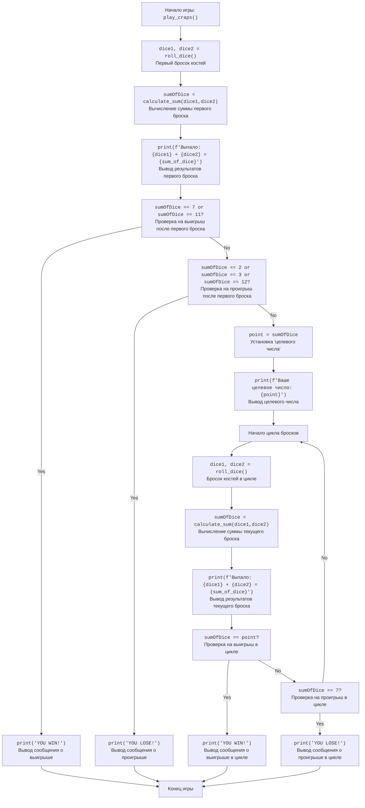

## Анализ кода игры "Крэпс"

### 1. <алгоритм>

**Блок-схема игры в "Крэпс":**

1.  **Начало игры:**
    *   Игра начинается с вызова функции `play_craps()`.

2.  **Первый бросок костей:**
    *   Вызывается функция `roll_dice()`, которая генерирует два случайных числа от 1 до 6 (значения костей) и возвращает их.
        *   *Пример:* `dice1 = 3`, `dice2 = 5`
    *   Вызывается функция `calculate_sum(dice1, dice2)`, которая вычисляет сумму значений костей.
        *   *Пример:* `sum_of_dice = 3 + 5 = 8`
    *   Выводится на экран сообщение о результате броска.
        *   *Пример:* `"Выпало: 3 + 5 = 8"`

3.  **Проверка выигрыша или проигрыша в первом броске:**
    *   Проверяется, равна ли `sum_of_dice` 7 или 11.
        *   Если да, выводится сообщение "YOU WIN!" и игра завершается.
        *   *Пример:* `sum_of_dice = 7` → Вывод: `"YOU WIN!"`
    *   Если нет, проверяется, равна ли `sum_of_dice` 2, 3 или 12.
        *   Если да, выводится сообщение "YOU LOSE!" и игра завершается.
        *   *Пример:* `sum_of_dice = 3` → Вывод: `"YOU LOSE!"`

4.  **Установка "целевого числа":**
    *   Если первый бросок не привел к выигрышу или проигрышу, значение `sum_of_dice` сохраняется как "целевое число" (point).
        *   *Пример:* `point = 8`
    *   Выводится на экран сообщение о "целевом числе".
        *   *Пример:* `"Ваше целевое число: 8"`

5.  **Цикл бросков костей:**
    *   Начинается цикл, который продолжается, пока игрок не выиграет или не проиграет.
        *   В цикле каждый раз вызывается `roll_dice()`, которая генерирует новые случайные значения для двух костей, и `calculate_sum()`, вычисляющая их сумму.
            *   *Пример:* `dice1 = 2`, `dice2 = 4` → `sum_of_dice = 6`
        *   Выводится на экран сообщение о результатах броска.
            *   *Пример:* `"Выпало: 2 + 4 = 6"`
    *   Проверяется, равна ли `sum_of_dice` "целевому числу".
        *   Если да, выводится сообщение "YOU WIN!" и игра завершается.
        *   *Пример:* `sum_of_dice = 8`, `point = 8` → Вывод: `"YOU WIN!"`
    *   Если нет, проверяется, равна ли `sum_of_dice` 7.
        *   Если да, выводится сообщение "YOU LOSE!" и игра завершается.
        *   *Пример:* `sum_of_dice = 7` → Вывод: `"YOU LOSE!"`
    *   Если ни одно из условий не выполнено, цикл продолжается.

6. **Завершение игры:**
   * Игра завершается, когда игрок выигрывает или проигрывает.

### 2. <mermaid>

**Описание зависимостей:**

*   Диаграмма начинается с `Start`, который представляет начало игры через функцию `play_craps()`.
*   Функция `roll_dice()` вызывается дважды: один раз для первого броска (`RollDice1`) и один раз внутри цикла (`RollDice2`).
*   Функция `calculate_sum(dice1, dice2)` также вызывается дважды: один раз для первого броска (`CalculateSum1`) и один раз внутри цикла (`CalculateSum2`), и оба раза принимает значения костей (`dice1`, `dice2`).
*   `sumOfDice` - переменная, в которой хранится сумма значений двух костей, вычисленная функцией `calculate_sum()`.
*   `point` - переменная, в которой хранится целевое число.
*   `OutputFirstRoll`, `OutputPoint`, `OutputRoll` выводят информацию о бросках костей и целевом числе.
*  `CheckWinFirst`, `CheckLoseFirst`, `CheckWinLoop`, `CheckLoseLoop` - это блоки проверок условий выигрыша и проигрыша.
*  `OutputWinFirst`, `OutputLoseFirst`, `OutputWinLoop`, `OutputLoseLoop` - вывод сообщений о выигрыше и проигрыше.
*   `LoopStart` указывает на начало цикла.
*   `End` обозначает конец игры.

### 3. <объяснение>

**Импорты:**

*   `import random`: Этот импорт позволяет использовать модуль `random`, который необходим для генерации случайных чисел, имитирующих броски игральных костей.

**Функции:**

*   `roll_dice()`:
    *   **Аргументы:** Нет.
    *   **Возвращаемое значение:** `dice1, dice2` (кортеж из двух целых чисел).
    *   **Назначение:** Генерирует случайные значения для двух игральных костей (от 1 до 6) и возвращает их.
    *   **Пример:** `dice1, dice2 = roll_dice()` может вернуть `dice1 = 3, dice2 = 5`.
*   `calculate_sum(dice1, dice2)`:
    *   **Аргументы:**
        *   `dice1` (целое число): Значение первой кости.
        *   `dice2` (целое число): Значение второй кости.
    *   **Возвращаемое значение:** Сумма `dice1 + dice2` (целое число).
    *   **Назначение:** Вычисляет и возвращает сумму значений двух костей.
    *   **Пример:** `sum_of_dice = calculate_sum(3, 5)` вернет `sum_of_dice = 8`.
*   `play_craps()`:
    *   **Аргументы:** Нет.
    *   **Возвращаемое значение:** Нет (функция завершается через `return`).
    *   **Назначение:** Содержит основную логику игры "Крэпс".
        *   Вызывает `roll_dice()` для первого броска.
        *   Вызывает `calculate_sum()` для вычисления суммы первого броска.
        *   Проверяет условия выигрыша (сумма 7 или 11) или проигрыша (сумма 2, 3 или 12) в первом броске.
        *   Если ни один из исходов не наступил, устанавливает "целевое число".
        *   Запускает цикл для последующих бросков, пока не будет достигнут выигрыш (сумма равна целевому числу) или проигрыш (сумма равна 7).

**Переменные:**

*   `dice1`, `dice2` (целые числа): Хранят значения отдельных костей после броска.
*   `sum_of_dice` (целое число): Хранит сумму значений двух костей.
*   `point` (целое число): Хранит целевое число, установленное после первого броска.

**Потенциальные ошибки и области для улучшения:**

*   **Нет обработки ошибок:** Код не обрабатывает возможные ошибки, такие как неверный ввод.
*   **Нет возможности для пользовательского ввода:**  Игра не позволяет пользователю взаимодействовать (например, делать ставки).
*   **Нет повторной игры:** После окончания текущей игры, нужно перезапускать программу.

**Взаимосвязи с другими частями проекта:**

*   Этот файл является самостоятельной программой для игры в "Крэпс" и не имеет прямых зависимостей с другими частями проекта.
*   Используется `random`, который является стандартным модулем Python, что не имеет прямых связей с `src`.

**Дополнительные замечания:**

*   Код хорошо структурирован и логически понятен.
*   Функции имеют ясное назначение и хорошо документированы.
*   Алгоритм игры соответствует правилам "Крэпс".