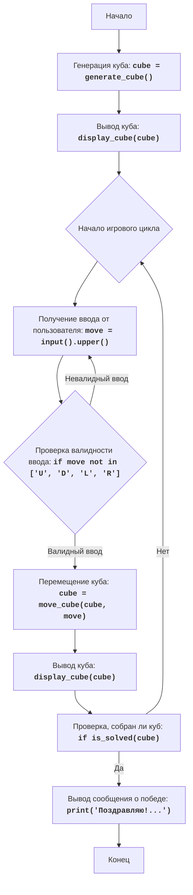

## АНАЛИЗ КОДА: CUBE GAME

### 1. <алгоритм>

**Блок-схема:**

1.  **Начало**: Программа начинает выполнение.
2.  **Инициализация куба**: Вызывается функция `generate_cube()`.
    *   Создается список `numbers` чисел от 1 до 9.
    *   Список `numbers` перемешивается случайным образом.
    *   Из перемешанного списка формируется матрица 3x3 (куб) `cube`.
    *   Пример: `numbers` = `[5, 2, 8, 1, 9, 3, 7, 4, 6]`,  `cube` = `[[5, 2, 8], [1, 9, 3], [7, 4, 6]]`
3.  **Вывод куба**: Вызывается функция `display_cube(cube)`, которая выводит текущее состояние куба на экран в виде матрицы.
    *   Пример:
        ```
        5  2  8
        1  9  3
        7  4  6
        ```
4.  **Начало игрового цикла**: Начинается бесконечный цикл `while True`, который выполняется до тех пор, пока куб не будет собран.
5.  **Ввод перемещения**: Пользователь вводит команду перемещения (U, D, L, R).
    *   Пример: Пользователь вводит "U".
6.  **Перемещение граней куба**: Вызывается функция `move_cube(cube, move)`.
    *   В зависимости от введенной команды, грани куба перемещаются.
        *   Если `move` == 'U':
            *   Верхняя строка перемещается в конец, остальные сдвигаются вверх.
            *   Пример: `cube` = `[[1, 9, 3], [7, 4, 6], [5, 2, 8]]`.
        *   Если `move` == 'D':
            *   Нижняя строка перемещается в начало, остальные сдвигаются вниз.
            *   Пример: `cube` = `[[7, 4, 6], [5, 2, 8], [1, 9, 3]]`.
        *   Если `move` == 'L':
            *   Левый столбец перемещается в конец, остальные сдвигаются влево.
            *   Пример: `cube` = `[[2, 8, 5], [9, 3, 1], [4, 6, 7]]`.
        *   Если `move` == 'R':
            *   Правый столбец перемещается в начало, остальные сдвигаются вправо.
            *   Пример: `cube` = `[[8, 5, 2], [3, 1, 9], [6, 7, 4]]`.
7.  **Вывод куба**: Вызывается функция `display_cube(cube)`, чтобы отобразить состояние куба после перемещения.
8.  **Проверка, собран ли куб**: Вызывается функция `is_solved(cube)`.
    *   Функция сравнивает текущее расположение чисел в кубе с ожидаемым `[1, 2, 3, 4, 5, 6, 7, 8, 9]`.
    *   Возвращает `True`, если куб собран, и `False` в противном случае.
9.  **Вывод сообщения о победе**: Если куб собран, выводится сообщение "Поздравляю! Вы собрали куб!".
10. **Конец**: Если куб собран, программа завершает выполнение (выход из цикла `while True`).
11. Если куб не собран, возвращаемся к шагу 4.

### 2. <mermaid>



### 3. <объяснение>

**Импорты:**

*   `import random`: Импортирует модуль `random`, который используется для генерации случайного куба. В данном случае используется `random.shuffle()` для перемешивания чисел, представляющих грани куба. Модуль `random` не относится к пакетам `src.`, это стандартная библиотека Python.

**Функции:**

1.  **`generate_cube()`**:
    *   **Назначение**: Создает случайный куб 3x3.
    *   **Аргументы**: Нет.
    *   **Возвращаемое значение**: `cube` - матрица 3x3, представляющая куб.
    *   **Пример**: `generate_cube()` может вернуть `[[5, 2, 8], [1, 9, 3], [7, 4, 6]]`.
    *   **Описание**: Создает список чисел от 1 до 9, перемешивает их случайным образом и формирует из них матрицу 3x3.
2.  **`display_cube(cube)`**:
    *   **Назначение**: Выводит текущее состояние куба на экран.
    *   **Аргументы**: `cube` - матрица 3x3.
    *   **Возвращаемое значение**: Нет.
    *   **Пример**: Выводит на экран:
        ```
        5  2  8
        1  9  3
        7  4  6
        ```
    *   **Описание**: Печатает строки матрицы `cube` в форматированном виде.
3.  **`move_cube(cube, move)`**:
    *   **Назначение**: Перемещает грани куба в соответствии с введенной командой.
    *   **Аргументы**: `cube` - текущее состояние куба, `move` - команда перемещения ('U', 'D', 'L', 'R').
    *   **Возвращаемое значение**: `cube` - матрица 3x3, представляющая куб после перемещения.
    *   **Пример**: `move_cube(cube, 'U')` выполняет сдвиг всех рядов куба вверх.
    *   **Описание**: В зависимости от команды, сдвигает строки или столбцы куба, возвращая измененный куб.
4.  **`is_solved(cube)`**:
    *   **Назначение**: Проверяет, собран ли куб.
    *   **Аргументы**: `cube` - матрица 3x3, представляющая куб.
    *   **Возвращаемое значение**: `True`, если куб собран; `False` в противном случае.
    *   **Пример**: `is_solved([[1, 2, 3], [4, 5, 6], [7, 8, 9]])` вернет `True`.
    *   **Описание**: Проверяет, что числа в кубе идут по порядку от 1 до 9.

**Переменные:**

*   `numbers`: Список целых чисел от 1 до 9, используемый для инициализации куба.
*   `cube`: Матрица 3x3 (список списков), представляющая текущее состояние куба.
*  `move`: Строка, представляющая ход пользователя ('U', 'D', 'L', 'R').
*  `actual`: Список целых чисел, представляющий куб в виде одномерного списка для проверки решения.
*  `expected`: Список целых чисел от 1 до 9, представляющий правильное решение куба.
*   `temp`: Временная переменная для хранения данных при перемещении граней куба.

**Взаимосвязи:**

1.  Функция `generate_cube()` создает начальный куб, который используется в начале игры.
2.  Функция `display_cube(cube)` используется для вывода куба как в начале игры, так и после каждого хода.
3.  Функция `move_cube(cube, move)` изменяет состояние куба в соответствии с действиями пользователя.
4.  Функция `is_solved(cube)` проверяет, завершена ли игра.

**Потенциальные ошибки и области для улучшения:**

1.  **Отсутствует проверка на ввод некорректных данных:** При вводе пользователем некорректных данных, кроме U,D,L,R  выводится лишь предупреждение "Неверный ход". Можно добавить защиту от ошибок ввода (например,  try-except для обработки ошибок при вводе).
2.  **Нет визуализации игры:** Игра выводится только как текст в консоль. Можно улучшить, добавив графический интерфейс.
3.  **Нет возможности откатить ход:**  Если пользователь совершил ошибку, он не может откатить ход. Можно добавить возможность отмены предыдущего хода.
4.  **Нет проверки на возможность решения:**  Не все начальные конфигурации куба могут быть решены. Можно добавить проверку на решаемость куба.

**Взаимосвязи с другими частями проекта:**

Этот код представляет собой отдельную игру, которая не зависит от других частей проекта. Она является частью набора простых компьютерных игр.