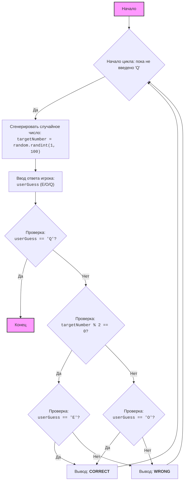

## <алгоритм>

**Алгоритм работы программы "Четное число"**:

1.  **Начало**: Запуск программы.
2.  **Бесконечный цикл**: Программа входит в бесконечный цикл, который будет выполняться до тех пор, пока пользователь не введет 'Q' для выхода.
3.  **Генерация случайного числа**:
    *   Компьютер генерирует случайное целое число в диапазоне от 1 до 100 (например, `targetNumber = 42`).
4.  **Запрос ввода пользователя**:
    *   Программа запрашивает у пользователя ввод: 'E' (четное), 'O' (нечетное) или 'Q' (выход).
    *   Пользователь вводит, например, `'E'` (пользователь считает, что число четное)
5.  **Проверка выхода**:
    *   Проверяется, ввел ли пользователь 'Q'.
    *   **Если введено 'Q'**: Выводится сообщение "Выход из игры." и программа завершается.
        *   _Пример_: `userGuess == 'Q'`, программа завершается.
    *   **Если не введено 'Q'**: Переход к следующему шагу.
6.  **Проверка четности**:
    *   Проверяется, является ли сгенерированное число четным (`targetNumber % 2 == 0`).
    *   **Если число четное** (например, `42 % 2 == 0`):
        *   Проверяется, ввел ли пользователь 'E'.
        *   **Если пользователь ввел 'E'**: Выводится "CORRECT" (пользователь угадал).
            *   _Пример_: `userGuess == 'E'`, выводится "CORRECT".
        *   **Если пользователь ввел 'O'**: Выводится "WRONG" (пользователь не угадал).
            *   _Пример_: `userGuess == 'O'`, выводится "WRONG".
    *   **Если число нечетное** (например, `targetNumber = 37; 37 % 2 != 0`):
        *   Проверяется, ввел ли пользователь 'O'.
        *   **Если пользователь ввел 'O'**: Выводится "CORRECT" (пользователь угадал).
            *    _Пример_: `userGuess == 'O'`, выводится "CORRECT".
        *   **Если пользователь ввел 'E'**: Выводится "WRONG" (пользователь не угадал).
            *   _Пример_: `userGuess == 'E'`, выводится "WRONG".
7.  **Переход к началу цикла**: Возврат к шагу 2, чтобы начать новую игру, если пользователь не вышел.

## <mermaid>

**Описание диаграммы `mermaid`:**

*   **Start**: Начало программы.
*   **LoopStart**: Начало бесконечного цикла, который продолжается, пока пользователь не введет 'Q'.
*   **GenerateNumber**: Генерирует случайное целое число от 1 до 100, сохраняя его в переменной `targetNumber`. Используется функция `random.randint(1, 100)`.
*   **InputGuess**: Запрашивает у пользователя ввод 'E' (четное), 'O' (нечетное) или 'Q' (выход) и сохраняет ввод в переменной `userGuess`.
*   **CheckQuit**: Проверяет, равно ли значение переменной `userGuess` символу 'Q'.
*   **End**: Конец программы, если пользователь ввел 'Q'.
*   **CheckEven**: Проверяет, является ли число, хранящееся в переменной `targetNumber`, четным, используя оператор `% 2 == 0`.
*   **CheckUserEven**: Проверяет, ввел ли пользователь 'E' (четное), если число четное.
*   **CheckUserOdd**: Проверяет, ввел ли пользователь 'O' (нечетное), если число нечетное.
*   **OutputCorrect**: Выводит сообщение "CORRECT", если пользователь угадал четность числа.
*   **OutputWrong**: Выводит сообщение "WRONG", если пользователь не угадал четность числа.
*   **Стрелки**: Показывают порядок выполнения операций.

**Зависимости:**

*   `random`:  Используется для генерации случайного числа. Зависимостей от других частей проекта `src` нет.

## <объяснение>

**Объяснение кода:**

**1. Импорты:**

*   `import random`:
    *   **Назначение**: Импортирует модуль `random`, который предоставляет функции для генерации случайных чисел.
    *   **Взаимосвязь с `src`**: Этот модуль является частью стандартной библиотеки Python и не связан с пользовательскими пакетами в каталоге `src`.

**2.  Основной цикл `while True:`:**

*   `while True:`:
    *   **Назначение**: Создаёт бесконечный цикл, который позволяет игроку играть до тех пор, пока он не решит выйти (введя 'Q').
    *   **Тип**: Бесконечный цикл `while`.

**3.  Переменные:**

*   `targetNumber = random.randint(1, 100)`:
    *   **Назначение**: Сохраняет случайно сгенерированное целое число от 1 до 100.
    *   **Тип**: `int` (целое число).
    *   **Использование**: Используется для проверки четности и сравнения с выбором пользователя.
*   `userGuess = input("Введите \'E\' для четного, \'O\' для нечетного, \'Q\' для выхода: ").upper()`:
    *   **Назначение**: Сохраняет ввод пользователя (букву 'E', 'O', или 'Q'). Метод `.upper()` преобразует введенный текст в верхний регистр.
    *   **Тип**: `str` (строка).
    *   **Использование**: Используется для проверки выбора пользователя и определения, следует ли продолжать игру или выйти.

**4.  Логика игры:**

*   `if userGuess == 'Q':`:
    *   **Назначение**: Проверяет, ввел ли пользователь 'Q' для выхода из игры.
    *   **Возвращаемое значение**: Логическое значение (`True` или `False`).
    *   **Пример**: Если `userGuess` равно "Q", программа завершает цикл.
*   `if (targetNumber % 2 == 0 and userGuess == 'E') or (targetNumber % 2 != 0 and userGuess == 'O'):`:
    *   **Назначение**: Проверяет, угадал ли пользователь четность сгенерированного числа. Если `targetNumber` четное и `userGuess` равно 'E', либо `targetNumber` нечетное и `userGuess` равно 'O'.
    *   **Возвращаемое значение**: Логическое значение (`True` или `False`).
    *   **Пример**: Если `targetNumber` равно 10 (четное) и `userGuess` равно "E", или если `targetNumber` равно 15 (нечетное) и `userGuess` равно "O", то условие верно.
*   `print("CORRECT")`:
    *   **Назначение**: Выводит сообщение "CORRECT", если пользователь угадал.
*   `print("WRONG")`:
    *   **Назначение**: Выводит сообщение "WRONG", если пользователь не угадал.
*   `break`:
    *   **Назначение**: Прерывает выполнение текущего цикла `while True`.
    *   **Использование**: Используется для выхода из игры, когда пользователь вводит 'Q'.

**Потенциальные ошибки и области для улучшения:**

*   **Обработка неверного ввода:** Программа не обрабатывает случаи, когда пользователь вводит что-либо, кроме 'E', 'O' или 'Q'. Это можно улучшить, добавив проверку на некорректный ввод.
*   **Интерфейс**: Можно улучшить интерфейс пользователя, добавив больше информационных сообщений, например, отображение текущего раунда игры.
*   **Уровни сложности**: Можно добавить уровни сложности, например, меняя диапазон генерируемых чисел.
*  **Локализация**: Можно добавить поддержку локализации для сообщений игры.

**Цепочка взаимосвязей с другими частями проекта:**

В данном коде не используется никаких пользовательских пакетов или модулей из каталога `src`, поэтому он не имеет прямых взаимосвязей с другими частями проекта.