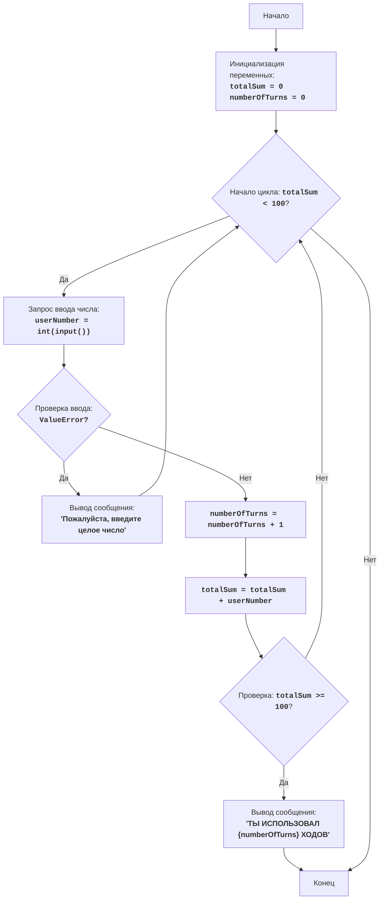

# АНАЛИЗ КОДА: fipfop.py

## <алгоритм>

1. **Инициализация:**
   - `totalSum` устанавливается в `0`. (Пример: `totalSum = 0`)
   - `numberOfTurns` устанавливается в `0`. (Пример: `numberOfTurns = 0`)

2. **Начало цикла `while totalSum < 100`:**
   - Проверяется, меньше ли текущая `totalSum` 100.
    - Если `totalSum < 100` (например, `totalSum = 50`), переходим к шагу 3.
    - Если `totalSum >= 100` (например, `totalSum = 100`), переходим к шагу 6.

3. **Ввод числа:**
   - Пользователю предлагается ввести целое число.
   - Попытка преобразовать ввод в целое число (int).
     - Если ввод удачен, сохраняем значение в `userNumber` (например, `userNumber = 25`).
     - Если ввод не удачен (не целое число), выводится сообщение об ошибке, и цикл переходит к следующей итерации.

4. **Увеличение счетчика ходов:**
   -  Значение `numberOfTurns` увеличивается на 1. (Пример: `numberOfTurns = 1`)

5. **Добавление числа к сумме:**
   -  Значение `userNumber` добавляется к `totalSum`. (Пример: `totalSum = 0 + 25 = 25`)
   - Возвращаемся к шагу 2.

6. **Вывод результата:**
   - После завершения цикла (когда `totalSum >= 100`) выводится сообщение "ТЫ ИСПОЛЬЗОВАЛ {numberOfTurns} ХОДОВ" с общим количеством ходов. (Пример: "ТЫ ИСПОЛЬЗОВАЛ 4 ХОДОВ").

## <mermaid>

**Описание диаграммы `mermaid`:**

1.  `Start`: Начало программы.
2.  `InitializeVariables`: Инициализация переменных `totalSum` и `numberOfTurns` нулями.
3.  `LoopStart`: Проверка условия `totalSum < 100`.
4.  `InputNumber`: Запрос у пользователя ввода целого числа, попытка преобразовать его.
5.  `CheckInput`: Проверка на ошибку `ValueError` при вводе (не целое число).
6.  `ErrorMessage`: Вывод сообщения об ошибке, если ввод не является целым числом.
7.  `IncreaseTurns`: Увеличение счетчика `numberOfTurns` на 1.
8.  `AddNumber`: Добавление введенного числа `userNumber` к сумме `totalSum`.
9.  `CheckSum`: Проверка условия `totalSum >= 100` для завершения цикла.
10. `OutputTurns`: Вывод сообщения с общим количеством ходов, если `totalSum >= 100`.
11. `End`: Конец программы.

**Зависимости импорта:**

В данном коде нет импортов. Код использует только встроенные функции Python.

## <объяснение>

1.  **Импорты**:
    - В этом коде нет явных импортов других модулей или пакетов. Он использует встроенные функции Python, такие как `input()`, `int()`, `print()`.

2.  **Классы**:
    - В этом коде не используются классы. Это простой скрипт, который решает задачу с помощью глобальных переменных и цикла.

3.  **Функции**:
    -   `input(prompt)`: Встроенная функция Python, которая выводит строку `prompt` (в данном случае "Введите число: ") и ожидает ввода пользователя, возвращая введенную строку.
    -   `int(x)`: Встроенная функция Python, которая преобразует значение `x` к целочисленному типу. Возбуждает исключение ValueError, если преобразование невозможно.
    -   `print(...)`: Встроенная функция Python, которая выводит на экран текст или значения.
   
4.  **Переменные**:
    -   `totalSum`: Целочисленная переменная, хранящая текущую сумму введенных чисел. Инициализируется как 0.
    -   `numberOfTurns`: Целочисленная переменная, хранящая количество ходов, сделанных игроком. Инициализируется как 0.
    -   `userNumber`: Целочисленная переменная, хранящая число, введенное пользователем на текущем ходу.

5. **Взаимосвязь и поток данных:**
   -  Скрипт начинается с инициализации переменных `totalSum` и `numberOfTurns`.
   -  Затем выполняется цикл `while`, пока `totalSum` не достигнет 100.
   -  Внутри цикла пользователю предлагается ввести число, которое сохраняется в `userNumber`.
   -  Если ввод корректен (целое число), `numberOfTurns` увеличивается на 1, и `userNumber` добавляется к `totalSum`.
   -  Цикл повторяется, пока `totalSum` не станет больше или равна 100.
   -  После завершения цикла выводится сообщение о количестве ходов, сделанных игроком.

6. **Потенциальные ошибки и улучшения:**
   -   **Обработка ошибок ввода:** Код обрабатывает `ValueError` при вводе нецелого числа, выводя сообщение об ошибке, но можно было бы добавить больше вариантов обработки.
   -   **Проверка на ввод отрицательного числа:** В текущей версии кода не проверяется, введено ли отрицательное число. Это может не соответствовать ожиданиям игры (ввод только положительных чисел).

7. **Цепочка взаимосвязей:**
    -  Этот скрипт является самостоятельным и не зависит от других частей проекта. Это простая игра, которая не использует внешние модули, поэтому нет цепочки взаимосвязей с другими частями проекта.