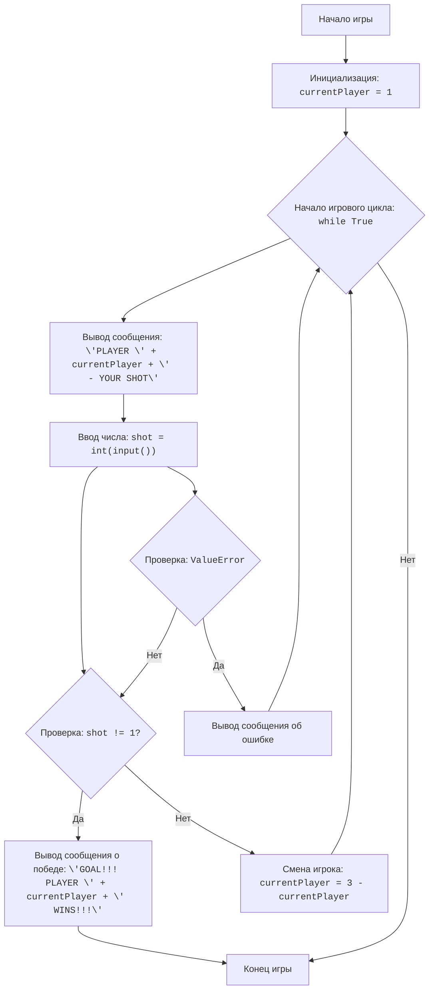

## Анализ кода игры "Футбол"

### <алгоритм>
1.  **Инициализация:**
    *   Устанавливаем переменную `currentPlayer` в значение 1. Это означает, что начинает игру первый игрок.
    *   *Пример:* `currentPlayer = 1`
2.  **Начало игрового цикла:**
    *   Запускается бесконечный цикл `while True`, который продолжается до тех пор, пока один из игроков не забьёт гол.
3.  **Вывод сообщения о ходе текущего игрока:**
    *   Выводится сообщение в формате "PLAYER [номер игрока] --- YOUR SHOT", где [номер игрока] - значение переменной `currentPlayer`.
    *   *Пример:* Если `currentPlayer` равен 1, то будет выведено "PLAYER 1 --- YOUR SHOT".
4.  **Запрос ввода числа от игрока:**
    *   Запрашивается у пользователя ввод числа от 1 до 10, представляющего собой попытку удара по воротам.
    *   *Пример:* Пользователь вводит "5", это значение будет сохранено в переменной `shot`.
    *   Обработка исключения: Если ввод не является числом, выводится сообщение об ошибке и цикл продолжается с начала.
5.  **Проверка, был ли забит гол:**
    *   Проверяется, равно ли значение переменной `shot` 1.
    *   Если `shot` не равно 1 (то есть, любое другое число от 2 до 10), то считается, что игрок забил гол.
    *   *Пример:* Если `shot` равно 5, выполняется условие `shot != 1`.
6.  **Вывод сообщения о победе:**
    *   Выводится сообщение в формате "GOAL!!! PLAYER [номер игрока] WINS!!!", где [номер игрока] - значение переменной `currentPlayer`.
    *   Игра завершается оператором `break`.
    *    *Пример:* Если `currentPlayer` равен 2, то будет выведено "GOAL!!! PLAYER 2 WINS!!!".
7.  **Смена игрока:**
    *   Если гола не было (то есть, `shot` равно 1), то меняется текущий игрок на противоположного с помощью выражения `currentPlayer = 3 - currentPlayer`.
    *   *Пример:* Если `currentPlayer` равен 1, то он станет равен `3 - 1 = 2`, и наоборот.
8.  **Возврат к шагу 3:**
    *   Цикл возвращается к началу (шаг 3), и следующий игрок делает свой ход.

### <mermaid>


**Объяснение диаграммы `mermaid`:**

*   **Start:** Начало программы.
*   **InitializePlayer:** Инициализирует переменную `currentPlayer`, которая отслеживает, какой игрок сейчас ходит, присваивая ей значение 1.
*   **GameLoopStart:** Начало бесконечного цикла `while True`, который будет повторяться, пока не будет забит гол.
*   **OutputPlayerTurn:** Выводит сообщение на экран, информирующее о том, чей сейчас ход (какого игрока).
*   **InputShot:** Запрашивает у текущего игрока ввод числа от 1 до 10, которое сохраняется в переменную `shot`.
*   **CheckValueError:** Проверяет наличие ошибки типа `ValueError`. Если ввод пользователя не является числом.
    *   Если **Да**, то выполняется ветвь `PrintError`.
    *   Если **Нет**, то выполняется ветвь `CheckShot`.
*   **PrintError:** Выводит на экран сообщение об ошибке, и после этого, цикл продолжается с начала (`GameLoopStart`).
*   **CheckShot:** Проверяет, равно ли введенное пользователем число `shot` 1.
    *   Если **Да** (то есть, `shot` не равно 1), выполняется ветвь `OutputWin`.
    *   Если **Нет**, выполняется ветвь `SwitchPlayer`.
*   **OutputWin:** Выводит сообщение о победе текущего игрока и завершает программу.
*   **SwitchPlayer:** Меняет текущего игрока на противоположного с помощью выражения `currentPlayer = 3 - currentPlayer`.
*    **End:** Конец программы.

### <объяснение>

**Импорты:**

*   В данном коде нет импортов. Это простая игра, не требующая использования внешних библиотек или модулей.

**Классы:**

*   В данном коде нет классов.

**Функции:**

*   В коде нет пользовательских функций. Весь код расположен в глобальной области видимости.

**Переменные:**

*   `currentPlayer`: Целочисленная переменная, представляющая текущего игрока (1 или 2). Изначально установлена в 1.
*   `shot`: Целочисленная переменная, хранящая ввод игрока, представляющий попытку удара (число от 1 до 10).

**Подробное объяснение:**

1.  **Инициализация игрока:** `currentPlayer = 1` - устанавливает начальное значение текущего игрока, начинает игрок под номером 1.

2.  **Игровой цикл `while True`:**
    *   Цикл выполняется до тех пор, пока не произойдет выход из цикла с помощью `break`, то есть, когда будет забит гол.
    *   **Вывод сообщения:** `print(f"PLAYER {currentPlayer} --- YOUR SHOT")` выводит сообщение, показывающее, чей ход.
    *   **Ввод числа:**
        *   `try...except ValueError`: Это блок try-except обрабатывает возможные ошибки ввода. Если пользователь введет не целое число, то будет выведено сообщение об ошибке, и цикл начнется снова.
        *   `shot = int(input("Введите число от 1 до 10: "))` - запрашивает у игрока ввод числа и преобразует его в целое число.
    *   **Проверка гола:** `if shot != 1:` проверяет, является ли введенное число голом (если оно не равно 1).
        *   Если гол: `print(f"GOAL!!! PLAYER {currentPlayer} WINS!!!")` выводит сообщение о победе и `break` завершает цикл.
    *   **Смена игрока:** `currentPlayer = 3 - currentPlayer` меняет текущего игрока на противоположного (1 на 2, 2 на 1).

**Потенциальные ошибки и области для улучшения:**

1.  **Валидация ввода:** В текущем коде не проверяется, находится ли введенное число в диапазоне от 1 до 10. Пользователь может ввести любое целое число, что может привести к некорректному поведению программы. Можно добавить дополнительную проверку, чтобы убедиться, что `shot` находится в правильном диапазоне, например:
    ```python
        while True:
            try:
                shot = int(input("Введите число от 1 до 10: "))
                if not 1 <= shot <= 10:
                    print("Пожалуйста, введите число от 1 до 10.")
                    continue
                break  # Выход из цикла, если ввод корректный
            except ValueError:
                print("Пожалуйста, введите целое число.")
        ```

2.  **Сообщения:** Можно добавить более информативные сообщения, например, сообщать, что удар не достиг цели, если введено число 1.

3.  **Функциональность:** Можно расширить игру, добавив количество попыток или счет игры.

**Цепочка взаимосвязей с другими частями проекта:**

*   Данный код - это отдельная игра, и он не зависит от других частей проекта. Это самостоятельный файл, реализующий простую текстовую игру.