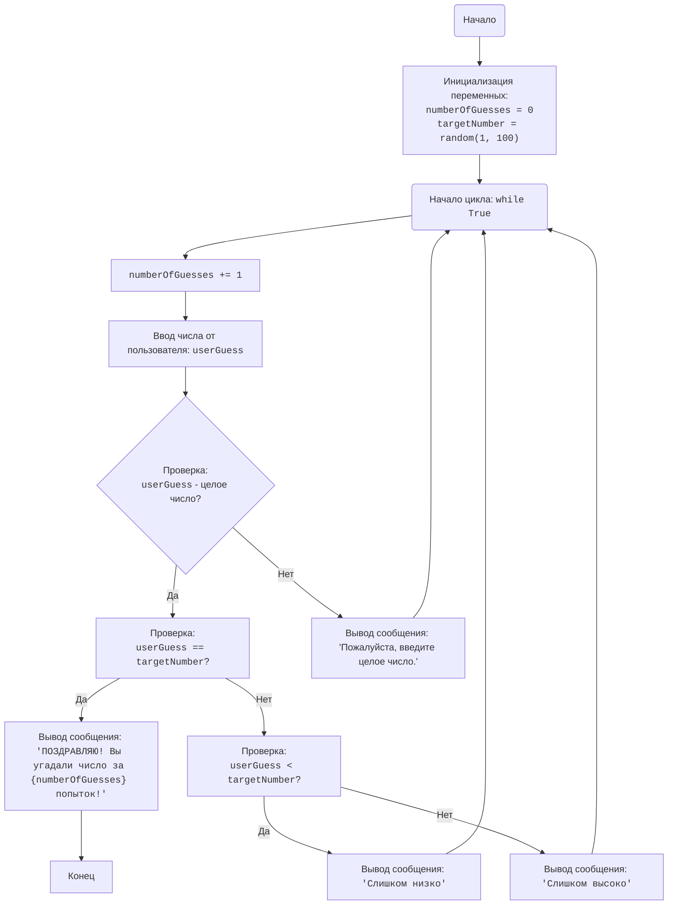

## <алгоритм>

1.  **Инициализация**:
    *   Установить `numberOfGuesses` = 0.
        *   *Пример*: `numberOfGuesses` начинается с 0, так как игрок еще не сделал ни одной попытки.
    *   Сгенерировать случайное `targetNumber` в диапазоне от 1 до 100.
        *   *Пример*: `targetNumber` может быть 42.
2.  **Начало цикла**:
    *   Начать цикл `while True` (бесконечный цикл), который будет выполняться, пока игрок не угадает число.
3.  **Увеличение попыток**:
    *   `numberOfGuesses` += 1.
        *   *Пример*: Если `numberOfGuesses` было 0, то станет 1.
4.  **Запрос ввода**:
    *   Запросить у игрока `userGuess` число от 1 до 100.
        *   *Пример*: Игрок вводит 50.
    *   Проверить, является ли ввод числом. Если нет, вывести сообщение об ошибке и перейти к началу цикла.
5.  **Проверка равенства**:
    *   Проверить: `userGuess` == `targetNumber`?
        *   *Пример*: Если `userGuess` = 50, `targetNumber` = 42, условие не выполняется.
        *   *Пример*: Если `userGuess` = 42, `targetNumber` = 42, условие выполняется.
    *   Если **ДА**:
        *   Вывести сообщение о победе: "YOU GOT IT IN {`numberOfGuesses`} GUESSES!".
            *   *Пример*: Выведет: "YOU GOT IT IN 3 GUESSES!"
        *   Завершить цикл (`break`).
        *   Перейти к шагу 8 (Конец).
    *   Если **НЕТ**:
        *   Перейти к следующей проверке.
6.  **Проверка "слишком низко"**:
    *   Проверить: `userGuess` < `targetNumber`?
        *   *Пример*: Если `userGuess` = 30, `targetNumber` = 42, условие выполняется.
        *   *Пример*: Если `userGuess` = 50, `targetNumber` = 42, условие не выполняется.
    *   Если **ДА**:
        *   Вывести сообщение "TOO LOW".
            *   *Пример*: Выведет: "TOO LOW".
        *   Перейти к шагу 2 (Начало цикла).
    *   Если **НЕТ**:
        *   Перейти к следующей проверке.
7. **Проверка "слишком высоко"**:
    *   Вывести сообщение "TOO HIGH".
        *   *Пример*: Выведет: "TOO HIGH".
    *   Перейти к шагу 2 (Начало цикла).
8.  **Конец**:
    *   Завершение игры.

## <mermaid>

**Описание `mermaid` диаграммы:**

*   **Start**: Начало программы.
*   **InitializeVariables**: Инициализация переменных `numberOfGuesses` (количество попыток) и `targetNumber` (случайное число). Использует функцию `random.randint(1,100)` из модуля `random` для генерации случайного числа.
*  **LoopStart**: Начало бесконечного цикла `while True`.
*   **IncreaseGuesses**: Увеличивает счетчик количества попыток (`numberOfGuesses`).
*   **InputGuess**: Запрашивает ввод числа у пользователя и сохраняет его в `userGuess`.
*   **CheckInputType**: Проверяет, является ли ввод пользователя целым числом.
*   **InputError**: Выводит сообщение об ошибке, если ввод пользователя не является целым числом.
*   **CheckGuess**: Проверяет, равно ли введенное число `userGuess` загаданному числу `targetNumber`.
*   **OutputWin**: Выводит сообщение о победе, если числа равны, с указанием количества попыток.
*   **End**: Конец программы.
*   **CheckLow**: Проверяет, меньше ли введенное число `userGuess` загаданного числа `targetNumber`.
*   **OutputLow**: Выводит сообщение "Слишком низко", если введенное число меньше загаданного.
*   **OutputHigh**: Выводит сообщение "Слишком высоко", если введенное число больше загаданного.

**Зависимости:**

*   `random`:  Импортируется для генерации случайного числа `targetNumber` с помощью функции `random.randint(1, 100)`.

## <объяснение>

### Импорты

*   **`import random`**:
    *   **Назначение**: Модуль `random` используется для генерации псевдослучайных чисел. В данном коде он используется для генерации случайного числа, которое игрок должен угадать.
    *   **Взаимосвязь с другими пакетами**: Не взаимодействует с другими пакетами `src.`. Является стандартной библиотекой Python.

### Переменные

*   **`numberOfGuesses`**:
    *   **Тип**: Целое число (`int`).
    *   **Использование**: Счетчик попыток игрока. Инициализируется значением 0 в начале игры и увеличивается на 1 с каждой попыткой.
*   **`targetNumber`**:
    *   **Тип**: Целое число (`int`).
    *   **Использование**: Случайное число, которое игрок должен угадать. Генерируется один раз в начале игры с использованием `random.randint(1, 100)`.
*   **`userGuess`**:
    *   **Тип**: Целое число (`int`).
    *   **Использование**: Число, которое игрок вводит с клавиатуры. Получается с помощью функции `input()`.

### Функции

*   **`random.randint(a, b)`**:
    *   **Аргументы**:
        *   `a`: Нижняя граница диапазона (включительно).
        *   `b`: Верхняя граница диапазона (включительно).
    *   **Возвращаемое значение**: Случайное целое число в диапазоне от `a` до `b`.
    *   **Назначение**: Генерирует случайное целое число, которое используется в качестве загаданного числа для игры.
    *   **Пример**: `random.randint(1, 100)` может вернуть любое целое число от 1 до 100, например, 42, 7, 99.

*   **`input(prompt)`**:
    *   **Аргументы**:
        *   `prompt`: Строка, которая выводится пользователю перед вводом.
    *   **Возвращаемое значение**: Строка, введенная пользователем.
    *   **Назначение**: Позволяет получить данные от пользователя через консоль.
    *   **Пример**: `input("Угадай число от 1 до 100: ")` выводит сообщение "Угадай число от 1 до 100: " и ждет ввода пользователя. Введенное значение возвращается в виде строки.

*  **`int(x)`**:
    *  **Аргументы**:
        *   `x`: Строка или число, которое нужно преобразовать в целое число.
    *  **Возвращаемое значение**: Целое число, полученное из аргумента.
    *  **Назначение**: Преобразует строку, полученную от `input()` в целое число.
    *  **Пример**: `int("50")` вернет целое число `50`.

### Классы
В данном коде классы не используются.

### Потенциальные ошибки и области для улучшения

*   **Обработка нечислового ввода**:
    *   Код уже обрабатывает `ValueError`, но можно добавить более подробные сообщения для пользователя.
    *   Вместо того чтобы просто просить ввести целое число можно использовать `isdigit()` для более точной проверки
    *  Обработку ошибок можно вынести в отдельную функцию для улучшения читаемости кода
*   **Сложность игры**:
    *   Можно добавить возможность выбора диапазона чисел.
    *   Можно добавить уровень сложности, который будет влиять на количество попыток.
*   **Рефакторинг**:
    *   Основную логику игры можно вынести в отдельную функцию.
*   **UI**:
    *   Можно добавить графический интерфейс для улучшения взаимодействия с пользователем.
* **Дополнительные правила**
    *   Можно добавить проверку на ввод числа вне диапазона от 1 до 100.

### Взаимосвязи с другими частями проекта
Данный код представляет собой отдельную игру и не имеет прямых взаимосвязей с другими частями проекта, если не считать общие правила оформления.

В целом, код написан понятно и соответствует поставленной задаче.