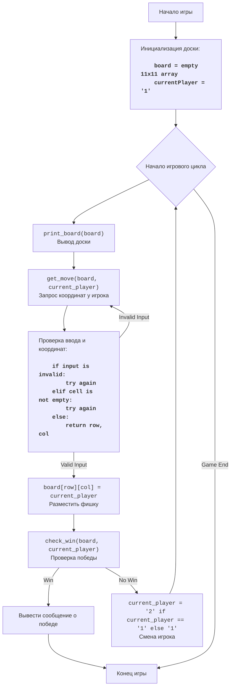

##  АНАЛИЗ КОДА: `hex.py`

### <алгоритм>
**1. Инициализация:**
   - Создается пустая игровая доска `board` размером 11x11, представляющая собой двумерный список, заполненный пробелами (" ").
     - Пример: `board = [[' ', ' ', ' ', ...], [' ', ' ', ' ', ...], ...]`.
   - Устанавливается начальный игрок `current_player` равным "1".

**2. Основной игровой цикл (пока не будет победителя):**
   - **2.1. Вывод доски:** Функция `print_board(board)` выводит текущее состояние игровой доски.
     - Пример: Вывод текущего состояния доски на экран.
   - **2.2. Получение хода:** Функция `get_move(board, current_player)` запрашивает у текущего игрока координаты для хода.
     - Пример: Игрок вводит "A1".
   - **2.3. Проверка ввода:**
     - Функция `get_move` проверяет, что ввод соответствует формату (например, "A1") и что координаты находятся в пределах доски.
     - Если ввод некорректный, выводится сообщение об ошибке, и игрок снова вводит координаты.
   - **2.4. Проверка клетки:**
     - Функция `get_move` проверяет, что выбранная клетка свободна. Если клетка занята, выводится сообщение об ошибке и игрок снова вводит координаты.
   - **2.5. Размещение фишки:**
     - В массиве `board`  в клетку с индексами `[row][col]` ставится фишка текущего игрока `current_player`.
        - Пример: `board[0][0]` присваивается `1`.
   - **2.6. Проверка выигрыша:**
     - Функция `check_win(board, current_player)` проверяет, выиграл ли текущий игрок.
       - Для игрока "1" проверяется, существует ли путь от левой стороны доски к правой, по занятым фишкам.
       - Для игрока "2" проверяется, существует ли путь от верхней стороны доски к нижней, по занятым фишкам.
       - Если игрок выиграл:
         - выводится сообщение о победе.
         - игра завершается.
   - **2.7. Смена игрока:**
      - Если нет победителя, текущий игрок меняется на противоположного (с "1" на "2" или с "2" на "1").
        - Пример: `current_player` изменяется с `1` на `2`.
      - Возврат к началу игрового цикла (шаг 2.1).

**3. Завершение игры:**
   - После выигрыша одного из игроков выводится сообщение о победе.
   - Игра завершается.

**Поток данных:**
```
   Начало игры
        ↓
   Инициализация доски (board) и текущего игрока (current_player)
        ↓
   Цикл:
        ↓
   print_board(board): Вывод доски
        ↓
   get_move(board, current_player): Получение хода игрока (row, col)
        ↓
   Размещение фишки на доске board[row][col] = current_player
        ↓
   check_win(board, current_player): Проверка на победу
        ↓
   Если победа: Вывод сообщения и конец игры
        ↓
   Если нет победы: Смена игрока (current_player)
        ↓
   Повторение цикла
```

### <mermaid>



### <объяснение>

**Импорты:**
   - `import sys`:
     -  Импортирует модуль `sys`, который обычно используется для работы с системными параметрами и функциями, такими как выход из программы (`sys.exit()`). В данном коде `sys` не используется, этот импорт можно удалить.

**Функции:**
   - `print_board(board)`:
     -  **Аргументы**:
         -  `board` (list of lists):  Двумерный список, представляющий игровую доску.
      -   **Возвращает**: Ничего (None).
     -   **Назначение**: Выводит текущее состояние игровой доски в консоль, с обозначениями строк (цифрами) и столбцов (буквами).
     -   **Пример**:
         - `print_board([[' ', '1', ' '], ['2', ' ', ' '], [' ', ' ', '1']])` выведет доску в консоль.

   - `get_move(board, player)`:
      - **Аргументы**:
           - `board` (list of lists):  Игровая доска.
           - `player` (str): Текущий игрок ("1" или "2").
      - **Возвращает**: tuple(int, int).  Кортеж, содержащий координаты `row` (строку) и `col` (столбец) хода игрока.
     -  **Назначение**: Запрашивает у игрока координаты для хода, проверяет корректность ввода и доступность клетки.
     -  **Пример**:
         -   `get_move(board, "1")` может вернуть `(0, 0)` при вводе "A1" (индексы строк и столбцов).

   - `check_win(board, player)`:
       -  **Аргументы**:
           - `board` (list of lists):  Игровая доска.
           - `player` (str): Текущий игрок ("1" или "2").
       -  **Возвращает**: `bool`. `True`, если игрок выиграл, `False` в противном случае.
       - **Назначение**: Проверяет, выиграл ли игрок, используя поиск в глубину (`dfs`).
        - **Пример**:
           - `check_win(board, "1")` может вернуть `True`, если игрок "1" соединил левую и правую стороны, или `False` если не соединил.
           - `is_valid(row, col)`: локальная функция, проверяющая, что координаты `row`, `col` находятся в пределах доски.
           - `dfs(row, col, visited, player)`: рекурсивная функция поиска в глубину, которая проверяет, есть ли путь от начальной точки до противоположной стороны.
             - Если путь для игрока 1 найден, то функция возвращает `True`
             - Если путь для игрока 2 найден, то функция возвращает `True`
             - Если путь не найден, то функция возвращает `False`

   - `play_hex()`:
      -   **Аргументы**: Нет.
      -   **Возвращает**: Ничего (None).
      -   **Назначение**: Основная функция, управляющая игровым процессом: инициализирует доску, обрабатывает ходы игроков, проверяет выигрыш и управляет сменой игроков.
      -   **Пример**:  `play_hex()` запускает игру, пока один из игроков не выиграет.

**Переменные:**
   -   `board` (list of lists): Двумерный список, представляющий текущее состояние доски (игровую сетку).
   -   `current_player` (str): Строка, представляющая текущего игрока ("1" или "2").
   -   `board_size` (int): Размер доски (11x11), константа.
   -   `row`, `col` (int): Координаты хода игрока, используемые как индексы массива.
   - `move` (str): Ввод пользователя (например, "A1").
   - `directions` (list of tuples): Возможные направления для поиска в глубину `dfs`.
   - `visited` (set of tuples): Множество для отслеживания посещенных клеток во время поиска в глубину.

**Потенциальные ошибки и улучшения:**
   -   **Удалить неиспользуемый импорт**: Импорт `sys` не используется и может быть удален.
    -   **Улучшить обработку ввода**: Можно улучшить обработку некорректного ввода, например, запрашивать ввод до тех пор, пока он не будет корректным.
    -   **Рефакторинг**: Можно разбить функцию `check_win` на более мелкие, что улучшит читаемость кода.
   -   **Добавить подсказки**: Можно добавить более подробные подсказки для пользователей, например, выводя текущие ходы.

**Взаимосвязи с другими частями проекта:**
-   Данный файл является самостоятельной игрой и не имеет прямых зависимостей от других частей проекта, за исключением стандартных модулей Python. Однако, предполагается, что он расположен в каталоге `src/ai/helicone/ai_games/101_basic_computer_games/en/HEX/`, следуя структуре проекта.