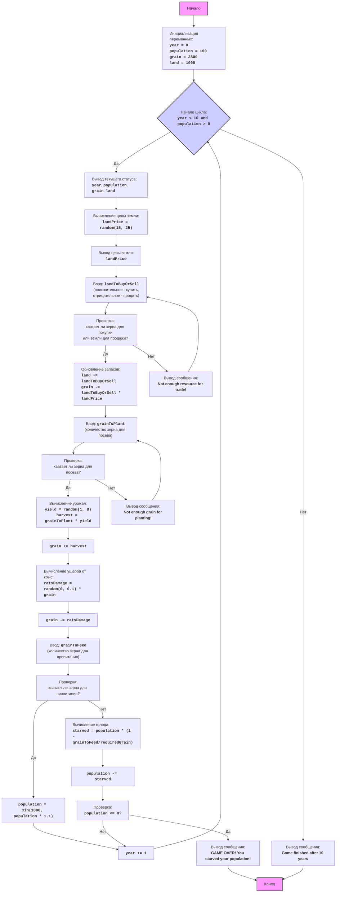
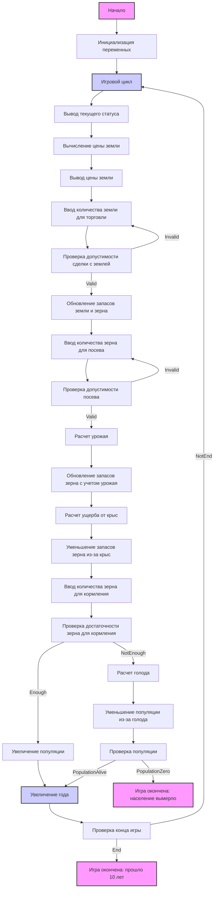

## ИНСТРУКЦИЯ:

Анализируй предоставленный код подробно и объясни его функциональность. Ответ должен включать три раздела:  

1. **<алгоритм>**: Опиши рабочий процесс в виде пошаговой блок-схемы, включая примеры для каждого логического блока, и проиллюстрируй поток данных между функциями, классами или методами.  
2. **<mermaid>**: Напиши код для диаграммы в формате `mermaid`, проанализируй и объясни все зависимости, 
    которые импортируются при создании диаграммы. 
    **ВАЖНО!** Убедитесь, что все имена переменных, используемые в диаграмме `mermaid`, 
    имеют осмысленные и описательные имена. Имена переменных вроде `A`, `B`, `C`, и т.д., не допускаются!  
    
    **Дополнительно**: Если в коде есть импорт `import header`, добавьте блок `mermaid` flowchart, объясняющий `header.py`:\
    ```mermaid
    flowchart TD
        Start --> Header[<code>header.py</code><br> Determine Project Root]
    
        Header --> import[Import Global Settings: <br><code>from src import gs</code>] 
    ```

3. **<объяснение>**: Предоставьте подробные объяснения:  
   - **Импорты**: Их назначение и взаимосвязь с другими пакетами `src.`.  
   - **Классы**: Их роль, атрибуты, методы и взаимодействие с другими компонентами проекта.  
   - **Функции**: Их аргументы, возвращаемые значения, назначение и примеры.  
   - **Переменные**: Их типы и использование.  
   - Выделите потенциальные ошибки или области для улучшения.  

Дополнительно, постройте цепочку взаимосвязей с другими частями проекта (если применимо).  

Это обеспечивает всесторонний и структурированный анализ кода.
## Формат ответа: `.md` (markdown)
**КОНЕЦ ИНСТРУКЦИИ**
```

# Анализ кода игры "Хамурапи"

## <алгоритм>

Игра "Хамурапи" - это текстовая экономическая игра, в которой игрок управляет древним городом. Цель игры - выжить и процветать в условиях ограниченных ресурсов. Игрок принимает решения о покупке и продаже земли, распределении урожая, посеве, и следит за уровнем голода и численностью населения. Игра заканчивается, если население города умирает от голода, или по истечении 10 игровых лет.

**Блок-схема:**



**Легенда:**

*   **Start**: Начало игры.
*   **InitializeVariables**: Инициализация начальных значений переменных: `year` = 0, `population` = 100, `grain` = 2800, `land` = 1000.
*   **LoopStart**: Начало игрового цикла, который продолжается, пока `year < 10` и `population > 0`.
*   **DisplayStatus**: Вывод текущего статуса игры: год, количество населения, запасы зерна и площадь земли.
*   **CalculateLandPrice**: Вычисление случайной цены за акр земли (от 15 до 25 бушелей).
*   **DisplayLandPrice**: Вывод цены за акр земли.
*   **InputLandTrade**: Запрос у пользователя количества земли для покупки или продажи.
*   **CheckLandTrade**: Проверка, хватает ли ресурсов для покупки или земли для продажи.
*   **UpdateLandAndGrain**: Обновление запасов земли и зерна.
*   **InputGrainToPlant**: Запрос у пользователя количества зерна для посева.
*   **CheckGrainToPlant**: Проверка, хватает ли зерна для посева.
*   **CalculateHarvest**: Вычисление урожая на основе количества посеянного зерна и случайной урожайности (от 1 до 8 бушелей на акр).
*   **UpdateGrainWithHarvest**: Обновление запасов зерна с учетом урожая.
*   **CalculateRatsDamage**: Вычисление ущерба от крыс (случайное значение от 0 до 10% от запасов зерна).
*   **UpdateGrainWithRats**: Уменьшение запасов зерна из-за ущерба от крыс.
*   **InputGrainToFeed**: Запрос у пользователя количества зерна для кормления населения.
*   **CheckGrainToFeed**: Проверка, хватает ли зерна для пропитания всего населения.
*   **UpdatePopulation**: Увеличение населения на 10% (но не более 1000 человек), если зерна достаточно.
*   **IncreaseYear**: Увеличение текущего года на 1.
*   **CalculateStarvation**: Вычисление количества населения, погибшего от голода, если зерна недостаточно.
*   **UpdatePopulationWithStarvation**: Обновление населения с учетом погибших от голода.
*   **CheckPopulation**: Проверка, не умерло ли все население от голода.
*   **OutputGameOver**: Вывод сообщения о поражении, если все население умерло от голода.
*   **OutputErrorLand**: Вывод сообщения об ошибке, если не хватает ресурсов для торговли землей.
*   **OutputErrorPlant**: Вывод сообщения об ошибке, если не хватает зерна для посева.
*    **OutputGameEnd**: Вывод сообщения об окончании игры после 10 лет.
*   **End**: Конец игры.

## <mermaid>



**Описание `mermaid` диаграммы:**

1.  **Start:** Начало выполнения программы.
2.  **InitializeVariables**: Инициализирует основные игровые переменные: год, население, зерно и землю.
3.  **GameLoop**: Главный цикл игры, который выполняется, пока не истечет 10 лет или население не вымрет.
4.  **DisplayStatus**: Выводит текущее состояние игры (год, население, зерно, земля).
5.  **CalculateLandPrice**: Вычисляет случайную цену земли.
6.  **DisplayLandPrice**: Выводит цену земли.
7.  **GetLandTradeInput**: Получает ввод от пользователя о покупке или продаже земли.
8.  **ValidateLandTrade**: Проверяет корректность ввода пользователя для сделки с землей.
9.  **UpdateLandAndGrain**: Обновляет запасы земли и зерна в соответствии с решением пользователя.
10. **GetPlantingGrainInput**: Запрашивает количество зерна для посева у игрока.
11. **ValidatePlantingGrain**: Проверяет, достаточно ли зерна для посева.
12. **CalculateHarvest**: Вычисляет урожай на основе посеянного зерна.
13. **UpdateGrainWithHarvest**: Обновляет запасы зерна с учетом собранного урожая.
14. **CalculateRatsDamage**: Рассчитывает урон, нанесенный крысами.
15. **UpdateGrainWithRats**: Уменьшает запасы зерна на величину ущерба от крыс.
16. **GetFeedingGrainInput**: Получает ввод от пользователя о количестве зерна для пропитания.
17. **CheckGrainForFeeding**: Проверяет достаточность зерна для пропитания.
18. **GrowPopulation**: Увеличивает популяцию, если достаточно зерна.
19.  **CalculateStarvation**: Рассчитывает количество умерших от голода, если зерна недостаточно.
20. **UpdatePopulationWithStarvation**: Уменьшает население на величину умерших от голода.
21. **CheckPopulation**: Проверяет, не вымерло ли все население.
22. **GameOver**: Состояние завершения игры, если все население умерло.
23. **UpdateYear**: Увеличивает год на 1.
24. **CheckGameEnd**: Проверяет, не прошло ли 10 лет.
25. **EndGame**: Состояние завершения игры, если прошло 10 лет.

**Зависимости:**

*   `random`: Модуль `random` используется для генерации случайных чисел при определении цены земли, урожая и ущерба от крыс. Это единственная внешняя зависимость кода, не считая встроенных функций Python (таких как `print`, `input`, `int` и др.)

## <объяснение>

**Импорты:**

*   `import random`: Импортирует модуль `random`, предоставляющий функции для генерации случайных чисел. Используется для определения случайных событий в игре, таких как:
    *   Цена земли (`random.randint(15, 25)`)
    *   Урожайность земли (`random.randint(1, 8)`)
    *   Ущерб от крыс (`random.random() * 0.1 * grain`)

**Переменные:**

*   `year` (int): Текущий год игры, инициализируется 0 и увеличивается на 1 в конце каждого года.
*   `population` (int): Текущее количество населения, начинается со 100, изменяется в зависимости от наличия еды и голода. Максимальное значение ограничено 1000.
*   `grain` (int): Общее количество зерна, начинается с 2800, изменяется в зависимости от покупки/продажи, посева, урожая, ущерба от крыс и питания населения.
*   `land` (int): Общее количество земли, начинается с 1000, изменяется в зависимости от покупки/продажи.
*   `land_price` (int): Цена земли за акр в текущем году, случайное число от 15 до 25.
*   `land_trade` (int): Количество земли, которое игрок хочет купить (положительное значение) или продать (отрицательное значение).
*   `grain_to_plant` (int): Количество зерна, которое игрок использует для посева.
*   `yield_per_acre` (int): Случайная урожайность земли в текущем году, от 1 до 8 бушелей на акр.
*   `harvest` (int): Общий урожай зерна в текущем году.
*    `rats_damage` (int):  Случайный ущерб зерну от крыс (от 0 до 10% запасов зерна)
*    `grain_to_feed` (int): Количество зерна, отданное на пропитание населения
*    `starved` (int): Количество людей умерших от голода

**Функции:**

*   В коде отсутствуют пользовательские функции, используется только основная логика игры в цикле `while`. Основные операции выполняются внутри этого цикла.
*   Встроенные функции:
    *   `random.randint(a, b)`: Возвращает случайное целое число N, такое, что a <= N <= b.
    *   `random.random()`: Возвращает случайное число с плавающей запятой в диапазоне \[0.0, 1.0).
    *   `print(...)`: Выводит сообщения на экран.
    *   `input(...)`: Получает ввод от пользователя.
    *   `int(...)`: Преобразует строку в целое число.
    *   `min(a, b)`: Возвращает наименьшее из значений a и b.
    *   `abs(x)`: Возвращает абсолютное значение x.

**Пример работы:**

1.  **Начало игры:**
    *   Инициализация переменных: `year = 0`, `population = 100`, `grain = 2800`, `land = 1000`.
    *   Выводится приветственное сообщение.

2.  **Игровой цикл (каждый год):**
    *   Выводится текущий год, население, количество зерна и земли.
    *   **Определение цены земли:** `land_price` устанавливается случайным образом (например, `land_price = 20`).
    *   **Ввод земли для торговли:** Игрок вводит `land_trade = -100` (продажа 100 акров).
    *   **Обновление запасов земли и зерна:** `land` становится `1000 - 100 = 900`, `grain` становится `2800 + 100 * 20 = 4800`.
    *   **Ввод зерна для посева:** Игрок вводит `grain_to_plant = 1000`.
    *   **Расчет урожая:** `yield_per_acre` устанавливается случайно (например, `yield_per_acre = 5`). `harvest` вычисляется как `1000 * 5 = 5000`.
        *   `grain` становится `4800 + 5000 = 9800`.
        *   **Расчет ущерба от крыс:** `rats_damage`  (например,  `0.05 * 9800 = 490`)
        *   `grain` становится  `9800 - 490 = 9310`
    *   **Ввод зерна для кормления:** Игрок вводит `grain_to_feed = 500`.
        *   **Проверка зерна для пропитания:** 
            *   `500 < 100`, зерна не хватает. 
            *    `starved`  становится `100 * (1- 500/100) = -400`, так как результат не может быть отрицательным, то получаем  `starved = 0`, то есть никто не умер.
             *   `population` остается `100`.
             *   `grain` становится  `9310-500 = 8810`
    *   **Увеличение года:** `year` становится `1`.

3.  **Конец игры:**
    *   Если `year == 10`, выводится сообщение о конце игры.
    *   Если `population <= 0`, выводится сообщение о поражении.

**Потенциальные ошибки и улучшения:**

*   **Обработка некорректного ввода:** Код проверяет ввод пользователя на корректность (целое число), но не проверяет на допустимость значений (например, отрицательное количество зерна для посева).
*   **Реалистичность:** Игровая логика может быть улучшена для повышения реалистичности (например, введение зависимости между количеством земли и урожайностью, влияние населения на потребление зерна).
*   **Вывод сообщений:** Сообщения можно сделать более информативными, добавив больше контекста и деталей.
*   **Структурирование кода:** Можно выделить отдельные функции для обработки ввода, расчетов и вывода, чтобы сделать код более модульным и читаемым.

**Взаимосвязь с другими частями проекта:**

*   Данный код является самостоятельной программой, не зависящей от других частей проекта.
*   Модуль `random` используется для имитации случайных событий в игре.