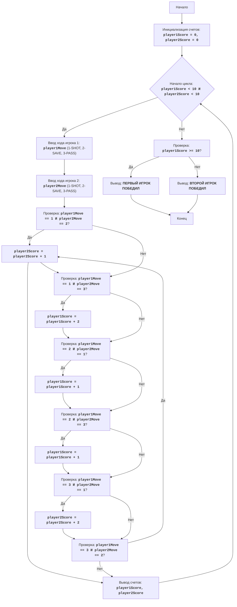

## АНАЛИЗ КОДА:

### <алгоритм>

1.  **Начало игры:**
    *   Инициализируются переменные `player1Score` и `player2Score` нулем.
    *   Пример: `player1Score = 0`, `player2Score = 0`

2.  **Игровой цикл:**
    *   Цикл `while player1Score < 10 and player2Score < 10:` продолжается, пока ни один из игроков не наберет 10 очков.
    *   Пример: Если `player1Score = 5`, `player2Score = 7`, цикл продолжается. Если `player1Score = 10`, цикл завершается.

3.  **Ввод ходов игроков:**
    *   Запрашивается ввод хода первого игрока (1, 2 или 3) с помощью `input()`, сохраняется в `player1Move` и преобразуется в целое число.
        *   Пример: `player1Move = 2` (защита)
    *   Если ввод не целое число или число не в диапазоне [1, 3], выводится сообщение об ошибке и начинается новая итерация цикла.
    *   Запрашивается ввод хода второго игрока (1, 2 или 3) с помощью `input()`, сохраняется в `player2Move` и преобразуется в целое число.
        *   Пример: `player2Move = 1` (бросок)
     *   Если ввод не целое число или число не в диапазоне [1, 3], выводится сообщение об ошибке и начинается новая итерация цикла.

4.  **Проверка и начисление очков:**
    *   Серия `if-elif` условий проверяет комбинации ходов `player1Move` и `player2Move` и начисляет очки:
        *   `if player1Move == 1 and player2Move == 2:`: `player2Score += 1` (второй игрок получает 1 очко)
        *   `elif player1Move == 1 and player2Move == 3:`: `player1Score += 2` (первый игрок получает 2 очка)
        *   `elif player1Move == 2 and player2Move == 1:`: `player1Score += 1` (первый игрок получает 1 очко)
        *   `elif player1Move == 2 and player2Move == 3:`: `player1Score += 1` (первый игрок получает 1 очко)
        *   `elif player1Move == 3 and player2Move == 1:`: `player2Score += 2` (второй игрок получает 2 очка)
        *   `elif player1Move == 3 and player2Move == 2:`: `player2Score += 1` (второй игрок получает 1 очко)
    *   Пример: Если `player1Move = 1` и `player2Move = 3`, то `player1Score` увеличивается на 2.

5.  **Вывод текущего счета:**
    *   Выводится текущий счет игроков.
        *   Пример: `Счет: Игрок 1 - 7, Игрок 2 - 8`

6.  **Проверка победителя:**
    *   После завершения цикла проверяется, кто победил:
        *   `if player1Score >= 10:`: выводится сообщение "ПЕРВЫЙ ИГРОК ПОБЕДИЛ"
        *   `else`: выводится сообщение "ВТОРОЙ ИГРОК ПОБЕДИЛ"
    *   Пример: Если `player1Score = 10`, выводится "ПЕРВЫЙ ИГРОК ПОБЕДИЛ"

### <mermaid>

**Объяснение зависимостей:**
В данной диаграмме `mermaid` представлены основные этапы игры "Хоккей", включая:

*   **Инициализация счетов:** Установка начальных значений для счетов обоих игроков.
*   **Игровой цикл:** Условный цикл, который повторяется, пока ни один из игроков не достигнет 10 очков.
*   **Ввод ходов:** Запрос ввода ходов от каждого игрока.
*   **Проверка условий и начисление очков:** Серия проверок комбинаций ходов и соответствующих начислений очков.
*   **Вывод счета:** Отображение текущего счета игры.
*   **Проверка победителя:** После завершения цикла определяется победитель и выводится соответствующее сообщение.
    
В коде не используется импорт `header`, поэтому дополнительный блок `mermaid` не требуется.

### <объяснение>

*   **Импорты**:
    *   В коде нет импортов.
*   **Классы**:
    *   В коде нет классов.
*   **Функции**:
    *   Код не содержит пользовательских функций, использует только встроенные функции Python, такие как `int()`, `input()`, и `print()`.
        *   `int(input(...))` - используется для получения ввода пользователя и преобразования его в целое число.
        *   `print(...)` - используется для вывода информации на консоль.
        *   Пример: `player1Move = int(input("Ход первого игрока (1-бросок, 2-защита, 3-пас): "))` - запрашивает ввод хода первого игрока и сохраняет в `player1Move`.
        *   Пример: `print(f"Счет: Игрок 1 - {player1Score}, Игрок 2 - {player2Score}")` - выводит текущий счет игры.
*   **Переменные**:
    *   `player1Score` (int): Целочисленная переменная, хранящая счет первого игрока.
    *   `player2Score` (int): Целочисленная переменная, хранящая счет второго игрока.
    *   `player1Move` (int): Целочисленная переменная, хранящая ход первого игрока (1, 2 или 3).
    *   `player2Move` (int): Целочисленная переменная, хранящая ход второго игрока (1, 2 или 3).
        *   Пример: `player1Score = 0` - инициализация счета первого игрока.
        *   Пример: `player1Move = 2` - ход первого игрока (защита).

**Потенциальные ошибки и области для улучшения:**

1.  **Обработка неверного ввода**:
    *   В коде предусмотрена обработка исключений `ValueError`, если пользователь вводит не число. Однако, код продолжает выполнение цикла, если введено число, не входящее в диапазон [1,3]. Можно улучшить проверку вводе в `if` условиях чтобы не выполнять итерацию цикла, если введено некорректное значение.
2.  **Расширение игры**:
    *   Можно добавить более сложные правила или варианты ходов.
    *   Можно добавить возможность выбора имени для игроков.
3.  **Интерфейс пользователя**:
    *   Можно улучшить интерфейс, добавив более информативные сообщения или используя графический интерфейс пользователя.
4.  **Организация кода**:
    *  Код можно разбить на функции, чтобы сделать его более модульным и легким для чтения.

**Взаимосвязи с другими частями проекта:**
* Данный код представляет собой отдельную игру и не имеет прямых зависимостей от других частей проекта.

**Дополнительные заметки:**

*   Код прост и понятен, хорошо документирован комментариями.
*   Логика игры реализована корректно.