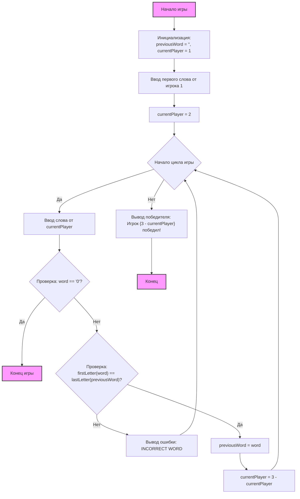

## АНАЛИЗ КОДА:

### <алгоритм>

1.  **Начало игры:**
    *   Инициализация `previousWord` как пустой строки и `currentPlayer` как 1.
    *   **Пример:** `previousWord = ""`, `currentPlayer = 1`.
2.  **Ввод первого слова:**
    *   Запрос ввода слова от игрока 1.
        *   **Пример:** Пользователь вводит "apple".
    *   Сохранение слова в `previousWord`.
        *   **Пример:** `previousWord = "apple"`.
    *   Переключение на игрока 2, `currentPlayer` становится 2.
        *   **Пример:** `currentPlayer = 2`.
3.  **Начало игрового цикла:**
    *   Бесконечный цикл `while True`, пока игра не закончится.
4.  **Ввод слова текущим игроком:**
    *   Запрос ввода слова от текущего игрока.
        *   **Пример:** Если `currentPlayer = 2`, запрос: "Игрок 2, введите слово: ".
        *   **Пример:** Пользователь вводит "egg".
    *   Сохранение слова в `currentWord`.
        *   **Пример:** `currentWord = "egg"`.
5.  **Проверка на выход:**
    *   Проверка, является ли `currentWord` равным '0'.
        *   **Пример:** Если `currentWord = '0'`, то игра заканчивается.
    *   Если да, вывод сообщения "Игра окончена." и выход из цикла.
6.  **Проверка первой буквы:**
    *   Проверка, не является ли `previousWord` пустой строкой.
    *   Сравнение первой буквы `currentWord` с последней буквой `previousWord` (без учета регистра).
        *   **Пример:** `currentWord = "egg"`, `previousWord = "apple"`. 'e' != 'e' (ошибка сравнения) или `currentWord = "egg"`, `previousWord = "dog"` 'e' != 'g'(ошибка сравнения)
        *   **Пример:** `currentWord = "ear"`, `previousWord = "range"`, 'e' == 'e' (совпадение).
    *   Если не совпадают, вывод ошибки и переход к началу цикла.
7.  **Обновление и переключение игрока:**
    *   Обновление `previousWord` на `currentWord`.
        *   **Пример:** `previousWord = "egg"`.
    *   Переключение текущего игрока (если был 1, то станет 2, и наоборот).
        *   **Пример:** `currentPlayer = 3 - 2 = 1`.
8.  **Конец игры:**
    *   Когда цикл завершен (игрок ввел '0'), выводится сообщение о победе предыдущего игрока.
        *   **Пример:** Если последний игрок был 1, то победил игрок 2.
        *   **Пример:** "Игрок 2 победил!".

### <mermaid>

**Описание `mermaid` диаграммы:**

*   **Start**: Начало игры, обозначает точку входа в программу.
*   **InitializeVariables**: Инициализация переменных `previousWord` и `currentPlayer` перед началом игры.
*   **InputFirstWord**: Получение первого слова от игрока 1.
*   **SetPlayer2**: Переключение текущего игрока на игрока 2.
*   **GameLoopStart**: Начало основного игрового цикла, который повторяется, пока игра не закончится.
*   **InputCurrentWord**: Запрос ввода слова от текущего игрока.
*   **CheckQuit**: Проверка, ввел ли игрок '0', чтобы закончить игру.
*   **GameOver**: Конец игры, если игрок ввел '0'.
*   **CheckFirstLetter**: Проверка, совпадает ли первая буква введенного слова с последней буквой предыдущего слова.
*   **OutputError**: Вывод ошибки, если проверка первой буквы не прошла.
*   **UpdatePreviousWord**: Обновление предыдущего слова текущим словом.
*   **SwitchPlayer**: Переключение текущего игрока.
*   **OutputWinner**: Вывод сообщения о победе предыдущего игрока.
*   **End**: Конец программы.

**Зависимости:**

Диаграмма отражает логическую последовательность выполнения игры.  Зависимости включают:

1.  **Инициализация переменных**: `previousWord` и `currentPlayer` устанавливаются до начала цикла.
2.  **Ввод слов**:  Ввод слова зависит от текущего игрока и предыдущего слова для проверки.
3.  **Переключение игроков**: После каждого корректного хода игроки меняются.
4.  **Условие выхода**: Игра заканчивается, когда игрок вводит '0'.

### <объяснение>

**Импорты:**

В данном коде нет импортов. Это означает, что код использует только встроенные функции Python.

**Классы:**

В коде нет классов. Это простая игра, основанная на процедурном программировании.

**Функции:**

*   **`input()`**:
    *   **Аргументы**: Принимает строку-приглашение для ввода пользователя.
    *   **Возвращаемое значение**: Возвращает строку, введенную пользователем.
    *   **Назначение**: Используется для получения пользовательского ввода.
    *   **Пример:** `input("Игрок 1, введите первое слово: ")` выведет на экран текст запроса и ожидает ввода от пользователя.
*   **`print()`**:
    *   **Аргументы**: Принимает любое количество аргументов, которые будут выведены на экран.
    *   **Возвращаемое значение**: Ничего (None).
    *   **Назначение**: Используется для вывода сообщений пользователю и результатов игры.
    *   **Пример:** `print("Игра окончена.")` выведет на экран строку "Игра окончена.".
*   **`strip()`**:
    *   **Аргументы**: Нет аргументов.
    *   **Возвращаемое значение**: Возвращает новую строку с удаленными пробелами в начале и конце.
    *   **Назначение**: Используется для очистки введенных пользователем строк от лишних пробелов.
    *   **Пример:** `"  apple  ".strip()` вернет `"apple"`.
*   **`lower()`**:
    *   **Аргументы**: Нет аргументов.
    *   **Возвращаемое значение**: Возвращает новую строку, где все символы в нижнем регистре.
    *   **Назначение**: Используется для сравнения букв без учета регистра.
    *   **Пример:** `"Apple".lower()` вернет `"apple"`.

**Переменные:**

*   **`previousWord`** (`str`): Хранит последнее введенное слово. Изначально пустая строка. Используется для проверки первой буквы нового слова.
    *   **Пример:** `previousWord = "apple"`
*   **`currentPlayer`** (`int`): Хранит номер текущего игрока (1 или 2). Используется для вывода подсказки игроку.
    *   **Пример:** `currentPlayer = 2`
*   **`currentWord`** (`str`): Хранит текущее слово, введенное игроком. Используется для проверки и обновления `previousWord`.
    *   **Пример:** `currentWord = "egg"`

**Потенциальные ошибки и области для улучшения:**

1.  **Обработка некорректного ввода:** Код не обрабатывает случаи, когда пользователь вводит не буквенные символы. Можно добавить проверки, например, использовать метод `.isalpha()` для проверки, что введено только слово.
2.  **Пустые слова:** Код не обрабатывает пустые слова (просто нажатие Enter). Можно добавить проверку на пустую строку после `strip()`.
3.  **Словарь слов:** Игра не проверяет, является ли введенное слово реальным словом. Для более сложной игры можно использовать словарь.
4.  **Условие ничьей:**  В текущей реализации игра никогда не заканчивается в ничью. Можно добавить механизм для этого случая.
5.  **Интерфейс:** Можно улучшить интерфейс, добавив больше пояснений и сообщений.

**Взаимосвязи с другими частями проекта:**

Так как код является автономным скриптом, он не имеет прямых взаимосвязей с другими частями проекта, кроме того, что он входит в набор игр внутри `src.ai.helicone.ai_games`

**Цепочка взаимосвязей:**

1.  Пользователь запускает скрипт `king.py`
2.  Программа запрашивает первое слово.
3.  Программа вступает в игровой цикл, где слова вводятся по очереди.
4.  Игра заканчивается, когда игрок вводит `0`.

Этот анализ предоставляет полное понимание функциональности, алгоритма и возможных улучшений кода.