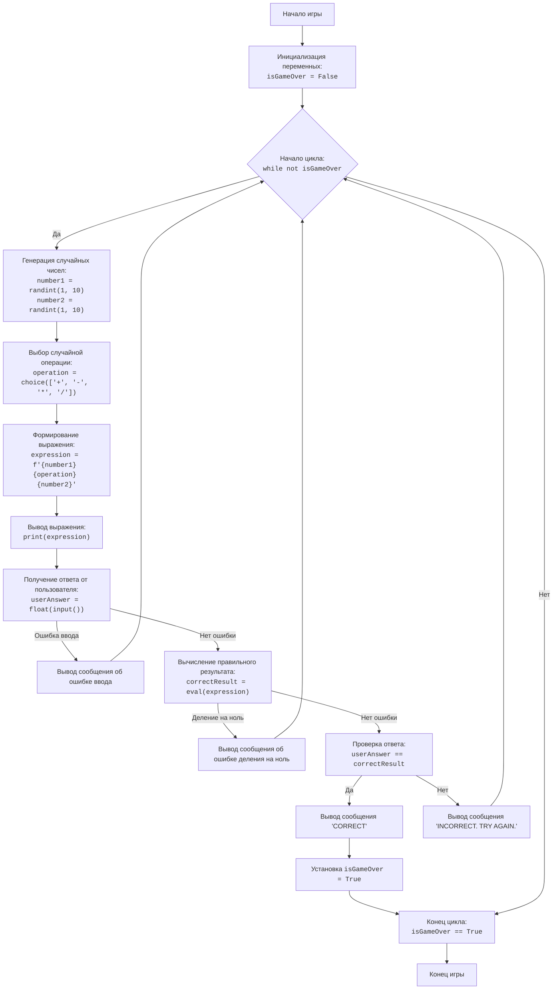

## <алгоритм>
1. **Инициализация игры:**
    - Установить флаг `isGameOver` в `False`.
    *Пример:* `isGameOver = False`

2. **Начало цикла игры (пока `isGameOver` равен `False`):**
    - *Пример:* `while not isGameOver:`

3. **Генерация случайных чисел:**
    - Сгенерировать случайное целое число `number1` в диапазоне от 1 до 10.
    *Пример:* `number1 = 5`
    - Сгенерировать случайное целое число `number2` в диапазоне от 1 до 10.
    *Пример:* `number2 = 7`

4. **Выбор случайной операции:**
    - Выбрать случайную операцию (`+`, `-`, `*`, `/`) из списка `operations`.
    *Пример:* `operation = '*' `

5. **Формирование математического выражения:**
    - Сформировать строку `expression`, объединяя `number1`, `operation` и `number2`.
    *Пример:* `expression = "5 * 7"`

6. **Вывод выражения пользователю:**
    - Вывести строку `expression` на экран.
    *Пример:* `print("Решите: 5 * 7 = ?")`

7. **Получение ответа пользователя:**
   - Запросить ввод ответа от пользователя и преобразовать его в число с плавающей точкой `userAnswer`.
   - Обработать ошибку `ValueError`, если ввод пользователя не является числом.
   *Пример:* `userAnswer = 35.0` или "Некорректный ввод. Пожалуйста, введите число."

8.  **Вычисление правильного результата:**
    - Вычислить правильный результат `correctResult` выражения `expression` с помощью функции `eval()`.
    - Обработать ошибку `ZeroDivisionError`, если произойдет деление на ноль.
    *Пример:* `correctResult = 35.0` или "Деление на ноль невозможно. Попробуйте еще раз."

9.  **Проверка ответа пользователя:**
    - Если `userAnswer` равен `correctResult`, перейти к шагу 10, иначе перейти к шагу 11.
   *Пример:* Если `userAnswer = 35.0` и `correctResult = 35.0`, условие верно.

10. **Правильный ответ:**
    - Вывести сообщение "CORRECT".
    - Установить флаг `isGameOver` в `True`.
    *Пример:* `print("CORRECT")`, `isGameOver = True`
    - Перейти к шагу 12.

11. **Неправильный ответ:**
    - Вывести сообщение "INCORRECT. TRY AGAIN.".
    - Вернуться к шагу 2.
    *Пример:* `print("INCORRECT. TRY AGAIN.")`

12. **Конец игры:**
    - Завершить цикл игры.
    - Завершить программу.

## <mermaid>

**Зависимости:**

- `random`: Модуль `random` импортируется для генерации случайных чисел и выбора случайной математической операции. В диаграмме `mermaid` это отражается в блоках `GenerateRandomNumbers` и `SelectRandomOperation`.

## <объяснение>

**Импорты:**

-   `import random`: Этот модуль используется для генерации случайных чисел (`random.randint`) и выбора случайного элемента из списка (`random.choice`).

**Переменные:**

-   `isGameOver`: Логическая переменная (`bool`), которая контролирует основной цикл игры. Изначально установлена в `False`, и становится `True`, когда пользователь правильно отвечает на пример.
-   `number1`, `number2`: Целочисленные переменные (`int`), хранящие случайно сгенерированные числа в диапазоне от 1 до 10.
-   `operations`: Список строк (`list`), содержащий возможные математические операции (`+`, `-`, `*`, `/`).
-   `operation`: Строковая переменная (`str`), хранящая случайно выбранную операцию из списка `operations`.
-   `expression`: Строковая переменная (`str`), которая формируется путем объединения `number1`, `operation` и `number2` в виде математического выражения (например, "5 + 3").
-   `userAnswer`: Число с плавающей точкой (`float`), в которое преобразуется введенный пользователем ответ.
-    `correctResult`: Число с плавающей точкой (`float`), хранящая правильный результат вычисления `expression` с использованием `eval()`.

**Функции:**

-   `random.randint(a, b)`: Функция модуля `random`, которая возвращает случайное целое число `N` в диапазоне `a <= N <= b`.
-   `random.choice(seq)`: Функция модуля `random`, которая возвращает случайный элемент из последовательности `seq`.
-   `input(prompt)`: Встроенная функция, которая выводит сообщение `prompt` и возвращает введенный пользователем текст в виде строки.
-   `float(x)`: Встроенная функция, которая преобразует число или строку в число с плавающей точкой.
-   `eval(expression)`: Встроенная функция, которая вычисляет выражение, заданное строкой `expression`.

**Классы:**

-   В этом коде классы не используются.

**Логика программы:**

1.  Инициализируется переменная `isGameOver` как `False`, что позволяет начать цикл игры.
2.  В цикле `while not isGameOver`:
    -   Генерируются два случайных числа `number1` и `number2`.
    -   Выбирается случайная операция из списка `operations`.
    -   Формируется строка `expression`, представляющая математическое выражение.
    -   Выражение выводится пользователю.
    -   Получается ответ от пользователя, который преобразуется в число с плавающей точкой `userAnswer`.
    -   Вычисляется правильный результат `correctResult` с помощью функции `eval(expression)`.
    -   Проверяется, равен ли `userAnswer` правильному результату.
        -   Если равен, выводится сообщение "CORRECT", `isGameOver` устанавливается в `True`, и цикл завершается.
        -   Если не равен, выводится сообщение "INCORRECT. TRY AGAIN.", и цикл начинается снова.
3.  Цикл завершается, когда `isGameOver` становится `True`, что происходит после правильного ответа пользователя.

**Потенциальные ошибки и области для улучшения:**

-   **Обработка ошибок ввода:**
    -  В блоке `try..except ValueError` обрабатывается некорректный ввод (например, буквы вместо чисел). Однако стоило бы добавить проверку на пустой ввод.
    -  В блоке `try..except ZeroDivisionError` обрабатывается деление на ноль, но пользователь не получает информации о том, какие именно числа привели к этой ошибке.
-   **Безопасность использования `eval()`:**
    -   Функция `eval()` может быть небезопасной, так как позволяет выполнять произвольный код, если пользователь может контролировать строку `expression`.  Однако в данном контексте, `expression` создается внутри кода, поэтому риска нет. Но при использовании пользовательского ввода eval() может стать уязвимостью.
-   **Ограниченность сложности:**
    -   Игра всегда генерирует только два числа и одну операцию. Можно расширить игру, позволяя генерировать более сложные выражения (например, с несколькими операциями и скобками).
-   **Пользовательский интерфейс:**
    -   Пользовательский интерфейс очень простой и выводит сообщения в консоль. Для улучшения UX можно использовать GUI.
-   **Проверка на деление на ноль:**
    -   Игра может зациклится в случае деления на ноль. Потенциально стоит сделать проверку до того как формировать `expression`.

**Взаимосвязи с другими частями проекта:**

-   Данный файл `mathdi.py` является самодостаточной программой и не имеет прямых зависимостей с другими частями проекта, кроме стандартной библиотеки python. Это независимая игра, поэтому нет связей с другими частями.