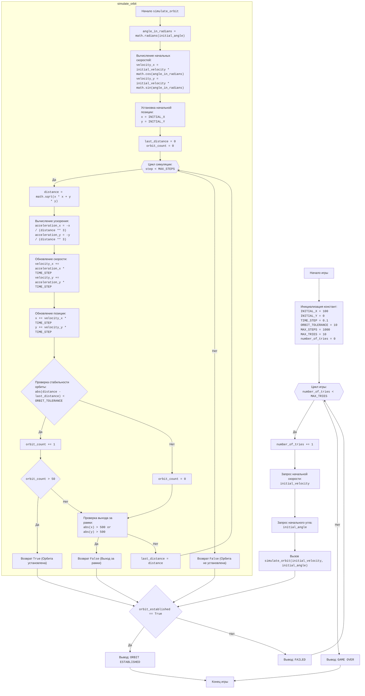

## <алгоритм>

**1. Инициализация:**
   - Устанавливаются константы для моделирования: `INITIAL_X = 100`, `INITIAL_Y = 0`, `TIME_STEP = 0.1`, `ORBIT_TOLERANCE = 10`, `MAX_STEPS = 1000`, `MAX_TRIES = 10`.
   - Счетчик попыток пользователя `number_of_tries` устанавливается в 0.

**2. Основной цикл игры (пока `number_of_tries` < `MAX_TRIES`):**
   - Увеличиваем счетчик попыток `number_of_tries` на 1.
   - **Ввод данных:**
      - Запрашиваем у пользователя начальную скорость `initial_velocity` (например, 5).
      - Запрашиваем у пользователя начальный угол `initial_angle` в градусах (например, 45).
      - Если введенные значения не являются числами, выводим сообщение об ошибке и переходим к следующей итерации цикла.
   - **Моделирование орбиты:**
        - Вызываем функцию `simulate_orbit(initial_velocity, initial_angle)` для моделирования траектории полета.
        -   **Внутри `simulate_orbit`:**
            -   Преобразуем угол `initial_angle` из градусов в радианы: `angle_in_radians = math.radians(initial_angle)`.
            -   Вычисляем начальные компоненты скорости `velocity_x` и `velocity_y`:
                 -   `velocity_x = initial_velocity * math.cos(angle_in_radians)`
                 -   `velocity_y = initial_velocity * math.sin(angle_in_radians)`
            -   Устанавливаем начальные координаты: `x = INITIAL_X`, `y = INITIAL_Y`.
            -   Инициализируем `last_distance = 0` и `orbit_count = 0` для проверки стабильности орбиты.
            -   **Цикл симуляции (пока `step` < `MAX_STEPS`):**
                -   Вычисляем расстояние до планеты `distance`: `distance = math.sqrt(x * x + y * y)`.
                -   Вычисляем ускорение по осям x и y (гравитация):
                     -   `acceleration_x = -x / (distance ** 3)`
                     -   `acceleration_y = -y / (distance ** 3)`
                -   Обновляем скорость:
                     -  `velocity_x += acceleration_x * TIME_STEP`
                     -  `velocity_y += acceleration_y * TIME_STEP`
                -   Обновляем координаты:
                     -   `x += velocity_x * TIME_STEP`
                     -   `y += velocity_y * TIME_STEP`
                -   Проверяем, вышло ли тело на стабильную орбиту:
                     - Если `abs(distance - last_distance) < ORBIT_TOLERANCE`, то увеличиваем счетчик `orbit_count`, иначе сбрасываем его в 0
                     - Если `orbit_count` > 50 (50 раз подряд расстояние не меняется), то возвращаем `True` (орбита установлена).
                -    Запоминаем последнее значение `last_distance = distance`
                -    Проверяем, не вышло ли тело за рамки симуляции (например, `abs(x) > 500 or abs(y) > 500`). Если вышло, возвращаем `False` (орбита не установлена).
            -   Если за `MAX_STEPS` шагов орбита не установлена, возвращаем `False`.
    - **Проверка результата симуляции:**
        - Если `simulate_orbit` вернула `True`, выводим "ORBIT ESTABLISHED" и завершаем игру.
        - Если `simulate_orbit` вернула `False`, выводим "FAILED".

**3. Конец игры:**
    - Если основной цикл завершился (все попытки исчерпаны), выводим "GAME OVER".

## <mermaid>

**Зависимости:**

-   **`math`:** Модуль `math` импортируется для использования математических функций, таких как `math.radians`, `math.cos`, `math.sin`, и `math.sqrt`. Эти функции необходимы для преобразования угла из градусов в радианы, вычисления компонент начальной скорости и расчета расстояния до планеты.

## <объяснение>

**Импорты:**

-   `import math`: Импортируется для использования математических функций. В частности, `math.radians` для преобразования градусов в радианы, `math.cos` и `math.sin` для расчета компонент скорости, и `math.sqrt` для расчета расстояния.

**Константы:**

-   `INITIAL_X`, `INITIAL_Y`: Начальные координаты космического корабля (100, 0). Тип - `int`.
-   `TIME_STEP`: Шаг времени для симуляции (0.1). Тип - `float`.
-   `ORBIT_TOLERANCE`: Допустимое отклонение в расстоянии для определения стабильной орбиты (10). Тип - `int`.
-   `MAX_STEPS`: Максимальное количество шагов симуляции (1000). Тип - `int`.
-    `MAX_TRIES`: Максимальное количество попыток пользователя вывести корабль на орбиту (10). Тип - `int`.

**Функция `simulate_orbit(initial_velocity, initial_angle)`:**

-   **Аргументы:**
    -   `initial_velocity` (`float`): Начальная скорость корабля.
    -   `initial_angle` (`float`): Начальный угол в градусах.
-   **Возвращаемое значение:**
    -   `bool`: `True`, если орбита установлена, иначе `False`.
-   **Функциональность:**
    1.  Преобразует угол из градусов в радианы, используя `math.radians(initial_angle)`.
    2.  Вычисляет компоненты начальной скорости `velocity_x` и `velocity_y` на основе начальной скорости и угла.
    3.  Устанавливает начальные координаты `x` и `y` из констант `INITIAL_X` и `INITIAL_Y`.
    4.  Инициализирует переменные `last_distance` и `orbit_count` для проверки стабильности орбиты.
    5.  В цикле симуляции до `MAX_STEPS` шагов:
        -   Вычисляет расстояние до планеты.
        -   Рассчитывает ускорение (гравитационное притяжение).
        -   Обновляет скорость и позицию корабля.
        -   Проверяет стабильность орбиты на основе изменения расстояния до планеты.
        -   Проверяет, не вышел ли корабль за рамки симуляции.
    6.  Возвращает `True`, если орбита установлена, `False` в противном случае.

**Функция `play_orbit_game()`:**

-   **Аргументы:** Нет.
-   **Возвращаемое значение:** Нет.
-   **Функциональность:**
    1.  Инициализирует счетчик попыток `number_of_tries`.
    2.  Запускает цикл, пока количество попыток не достигнет `MAX_TRIES`.
    3.  Запрашивает у пользователя ввод начальной скорости и угла.
    4.  Вызывает `simulate_orbit()` для моделирования траектории.
    5.  Если орбита установлена (`simulate_orbit` возвращает `True`), выводит сообщение "ORBIT ESTABLISHED" и завершает игру.
    6.  Если орбита не установлена, выводит "FAILED" и продолжает игру.
    7.  Если после всех попыток орбита не была установлена, выводит "GAME OVER".

**Переменные:**

-   `initial_velocity` (`float`): Начальная скорость корабля, вводимая пользователем.
-   `initial_angle` (`float`): Начальный угол корабля, вводимый пользователем.
-   `angle_in_radians` (`float`): Угол в радианах.
-   `velocity_x`, `velocity_y` (`float`): Компоненты скорости по осям x и y.
-   `x`, `y` (`float`): Текущие координаты корабля.
-   `distance` (`float`): Расстояние от корабля до планеты.
-   `acceleration_x`, `acceleration_y` (`float`): Ускорение по осям x и y.
-   `step` (`int`): Счетчик шагов в цикле симуляции.
-  `orbit_count` (`int`):  Счетчик стабильных орбит.
-  `last_distance` (`float`):  Последнее значение расстояния.
- `number_of_tries` (`int`): Счетчик попыток пользователя.
- `orbit_established` (`bool`):  Результат вызова `simulate_orbit`.

**Потенциальные ошибки и области для улучшения:**

1.  **Проверка ввода:** Функция `play_orbit_game()` проверяет ввод только на `ValueError`, но не проверяет диапазон значений начальной скорости и угла. Добавление проверки диапазонов может улучшить стабильность игры и защитить от ввода некорректных данных пользователем.
2.  **Критерий стабильной орбиты:** Определение стабильной орбиты основывается на том, что расстояние до планеты не меняется в течение 50 шагов с заданной `ORBIT_TOLERANCE`. Этот критерий можно улучшить, например, анализируя траекторию движения, что сделает симуляцию более точной.
3.  **Выход за рамки моделирования:** Проверка выхода за рамки моделирования происходит только по координатам (`abs(x) > 500 or abs(y) > 500`). Можно добавить проверку на скорость, чтобы избежать нереалистичных ситуаций.
4.  **Использование констант:** Все константы объявлены в начале файла. Это хороший подход для организации кода, однако стоит рассмотреть возможность их вынесения в отдельный конфигурационный файл, если количество констант будет расти.
5.  **Визуализация:** В настоящее время игра выводит только текстовые сообщения. Добавление графического интерфейса или визуализации траектории корабля сделало бы игру более интересной.
6.  **Алгоритм расчета ускорения:** Используется упрощенный вариант `acceleration_x = -x / (distance ** 3)` и `acceleration_y = -y / (distance ** 3)`. Можно использовать более точный закон гравитации, например: `acceleration_x = -G * M * x / (distance ** 3)` и `acceleration_y = -G * M * y / (distance ** 3)`, где `G` - гравитационная постоянная, а `M` - масса планеты.
7.  **Отсутствие `header.py`**: В данном коде нет импорта `header`, поэтому нет необходимости в блоке `mermaid` для его анализа.

**Цепочка взаимосвязей с другими частями проекта:**

-   Этот код является автономной игрой и не имеет явных зависимостей от других частей проекта, если не считать возможную зависимость от глобальных настроек, которые здесь не показаны. Однако, если бы константы для моделирования выносились в отдельный файл настроек, то была бы зависимость от этого файла.