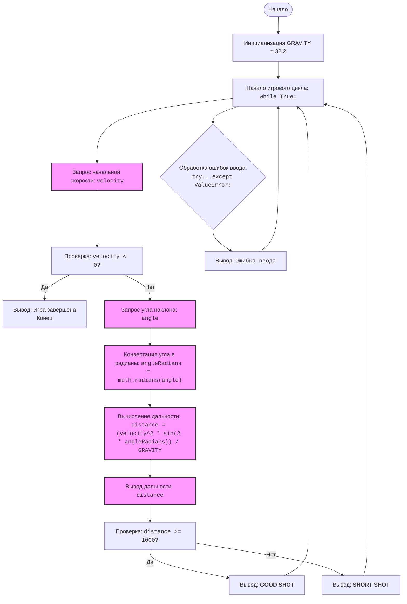

## <алгоритм>
1. **Начало программы:**
   - Программа начинает выполнение с инициализации константы `GRAVITY` равной 32.2, представляющей ускорение свободного падения.

2. **Игровой цикл (while True):**
   - Программа входит в бесконечный цикл, позволяющий игроку многократно запускать ракеты.

3. **Ввод начальной скорости:**
   - Программа запрашивает у пользователя начальную скорость ракеты (в футах в секунду) и сохраняет её в переменной `velocity`.
     - *Пример:* Пользователь вводит `150`.
   - Если введённая скорость `velocity` отрицательная, программа выводит сообщение "Игра завершена." и завершает цикл, заканчивая игру.
     - *Пример:* Пользователь вводит `-1`, игра заканчивается.
   - Если скорость неотрицательная, программа переходит к следующему шагу.

4. **Ввод угла наклона:**
   - Программа запрашивает у пользователя угол наклона (в градусах) и сохраняет его в переменной `angle`.
     - *Пример:* Пользователь вводит `45`.

5. **Преобразование угла в радианы:**
   - Используя функцию `math.radians()`, программа преобразует угол наклона из градусов в радианы и сохраняет его в переменной `angle_radians`.
     - *Пример:* `angle_radians` становится `0.785`.

6. **Вычисление дальности полета:**
   - Программа вычисляет дальность полёта ракеты, используя формулу: 
     `distance = (velocity**2 * math.sin(2 * angle_radians)) / GRAVITY`.
     Результат сохраняется в переменной `distance`.
     - *Пример:*  с `velocity=150` и `angle_radians=0.785`, `distance` становится `698.5`.

7. **Вывод дальности полета:**
   - Программа выводит рассчитанную дальность полёта ракеты на экран, округлённую до двух знаков после запятой.
     - *Пример:* Выводится "Дальность полета ракеты: 698.50 футов".

8. **Проверка достижения цели:**
   - Программа проверяет, достигла ли ракета цели (дальность 1000 футов или больше).
   - Если `distance` больше или равна 1000, программа выводит сообщение "GOOD SHOT".
     - *Пример:* если `distance` равно `1200`, выводится "GOOD SHOT".
   - Если `distance` меньше 1000, программа выводит сообщение "SHORT SHOT".
     - *Пример:* если `distance` равно `698.5`, выводится "SHORT SHOT".

9. **Обработка ошибок ввода:**
   - Если во время ввода данных возникает ошибка (например, пользователь вводит не число), то программа переходит к блоку `except ValueError:` и выводит сообщение "Ошибка ввода. Пожалуйста, введите числовое значение.".
   - После обработки ошибки цикл продолжается с начала (шаг 2).

10. **Повторение игрового цикла:**
    - После завершения шагов 7-9 программа возвращается к началу игрового цикла (шаг 2), позволяя игроку запустить ракету снова.

## <mermaid>

**Объяснение зависимостей:**

- **`math`**:
    -  Модуль `math` импортируется для использования математических функций, таких как `math.radians()` для преобразования угла из градусов в радианы и `math.sin()` для вычисления синуса. Без этого модуля, вычисление дальности полета ракеты было бы невозможно, поскольку тригонометрические функции не являются встроенными в Python.
-  В диаграмме `mermaid` отсутствуют импорты из других частей проекта `src.`,  так как этот скрипт является самодостаточным и не использует какие-либо другие модули, которые нужно было бы импортировать из проекта.

## <объяснение>

**Импорты:**

-   `import math`: Импортирует стандартный модуль Python `math`, который предоставляет доступ к математическим функциям и константам. В данном коде используются функции:
    -   `math.radians(angle)`: преобразует угол из градусов в радианы.
    -   `math.sin(x)`: вычисляет синус угла в радианах.
    -   **Связь с `src`**:  Модуль `math` - это встроенный модуль Python, он не относится к проекту `src`.

**Константы:**

-   `GRAVITY = 32.2`: Определяет константу, представляющую ускорение свободного падения (в футах в секунду в квадрате). Она используется в формуле для вычисления дальности полета ракеты.

**Игровой цикл (while True):**

-   `while True:`: Создаёт бесконечный цикл, в котором происходит запуск ракеты, пока пользователь не введёт отрицательную скорость.
-   **Взаимосвязь**: Цикл не связан с другими частями проекта, он управляет логикой игры.

**Блок try...except:**

-   `try:`: Этот блок оборачивает код, в котором могут возникнуть ошибки ввода от пользователя.
-   `except ValueError:`: Если пользователь вводит нечисловое значение, возникает `ValueError`, который обрабатывается в этом блоке, что предотвращает аварийное завершение программы. Программа выводит сообщение об ошибке, и цикл продолжается.
-   **Связь с `src`**:  Этот блок обрабатывает ошибки ввода, и он является самодостаточным и не зависит от других частей проекта `src`.

**Ввод данных:**

-   `velocity = float(input(...))`: Запрашивает у пользователя начальную скорость ракеты и преобразует ввод в число с плавающей точкой.
-   `angle = float(input(...))`: Запрашивает угол наклона и также преобразует ввод в число с плавающей точкой.
-   **Связь с `src`**: Ввод данных от пользователя является частью основной логики игры и не взаимодействует с другими частями проекта `src`.

**Проверка отрицательной скорости:**

-   `if velocity < 0:`: Проверяет, ввел ли пользователь отрицательную скорость, что означает выход из игры.
-   `break`: Завершает текущий игровой цикл, если скорость отрицательная.
-   **Связь с `src`**:  Этот блок является частью логики управления игрой.

**Преобразование угла:**

-   `angle_radians = math.radians(angle)`: Преобразует угол из градусов в радианы, чтобы использовать его в математических функциях.

**Вычисление дальности полета:**

-   `distance = (velocity**2 * math.sin(2 * angle_radians)) / GRAVITY`: Вычисляет дальность полёта ракеты по физической формуле.
-   **Связь с `src`**: Данная операция не зависит от других частей проекта.

**Вывод результатов:**

-   `print(f"Дальность полета ракеты: {distance:.2f} футов")`: Выводит дальность с двумя знаками после запятой.

**Проверка достижения цели:**

-   `if distance >= 1000:`: Проверяет, достигла ли ракета цели (дальность не менее 1000).
-   `print("GOOD SHOT")`: Выводит сообщение об успехе.
-   `else:`: Если цель не достигнута.
-   `print("SHORT SHOT")`: Выводит сообщение о провале.

**Переменные:**

-   `GRAVITY` (float):  Константа, представляющая ускорение свободного падения.
-   `velocity` (float):  Начальная скорость ракеты, вводимая пользователем.
-   `angle` (float): Угол наклона ракеты, вводимый пользователем (в градусах).
-   `angle_radians` (float): Угол наклона в радианах.
-   `distance` (float): Дальность полёта ракеты.

**Потенциальные ошибки и улучшения:**

1.  **Некорректный ввод:**  Программа корректно обрабатывает нечисловые значения благодаря `try-except`, но не проверяет значения на корректность (например, угол не может быть отрицательным).  Можно добавить дополнительные проверки на диапазоны ввода.
2.  **Формула:** Формула для дальности полёта соответствует упрощенной модели, которая не учитывает сопротивление воздуха и другие факторы.
3.  **Вывод:** Вывод "GOOD SHOT" / "SHORT SHOT" можно сделать более информативным (например, вывести, на сколько не хватило/на сколько перестреляла ракета).

**Цепочка взаимосвязей с другими частями проекта:**

Данный файл `rocket.py`  не имеет зависимостей от других частей проекта `src.`. Это автономная игра, которая использует только стандартную библиотеку `math` и ввод-вывод.