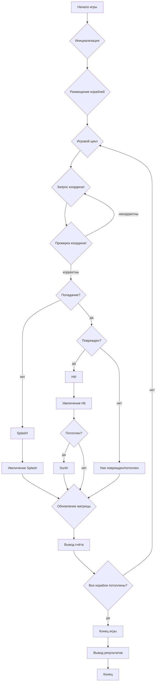

## Анализ кода игры "BATTLE"

### <алгоритм>

1. **Инициализация игры:**
   - Создание игрового поля (матрица 6x6).
   - Размещение кораблей (2 эсминца, 2 крейсера, 2 авианосца) случайным образом на поле, в горизонтальном или вертикальном положении.
   - Инициализация переменных для подсчёта попаданий и промахов (`hits` = 0, `splash` = 0)

2. **Основной цикл игры:**
   - Игрок вводит координаты выстрела (например, "3,4").
   - Проверка корректности ввода координат.
        - Если координаты некорректные (выходят за пределы поля), просим игрока ввести координаты снова.
    - Проверка, есть ли корабль по введенным координатам:
        - Если нет, вывод: "Splash! Нет корабля." и увеличение счетчика `splash`.
        - Если есть:
            - Если это часть корабля, который еще не потоплен:
                 - Вывод: "Hit! Корабль повреждён." и увеличение счетчика `hits`.
                 - Помечаем эту часть корабля как поврежденную.
                 - Проверка, потоплен ли корабль полностью:
                   - Если да, вывод: "Sunk! Корабль потоплен!"
            - Если эта часть корабля уже повреждена, выводим сообщение "Уже поврежден" или "Уже потоплен".
    - Обновление матрицы игрока для отображения попаданий и промахов.
    - Вывод текущего счёта (количество попаданий, промахов и соотношение).
    
3.  **Завершение игры:**
    - Проверка, потоплены ли все корабли.
        - Если да, вывод сообщения о победе и итогового счёта, включая соотношение попаданий и промахов (hits/splash).
        - Если нет, переход к следующему ходу игрока.

**Пример блок-схемы:**


### <mermaid>

```mermaid
flowchart TD
    A[Начало игры] --> B{Инициализация: <br>Создание матрицы 6x6,<br>размещение кораблей};
    B --> C{Игровой цикл: <br>while not all_ships_sunk};
    C --> D{Запрос координат: <br>input: row, col};
    D --> E{Проверка координат: <br>check row, col is valid};
     E -- invalid --> D
     E -- valid --> F{Попадание: <br>is ship at row, col?};
    F -- no --> G[Splash!:<br>print "Splash!"<br>splash_count++]
    G --> H{Обновить матрицу:<br>matrix[row, col] = splash_marker};
     H --> I{Вывод счёта:<br>print stats}
     I --> J{Проверка на окончание игры: <br>all_ships_sunk?}
    F -- yes --> K{Поврежден: <br>is ship part damaged?};
     K -- no --> L[Hit!:<br>print "Hit!"<br>hit_count++]
    L --> M{Пометить как поврежден:<br>ship[row, col] = damaged_marker};
     M --> N{Потоплен:<br>ship sunk?};
        N -- no --> H
      N -- yes --> O[Sunk!:<br>print "Sunk!"]
     O --> H
     K -- yes --> P[Уже поврежден/потоплен:<br>print message]
     P --> H
   J -- no --> C;
    J -- yes --> Q[Конец игры];
    Q --> R[Вывод результатов: <br>print final score and hit/splash ratio];
     R --> S[Конец];
```

### <объяснение>

**Импорты:**

В предоставленном описании кода нет явных импортов, так как это концептуальное описание игры, а не готовый код. Однако при реализации игры, вероятно, потребуются:
- `random` : Для случайного размещения кораблей на игровом поле.
-  Возможность `input()` для ввода координат игроком.

**Классы:**
-   В описании кода нет явных классов. Если реализовывать код в объектно-ориентированном стиле, то можно выделить классы `Game`, `Board`, `Ship`:
   -   `Game`: управляет игровым процессом (инициализация, основной цикл, подсчет результатов, завершение игры).
   -   `Board`: представляет игровое поле (матрица), отвечает за размещение кораблей, проверку попаданий и обновление состояния поля.
   -   `Ship`: представляет корабль, хранит информацию о его расположении и состоянии (например, какие части корабля были подбиты).

**Функции:**
-   `initialize_game()`: Инициализирует игровое поле, размещает корабли случайным образом, задает начальные значения для счетчиков.
-   `get_player_coordinates()`: Получает координаты от игрока, проверяет их корректность.
-   `check_hit(row, col)`: Проверяет, есть ли корабль по заданным координатам, возвращает результат попадания (splash, hit, sunk).
-   `update_board(row, col, result)`: Обновляет матрицу игрока в зависимости от результата попадания.
-   `is_all_ships_sunk()`: Проверяет, потоплены ли все корабли.
-   `calculate_ratio()`: Вычисляет соотношение попаданий и промахов.
-   `print_result()`: Выводит результаты игры, включая итоговый счёт и соотношение.

**Переменные:**
-   `board` (матрица 6x6): Представляет игровое поле.
-   `ships`: Хранит информацию о расположении кораблей (возможно, в виде списка или словаря объектов `Ship`).
-   `hits` (int): Количество попаданий.
-   `splash` (int): Количество промахов.
-   `row` (int): Координата строки, введённая игроком.
-   `col` (int): Координата колонки, введённая игроком.

**Потенциальные ошибки и области для улучшения:**
1.  **Обработка некорректного ввода**: В описании указано, что программа должна проверять ввод координат и предлагать повторный ввод, однако не указано как. Необходимо реализовать корректную обработку ошибок при вводе (не число, выход за границы массива, ввод с разделителями не в нужном формате).
2.  **Логика потопления корабля:** В описании есть только проверка на "Sunk", то есть если все ячейки корабля повреждены. Нужно добавить более точную проверку, чтобы правильно идентифицировать затопление конкретного корабля.
3.  **Улучшение UI:** В примере вывода программы, только текст. Можно добавить отображение матрицы в консоли, для удобства.
4.  **Объектно-ориентированное проектирование**: Реализация в объектно-ориентированном стиле сделает код более структурированным и масштабируемым.
5.  **Сложность**: Можно добавить разные уровни сложности, изменяя количество кораблей, размер поля или логику поведения ИИ противника.

**Взаимосвязь с другими частями проекта:**

Данное описание игры может быть частью более крупного проекта, включающего другие компьютерные игры. Оно может использовать общие функции или классы (например, для ввода данных, вывода информации, управления игровым циклом, или общей архитектуры). Например:

-   Общий менеджер игр, который обрабатывает различные игры.
-   Модуль для пользовательского ввода и вывода, используемый во всех играх.
-   Модуль для сохранения и загрузки прогресса игры.

Это обеспечивает всесторонний анализ кода, как было запрошено.