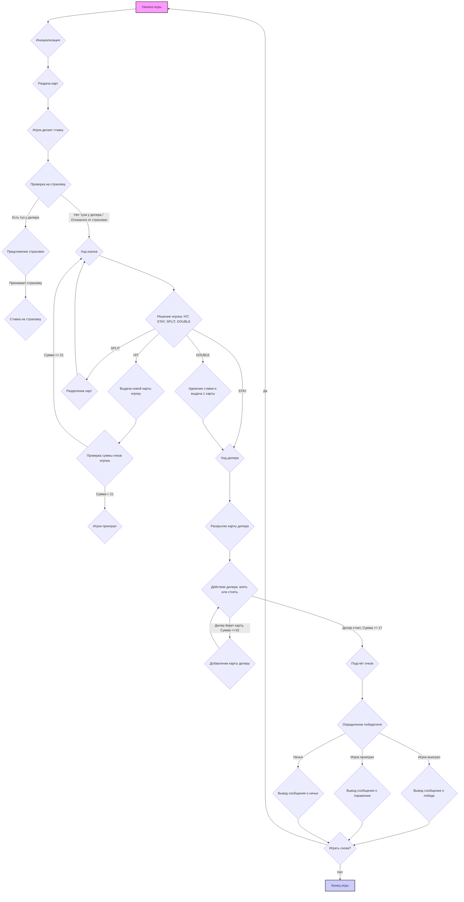

## Анализ кода игры BLKJAK (Блэкджек)

### 1. <алгоритм>

**Блок-схема игрового процесса:**



**Примеры для каждого логического блока:**

- **A (Начало игры):**  Инициализирует необходимые переменные, например, баланс игрока.
- **B (Инициализация):**  Создаются объекты карт, колоды, игрока и дилера.
- **C (Раздача карт):** Игроку раздаются две карты, дилеру одна открытая и одна закрытая карты.
- **D (Игрок делает ставку):**  Запрашивает у игрока размер ставки, проверяет на корректность ввода.
    - Пример: Игрок вводит ставку `50`.
- **E (Проверка на страховку):** Проверяет, является ли открытая карта дилера тузом.
    - Пример: Открытая карта дилера - `туз`, переход в `F`; Открытая карта дилера - `7`, переход в `H`.
- **F (Предложение страховки):**  Запрашивает у игрока, хочет ли он купить страховку.
    - Пример: Игрок вводит `да`.
- **G (Ставка на страховку):** Высчитывается размер ставки на страховку (половина от начальной).
   - Пример: Начальная ставка `50`, ставка на страховку `25`.
- **H (Ход игрока):**  Игроку предлагается выбрать действие: `HIT`, `STAY`, `SPLIT`, `DOUBLE`.
- **I (Решение игрока: HIT, STAY, SPLIT, DOUBLE):** Запрашивает у игрока решение.
    - Пример: Игрок выбирает `HIT`.
- **J (Выдача новой карты игроку):** Добавляет карту в руку игрока.
- **K (Проверка суммы очков игрока):**  Суммируются очки карт игрока, проверяется, не больше ли 21.
   - Пример: Сумма очков игрока `22`, переход в `L`. Сумма очков игрока `17`, переход в `H`.
- **L (Игрок проиграл):** Выводится сообщение о проигрыше игрока.
- **M (Ход дилера):**  Дилер открывает свою закрытую карту.
- **N (Разделение карт):** Если у игрока пара одинаковых карт, он может разделить их на две руки, удвоив ставку.
- **O (Удвоение ставки и выдача 1 карты):**  Увеличивает ставку вдвое, выдает игроку 1 карту.
- **P (Раскрытие карты дилера):**  Открываются все карты дилера.
- **Q (Действие дилера: взять или стоять):**  Если сумма очков дилера <=16, то берется карта, иначе дилер стоит.
   - Пример: Сумма очков дилера `16`, берется еще карта, переход в `R`. Сумма очков дилера `17`, переход в `S`.
- **R (Добавление карты дилеру):** Добавляет новую карту в руку дилера.
- **S (Подсчет очков):** Подсчитываются очки дилера и игрока.
- **T (Определение победителя):** Определяется, кто выиграл, проиграл или ничья.
- **U (Вывод сообщения о победе):** Выводится сообщение о победе игрока.
- **V (Вывод сообщения о поражении):** Выводится сообщение о поражении игрока.
- **W (Вывод сообщения о ничье):** Выводится сообщение о ничьей.
- **X (Играть снова?):** Предлагается сыграть еще раз.
   - Пример: Игрок вводит `да`.
- **Y (Конец игры):**  Завершается игра.

### 2. <mermaid>

```mermaid
flowchart TD
    subgraph Игра "BLKJAK"
        Start(Начало игры) --> init(Инициализация игры);
        init --> deal(Раздача карт);
        deal --> bet(Игрок делает ставку);
        bet --> checkInsurance{Проверка на туза у дилера};
        checkInsurance -- Туз есть --> offerInsurance(Предложение страховки);
         checkInsurance -- Туза нет --> playerTurn(Ход игрока);
        offerInsurance --> insuranceBet(Ставка страховки);
        insuranceBet --> playerTurn;
        playerTurn --> playerAction{Решение игрока: HIT, STAY, SPLIT, DOUBLE};
        playerAction -- HIT --> hitPlayer(Выдача карты игроку);
        playerAction -- STAY --> dealerTurn(Ход дилера);
        playerAction -- SPLIT --> splitHand(Разделение карт);
        playerAction -- DOUBLE --> doubleBet(Удвоение ставки и выдача 1 карты);
         hitPlayer --> checkPlayerScore{Проверка очков игрока};
        checkPlayerScore -- Перебор --> playerLose(Игрок проиграл);
        checkPlayerScore -- Не перебор --> playerTurn;
        splitHand --> playerTurn;
        doubleBet --> dealerTurn;
        playerLose --> gameResult(Определение результата);
        dealerTurn --> dealerReveal(Раскрытие карт дилера);
        dealerReveal --> dealerAction{Действие дилера: взять или стоять};
         dealerAction -- Взять карту --> dealerHit(Добавление карты дилеру);
        dealerAction -- Стоять --> gameResult;
        dealerHit --> dealerAction;
        gameResult --> determineWinner(Определение победителя);
        determineWinner --> |Игрок выиграл|playerWin(Игрок выиграл);
        determineWinner --> |Дилер выиграл|dealerWin(Дилер выиграл);
         determineWinner --> |Ничья|draw(Ничья);
        playerWin --> playAgain(Играть снова?);
         dealerWin --> playAgain;
          draw --> playAgain;
         playAgain -- Да --> Start;
        playAgain -- Нет --> End(Конец игры);
    end
```

**Объяснение зависимостей (mermaid):**

-   **Start**: Начало игры, запускает процесс инициализации.
-   **init**: Инициализирует игровые переменные и объекты (колода, игрок, дилер).
-   **deal**: Раздаёт карты игроку и дилеру в начале игры.
-   **bet**: Позволяет игроку сделать начальную ставку.
-   **checkInsurance**: Проверяет, есть ли у дилера туз в открытой карте для возможности страховки.
-   **offerInsurance**: Предлагает игроку сделать ставку на страховку.
-   **insuranceBet**: Игрок делает ставку страховку.
-   **playerTurn**: Управляет ходом игрока, предоставляя выбор действий.
-   **playerAction**: Позволяет игроку выбирать действие (`HIT`, `STAY`, `SPLIT`, `DOUBLE`).
-   **hitPlayer**: Добавляет карту в руку игрока.
-   **checkPlayerScore**: Проверяет сумму очков игрока, перебор или нет.
-   **playerLose**: Игрок проигрывает.
-  **splitHand**: Разделяет текущую руку игрока на две, удваивая начальную ставку.
-   **doubleBet**:  Удваивает ставку игрока и добавляет одну дополнительную карту.
-   **dealerTurn**: Запускает ход дилера, раскрывая его закрытую карту.
-   **dealerReveal**: Показывает карту дилера, которая была скрыта.
-   **dealerAction**: Выбирает действие дилера (взять карту или стоять).
-   **dealerHit**: Добавляет карту в руку дилера.
-   **gameResult**: Запускает определение победителя после ходов игрока и дилера.
-   **determineWinner**: Определяет победителя на основе суммы очков у игрока и дилера.
-   **playerWin**: Сообщает, что игрок выиграл.
-   **dealerWin**: Сообщает, что дилер выиграл.
-   **draw**: Сообщает, что игра закончилась ничьей.
-   **playAgain**: Предлагает игроку сыграть снова.
-   **End**: Завершает игру.

### 3. <объяснение>

**Импорты:**

В данном коде нет импортов, так как это текстовое описание логики игры, а не программный код.

**Классы:**

В описании нет классов. В реальном коде могут использоваться классы `Card`, `Deck`, `Player`, `Dealer` и `Game` (или им подобные).

**Функции:**

В описании нет функций. В реальном коде могут быть функции для:

-   `deal_card()` - раздача карт.
-   `calculate_score()` - подсчет очков.
-   `player_turn()` - ход игрока.
-   `dealer_turn()` - ход дилера.
-   `determine_winner()` - определение победителя.
-   `play_game()` - основная функция для управления игрой.

**Переменные:**

-   `player_balance`: Баланс игрока (например, `$200`).
-   `bet_amount`: Сумма ставки игрока (например, `$50`).
-   `player_cards`: Карты игрока (список или массив).
-   `dealer_cards`: Карты дилера (список или массив).
-   `player_score`: Сумма очков игрока.
-   `dealer_score`: Сумма очков дилера.
-  `insurance_bet`: Ставка на страховку, если она была куплена.

**Потенциальные ошибки и улучшения:**

-   **Нет проверок ввода от игрока**: Код может сбоить при некорректном вводе, нужно добавить валидацию.
-   **Нет разделения на функции**: Логика игры не разделена на функции, что усложняет понимание.
-   **Нет обработки ошибок**: Нет обработки ошибок и исключений.
-   **Нет классов**: Отсутствие классов делает код менее объектно-ориентированным.
-   **Отсутствуют тесты:** Код необходимо протестировать, чтобы убедиться, что он работает корректно.
- **Использование констант**: Желательно вынести магические числа в константы для лучшей читаемости.
-   **Нет комментариев:** Код не документирован.

**Взаимосвязи с другими частями проекта:**

Так как это описание логики игры, то нет прямой связи с другими частями проекта, однако, этот алгоритм будет использован при написании кода.