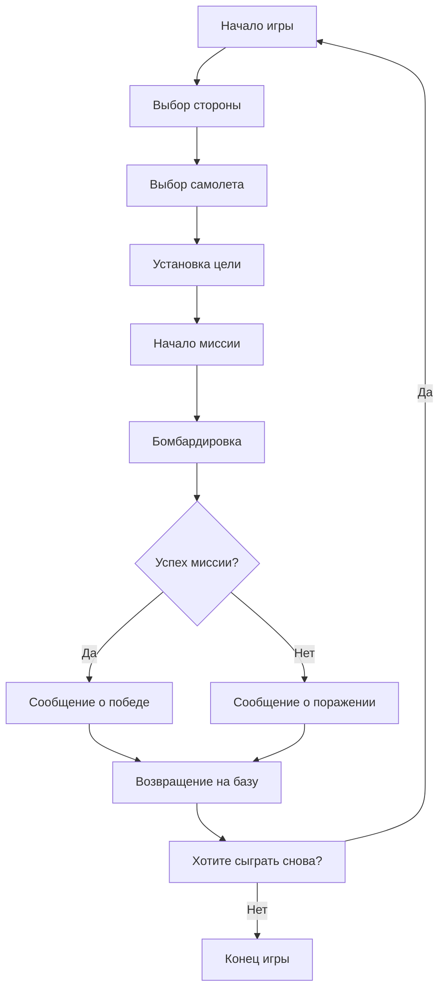

## АНАЛИЗ КОДА:

### <алгоритм>

**1. Инициализация игры:**
    -   **Начало:** Игра начинается с вывода приветственного сообщения и запроса на выбор стороны (Италия, союзники, Япония, Германия).
        -   _Пример:_ Вывод сообщения: "Добро пожаловать в BOMBER!". Запрос выбора: "Выберите свою сторону: 1. Италия 2. Союзники 3. Япония 4. Германия".
        -   _Данные:_ Ввод пользователя (число от 1 до 4).
    -   **Выбор стороны:** На основе ввода пользователя, программа сохраняет выбранную сторону.
        -   _Пример:_ Пользователь вводит `2`, программа сохраняет "Союзники".
    -   **Выбор самолёта:** Программа запрашивает тип самолета (B-29, Lancaster, B-17).
        -   _Пример:_ Вывод сообщения: "Выберите тип самолета: 1. B-29 2. Lancaster 3. B-17".
        -   _Данные:_ Ввод пользователя (число от 1 до 3).
    -   **Установка цели:**  Программа определяет цель для бомбардировки (например, Плоешти).
        -   _Пример:_ Вывод сообщения: "Вашей целью будет бомбардировка Плоешти.".
    
**2. Основной цикл игры:**
    -   **Начало миссии:** Вывод сообщения о начале миссии.
        -   _Пример:_ Сообщение: "Вы преодолели вражеские зенитные огни. Цель достигнута!".
    -   **Бомбардировка:** Имитация процесса бомбардировки, вывод сообщения об успешном или неуспешном выполнении.
        -   _Пример:_ Сообщение: "Подготовьтесь к сбросу бомб!". Сообщение об успехе: "Вы успешно разрушили цель."
    -   **Возвращение на базу:** Вывод сообщения о возвращении на базу.
         -  _Пример_: Сообщение: "Вы успешно завершили миссию! Ваш самолет возвращается на базу."

**3. Подсчёт победителя:**
    -   **Успех:** Если бомбардировка успешна, программа выводит сообщение о победе.
        -   _Пример:_ Сообщение: "Вы успешно завершили миссию и вернулись на базу!"
    -   **Неудача:** В случае неудачи (например, если игрок "сбит"), программа выводит сообщение о поражении.
        -   _Пример:_ Сообщение: "Вы были сбиты вражескими силами. Пожалуйста, попробуйте снова."
  
**4. Завершение игры:**
    -   **Предложение продолжить:** Программа запрашивает, хочет ли игрок сыграть снова.
        -   _Пример:_ Запрос: "Хотите сыграть снова? (да/нет)".
    -   **Повторный цикл или выход:** В зависимости от ответа пользователя, игра начинается заново или заканчивается.
        -   _Пример:_ Если пользователь вводит `да`, игра начинается сначала. Если пользователь вводит `нет`, игра завершается.
    -  **Завершение игры**: Вывод прощального сообщения.
        -  _Пример_: Сообщение: "До свидания!"
    
**Поток данных:**
1.  **Ввод пользователя** (выбор стороны, самолета, ответ на вопрос о повторной игре) -> **Обработка выбора** -> **Начало миссии/Завершение игры**.
2. **Успех миссии** -> **Сообщение о победе** -> **Завершение игры**.
3. **Неудача миссии** -> **Сообщение о поражении** -> **Завершение игры**.

### <mermaid>

**Объяснение `mermaid`:**

-   **`flowchart TD`**: Объявляет диаграмму типа flowchart (блок-схема) и устанавливает направление "сверху вниз" (Top Down).
-   **`Start`, `ChooseSide`, `ChoosePlane`, `SetTarget`, `StartMission`, `Bombing`, `MissionSuccess`, `VictoryMessage`, `FailureMessage`, `ReturnToBase`, `PlayAgainQuestion`, `End`**: Узлы (блоки) диаграммы, представляющие этапы игры.
-   **`-->`**: Стрелки, указывающие последовательность этапов (поток управления).
-   **`{Успех миссии?}`**: Ромб, обозначающий условный переход (решение о победе или поражении).
-   **`-- Да -->`, `-- Нет -->`**: Обозначение стрелок для условного перехода (если миссия успешна - переход к победе, иначе к поражению).
-   **Связи:** Описывают последовательность игры: от начала до выбора стороны, самолета, установки цели, выполнения миссии, проверки ее успеха и вывода сообщения о победе или поражении, и далее, либо повторение игры, либо ее завершение.
### <объяснение>

**Импорты:**

В данном коде **нет импортов**, так как представлен только текст правил игры, а не фактический код на Python. Однако, если бы мы имели дело с реальным кодом, могли бы встретиться такие импорты:

-   **`import random`**: Для генерации случайных событий, например, для определения успеха при бомбардировке или случайного нанесения урона противником.
-   **`import time`**: Для добавления пауз или задержек, например, чтобы имитировать полет или процесс бомбардировки.
-   **`import sys`**: Для управления взаимодействием с системой, например, для вывода сообщений в консоль.
-   **`import os`**: Для взаимодействия с операционной системой, например, для чтения конфигурационных файлов.

**Классы:**

В данном текстовом описании **нет классов**. Но в реальной реализации могут потребоваться следующие классы:

-   **`Player`**: Для хранения информации об игроке (сторона, выбранный самолет, количество бомб).
-   **`Aircraft`**: Для представления различных типов самолетов (модель, скорость, прочность).
-   **`Mission`**: Для описания конкретных миссий (цель, сложность, условия).
-   **`Target`**: Для описания целей (тип, уровень защиты, местоположение).

**Функции:**

В текстовом описании **нет функций**. Но в реальном коде могут понадобиться:

-   **`init_game()`**: Инициализирует игру (выбор стороны, самолета, цели).
-   **`start_mission(mission)`**: Запускает миссию.
-   **`run_combat(mission)`**: Имитирует боевые действия (столкновения с зенитками, истребителями).
-   **`bomb_target(target)`**: Имитирует бомбардировку цели.
-   **`check_mission_success(mission)`**: Проверяет, была ли миссия выполнена успешно.
-   **`display_game_state(player, mission)`**: Выводит текущее состояние игры (информацию об игроке, миссии).
-   **`main()`**: Главная функция игры.
-   **`ask_play_again()`**: Запрашивает у пользователя, хочет ли он сыграть еще раз.

**Переменные:**

-   **`player_side`**: Строка, содержащая выбранную сторону (например, "Союзники", "Германия").
-   **`player_aircraft`**: Строка, содержащая тип выбранного самолета (например, "B-29", "Lancaster").
-   **`current_target`**: Строка, содержащая имя текущей цели (например, "Плоешти").
-  **`game_over`**: Булево значение, показывающее, закончилась ли игра (True или False).
-  **`play_again`**: Строка, содержащая ответ на вопрос "Хотите сыграть еще раз?" ("да" или "нет").

**Потенциальные ошибки и улучшения:**

-   **Отсутствие реализации**: Данный текст представляет собой только описание правил игры.
-   **Простота**: Игра по описанию довольно проста, нет учета повреждений самолета, расхода бомб, разных типов врагов и прочих усложнений.
-   **Интерфейс**: Нет описания интерфейса, только текстовый вывод.
-   **Геймплей**: Нет элементов случайности и вариативности, которые делают игру интересной.

**Улучшения:**

-   Реализовать классы и функции для управления игрой.
-   Добавить генерацию случайных событий (попадания, типы врагов, и т.д.).
-   Добавить учет параметров самолета, повреждений, топлива и боеприпасов.
-   Реализовать графический интерфейс или псевдографику.
-   Добавить разные миссии с разными целями и сложностью.
-   Добавить возможность выбора сложности.

**Цепочка взаимосвязей с другими частями проекта:**
- При наличии общего проекта для AI Games, эта игра может зависеть от общего модуля управления играми, модуля ввода/вывода, и возможно, от модуля для представления графики или псевдографики. Это также может быть частью системы обучения ИИ, где ИИ может учиться играть в эту игру.