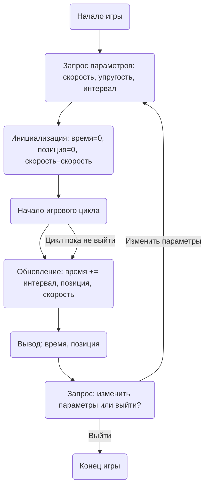

## ИНСТРУКЦИЯ:

Анализируй предоставленный код подробно и объясни его функциональность. Ответ должен включать три раздела:  

1. **<алгоритм>**: Опиши рабочий процесс в виде пошаговой блок-схемы, включая примеры для каждого логического блока, и проиллюстрируй поток данных между функциями, классами или методами.  
2. **<mermaid>**: Напиши код для диаграммы в формате `mermaid`, проанализируй и объясни все зависимости, 
    которые импортируются при создании диаграммы. 
    **ВАЖНО!** Убедитесь, что все имена переменных, используемые в диаграмме `mermaid`, 
    имеют осмысленные и описательные имена. Имена переменных вроде `A`, `B`, `C`, и т.д., не допускаются!  
    
    **Дополнительно**: Если в коде есть импорт `import header`, добавьте блок `mermaid` flowchart, объясняющий `header.py`:\
    ```mermaid
    flowchart TD
        Start --> Header[<code>header.py</code><br> Determine Project Root]
    
        Header --> import[Import Global Settings: <br><code>from src import gs</code>] 
    ```

3. **<объяснение>**: Предоставьте подробные объяснения:  
   - **Импорты**: Их назначение и взаимосвязь с другими пакетами `src.`.  
   - **Классы**: Их роль, атрибуты, методы и взаимодействие с другими компонентами проекта.  
   - **Функции**: Их аргументы, возвращаемые значения, назначение и примеры.  
   - **Переменные**: Их типы и использование.  
   - Выделите потенциальные ошибки или области для улучшения.  

Дополнительно, постройте цепочку взаимосвязей с другими частями проекта (если применимо).  

Это обеспечивает всесторонний и структурированный анализ кода.
## Формат ответа: `.md` (markdown)
**КОНЕЦ ИНСТРУКЦИИ**
```

## <алгоритм>

1. **Начало игры:**
    - Вывод приветственного сообщения "Добро пожаловать в игру BOUNCE!".
    - Запрос у пользователя начальных условий:
        - Скорость мяча (например, 20 футов в секунду).
        - Коэффициент упругости (например, 0.85).
        - Интервал времени (например, 0.1 секунды).
2. **Игровой цикл:**
    - Инициализация:
        - Текущее время = 0.
        - Текущая позиция мяча = 0.
        - Скорость мяча = начальная скорость, введенная пользователем.
    - Цикл, пока пользователь не решит завершить игру:
        - Обновление:
            - Текущее время = Текущее время + Интервал времени.
            - Новая позиция мяча = Текущая позиция мяча + Скорость мяча * Интервал времени.
            - Если мяч "отскочил" (в данном примере отскок не реализован, но в будущих реализациях может быть добавлен отскок от границ экрана), то скорость мяча = Скорость мяча * Коэффициент упругости.
            - Вывод на экран: "Время: {Текущее время} сек, Позиция: {Новая позиция} футов".
        - Запрос:
            - Хочет ли пользователь изменить параметры или выйти?
            - Если пользователь выбирает изменить параметры, то переходим к началу игры (шаг 1).
            - Если пользователь выбирает выйти, то завершаем программу.
3. **Завершение игры:**
    - Вывод прощального сообщения "До свидания!".

## <mermaid>



### Анализ диаграммы `mermaid`:

- **Start**: Начало программы, инициализация процесса игры.
- **InputParams**: Этот блок представляет запрос начальных параметров игры у пользователя: начальной скорости мяча, коэффициента упругости и временного интервала.
- **Init**: Инициализация начальных значений: текущее время устанавливается в 0, начальная позиция мяча - в 0, а текущая скорость мяча приравнивается к введенной пользователем начальной скорости.
- **GameLoopStart**: Начало основного цикла игры, который продолжается, пока пользователь не решит выйти.
- **Update**: В этом блоке происходит обновление параметров игры:
    - Текущее время увеличивается на заданный интервал.
    - Вычисляется новая позиция мяча на основе текущей скорости и временного интервала.
    - (Подразумевается, что здесь также будет реализовано уменьшение скорости при "отскоке")
- **Output**: Выводит текущее время и положение мяча на экран.
- **AskContinue**: Запрос у пользователя, хочет ли он изменить параметры или завершить игру.
- **End**: Завершение игры.

## <объяснение>

**Описание Игры BOUNCE**

Эта игра моделирует движение мяча, который отскакивает от поверхности, подобно стробоскопическому эффекту. Она позволяет игроку экспериментировать с начальными условиями, такими как скорость мяча, коэффициент упругости и временной интервал, чтобы увидеть, как они влияют на траекторию мяча.

**Основные концепции:**

1.  **Инициализация**:
    -   Игра начинается с получения начальных параметров от пользователя:
        -   `initial_speed`: Начальная скорость мяча (в футах в секунду).
        -   `elasticity_coefficient`: Коэффициент упругости мяча (значение от 0 до 1).
        -   `time_interval`: Временной интервал между обновлениями положения мяча (в секундах).
2.  **Моделирование движения:**
    -   Мяч двигается по горизонтальной траектории, его позиция обновляется на каждом шаге:
        -   `current_position = current_position + current_speed * time_interval`
        -   Скорость мяча уменьшается при каждом отскоке:
            - `current_speed = current_speed * elasticity_coefficient`

**Функциональность:**

-   **Интерактивный ввод:** Игра просит пользователя ввести начальные параметры, предоставляя возможность настроить симуляцию по желанию.
-   **Динамическая модель**: Игра выводит динамическое изменение позиции мяча на основе введенных параметров и времени.
-   **Текстовый интерфейс**: Движение мяча представлено в текстовом виде в консоли.

**Переменные:**

-   `initial_speed`: float, начальная скорость мяча.
-   `elasticity_coefficient`: float, коэффициент упругости мяча.
-   `time_interval`: float, временной интервал между обновлениями положения мяча.
-   `current_time`: float, текущее время симуляции.
-   `current_position`: float, текущая позиция мяча.
-  `current_speed`: float, текущая скорость мяча.

**Возможные улучшения:**

1.  **Графическое отображение**: Реализация графического интерфейса для более наглядного представления движения мяча.
2.  **Реалистичная физика**: Включение учета силы трения, гравитации, отскока от границ экрана для более реалистичной симуляции.
3.  **Динамическое изменение параметров**: Разрешить изменять параметры в ходе игры, чтобы пользователь мог в реальном времени видеть их влияние на траекторию.
4. **Обработка ошибок**: Добавить проверку на ввод некорректных данных (например, отрицательная скорость, упругость > 1).

**Взаимосвязи с другими частями проекта:**

В данном примере не указаны импорты или взаимосвязи с другими частями проекта. Однако, если бы этот код был частью более крупного проекта, он мог бы использовать:

-   **Модуль для ввода/вывода:** Для взаимодействия с пользователем через консоль или графический интерфейс.
-   **Модуль физики:** Для более сложного моделирования движения.
-   **Модуль настройки:** Для загрузки параметров игры из файла или конфигурации.

**Цепочка взаимодействия:**

1.  **Пользователь:** Вводит начальные параметры игры.
2.  **Игровой движок:** Инициализирует игру, рассчитывает траекторию и выводит результаты на экран.
3.  **Пользователь:** Может изменить параметры или выйти из игры.

В заключение, игра "BOUNCE" демонстрирует простую, но эффективную модель физического движения, где можно наглядно увидеть влияние начальных условий на траекторию объекта.