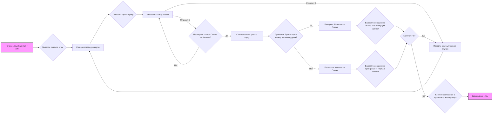

## ИНСТРУКЦИЯ:

Анализируй предоставленный код подробно и объясни его функциональность. Ответ должен включать три раздела:

1.  **<алгоритм>**: Опиши рабочий процесс в виде пошаговой блок-схемы, включая примеры для каждого логического блока, и проиллюстрируй поток данных между функциями, классами или методами.
2.  **<mermaid>**: Напиши код для диаграммы в формате `mermaid`, проанализируй и объясни все зависимости,
    которые импортируются при создании диаграммы.
    **ВАЖНО!** Убедитесь, что все имена переменных, используемые в диаграмме `mermaid`,
    имеют осмысленные и описательные имена. Имена переменных вроде `A`, `B`, `C`, и т.д., не допускаются!

    **Дополнительно**: Если в коде есть импорт `import header`, добавьте блок `mermaid` flowchart, объясняющий `header.py`:
    ```mermaid
    flowchart TD
        Start --> Header[<code>header.py</code><br> Determine Project Root]

        Header --> import[Import Global Settings: <br><code>from src import gs</code>]
    ```

3.  **<объяснение>**: Предоставьте подробные объяснения:
    -   **Импорты**: Их назначение и взаимосвязь с другими пакетами `src.`.
    -   **Классы**: Их роль, атрибуты, методы и взаимодействие с другими компонентами проекта.
    -   **Функции**: Их аргументы, возвращаемые значения, назначение и примеры.
    -   **Переменные**: Их типы и использование.
    -   Выделите потенциальные ошибки или области для улучшения.

Дополнительно, постройте цепочку взаимосвязей с другими частями проекта (если применимо).

Это обеспечивает всесторонний и структурированный анализ кода.
## Формат ответа: `.md` (markdown)
**КОНЕЦ ИНСТРУКЦИИ**
```markdown
## <алгоритм>

**Блок-схема игрового процесса Acey-Ducey:**



**Примеры для логических блоков:**

- **Начало игры (A):** Капитал игрока устанавливается в 100 долларов.
- **Генерация двух карт (C):** Например, первая карта - 5, вторая карта - 10.
- **Показать карты игроку (D):** Игрок видит карты 5 и 10.
- **Запрос ставки игрока (E):** Игрок вводит ставку 20.
- **Проверка ставки (F):** Если капитал 100, а ставка 20 (100 >= 20 - true), если ставка 120 (100 >= 120 - false) запрос ставки повториться.
- **Генерация третьей карты (G):** Третья карта - 7.
- **Проверка диапазона (I):** Карта 7 находится между 5 и 10 (true).
- **Выигрыш (J):** Капитал увеличивается на 20, теперь 120.
- **Проигрыш (K):** Если бы карта была 2, капитал уменьшился бы на 20, стал бы 80.
- **Завершение игры (O, P):** Игра заканчивается, если капитал опустится до 0.

## <mermaid>

```mermaid
flowchart TD
    A[Start: Инициализация игры] --> B(Установить начальный капитал);
    B --> C{Основной цикл игры};
    C --> D[Сгенерировать две случайные карты];
    D --> E{Отобразить карты игроку};
    E --> F[Запросить ставку игрока];
    F --> G{Проверка: Ставка <= Капитал?};
    G -- True --> H[Сгенерировать третью карту];
    G -- False --> F;
    H --> I{Проверка: Третья карта между первыми двумя?};
    I -- True --> J[Изменить капитал игрока (выигрыш)];
    I -- False --> K[Изменить капитал игрока (проигрыш)];
    J --> L{Сообщение о результате и капитал};
    K --> L;
    L --> M{Проверка: Капитал > 0?};
    M -- True --> C;
    M -- False --> N[Завершение игры (капитал = 0)];
    N --> O[Предложить новую игру или выход];
    
   
```

**Анализ зависимостей `mermaid`:**

Диаграмма `mermaid` иллюстрирует основной поток управления в игре Acey-Ducey. Нет импорта внешних библиотек, так как диаграмма описывает логику игры, а не конкретный код. Диаграмма отражает последовательность действий от инициализации игры до её завершения, включая основные этапы: генерация карт, запрос ставки, проверка результата и изменение капитала.

## <объяснение>

**Описание функциональности:**

Этот код реализует карточную игру Acey-Ducey. Игрок делает ставки на то, попадет ли значение третьей карты в диапазон значений между двумя первыми картами.

**1. Инициализация:**

-   Игра начинается с установления начального капитала игрока в 100 долларов.
-   Игроку выводятся правила игры.

**2. Основной цикл игры:**

-   Генерируются две случайные карты (значения от 2 до 14).
-   Карты отображаются игроку.
-   Игрок вводит ставку.
    -   Если ставка равна 0, раунд пропускается.
    -   Если ставка больше 0, она проверяется на допустимость (не превышает ли она текущий капитал).
-   Если ставка допустима, генерируется третья карта.
-   Проверяется, находится ли значение третьей карты в диапазоне между значениями первых двух карт.
-   В зависимости от результата, капитал игрока увеличивается или уменьшается на величину ставки.

**3. Завершение игры:**

-   Игра заканчивается, если капитал игрока становится равным 0.
-   Игроку предлагается начать новую игру или выйти.

**Переменные:**

-   `capital`: Целое число, представляющее текущий капитал игрока (начинается со 100).
-   `cards`: Список, в котором хранятся значения карт в каждом раунде (от 2 до 14).
-   `bet`: Целое число, представляющее ставку, которую игрок делает в каждом раунде.

**Функции:**
*нет, используются только базовые операторы языка и логика*

**Потенциальные ошибки и области для улучшения:**

1.  **Нет проверки на ввод ставки**: При запросе ставки,  нужна проверка что пользователь ввел именно число (число целое, float), а не строку или иной недопустимый тип данных.
2.  **Нет UI**: Игра происходит в консоли, нет графического интерфейса для более удобного взаимодействия с пользователем.
3.  **Отсутствие проверок на валидность данных карт**: В текущей реализации карты генерируются случайно, что может приводить к дубликатам в рамках одного раунда, можно реализовать `deck`
4.  **Нет контроля начала и завершения игры:** Можно улучшить игровой цикл, добавив возможность выхода в начале любого раунда.

**Взаимосвязи с другими частями проекта:**

Этот код представляет собой отдельную игру в рамках проекта. Взаимосвязь с другими частями проекта может быть установлена через общий интерфейс управления играми (если такой предусмотрен) или через общий класс для всех игр, которые могут содержать базовые функции для всех игр (например: сохранение прогресса, получение имени игрока).