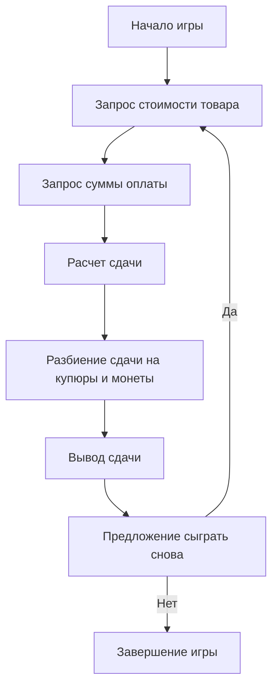

## АНАЛИЗ КОДА: CHANGE (Кассовая программа)

### <алгоритм>
1.  **Начало игры:**
    *   Выводится приветственное сообщение "Добро пожаловать в игру CHANGE!".
    *   Пример: Пользователю показывается сообщение "Добро пожаловать в игру CHANGE!".

2.  **Ввод стоимости товара:**
    *   Программа запрашивает у пользователя стоимость товара.
    *   Пример: Пользователь вводит `4.59`.

3.  **Ввод суммы оплаты:**
    *   Программа запрашивает у пользователя сумму, которую он платит за товар.
    *   Пример: Пользователь вводит `10.00`.

4.  **Расчет сдачи:**
    *   Программа вычисляет сдачу как разницу между суммой оплаты и стоимостью товара.
    *   Пример: `сдача = 10.00 - 4.59 = 5.41`.

5.  **Разбиение сдачи на купюры и монеты:**
    *   Программа использует набор номиналов (купюры и монеты, например: 5 долларов, 1 доллар, 25 центов (четверть), 10 центов (дайм), 5 центов (никель), 1 цент (пенни)).
    *   Программа последовательно определяет наибольшее количество купюр и монет каждого номинала, которые можно выдать в качестве сдачи.
    *   Пример:
        *   Сдача: `5.41`
        *   5 долларов: `1` (сдача становится `0.41`)
        *   25 центов: `1` (сдача становится `0.16`)
        *   10 центов: `1` (сдача становится `0.06`)
        *   5 центов: `1` (сдача становится `0.01`)
        *   1 цент: `1` (сдача становится `0.00`)

6.  **Вывод сдачи:**
    *   Программа выводит общую сумму сдачи и перечень купюр и монет, которые составляют сдачу.
    *   Пример: Выводится сообщение "Сдача: $5.41", "1 пятидолларовая купюра", "1 четверть", "1 дайм", "1 никель", "1 пенни".

7.  **Предложение сыграть снова:**
    *   Программа спрашивает пользователя, хочет ли он сыграть снова.
    *   Пример: Выводится сообщение "Хотите сыграть снова? (да/нет)".

8.  **Завершение игры:**
    *   Если пользователь вводит "нет", программа выводит "Спасибо за игру!" и завершается.
    *   Если пользователь вводит "да", программа возвращается к шагу 2 (ввод стоимости товара).

### <mermaid>

### <объяснение>

**Общее описание**

Игра `CHANGE` представляет собой простую кассовую программу, имитирующую выдачу сдачи в магазине. Пользователь вводит стоимость товара и сумму оплаты, а программа рассчитывает и выводит сдачу, разбитую на купюры и монеты. Игра не имеет победителя; основная цель - точное вычисление сдачи.

**Импорты**

В предоставленном описании кода импорты не требуются, поскольку это концептуальное описание, а не реальный код на Python или другом языке.

**Классы**

Классы отсутствуют, так как игра представлена в виде текстового описания алгоритма и примера работы.

**Функции**

Функций нет, так как это описание алгоритма, а не код. Однако, в реальной реализации можно было бы использовать функции для следующих задач:

*   `get_input(message)`: Запрашивает ввод у пользователя и возвращает его.
*   `calculate_change(cost, payment)`: Вычисляет сдачу.
*   `distribute_change(change)`: Разбивает сдачу на купюры и монеты.
*   `output_change(change_breakdown)`: Выводит результат.
*   `play_again()`: Спрашивает, хочет ли пользователь сыграть снова.

**Переменные**

*   `cost`: Стоимость товара, вводимая пользователем.
*   `payment`: Сумма оплаты, вводимая пользователем.
*   `change`: Сдача, вычисленная программой (`payment` - `cost`).
*   `change_breakdown`: Словарь или список, содержащий количество каждой купюры и монеты для сдачи (например, {"5_dollars": 1, "quarter": 1, "dime": 1, "nickel": 1, "penny": 1}).

**Возможные ошибки и улучшения**

1.  **Обработка некорректного ввода:**
    *   Необходимо добавить проверки на корректность ввода (например, ввод нечисловых значений, отрицательных значений стоимости или оплаты).
2.  **Обработка случаев, когда сумма оплаты меньше стоимости:**
    *   Нужно предусмотреть ситуацию, когда пользователь дает меньше денег, чем стоимость товара, и выводить соответствующее сообщение.
3.  **Гибкость в наборе банкнот и монет:**
    *   Можно сделать набор банкнот и монет настраиваемым, а не жестко прописанным в коде.
4.  **Использование словаря для хранения монет и банкнот:**
    *   Использование словаря с номиналом в качестве ключа и количеством в качестве значения сделало бы код более читаемым и масштабируемым.
5.  **Округление для избежания ошибок с плавающей точкой:**
    *   Использование `round()` для округления результатов вычислений с плавающей точкой, чтобы избежать незначительных ошибок.

**Взаимосвязи с другими частями проекта**

Поскольку это описание игры, оно пока не связано с другими частями проекта. В реальном проекте игра могла бы быть частью более крупной системы с интерфейсом пользователя, возможно, с графическим интерфейсом или текстовым интерфейсом.